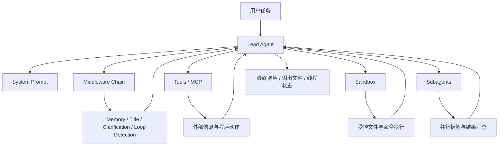
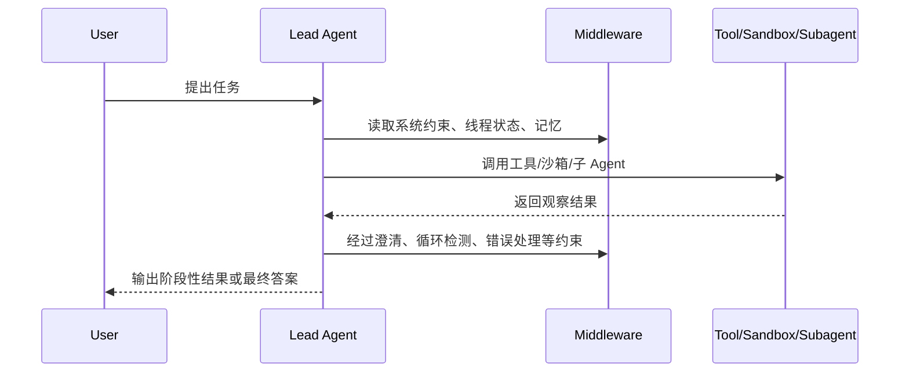
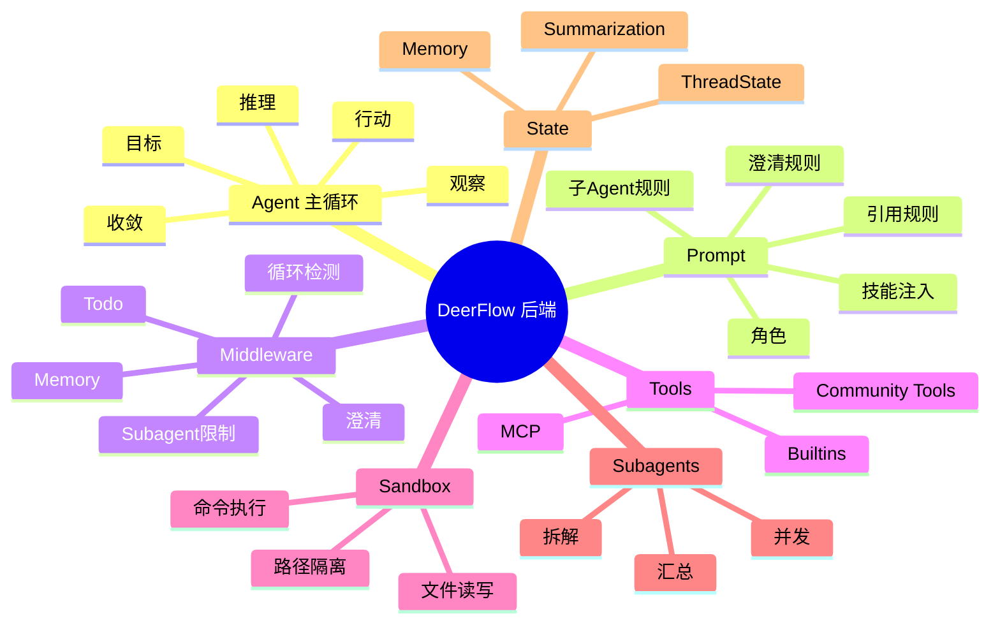

# 第 0 课：DeerFlow 后端引读

这一课不是正式进入某个单点知识，而是帮你先建立一张完整地图。

如果前面 15 节课是“拆机器”，那这一课就是先带你认识这台机器的总装图，避免后面学到 `prompt`、`memory`、`sandbox`、`subagent` 时只见树木、不见森林。

## 这一课解决什么问题

很多 AI 初学者一上来会陷进两种状态：

- 只知道一些论文名词，但不知道这些名词在真实工程里落在哪
- 打开 DeerFlow 代码后，只看到很多目录和很多 prompt 字符串，不知道哪个是主线

这一课就是为了解决这两个问题。

学完后，你应该能回答：

1. DeerFlow 后端到底是一套什么系统？
2. 一个 Agent 后端为什么一定会出现 prompt、tool、memory、sandbox、subagent 这些模块？
3. 后面每一课我们会怎么学，为什么不只是讲概念，而要对着 DeerFlow 核心代码逐段解读？

## 先把 DeerFlow 后端当成什么

先不要把它想成“聊天机器人”。

更准确地说，DeerFlow 后端是一套“让大模型能可靠执行复杂任务”的运行时系统。它至少做了 6 件事：

- 给模型一个统一的系统角色与行为约束
- 让模型可以调用工具，而不只是输出文本
- 让模型能在受控环境中执行文件和命令操作
- 让模型在长任务中维持状态和记忆
- 让主 Agent 把复杂任务拆给子 Agent 并收敛结果
- 让整个过程能被 API、网关、线程状态与外部协议接住

所以你后面学习 DeerFlow，不是学习一个“prompt 技巧合集”，而是在学习一套 AI 后端系统设计。

## 整体知识地图

下面这张图是后端学习主线。



你可以先把后续课程理解成 7 个模块：

| 模块 | DeerFlow 目录 | 后面重点学什么 |
|---|---|---|
| 主 Agent | `backend/packages/harness/deerflow/agents/lead_agent` | 系统怎么组织“思考、决策、调用工具、给出回复” |
| 中间件 | `backend/packages/harness/deerflow/agents/middlewares` | 为什么很多规则不写进 prompt，而写成硬约束 |
| 记忆 | `backend/packages/harness/deerflow/agents/memory` | 短期状态和长期记忆怎么配合 |
| 工具/MCP | `backend/packages/harness/deerflow/tools`、`backend/packages/harness/deerflow/mcp` | 模型怎么从“会说”变成“能做” |
| 沙箱 | `backend/packages/harness/deerflow/sandbox` | 为什么执行能力必须被隔离 |
| 子 Agent | `backend/packages/harness/deerflow/subagents` | 复杂任务怎么拆解、并行、汇总 |
| 网关 | `backend/app/gateway` | 后端能力如何被系统其余部分调用 |

## 一句话区分 3 个层次

这是后面所有课程的基础。

### 1. LLM

给模型一句话，拿回一句话。

它更像一个很强的文本函数。

### 2. Workflow

程序员先写好步骤，模型只在某几个步骤里参与。

它更像“带 AI 节点的流程引擎”。

### 3. Agent

模型不只是在某一步输出文本，而是要决定下一步该做什么。

它更像“会调度、会试错、会用工具的执行体”。

DeerFlow 的重点就在第 3 层，但它并不是完全放任模型自由发挥，而是通过 `prompt + middleware + state + tools` 把 Agent 行为收束到一个可用的工程系统里。

## DeerFlow 后端最小闭环

这张图建议你记住。



把它翻译成人话，就是：

`收到目标 -> 理解约束 -> 做动作 -> 拿反馈 -> 修正判断 -> 再行动 -> 输出结果`

现代 Agent 系统几乎都绕不开这个闭环。

## 这一课引用的论文和资料，到底该看什么

你提得很对，只列论文名是没用的。下面我把“核心观点”直接写出来。

### 1. Anthropic: Building Effective AI Agents

- 链接：[Building Effective AI Agents](https://www.anthropic.com/research/building-effective-agents)
- 你现在最该抓住的核心观点：
  - 很多业务里，先做可控的 workflow，往往比直接做 fully autonomous agent 更有效
  - 好的 agent 系统不是“更长的 prompt”，而是“模型、工具、状态、反馈回路”的组合
  - 工程上要优先追求可靠性、可观察性和逐步升级
- 对 DeerFlow 的映射：
  - DeerFlow 虽然是 agent harness，但不是放飞式自治，它大量借助 middleware、工具限制、线程状态、子 agent 上限来约束行为

### 2. Google: ReAct

- 链接：[ReAct: Synergizing Reasoning and Acting in Language Models](https://arxiv.org/abs/2210.03629)
- 核心观点：
  - 复杂任务中，模型不应只“想”，也不应只“做”
  - 最有效的模式往往是“推理一步 -> 执行动作 -> 根据观察继续推理”
  - 外部世界的反馈会显著降低纯语言模型“凭空编”的风险
- 对 DeerFlow 的映射：
  - Lead Agent 的目标并不是一次性写出答案，而是根据工具返回结果继续推进任务
  - `tools`、`sandbox`、`subagents` 都是在给 ReAct 式循环提供“行动”和“观察”

### 3. Google: Chain-of-Thought Prompting

- 链接：[Chain-of-Thought Prompting Elicits Reasoning in Large Language Models](https://arxiv.org/abs/2201.11903)
- 核心观点：
  - 对复杂任务，模型需要中间推理过程，不能只要求它“一步到位”
  - 中间推理不是目的，目的是让模型在复杂问题上更稳定地组织判断
- 对 DeerFlow 的映射：
  - DeerFlow prompt 明确要求模型先进行 concise thinking，再进入行动
  - 但工程上又限制它不要把内部思考直接当最终答复输出

### 4. OpenAI: Function Calling / Structured Outputs

- 链接：[Function Calling in the OpenAI API](https://help.openai.com/en/articles/8555517-function-calling-in-the-openai-api)
- 链接：[Introducing Structured Outputs in the API](https://openai.com/index/introducing-structured-outputs-in-the-api/)
- 核心观点：
  - 模型要想可靠调用工具，必须让输出尽量结构化、可验证、可执行
  - 真正有用的 agent，不是“模型说我想调用工具”，而是“模型按规范给出可执行参数，系统据此安全执行”
- 对 DeerFlow 的映射：
  - DeerFlow 的 `tools/`、`mcp/`、`task` 工具、本质上都在做“把模型决策变成程序动作”的桥接层

### 5. MCP 官方文档

- 链接：[Model Context Protocol](https://modelcontextprotocol.io/)
- 链接：[Specification Overview](https://modelcontextprotocol.io/specification/2025-06-18/basic)
- 核心观点：
  - 模型能力要想规模化接入外部上下文和工具，需要标准协议，而不是每个系统各写一套私有接口
  - 协议化能减少 agent 集成碎片化问题
- 对 DeerFlow 的映射：
  - DeerFlow 已经把 MCP 当成重要扩展边界，这决定了它不是封闭系统，而是一个可扩展后端框架

### 6. DeepSeek-R1

- 链接：[DeepSeek-R1](https://github.com/deepseek-ai/DeepSeek-R1)
- 你当前该抓住的核心观点：
  - 强化学习可以显著增强模型在复杂推理、多步决策上的稳定性
  - “会推理”的模型更适合 agent 场景，因为 agent 天生就是长链决策问题
- 对 DeerFlow 的映射：
  - DeerFlow 这类系统尤其受益于 reasoning model，因为它们要频繁做“接下来该不该搜、该不该拆、该不该澄清”的判断

### 7. Kimi k1.5

- 链接：[Kimi k1.5](https://github.com/MoonshotAI/Kimi-k1.5)
- 当前核心观点：
  - 长上下文和强化学习结合后，模型在长任务、长链纠错、复杂规划里的表现会明显增强
  - 这类模型适合 research agent、coding agent、analysis agent
- 对 DeerFlow 的映射：
  - DeerFlow 处理的很多任务都是长链、多阶段任务，所以模型的 reasoning 能力不是锦上添花，而是影响系统上限

### 8. Qwen-Agent

- 链接：[Qwen-Agent](https://github.com/QwenLM/Qwen-Agent)
- 当前核心观点：
  - 一个成熟 agent 框架会把 function calling、code interpreter、RAG、MCP 等能力统一抽象，而不是散落在各处
  - agent 框架真正难的是“组合与约束”，不是单点能力
- 对 DeerFlow 的映射：
  - DeerFlow 的设计同样体现了“组合式能力架构”，只是它更强调 research/coding 任务中的多 agent 和沙箱执行

## 这一课不是碎片课，而是总纲课

你刚才的判断是对的：原来的第 1 课更像碎片笔记，不像课程引读。

现在这节课应该这样理解：

- 它本质上是“第 0 课”
- 负责建立地图，不负责讲透某个单点
- 从下一课开始，每节都要进入 DeerFlow 真实代码

后续课程我会统一按这个模板来写：

1. 这个知识点在 Agent 工程里解决什么问题
2. 对应哪几篇论文/哪类业界实现
3. DeerFlow 里是哪段核心代码在负责这件事
4. 核心代码逐段解读
5. 为什么这样设计
6. 容易踩的坑是什么

## 后续课程的讲法示例：以 Prompt 为例

你举的 prompt 例子非常好，后面我就会按这种方式讲。

### 示例问题

DeerFlow 是怎么设计主 Agent prompt 的？

### 对应代码位置

- `backend/packages/harness/deerflow/agents/lead_agent/prompt.py`
- `backend/packages/harness/deerflow/agents/lead_agent/agent.py`

### 关键代码片段 1：主 prompt 不是一整块死字符串，而是模板加动态注入

```python
def apply_prompt_template(
    subagent_enabled: bool = False,
    max_concurrent_subagents: int = 3,
    *,
    agent_name: str | None = None,
    available_skills: set[str] | None = None,
) -> str:
    memory_context = _get_memory_context(agent_name)
    subagent_section = _build_subagent_section(n) if subagent_enabled else ""
    skills_section = get_skills_prompt_section(available_skills)
    deferred_tools_section = get_deferred_tools_prompt_section()

    prompt = SYSTEM_PROMPT_TEMPLATE.format(
        agent_name=agent_name or "DeerFlow 2.0",
        soul=get_agent_soul(agent_name),
        skills_section=skills_section,
        deferred_tools_section=deferred_tools_section,
        memory_context=memory_context,
        subagent_section=subagent_section,
        subagent_reminder=subagent_reminder,
        subagent_thinking=subagent_thinking,
    )

    return prompt + f"\n<current_date>{datetime.now().strftime('%Y-%m-%d, %A')}</current_date>"
```

出处：

- `backend/packages/harness/deerflow/agents/lead_agent/prompt.py:447`

### 这段代码说明了什么

它说明 DeerFlow 的 prompt 设计不是“写一篇超长系统提示词就完事”，而是模块化注入：

- 记忆要不要注入，是动态的
- 技能要不要注入，是动态的
- 子 Agent 规则要不要注入，是动态的
- 延迟工具列表要不要注入，也是动态的

这背后的设计动机是：

- 减少无关上下文
- 根据运行模式切换 prompt 行为
- 避免一个超级 prompt 把所有模式都硬塞进去

### 关键代码片段 2：主 prompt 明确把“澄清优先”写成一级规则

```python
<clarification_system>
**WORKFLOW PRIORITY: CLARIFY → PLAN → ACT**
1. **FIRST**: Analyze the request in your thinking - identify what's unclear, missing, or ambiguous
2. **SECOND**: If clarification is needed, call `ask_clarification` tool IMMEDIATELY - do NOT start working
3. **THIRD**: Only after all clarifications are resolved, proceed with planning and execution
</clarification_system>
```

出处：

- `backend/packages/harness/deerflow/agents/lead_agent/prompt.py:167`

### 为什么这么设计

因为真实工程里，“猜着做”常常比“问清楚再做”更危险。

尤其 DeerFlow 面向的是复杂任务：

- 写代码
- 搜索资料
- 修改文件
- 调子 Agent
- 运行命令

如果需求理解错了，后面每一步都可能错。

### 关键代码片段 3：光靠 prompt 限制还不够，系统还加了硬中间件

```python
if subagent_enabled:
    max_concurrent_subagents = config.get("configurable", {}).get("max_concurrent_subagents", 3)
    middlewares.append(SubagentLimitMiddleware(max_concurrent=max_concurrent_subagents))

middlewares.append(LoopDetectionMiddleware())
middlewares.append(ClarificationMiddleware())
```

出处：

- `backend/packages/harness/deerflow/agents/lead_agent/agent.py:248`

### 这段代码最值得学的点

这是 Agent 工程里非常重要的一课：

`不要把所有约束都寄希望于 prompt。`

原因很简单：

- prompt 是软约束
- middleware 才能做硬拦截

所以 DeerFlow 采用的是：

- prompt 负责教模型“应该怎么做”
- middleware 负责在模型没做到时“强制兜底”

这是一种非常典型、也非常正确的生产级思路。

### Prompt 设计里的常见坑

后面会专门展开，这里你先记住 5 个：

1. prompt 写太长，什么都想管，最后重点被稀释
2. 只写软规则，不做中间件硬约束
3. 不区分模式，把 plan、subagent、research、普通问答全塞进同一层指令
4. 只告诉模型“要做什么”，没告诉它“什么时候不要做”
5. 动态上下文注入太多，导致 token 膨胀和行为漂移

## 为什么后面必须加代码片段解读

因为只讲论文会有一个天然问题：

你知道“ReAct 很重要”，但你不知道 DeerFlow 到底在哪实现了 ReAct。

你知道“工具调用要结构化”，但你不知道 DeerFlow 的工具层和 prompt 层是怎么配合的。

你知道“不能全靠 prompt”，但你只有看到 `SubagentLimitMiddleware`、`ClarificationMiddleware`、`LoopDetectionMiddleware` 这些代码，才会真正理解什么叫工程约束。

所以从下一课开始，课程会固定加入“核心代码片段 + 解读”。

## 建议你现在先建立的思维导图



## 这一课看完后，你该怎么读代码

不要上来全仓库乱翻。

按这个顺序就够了：

1. `backend/README.md`
2. `backend/CLAUDE.md`
3. `backend/packages/harness/deerflow/agents/lead_agent/prompt.py`
4. `backend/packages/harness/deerflow/agents/lead_agent/agent.py`
5. `backend/packages/harness/deerflow/agents/middlewares/`

因为这几处能最快帮你建立“主线”。

## 本课小作业

这次的小作业不是背概念，而是建立映射关系：

1. 用自己的话解释：为什么 DeerFlow 后端不是“套个大模型接口”那么简单？
2. 对着 `lead_agent/prompt.py` 找出 3 类动态注入内容，并说出它们各自解决什么问题。
3. 想一想：为什么 DeerFlow 既要 prompt，又要 middleware？只要一个不行吗？

## 下一课我建议这样讲

第 1 课进入真正代码主线：

`一次用户请求，是怎样进入 DeerFlow Lead Agent 并完成一次调用闭环的`

那一课我会开始加入：

- 请求进入点
- Lead Agent 创建过程
- 核心函数调用链
- 对应代码片段逐段解读
- 设计动机
- 常见坑
