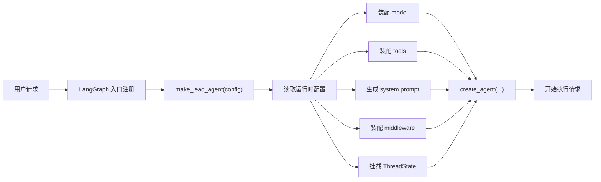
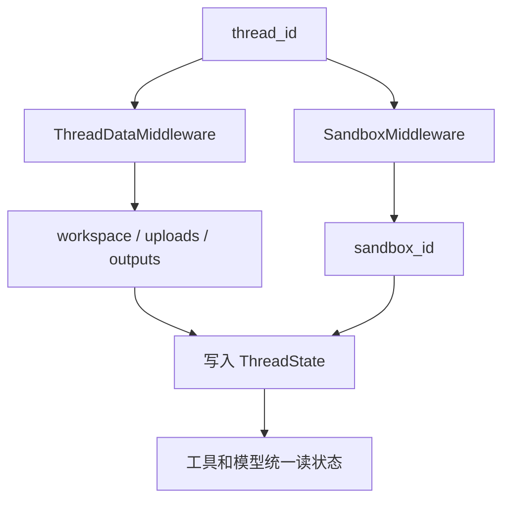

# 第 1 课：一次用户请求如何进入 Lead Agent

如果你刚开始学 AI 后端，最容易写出来的版本通常是这样的：

```python
def chat(user_input: str) -> str:
    model = create_model()          # 创建一个模型对象
    return model.invoke(user_input) # 直接把用户输入交给模型，拿回文本结果
```

这段代码当然能跑，但它几乎只适合做一个演示。因为只要你的系统稍微复杂一点，它马上就会暴露出很多问题。你会发现自己根本没有一个明确入口，不知道哪个函数才算真正的“系统起点”；你会发现模型只能输出文本，它不会真的读文件、搜网页、执行命令；你会发现一旦任务变成长链任务，系统开始失忆，不知道当前工作目录在哪里、上传文件放在哪里、前一步做到了哪里；你也会发现光在 prompt 里写“先澄清再执行”“不要死循环”“最多开 3 个子任务”并不稳，因为模型并不总是会老老实实遵守这些规则。更现实一点说，只要你把 bash 和文件写入能力接进去，安全和隔离问题会立刻出现；而只要工具一报错，整条链就会断掉。

**这段最朴素写法会立刻遇到的坑**

- **入口混乱**：不知道系统真正从哪开始
- **只能输出文本**：模型会说，但不会真的做
- **没有状态背板**：长任务很快失忆
- **全靠 prompt**：规则不够硬，容易漂
- **没有执行隔离**：文件和命令能力一接就危险
- **错误直接炸链**：工具失败时任务无法继续

DeerFlow 的价值，就在于它不是只补某一个坑，而是把“用户请求进入系统之后”的整条链都重新搭了一遍。它的做法不是把 AI 后端理解成“调一次模型接口”，而是把它理解成一套运行时系统。先有明确入口，再装配模型、工具、prompt、中间件和状态，最后才真正开始执行任务。你可以先把这个过程记成下面这张图：



**你可以先把 DeerFlow 的主线压成 5 句话**

- **先固定入口**：知道系统真正从哪启动
- **再读运行时配置**：决定这次请求开什么能力
- **再装 runtime**：把 model、tools、prompt、middleware、state 拼起来
- **再准备环境**：路径、sandbox、记忆、限制都先接好
- **最后才执行**：不是一上来就让模型裸跑

理解 DeerFlow 的第 1 步，不是去背一堆术语，而是先接受一个事实：一个成熟的 agent 后端，本质上是在解决一连串工程坑。

先说入口。很多项目长着长着就会出现一个问题：你知道系统能跑，但你不知道它到底从哪里正式开始。有人在某个模块里偷偷创建 agent，有人在别的模块里单独拼 prompt，还有人在另一个文件里自己选模型。这样的系统短期能跑，长期一定乱。DeerFlow 先把这个问题处理掉了。它在 `backend/langgraph.json` 里明确告诉 LangGraph，真正的系统入口是哪个 graph，以及这个 graph 对应哪个 Python 函数：

```json
{
  "graphs": {
    "lead_agent": "deerflow.agents:make_lead_agent"
  }
}
```

这段 `deerflow.agents:make_lead_agent` 的意思其实不复杂，就是“去 Python 模块 `deerflow.agents` 里找 `make_lead_agent` 这个函数，把它当成创建 Lead Agent 的入口”。这一步看起来普通，但它的意义很大。因为从这里开始，DeerFlow 就有了一个真正的“总装厂”：模型从哪来、工具从哪来、prompt 从哪来、中间件从哪来，后面都会回到 `make_lead_agent()` 这个函数上。

**这里你先记住一个结论**

- **`langgraph.json` 解决的是“入口混乱”**
- **`make_lead_agent()` 解决的是“谁负责总装”**

接下来，DeerFlow 并没有急着直接建模型，而是先读运行时配置。这一点特别值得你注意，因为很多初学者会下意识写出下面这种代码：

```python
model = create_chat_model("gpt-4")  # 模型名被写死，后面很难按请求切换
```

这种写法的问题不是“它不能跑”，而是它太死了。真实的 agent 系统经常要按当前任务切换模式，比如是否开启 thinking、是否允许 subagent、是否进入 plan 模式、这次到底用哪个模型。DeerFlow 在 `make_lead_agent()` 里一开始做的事，就是先把这些运行时参数抽出来：

```python
def make_lead_agent(config: RunnableConfig):
    cfg = config.get("configurable", {})  # 拿运行时配置，没有就给空字典

    thinking_enabled = cfg.get("thinking_enabled", True)   # 是否开启 thinking
    reasoning_effort = cfg.get("reasoning_effort", None)   # reasoning 强度
    requested_model_name: str | None = cfg.get("model_name") or cfg.get("model")  # 模型名
    is_plan_mode = cfg.get("is_plan_mode", False)          # 是否计划模式
    subagent_enabled = cfg.get("subagent_enabled", False)  # 是否允许子 Agent
    max_concurrent_subagents = cfg.get("max_concurrent_subagents", 3)  # 子 Agent 并发上限
    is_bootstrap = cfg.get("is_bootstrap", False)          # 是否 bootstrap 模式
    agent_name = cfg.get("agent_name")                     # Agent 名称
```

这里如果你对 Python 本身不陌生，其实语法并不难。真正值得停下来解释的，是 `requested_model_name: str | None` 这种写法。它是 Python 的类型标注，意思不是“强制必须这样”，而是告诉读代码的人：这个变量通常是字符串，但也可能是 `None`。还有 `cfg.get("model_name") or cfg.get("model")` 这种写法，也不只是语法技巧，它表达的是一种兼容思路：优先认 `model_name`，没有再退到 `model`。像这种地方，DeerFlow 在做的其实不是“语法表演”，而是把运行时行为做得更灵活、更可兼容。

**这段配置读取在解决什么**

- **按请求切换能力**：不是所有请求都用同一种 agent 模式
- **兼容不同参数来源**：比如 `model_name` 和 `model`
- **避免写死行为**：不把系统锁死在单一模型、单一模式上

真正把你带入 DeerFlow 核心设计的，是后面这一段 `create_agent(...)`。这一段几乎可以说是整节课最重要的代码，因为它把 Lead Agent 到底由什么组成，一次性摊开给你看了：

```python
return create_agent(
    model=create_chat_model(  # “脑子”
        name=model_name,
        thinking_enabled=thinking_enabled,
        reasoning_effort=reasoning_effort,
    ),
    tools=get_available_tools(  # “手脚”
        model_name=model_name,
        groups=agent_config.tool_groups if agent_config else None,
        subagent_enabled=subagent_enabled,
    ),
    middleware=_build_middlewares(  # 运行时治理层
        config,
        model_name=model_name,
        agent_name=agent_name,
    ),
    system_prompt=apply_prompt_template(  # 角色和行为规则
        subagent_enabled=subagent_enabled,
        max_concurrent_subagents=max_concurrent_subagents,
        agent_name=agent_name,
    ),
    state_schema=ThreadState,  # 统一状态背板
)
```

如果你读完这一课只记住一句话，我希望就是这一句：

`Lead Agent 不是一个模型，而是一整套运行时装配结果。`

这里的 `create_agent` 不是 DeerFlow 自己发明的普通函数，它来自 LangChain/LangGraph 这一类 agent 框架。你可以把它理解成一个“组装器”：你把模型、工具、系统 prompt、中间件、状态 schema 都交给它，它帮你拼出一个真正能跑的 agent runtime。也正因为这样，DeerFlow 的重点从来不只是“挑一个好模型”，而是“有没有把这次运行真正装起来”。

很多人第一次看这段代码时，会本能地把注意力全放在 `model=` 上，觉得模型才是主角。但 DeerFlow 恰恰在提醒你，模型只是其中一件部件。它当然重要，可如果没有工具，模型就只能说不能做；没有中间件，很多规则就只能停留在软约束；没有统一状态，长任务就会散架；没有 system prompt，模型甚至都不知道自己该扮演什么角色。所以在 DeerFlow 里，真正的主角不是某个单点，而是这一整套 runtime 装配关系。

**`create_agent(...)` 这一段最重要的 5 个关键词**

- **`model`**：决定推理能力
- **`tools`**：决定行动能力
- **`system_prompt`**：决定角色和行为规则
- **`middleware`**：决定运行时治理和兜底
- **`state_schema`**：决定长任务怎么持续记住上下文

模型这一层，DeerFlow 也不是“随便选一个就上”。很多系统早期都容易犯两个极端：要么所有请求都走最强最重的模型，成本和延迟全都飙升；要么完全不感知当前模型到底支不支持 reasoning、support 不支持 vision。DeerFlow 的做法更务实一些：

```python
model=create_chat_model(
    name=model_name,                    # 当前真正使用的模型名
    thinking_enabled=thinking_enabled,  # 是否启用 thinking
    reasoning_effort=reasoning_effort,  # 推理强度
)
```

而且它在前面还会先做能力检查：

```python
if model_config is None:
    raise ValueError(...)   # 模型不存在，直接报错
if thinking_enabled and not model_config.supports_thinking:
    logger.warning(...)     # 记录不匹配
    thinking_enabled = False  # 自动降级
```

这段代码背后其实是一个很朴素但非常重要的工程原则：不要假设所有模型都具备你想要的能力，也不要带着坏配置硬跑。DeepSeek-R1、Kimi k1.5 这类 reasoning model 确实让 agent 场景上限变高了，但运行时必须知道自己手里拿的是什么模型，而不是盲目乐观。

**模型层这里的重点不是“选最强”**

- **先判断模型是否存在**
- **再判断能力是否匹配**
- **不匹配时要明确降级，而不是假装能跑**

接着是工具层。如果没有工具，模型的“行动能力”其实只是幻觉。它最多只能说“我应该去读一下文件”或者“我现在应该调用搜索工具”，但如果系统没有真的把工具对象接进 runtime，这些都只是一段好听的话。DeerFlow 用 `get_available_tools()` 统一处理这件事：

```python
def get_available_tools(
    groups: list[str] | None = None,   # 按工具组筛选
    include_mcp: bool = True,          # 是否包含 MCP 工具
    model_name: str | None = None,     # 当前模型，用来判断能力
    subagent_enabled: bool = False,    # 是否加入子 Agent 工具
) -> list[BaseTool]:
```

这里值得解释的，不是这个函数长得像什么，而是 `-> list[BaseTool]` 和 `BaseTool`。`BaseTool` 不是 Python 内置类型，它来自 LangChain 工具系统。你可以把它理解成“所有工具对象的共同基类”。而 `-> list[BaseTool]` 的意思是：这个函数最终会返回一组工具对象。换句话说，DeerFlow 在这里做的不是“返回一个字符串配置”，而是“返回真正可执行的工具实例”。

它的核心装配逻辑也很值得你看：

```python
loaded_tools = [
    resolve_variable(tool.use, BaseTool)   # 把配置里的路径解析成真正的 Python 工具对象
    for tool in config.tools
    if groups is None or tool.group in groups
]

builtin_tools = BUILTIN_TOOLS.copy()       # 先拿一份系统内建工具

if subagent_enabled:
    builtin_tools.extend(SUBAGENT_TOOLS)   # 需要子 Agent 时，再加入 task 工具

if model_config is not None and model_config.supports_vision:
    builtin_tools.append(view_image_tool)  # 只有视觉模型才加入图片工具
```

这里最值得你注意的是 `resolve_variable(...)`。这是 DeerFlow 自己的一层反射工具，它的作用是把配置里的字符串路径，解析成真正的 Python 对象。你可以粗略地把它想成：配置文件里写的是“这个工具类在哪”，运行时再把它真的导入进来。这个思路很常见，因为它能让系统不把所有工具写死在代码里，而是按配置动态加载。也正因为这样，DeerFlow 的工具体系才有很强的扩展性。

工具层还有一个很重要的工程点：工具不是越多越好。很多系统一开始会犯一个典型错误，把所有工具不分场景地全暴露给模型。这样看起来“很强”，实际上往往更差。因为工具一多，模型每轮的选择空间会变大，上下文也会更重，误调工具的概率也会上升。DeerFlow 的做法是按模式、按模型能力、按配置来拼工具集。换句话说，它在控制的不只是“有没有工具”，而是“当前这一轮，该给模型哪些手脚”。

**工具层这部分最该记住**

- **工具要动态装配，不要一股脑全塞给模型**
- **工具集合和运行模式强相关**
- **工具层是模型“从会说到能做”的桥**

再往后就是状态。很多 agent 系统在早期只把 `messages` 当状态，但只要你做过长任务，你就会知道这远远不够。真实运行时还得记住 sandbox、工作目录、上传文件、产物文件、图片查看结果等等。DeerFlow 用 `ThreadState` 把这些状态正式收进一个统一背板里：

```python
class ThreadState(AgentState):
    sandbox: NotRequired[SandboxState | None]          # 当前线程使用的 sandbox
    thread_data: NotRequired[ThreadDataState | None]   # workspace / uploads / outputs 路径
    title: NotRequired[str | None]                     # 线程标题
    artifacts: Annotated[list[str], merge_artifacts]   # 输出产物，更新时要做合并
    todos: NotRequired[list | None]                    # todo 或计划数据
    uploaded_files: NotRequired[list[dict] | None]     # 上传文件信息
    viewed_images: Annotated[dict[str, ViewedImageData], merge_viewed_images]  # 图片查看状态
```

这里如果你看不懂，真正需要停一下的不是基础语法，而是 `Annotated[...]` 这种写法。`Annotated` 的意思不是单纯“这是个列表”，而是“这是个列表，而且更新它的时候要配套某个额外行为”。比如 `artifacts` 配的是 `merge_artifacts`，本质上就是告诉系统：这个字段不是简单覆盖，而是需要合并。你可以把这理解成一种“状态更新规则写进类型定义”的方式。它让 DeerFlow 的状态系统不只是“装数据”，还顺手定义了“怎么更新这些数据”。

**状态层为什么关键**

- **长任务不能只靠 messages**
- **状态不只是存数据，还要定义更新规则**
- **统一状态背板能让工具层和中间件层协作起来**

有了状态，接下来就该解决另一个现实问题：文件和执行环境怎么隔离。很多 demo 一开始会把所有线程都扔进同一个目录里工作，结果很快就会出现上传文件混在一起、线程 A 的产物污染线程 B、临时文件和最终输出搅成一锅粥。DeerFlow 先通过 `ThreadDataMiddleware` 把 thread 级目录准备好：

```python
return {
    "thread_data": {
        **paths,  # 把 workspace / uploads / outputs 这些路径整体写回状态
    }
}
```

里面那份 `paths` 大概长这样：

```python
return {
    "workspace_path": str(self._paths.sandbox_work_dir(thread_id)),   # 临时工作目录
    "uploads_path": str(self._paths.sandbox_uploads_dir(thread_id)),  # 上传文件目录
    "outputs_path": str(self._paths.sandbox_outputs_dir(thread_id)),  # 最终输出目录
}
```

你不需要把这段代码背下来，只需要明白它在做什么：模型还没真正开始工作，运行环境已经先被整理好了。这个思想非常重要，因为它说明 DeerFlow 并不是“先让模型动手，再想办法补环境”，而是先把任务舞台搭好，再让模型上场。

同样的思路也体现在 sandbox 上。只要你允许工具执行命令、读写文件，你就必须开始考虑隔离问题。DeerFlow 没有让 agent 直接裸奔在宿主环境里，而是通过 `SandboxMiddleware` 在运行时把 sandbox 挂到当前线程状态上：

```python
if "sandbox" not in state or state["sandbox"] is None:
    thread_id = runtime.context["thread_id"]       # 先拿当前线程 ID
    sandbox_id = self._acquire_sandbox(thread_id)  # 按线程申请 sandbox
    return {"sandbox": {"sandbox_id": sandbox_id}} # 写回状态，后面工具统一使用
```

你会发现，DeerFlow 一直在重复同一种设计语言：别让后面的工具、prompt、模型去猜环境；环境先由 runtime 明确准备好，再作为状态的一部分传下去。这种设计的好处是，工具层和模型层都不需要到处自己推断路径和上下文，它们只要读状态就行。



到这里，你大概已经能感觉到，DeerFlow 并没有把所有规则都堆进 prompt 里。这就引出了 middleware 这一层。很多新手第一次做 agent，都会天然觉得“规则写进 prompt 不就好了”。但 prompt 有一个天然问题：它是软约束。模型可能听，也可能忘，任务一长还可能漂。所以 DeerFlow 专门留出一层 middleware 来做运行时治理：

```python
middlewares = build_lead_runtime_middlewares(lazy_init=True)

summarization_middleware = _create_summarization_middleware()
if summarization_middleware is not None:
    middlewares.append(summarization_middleware)  # 上下文过长时做摘要压缩

middlewares.append(TitleMiddleware())             # 自动生成标题
middlewares.append(MemoryMiddleware(agent_name=agent_name))  # 记忆处理

if subagent_enabled:
    middlewares.append(SubagentLimitMiddleware(max_concurrent=max_concurrent_subagents))  # 限制子 Agent 并发

middlewares.append(LoopDetectionMiddleware())     # 防死循环
middlewares.append(ClarificationMiddleware())     # 需要澄清时中断
```

这里你可以先不去管每一个 middleware 的内部细节，只要抓住它们存在的共同理由：prompt 负责告诉模型“应该怎么做”，middleware 负责在运行时确保系统“不至于失控”。所以如果你问 middleware 算不算 workflow，更准确的回答应该是：不完全算。workflow 更像主线，告诉系统“按什么步骤推进”；middleware 更像横切治理层，告诉系统“每一步推进时要受什么约束和保护”。

**middleware 这一层最容易记错，但也最重要**

- **workflow**：主线怎么推进
- **middleware**：推进过程中有哪些横切规则在约束它
- **prompt**：告诉模型“应该怎么做”
- **middleware**：保证系统“不会轻易失控”

最后一个特别容易被忽视、但其实非常工程化的点，是工具报错时 DeerFlow 怎么处理。很多系统在工具层一报错，就直接把整次请求炸掉了。这种做法短期简单，但长链任务里非常脆弱。DeerFlow 的想法不一样：错误本身也是一种观察结果，所以也应该被送回 agent，而不是单纯变成一次致命异常：

```python
content = f"Error: Tool '{tool_name}' failed with {exc.__class__.__name__}: {detail}. Continue with available context, or choose an alternative tool."
return ToolMessage(
    content=content,            # 给模型看的错误说明
    tool_call_id=tool_call_id,  # 对应哪次工具调用
    name=tool_name,             # 哪个工具出错了
    status="error",             # 明确标成错误状态
)
```

这里的 `ToolMessage` 不是普通字符串，它来自 LangChain/LangGraph 的消息体系。你可以把它理解成“专门代表工具结果的一类消息”。DeerFlow 把错误转成 `ToolMessage`，本质上是在告诉 agent：这次行动失败了，但失败本身也是上下文，你可以继续基于它做下一步判断。这种思路其实非常接近 ReAct 的精神，因为 ReAct 讲的从来就不只是“成功后继续”，而是“行动后根据观察继续推理”。而工具失败，恰恰也是观察的一部分。

**错误处理这部分的核心思想**

- **不要让工具异常直接炸掉整条链**
- **把失败也转成上下文**
- **让 agent 基于失败继续判断下一步**

读到这里，你可以再回头看 DeerFlow 的整个调用链，就会发现它其实有非常强的线性感。它不是在同时讲十几个知识点，而是在按一个很稳定的逻辑往前推：先把入口固定下来，再读取运行时配置，再把 agent runtime 装配起来，再把工具和状态接上，再把目录和 sandbox 这种执行环境准备好，再用 middleware 去做治理和兜底，最后才真正让模型开始处理请求。整套设计背后的思想也很统一：不是相信模型会自动变得可靠，而是先把系统搭成一个更不容易失控的运行时。

如果你现在觉得这节课信息量不小，这是正常的。但你至少应该已经建立起一个很关键的感觉：DeerFlow 后端并不是一堆零散文件，而是在沿着同一条工程主线解决问题。它遇到的坑包括入口混乱、工具失控、状态散落、环境不隔离、错误难恢复，而它给出的解决方案分别是显式入口、运行时装配、工具分层、统一状态、thread 级目录、sandbox 和 middleware 兜底。你后面学 prompt、memory、subagent，其实也都是沿着同一条逻辑继续往下展开。

这一课你现在最应该留下来的，不是某个语法点，而是一个更大的认识：一个成熟的 agent 后端，重点从来不只是模型能力，而是你能不能把模型、工具、状态、环境和规则组织成一个可靠的 runtime。DeerFlow 的第 1 课，本质上讲的就是这件事。

**这一课的最后总结**

- **Lead Agent 不是单个模型，而是一套 runtime**
- **`make_lead_agent()` 是 DeerFlow 的总装厂**
- **`create_agent(...)` 把 model、tools、prompt、middleware、state 真正拼起来**
- **`ThreadState` 解决长任务状态散落**
- **middleware 解决“光靠 prompt 不够硬”**
- **sandbox 和 thread 级目录解决执行环境隔离**
- **工具错误不直接炸链，而是变成下一轮推理的上下文**

下一课，我们就沿着这条线继续往前走，去看 DeerFlow 的 prompt 到底是怎么设计出来的，以及为什么很多规则看起来写在 prompt 里，但真正要落稳，还得靠 runtime 其他层一起配合。
