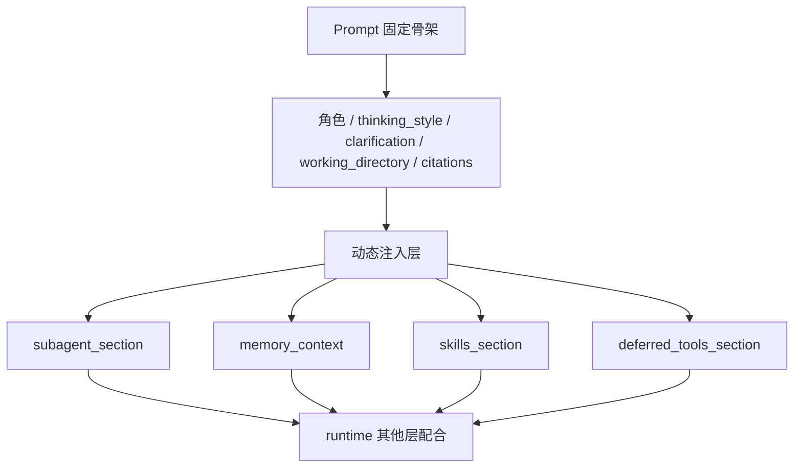

# 第 2 课：DeerFlow 的 Prompt 是怎么设计的

很多人学 Agent，最早着迷的就是 prompt。因为 prompt 看起来最像“魔法开关”: 你多写几句话，模型就好像更聪明一点；你再补几条规则，模型又好像更听话一点。可一旦系统复杂起来，prompt 往往会最先失控。它会越来越长，越来越重，越来越像一个什么都想管、最后却什么都管不稳的总说明书。

所以这一课我们不从“Prompt Engineering 技巧大全”开始，而是从一个更现实的问题开始：

**一个 Agent 后端的 prompt，最容易先坏在哪？**

答案通常有四种。第一种坏法，是把所有规则都塞进一份超长 prompt，最后模型根本抓不住重点。第二种坏法，是只告诉模型“该做什么”，却没告诉它“什么时候绝对不能继续做”。第三种坏法，是把 skills、memory、subagent、引用规则、输出路径这些东西一股脑全暴露出来，不分场景、不分模式。第四种坏法，也是最隐蔽的一种，是以为 prompt 足够长就能替代 runtime 其他层，结果系统一遇到复杂任务就开始漂。

DeerFlow 的 prompt 设计之所以值得你学，不是因为它写得特别华丽，而是因为它并没有把 prompt 当成一段静态话术，而是把它当成一个运行时模板。你先看核心结构，就能感觉出这个思路：

```python
SYSTEM_PROMPT_TEMPLATE = """
<role>
You are {agent_name}, an open-source super agent.
</role>

{soul}              # 当前 agent 的 personality / SOUL，可按 agent 名注入
{memory_context}    # 记忆内容，不是每次都有

<thinking_style>
- Think concisely and strategically about the user's request BEFORE taking action
- Break down the task: What is clear? What is ambiguous? What is missing?
- **PRIORITY CHECK: If anything is unclear, missing, or has multiple interpretations, you MUST ask for clarification FIRST**
{subagent_thinking} # 只有开了 subagent 才会加进来
</thinking_style>

<clarification_system>
**WORKFLOW PRIORITY: CLARIFY → PLAN → ACT**
...
</clarification_system>

{skills_section}         # 技能区块，动态注入
{deferred_tools_section} # 延迟工具区块，动态注入
{subagent_section}       # 子 Agent 区块，动态注入

<working_directory existed="true">
...
</working_directory>

<citations>
...
</citations>
"""
```

这段代码如果只从字面看，很容易把注意力放在那些 XML 风格标签上。但它真正重要的不是“长得像不像 XML”，而是其中这些占位符：`{memory_context}`、`{skills_section}`、`{deferred_tools_section}`、`{subagent_section}`。这说明 DeerFlow 从一开始就没有把 prompt 设计成一块写死的长字符串。它更像一个框架，先把固定骨架搭好，再根据当前运行模式把真正需要的内容塞进去。

**这一层设计最重要的 4 个收益**

- **减少无关上下文**：不是每次都背完整套系统说明书
- **按模式切 prompt**：开了 subagent 才讲 subagent 规则
- **让重点更稳定**：少一些无关指令，模型更容易抓住主线
- **为 runtime 配合留空间**：prompt 不再承担所有责任

如果你往回想第 1 课，就会发现这里其实是在解决同一类坑。第 1 课讲的是 runtime 不能只靠模型，这一课讲的是 prompt 也不能只靠“越长越好”。DeerFlow 的思路很一致: 凡是容易失控的地方，都不要试图用“大而全”的写法硬扛。

Prompt 里第一个特别值得你学的模块，是 `thinking_style`。很多系统会犯一个典型错误：只要求模型“给我答案”，不要求模型先判断问题是否清楚、信息是否足够、任务是否需要拆解。DeerFlow 的写法更像是在提醒模型先做一层任务判断：

```python
<thinking_style>
- Think concisely and strategically about the user's request BEFORE taking action  # 先判断，再动手
- Break down the task: What is clear? What is ambiguous? What is missing?          # 先分清楚、分不清楚、缺什么
- **PRIORITY CHECK: If anything is unclear, missing, or has multiple interpretations, you MUST ask for clarification FIRST**
{subagent_thinking}  # 如果允许 subagent，这里还会额外补一层拆解提示
- Never write down your full final answer or report in thinking process, but only outline
- CRITICAL: After thinking, you MUST provide your actual response to the user.
</thinking_style>
```

这里最关键的不是 “Think strategically” 这种表述，而是它把“先判断是否要澄清”放在了整个动作之前。也就是说，DeerFlow 并不把 prompt 当成“写作风格说明”，而是拿它来控制 Agent 的动作顺序。这个区别非常大，因为一旦你把 prompt 提升到“动作顺序级别”，它就不只是人设，而更像行为协议。

Prompt 里第二个特别重要的模块，是 `clarification_system`。这个区块几乎可以说是 DeerFlow 对“先澄清再执行”这件事的正式承诺：

```python
<clarification_system>
**WORKFLOW PRIORITY: CLARIFY → PLAN → ACT**
1. **FIRST**: Analyze the request in your thinking - identify what's unclear, missing, or ambiguous
2. **SECOND**: If clarification is needed, call `ask_clarification` tool IMMEDIATELY - do NOT start working
3. **THIRD**: Only after all clarifications are resolved, proceed with planning and execution

**MANDATORY Clarification Scenarios**
1. Missing Information
2. Ambiguous Requirements
3. Approach Choices
4. Risky Operations
5. Suggestions
</clarification_system>
```

这一段如果只看文字，好像只是“要求模型更谨慎”。但它实际在解决的是一个很工程的问题：如果用户需求本身不清楚，模型越积极，反而越危险。尤其在 DeerFlow 这种会调工具、会读写文件、会执行命令、会开 subagent 的系统里，错误地理解需求，后面每一步都可能继续放大错误。

你可以把这段 prompt 理解成 DeerFlow 给 Agent 下的一条主纪律：

- **不清楚，就先停**
- **不要边做边问**
- **不要靠猜把任务推进下去**

这也是为什么 DeerFlow 的 prompt 值得学。它不是在教模型“怎么写得更像人”，而是在教模型“怎么别把系统带进错轨道”。

不过，DeerFlow 真正高明的地方还不是把规则写出来，而是把“规则写进 prompt”这件事做成动态装配。最核心的函数就是 `apply_prompt_template(...)`：

```python
def apply_prompt_template(
    subagent_enabled: bool = False,
    max_concurrent_subagents: int = 3,
    *,
    agent_name: str | None = None,
    available_skills: set[str] | None = None,
) -> str:
    memory_context = _get_memory_context(agent_name)                  # 根据 memory 配置和 agent_name 决定要不要注入记忆
    subagent_section = _build_subagent_section(n) if subagent_enabled else ""  # 只有开了 subagent 才拼子 Agent 规则
    skills_section = get_skills_prompt_section(available_skills)      # 动态生成技能区块
    deferred_tools_section = get_deferred_tools_prompt_section()      # 动态生成延迟工具区块

    prompt = SYSTEM_PROMPT_TEMPLATE.format(
        agent_name=agent_name or "DeerFlow 2.0",
        soul=get_agent_soul(agent_name),          # 按 agent_name 注入 personality
        skills_section=skills_section,
        deferred_tools_section=deferred_tools_section,
        memory_context=memory_context,
        subagent_section=subagent_section,
        subagent_reminder=subagent_reminder,
        subagent_thinking=subagent_thinking,
    )

    return prompt + f"\n<current_date>{datetime.now().strftime('%Y-%m-%d, %A')}</current_date>"  # 把当前日期补进 prompt
```

这段代码里真正值得你停一下的，不是 Python 语法，而是它背后的设计判断。DeerFlow 明显在说：

**Prompt 不应该是一份总说明书，而应该是这次运行真正需要的最小规则集合。**

比如当前没开 subagent，那就不要把整大段子 Agent 调度规则塞进去；当前 memory 没开，那就不要把 long-term memory 硬注入；当前没有技能，就不要给模型一整屏 skill 清单；当前没有 deferred tools，也没必要让模型背着这部分知识。

这意味着 DeerFlow 的 prompt 是“运行时可变”的。这个设计极其重要，因为它直接影响三个东西：

- **Token 体积**
- **模型注意力**
- **规则稳定性**

Prompt 太长，模型未必更稳，很多时候反而更飘。DeerFlow 在这里的思路，其实和整个后端架构是一致的：少让系统背无关负担，让每一次运行尽量只携带当前真正需要的东西。

再往细处看，DeerFlow 注入的这几个动态模块，也各自对应一个特别现实的坑。

`memory_context` 解决的是“模型每次都像失忆一样”的问题。可它不是无脑把所有历史塞进去，而是先通过 `_get_memory_context(...)` 判断 memory 配置是否打开，再判断内容是否为空，再控制注入 token 数。也就是说，记忆在 DeerFlow 里不是“我存了，所以我每次都塞给你”，而是“只有当前真的需要、而且能控制大小时才注入”。

`skills_section` 解决的是“模型不知道系统里有哪些成熟流程”的问题。DeerFlow 不是直接把 skill 文档全文塞进去，而是只给模型一个技能索引和读取规则：

```python
def get_skills_prompt_section(available_skills: set[str] | None = None) -> str:
    skills = load_skills(enabled_only=True)  # 先拿当前启用技能
    ...
    return f"""<skill_system>
You have access to skills that provide optimized workflows for specific tasks.

**Progressive Loading Pattern:**
1. When a user query matches a skill's use case, immediately call `read_file`
2. Read and understand the skill's workflow and instructions
3. Load referenced resources only when needed
4. Follow the skill's instructions precisely

{skills_list}
</skill_system>"""
```

这里最值得你学的，不是“skills 可以被列出来”，而是 **Progressive Loading Pattern**。这说明 DeerFlow 不希望模型一上来就把所有技能详情都背在上下文里，而是希望模型先知道“有什么”，再按需读。这个思路和 MCP / Tool Search 很像，本质上都是在防一个坑：能力很多时，不要一口气全塞给模型。

`deferred_tools_section` 解决的是“外部工具很多，但没必要全绑定”的问题。你可以把它理解成：系统先告诉模型“外面有这些工具名”，但真正要用时再通过 `tool_search` 去拿。这样做的好处非常直接，prompt 不会被大批工具 schema 压得太重。

`subagent_section` 则是在解决另一个更难的坑：如果开启了 subagent，模型很容易过度兴奋，一上来就乱开任务，最后要么并发超上限，要么把一个简单动作也包装成 subagent。DeerFlow 直接把这些风险写进 prompt 里，而且写得很硬：

```python
def _build_subagent_section(max_concurrent: int) -> str:
    return f"""<subagent_system>
**⛔ HARD CONCURRENCY LIMIT: MAXIMUM {n} `task` CALLS PER RESPONSE.**
- Each response, you may include at most {n} `task` tool calls
- If count > {n}: pick the most important sub-tasks first
- Multi-batch execution for larger tasks
- Single task = execute directly, do not wrap in subagent
</subagent_system>"""
```

这段 prompt 的重要性在于，它不只是说“你可以用 subagent”，而是在提前规定：

- **什么时候该用**
- **什么时候不该用**
- **超上限时怎么办**
- **为什么单个简单任务不该包成 subagent**

也就是说，DeerFlow 的 prompt 不是在扩展模型能力，而是在给能力划边界。这个设计非常有后端意识，因为很多系统真正不稳的原因不是“能力不够”，而是“能力一开就没有边界”。

Prompt 里还有两个非常容易被忽略、但对真实任务非常关键的区块：`working_directory` 和 `citations`。

`working_directory` 这一段其实是在解决文件类任务经常踩的坑。模型如果不知道上传文件、工作目录、最终输出目录分别在哪，很容易出现几个问题：在错误目录里写文件、把临时内容误当最终产物、找不到用户上传的材料。DeerFlow 干脆把这些路径规则直接写清楚：

```python
<working_directory existed="true">
- User uploads: `/mnt/user-data/uploads`
- User workspace: `/mnt/user-data/workspace`
- Output files: `/mnt/user-data/outputs`

**File Management**
- Uploaded files are automatically listed in context
- Temporary work happens in workspace
- Final deliverables must be copied to outputs
</working_directory>
```

Prompt 在这里做的，不是“帮模型更有礼貌”，而是在避免模型对文件系统做错误假设。

`citations` 这一段则是在解决 research / search 类任务常见的另一个坑：模型很容易写出一篇看起来像研究报告、但没有来源锚点的内容。DeerFlow 不满足于“鼓励引用”，它把 citation 规范直接写成明确规则：

```python
<citations>
- When to Use: MANDATORY after web_search, web_fetch, or any external information source
- Format: `[citation:TITLE](URL)` immediately after the claim
- Also collect all citations in a Sources section
- NEVER write claims without citations when sources are available
</citations>
```

这说明在 DeerFlow 里，prompt 已经不只是思考指导，而是在承担一部分输出协议的职责。系统不是只想让模型“写得像样”，而是想让模型“写得可回溯”。

到这里，你可能会自然冒出一个问题：如果 prompt 已经写得这么细了，那是不是 prompt 足够好，就可以不需要 middleware 了？答案恰恰相反。DeerFlow 的 prompt 设计越细，越能看出一个事实：

**Prompt 在 DeerFlow 里是软规则层，它很重要，但它从来不是唯一规则层。**

比如“最大并发子 Agent 数量”写在 prompt 里是必要的，因为模型需要先知道这件事；但光写在 prompt 里还不够，因为系统还要在 middleware 里真的限制它。再比如“需要澄清时必须先停”写进 prompt 是必要的，因为模型得先形成这个判断；但真正让执行中断的，最终还是 `ClarificationMiddleware`。这也就是为什么第 2 课和第 3 课是连在一起的。Prompt 负责把规则说清楚，middleware 负责在运行时把这些规则落稳。

你可以把 DeerFlow 的 prompt 总结成三层：



**你可以先把这张图读成 3 句话**

- **先有固定骨架**：这部分决定 Agent 的基本角色和行为纪律
- **再有动态注入**：这部分决定这次运行需要带哪些能力说明
- **最后和 runtime 配合**：prompt 不独立存在，它要和 middleware、tools、state 一起工作

如果要把这一课压成一句话，我会这样说：

**DeerFlow 的 prompt 不是“写给模型的一篇长文”，而是“按当前运行时能力拼装出来的一份行为模板”。**

它真正厉害的地方，不是写得长，而是写得有边界；不是把所有东西都塞进去，而是知道哪些该注入、哪些不该注入；不是想单靠 prompt 解决所有问题，而是知道 prompt 只是整个 runtime 里非常重要但不是唯一的一层。

**这一课最后你最该记住的点**

- **Prompt 不是静态话术，而是运行时模板**
- **固定骨架负责角色和纪律，动态注入负责当前运行模式**
- **skills、memory、subagent、deferred tools 都不该无脑全塞**
- **working_directory 和 citations 说明 prompt 也在承担行为协议职责**
- **Prompt 负责立规则，但真正落稳规则还得靠 runtime 其他层**
