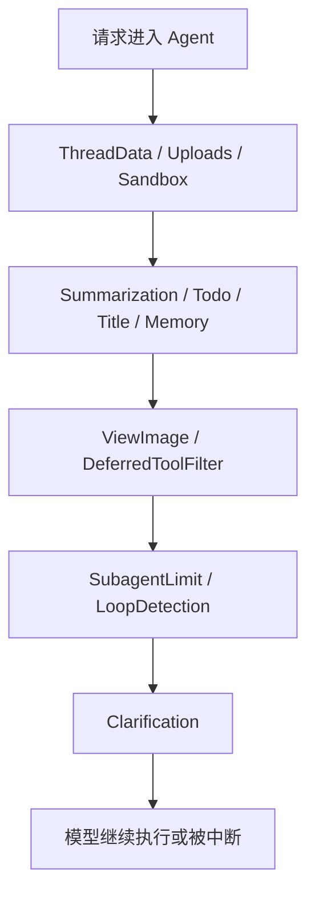

# 第 3 课：为什么 DeerFlow 需要 Middleware 链

如果你已经读完前两课，现在最自然会冒出来的一个问题就是：既然 DeerFlow 的 prompt 已经写得这么细了，为什么还要 middleware？这不是多此一举吗？

这个问题特别关键，因为它决定了你到底是怎么理解 Agent 后端的。很多人刚开始做 Agent，会天然把整个系统想成“模型 + prompt”。只要 prompt 写得足够细，模型应该就会更听话、更可靠、更不容易跑偏。这个直觉在简单任务里偶尔成立，但一旦任务开始变长、工具开始变多、用户输入开始变复杂，prompt 很快就会暴露出一个根本弱点：

**prompt 是软规则。**

它可以引导模型，但不能保证模型每次都严格照做。模型不是编译器，它不会像执行程序那样稳定地服从所有指令。你在 prompt 里写“需要澄清就先停”，模型有时会照做，有时可能还是先试着干点什么；你写“最多只能开 3 个 subagent”，模型也可能一兴奋就多开几个；你写“不要重复同样的工具调用”，模型在长上下文里还是可能绕进去。

所以 DeerFlow 的 middleware 不是为了“架构更高级”，而是为了正面解决这个现实问题：**当 prompt 不够硬的时候，系统层必须接管。**

你先看 DeerFlow 在组装 middleware 链时，代码本身就已经在强调“顺序”有多重要：

```python
# ThreadDataMiddleware must be before SandboxMiddleware to ensure thread_id is available
# UploadsMiddleware should be after ThreadDataMiddleware to access thread_id
# SummarizationMiddleware should be early to reduce context before other processing
# MemoryMiddleware queues conversation for memory update (after TitleMiddleware)
# ClarificationMiddleware should be last to intercept clarification requests after model calls

def _build_middlewares(config: RunnableConfig, model_name: str | None, agent_name: str | None = None):
    middlewares = build_lead_runtime_middlewares(lazy_init=True)

    summarization_middleware = _create_summarization_middleware()
    if summarization_middleware is not None:
        middlewares.append(summarization_middleware)  # 上下文长了先压缩

    todo_list_middleware = _create_todo_list_middleware(is_plan_mode)
    if todo_list_middleware is not None:
        middlewares.append(todo_list_middleware)      # plan mode 才加 todo 管理

    middlewares.append(TitleMiddleware())             # 先生成标题
    middlewares.append(MemoryMiddleware(agent_name=agent_name))  # 再处理记忆

    if model_config is not None and model_config.supports_vision:
        middlewares.append(ViewImageMiddleware())     # 支持视觉时，才处理图片

    if app_config.tool_search.enabled:
        middlewares.append(DeferredToolFilterMiddleware())  # 隐藏延迟工具 schema

    if subagent_enabled:
        middlewares.append(SubagentLimitMiddleware(max_concurrent=max_concurrent_subagents))  # 限制子 Agent 数量

    middlewares.append(LoopDetectionMiddleware())     # 防止重复调用同一批工具
    middlewares.append(ClarificationMiddleware())     # 最后再拦截 ask_clarification
    return middlewares
```

这段代码最值得你先停下来体会的，不是某一个具体 middleware，而是 **middleware 是一条链** 这件事。DeerFlow 不是简单地“加几个中间件”，而是在明确设计一个有顺序的运行时治理流程。为什么要有顺序？因为不同中间件解决的问题不一样，而有些问题必须在别的问题之前处理。

比如 `ThreadDataMiddleware` 必须早于 `SandboxMiddleware`，因为 sandbox 需要知道 thread_id 才能和当前线程绑定；`SummarizationMiddleware` 要尽量靠前，因为上下文太长时，后面的处理中间件也会一起受累；`ClarificationMiddleware` 要放在最后，因为它的职责不是修改上下文，而是拦截 `ask_clarification` 这个工具调用并直接中断执行。

如果你只从“有没有 middleware”这个角度看，很容易低估 DeerFlow 做的事情。但如果你从“这条链要按什么顺序排”来理解，就会一下子明白它为什么是 runtime 的一部分，而不是补丁。

你可以先把 middleware 这一层想成围在主 workflow 外面的一圈运行时治理层。这里特别容易混淆的两个词是 workflow 和 middleware。很多人会觉得：“这不也是流程的一部分吗？”更准确的说法应该是：

- **workflow**：主任务按什么步骤推进
- **middleware**：任务推进的每一步，要受到哪些横切规则约束

所以 middleware 不完全等于 workflow，但它确实决定 workflow 会不会失控。DeerFlow 把这两层分开，是一个非常成熟的架构判断。因为如果你把所有控制逻辑都揉进主流程，系统很快就会变得又难改又难查；但如果你把横切规则下沉到 middleware，各个模块的职责就会清楚很多。

**Middleware 这层最重要的作用**

- **把软规则变成硬约束**
- **把主流程和治理逻辑拆开**
- **让每一个风险点都能有独立兜底**
- **让系统不只会“说应该怎样”，而是真的能“控制成这样”**

如果我们沿着“最容易先坏在哪”这条线往下走，很快就会撞上第一个很典型的坑：用户需求明明没说清楚，模型还是继续开工。这个坑只靠 prompt 很难彻底解决，因为 prompt 最多只能提醒模型“先澄清”。真正让系统停下来的，是 `ClarificationMiddleware`。

你看它的逻辑其实非常直接：

```python
def wrap_tool_call(self, request: ToolCallRequest, handler: Callable[[ToolCallRequest], ToolMessage | Command]) -> ToolMessage | Command:
    if request.tool_call.get("name") != "ask_clarification":
        return handler(request)  # 不是 ask_clarification，就正常放行

    return self._handle_clarification(request)  # 是 ask_clarification，就交给中间件接管
```

更关键的是 `_handle_clarification(...)` 最后的返回值：

```python
tool_message = ToolMessage(
    content=formatted_message,     # 把澄清问题整理成用户能直接读懂的文本
    tool_call_id=tool_call_id,
    name="ask_clarification",
)

return Command(
    update={"messages": [tool_message]},  # 先把提问写进消息历史
    goto=END,                             # 再直接中断这次执行
)
```

这里如果你第一次看到 `Command(goto=END)` 可能会有点陌生。它不是普通 Python 控制流，而是 LangGraph 提供的一种图执行控制方式。你可以把它理解成：middleware 在这里不是“建议模型暂停”，而是在图执行层面直接说，“这一轮就到这里，先别继续了”。这就是 middleware 和 prompt 最本质的差别。Prompt 会说：“如果不清楚，应该澄清。” Middleware 则能说：“你已经触发澄清工具了，那这一轮现在就停。”

这也是为什么我前面一直强调，middleware 不是“写在 prompt 外面的说明书”，它是在运行时真正接管控制流的地方。

第二个特别典型的坑，是 subagent。一旦系统支持子 Agent，模型很容易变得兴奋起来。它会觉得，复杂任务既然可以拆，那我多拆几个不是更好吗？如果只靠 prompt 约束“每次最多 3 个”，模型依然可能会超上限。DeerFlow 对这个问题的处理非常直接：系统层硬裁掉超出的调用。

```python
task_indices = [i for i, tc in enumerate(tool_calls) if tc.get("name") == "task"]
if len(task_indices) <= self.max_concurrent:
    return None  # 没超上限，不动

indices_to_drop = set(task_indices[self.max_concurrent :])  # 找出多出来的 task 调用
truncated_tool_calls = [tc for i, tc in enumerate(tool_calls) if i not in indices_to_drop]

updated_msg = last_msg.model_copy(update={"tool_calls": truncated_tool_calls})  # 只保留前 N 个
return {"messages": [updated_msg]}
```

这段 `SubagentLimitMiddleware` 的意义特别值得你记住。它不是“提醒模型别乱来”，而是“模型就算乱来了，系统也会替它截断”。这就是所谓把软规则变成硬约束。你甚至可以说，这种中间件本质上是在做一件非常后端的事情：**不给模型犯错的机会**。它不是等错误发生了再补救，而是直接从响应里把超限部分切掉。

第三个经典坑，是循环。Agent 一旦开始调工具，就有可能陷入一种非常讨厌的状态：同一个工具、同一组参数、重复来回调用，直到递归限制把它强行杀掉。这个问题在简单任务里不明显，但在复杂任务里非常常见，因为模型会把“再试一次”误当成“还没完成”。

DeerFlow 的 `LoopDetectionMiddleware` 处理这个问题的方式很漂亮。它不是去理解业务内容，而是直接哈希工具调用：

```python
def _hash_tool_calls(tool_calls: list[dict]) -> str:
    normalized = []
    for tc in tool_calls:
        normalized.append(
            {
                "name": tc.get("name", ""),  # 只保留工具名
                "args": tc.get("args", {}),  # 和参数
            }
        )

    normalized.sort(
        key=lambda tc: (
            tc["name"],
            json.dumps(tc["args"], sort_keys=True, default=str),
        )
    )
    blob = json.dumps(normalized, sort_keys=True, default=str)
    return hashlib.md5(blob.encode()).hexdigest()[:12]  # 把这一组工具调用压成一个短 hash
```

这里真正聪明的点有两个。第一，它并不关心模型说了什么长篇大论，它只关心工具调用这件事是不是在重复。第二，它把工具调用做成 **order-independent hash**，也就是说，只要工具名和参数集合一样，顺序变化也不会骗过它。

检测到重复之后，DeerFlow 会分两步处理。先是警告，再是硬停：

```python
if count >= self.warn_threshold:
    return _WARNING_MSG, False  # 先注入系统警告：你在重复，收尾吧

if count >= self.hard_limit:
    return _HARD_STOP_MSG, True # 超过硬阈值，直接强行停止工具调用
```

真正执行硬停的时候，它会干一件很“硬”的事：

```python
stripped_msg = last_msg.model_copy(update={
    "tool_calls": [],  # 把工具调用全部剥掉
    "content": (last_msg.content or "") + f"\n\n{_HARD_STOP_MSG}",
})
return {"messages": [stripped_msg]}
```

也就是说，系统不是在和模型商量“你别继续调工具了”，而是直接把最后那条 AI 消息里的 `tool_calls` 清空，逼着模型别再动手，而是开始收尾。这就是 middleware 的力量：它不只是解释规则，而是能真正改写一次执行。

如果我们把上面这几个例子连起来看，就会发现 DeerFlow 的 middleware 其实在不断重复同一个设计哲学：

- prompt 先告诉模型应该怎么做
- middleware 再确保模型做不到时，系统还能把事情拉回来

也就是说，prompt 和 middleware 不是竞争关系，而是分层协作关系。Prompt 解决的是“模型该怎么理解自己的角色和任务”，middleware 解决的是“系统怎么在运行时保证底线不被突破”。

这也是为什么 DeerFlow 的 middleware 不是一个巨大的总控模块，而是一串职责单一的链。你继续往前看，会发现还有一些中间件也在做同样的事。`MemoryMiddleware` 不负责替模型思考，它负责把对话排进记忆更新机制。`ViewImageMiddleware` 不负责理解图片，它负责在模型真正看到图片前，把图片内容作为上下文准备好。`DeferredToolFilterMiddleware` 不负责决定用什么工具，它负责让延迟工具 schema 不要在绑定阶段就把模型压垮。

你可以把整个 middleware 链画成这样：



**你可以先把这张图读成 4 句话**

- **先准备环境**：路径、上传、sandbox 这些基础设施先就位
- **再整理上下文**：摘要、标题、记忆这些信息先收束好
- **再处理特殊能力**：视觉、延迟工具这种附加能力按条件接上
- **最后做硬拦截**：subagent 上限、循环检测、澄清中断都是兜底层

这一课最重要的，不是记住每个 middleware 名字，而是你要开始理解：一个成熟的 Agent 后端为什么不能只靠模型自己“理解规则”。因为真实世界里的任务不是静态作文，而是会调用工具、会改变状态、会进入复杂控制流的执行过程。只要进入执行过程，系统层就必须有能力干预。

如果要把这一课压成一句话，我会这样说：

**Prompt 负责告诉模型“应该怎样”，middleware 负责让系统在模型没做到时“依然不失控”。**

这也是 DeerFlow 这条主线越往后越清晰的原因。它不是在赌模型每次都懂，而是在不断用 runtime 层把不可靠的地方收回来。等你后面再看 guardrails、memory、subagent、sandbox，就会发现它们其实都在做同一类事：把“AI 可能会漂”的地方，变成“系统至少还能兜住”的地方。

**这一课最后你最该记住的点**

- **middleware 是运行时治理层，不是 prompt 的重复版**
- **workflow 决定主线怎么走，middleware 决定主线会不会失控**
- **ClarificationMiddleware 代表控制流接管**
- **SubagentLimitMiddleware 代表硬上限约束**
- **LoopDetectionMiddleware 代表运行时自救机制**
- **真正成熟的 Agent 后端，不会把底线全交给模型自己守**
