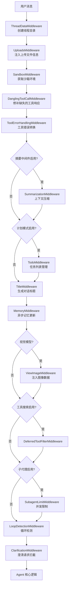

# DeerFlow 中间件架构分析

## 目录
- [中间件责任链模式](#中间件责任链模式)
- [完整中间件链](#完整中间件链)
- [核心中间件详解](#核心中间件详解)
- [状态管理模式](#状态管理模式)
- [权威论文参考](#权威论文参考)

---

## 中间件责任链模式

### 核心概念

中间件责任链（Middleware Chain of Responsibility）是一种将横切关注点（cross-cutting concerns）从核心业务逻辑中分离出来的架构模式。在 DeerFlow 中，中间件以有序链的形式组织，在 Agent 执行的不同生命周期节点（`before_agent`、`before_model`、`after_model`、`after_agent`、`wrap_tool_call`）介入处理。

### 项目中的实现

```python
# backend/packages/harness/deerflow/agents/lead_agent/agent.py:207-259
def _build_middlewares(config: RunnableConfig, model_name: str | None, agent_name: str | None = None):
    """构建中间件链"""
    middlewares = build_lead_runtime_middlewares(lazy_init=True)

    # 按需添加可选中间件
    if summarization_middleware:
        middlewares.append(summarization_middleware)
    if todo_list_middleware:
        middlewares.append(todo_list_middleware)

    # 固定顺序的中间件
    middlewares.append(TitleMiddleware())
    middlewares.append(MemoryMiddleware(agent_name=agent_name))
    # ... 更多中间件

    # ClarificationMiddleware 必须放在最后
    middlewares.append(ClarificationMiddleware())
    return middlewares
```

**代码分析：**
- 严格的顺序控制确保数据依赖正确（如 ThreadDataMiddleware 必须在 SandboxMiddleware 之前）
- 条件加载支持运行时配置（如 plan_mode、subagent_enabled）
- 末尾拦截器模式（ClarificationMiddleware 必须最后）

---

## 完整中间件链

### 执行顺序流程图



### 中间件清单

| 中间件 | 生命周期 | 作用 | 可选 |
|--------|----------|------|------|
| **ThreadDataMiddleware** | `before_agent` | 创建线程隔离的工作目录 | 否 |
| **UploadsMiddleware** | `before_agent` | 注入上传文件信息 | 否 |
| **SandboxMiddleware** | `before_agent` | 获取/释放沙箱环境 | 否 |
| **DanglingToolCallMiddleware** | `before_agent` | 修补缺失的 ToolMessage | 否 |
| **ToolErrorHandlingMiddleware** | `wrap_tool_call` | 工具异常转换为消息 | 否 |
| **SummarizationMiddleware** | `before_model` | 上下文摘要压缩 | 是 |
| **TodoMiddleware** | `before_model` / 工具 | 任务列表管理 | 是 |
| **TitleMiddleware** | `after_agent` | 自动生成对话标题 | 否 |
| **MemoryMiddleware** | `after_agent` | 异步记忆队列 | 否 |
| **ViewImageMiddleware** | `before_model` | 注入 base64 图像 | 是 |
| **DeferredToolFilterMiddleware** | 工具绑定 | 延迟工具过滤 | 是 |
| **SubagentLimitMiddleware** | `after_model` | 子代理并发限制 | 是 |
| **LoopDetectionMiddleware** | `after_model` | 检测重复工具调用 | 否 |
| **ClarificationMiddleware** | `wrap_tool_call` | 拦截澄清请求 | 否 |

---

## 核心中间件详解

### 1. ThreadDataMiddleware - 线程数据隔离

```python
# backend/packages/harness/deerflow/agents/middlewares/thread_data_middleware.py:17-91
class ThreadDataMiddleware(AgentMiddleware[ThreadDataMiddlewareState]):
    """为每个线程执行创建线程数据目录

    创建目录结构:
    - {base_dir}/threads/{thread_id}/user-data/workspace
    - {base_dir}/threads/{thread_id}/user-data/uploads
    - {base_dir}/threads/{thread_id}/user-data/outputs
    """

    state_schema = ThreadDataMiddlewareState

    def __init__(self, base_dir: str | None = None, lazy_init: bool = True):
        super().__init__()
        self._paths = Paths(base_dir) if base_dir else get_paths()
        self._lazy_init = lazy_init  # 懒加载优化
```

**设计亮点：**
- **线程隔离**：每个 thread_id 有独立目录，避免数据污染
- **懒加载模式**：`lazy_init=True` 时只计算路径，不创建目录，优化性能
- **路径抽象**：通过 `Paths` 类统一管理物理路径与虚拟路径映射

### 2. MemoryMiddleware - 异步记忆更新

```python
# backend/packages/harness/deerflow/agents/middlewares/memory_middleware.py:86-149
class MemoryMiddleware(AgentMiddleware[MemoryMiddlewareState]):
    """在 Agent 执行后将对话加入记忆更新队列

    1. 每次 Agent 执行后，将对话加入记忆更新队列
    2. 只包含用户输入和最终助理响应（忽略工具调用）
    3. 队列使用防抖机制批量处理多次更新
    4. 记忆通过 LLM 摘要异步更新
    """

    @override
    def after_agent(self, state: MemoryMiddlewareState, runtime: Runtime) -> dict | None:
        config = get_memory_config()
        if not config.enabled:
            return None

        # 获取 thread_id
        thread_id = runtime.context.get("thread_id")

        # 过滤消息：只保留用户输入和最终 AI 响应
        filtered_messages = _filter_messages_for_memory(messages)

        # 加入队列，防抖异步处理
        queue = get_memory_queue()
        queue.add(thread_id=thread_id, messages=filtered_messages, agent_name=self._agent_name)

        return None
```

**设计亮点：**
- **消息过滤**：通过 `_filter_messages_for_memory()` 剔除工具调用中间步骤
- **防抖队列**：避免频繁触发 LLM 摘要，30 秒（可配置）内的更新合并
- **异步处理**：不阻塞主对话流程，记忆更新在后台完成
- **持久化**：原子文件操作（临时文件 + rename）保证数据一致性

### 3. TodoMiddleware - 上下文丢失检测

```python
# backend/packages/harness/deerflow/agents/middlewares/todo_middleware.py:47-100
class TodoMiddleware(TodoListMiddleware):
    """扩展 TodoListMiddleware，添加 write_todos 上下文丢失检测

    当消息历史被截断时（如 SummarizationMiddleware），原始的 write_todos
    工具调用和 ToolMessage 可能会滚出活动上下文窗口。此中间件检测
    这种情况并注入提醒消息，使模型仍然知道待办事项列表。
    """

    @override
    def before_model(self, state: PlanningState, runtime: Runtime) -> dict[str, Any] | None:
        """当 write_todos 离开上下文窗口时注入待办事项提醒"""
        todos: list[Todo] = state.get("todos") or []
        if not todos:
            return None

        messages = state.get("messages") or []
        if _todos_in_messages(messages):
            # write_todos 仍在上下文中，无需处理
            return None

        if _reminder_in_messages(messages):
            # 已注入提醒，无需重复
            return None

        # 注入提醒作为 HumanMessage
        formatted = _format_todos(todos)
        reminder = HumanMessage(
            name="todo_reminder",
            content=f"<system_reminder>\nYour todo list...\n{formatted}\n</system_reminder>"
        )
        return {"messages": [reminder]}
```

**设计亮点：**
- **上下文感知**：检测 `write_todos` 工具调用是否仍在消息历史中
- **优雅降级**：通过注入系统提醒消息保持任务列表可见性
- **幂等性**：检查是否已注入提醒，避免重复

### 4. LoopDetectionMiddleware - 安全防护

```python
# backend/packages/harness/deerflow/agents/middlewares/loop_detection_middleware.py:76-227
class LoopDetectionMiddleware(AgentMiddleware[AgentState]):
    """检测并打破重复工具调用循环

    检测策略:
      1. 每次模型响应后，哈希工具调用（名称 + 参数）
      2. 在滑动窗口中跟踪最近的哈希值
      3. 如果相同哈希出现 >= warn_threshold 次，注入警告
      4. 如果 >= hard_limit 次，剥离所有 tool_calls 强制结束
    """

    def __init__(
        self,
        warn_threshold: int = 3,    # 3 次相同调用后警告
        hard_limit: int = 5,         # 5 次后强制停止
        window_size: int = 20,       # 跟踪最近 20 次调用
        max_tracked_threads: int = 100,  # LRU 淘汰限制
    ):
        super().__init__()
        self.warn_threshold = warn_threshold
        self.hard_limit = hard_limit
        # ...
        self._history: OrderedDict[str, list[str]] = OrderedDict()  # LRU
        self._warned: dict[str, set[str]] = defaultdict(set)
```

**设计亮点：**
- **有序哈希**：工具调用先按名称和 JSON 序列化排序，确保顺序不影响哈希
- **滑动窗口**：只跟踪最近 N 次调用，避免内存无限增长
- **LRU 淘汰**：线程过多时自动淘汰最少使用的线程跟踪状态
- **两级防护**：警告 → 强制停止，渐进式干预

### 5. ClarificationMiddleware - 控制流拦截

```python
# backend/packages/harness/deerflow/agents/middlewares/clarification_middleware.py:20-173
class ClarificationMiddleware(AgentMiddleware[ClarificationMiddlewareState]):
    """拦截澄清工具调用并中断执行向用户展示问题

    当模型调用 ask_clarification 工具时，此中间件:
    1. 在执行前拦截工具调用
    2. 提取澄清问题和元数据
    3. 格式化用户友好的消息
    4. 返回 Command 中断执行并展示问题
    5. 等待用户响应后继续
    """

    @override
    def wrap_tool_call(
        self,
        request: ToolCallRequest,
        handler: Callable[[ToolCallRequest], ToolMessage | Command],
    ) -> ToolMessage | Command:
        """拦截 ask_clarification 工具调用并中断执行（同步版本）"""
        if request.tool_call.get("name") != "ask_clarification":
            return handler(request)  # 不是澄清调用，正常执行

        return self._handle_clarification(request)

    def _handle_clarification(self, request: ToolCallRequest) -> Command:
        # 格式化澄清消息
        formatted_message = self._format_clarification_message(args)

        # 创建 ToolMessage
        tool_message = ToolMessage(
            content=formatted_message,
            tool_call_id=tool_call_id,
            name="ask_clarification",
        )

        # 返回 Command：添加消息 + 中断到 END
        return Command(
            update={"messages": [tool_message]},
            goto=END,  # 关键：中断执行流
        )
```

**设计亮点：**
- **工具包装**：使用 `wrap_tool_call` 生命周期在工具执行前拦截
- **控制流命令**：通过 `Command(goto=END)` 优雅中断图执行
- **用户体验**：格式化带图标的消息（❓🤔🔀⚠️💡）

---

## 状态管理模式

### ThreadState 设计

```python
# backend/packages/harness/deerflow/agents/thread_state.py:48-56
class ThreadState(AgentState):
    sandbox: NotRequired[SandboxState | None]
    thread_data: NotRequired[ThreadDataState | None]
    title: NotRequired[str | None]
    artifacts: Annotated[list[str], merge_artifacts]  # 自定义 reducer
    todos: NotRequired[list | None]
    uploaded_files: NotRequired[list[dict] | None]
    viewed_images: Annotated[dict[str, ViewedImageData], merge_viewed_images]
```

**自定义 Reducer 模式：**

```python
# backend/packages/harness/deerflow/agents/thread_state.py:21-45
def merge_artifacts(existing: list[str] | None, new: list[str] | None) -> list[str]:
    """合并并去重 artifacts 列表"""
    if existing is None:
        return new or []
    if new is None:
        return existing
    # 使用 dict.fromkeys 去重同时保留顺序
    return list(dict.fromkeys(existing + new))

def merge_viewed_images(existing: dict[str, ViewedImageData] | None,
                         new: dict[str, ViewedImageData] | None) -> dict[str, ViewedImageData]:
    """合并图像字典，特殊情况：空字典 {} 表示清除"""
    if existing is None:
        return new or {}
    if new is None:
        return existing
    # 特殊情况：空字典表示清除所有已查看图像
    if len(new) == 0:
        return {}
    # 合并字典，新值覆盖旧值
    return {**existing, **new}
```

**设计亮点：**
- **声明式合并**：通过 `Annotated` 类型注解指定 reducer 函数
- **语义化清除**：`merge_viewed_images` 中空字典 `{}` 表示清除操作
- **有序去重**：`merge_artifacts` 使用 `dict.fromkeys` 保留插入顺序

---

## 权威论文

| 论文 | 机构 | 核心贡献 | 链接 |
|------|------|---------|------|
| **ReAct: Synergizing Reasoning and Acting in Language Models** | Google Research | 推理与行动协同的范式，工具调用的理论基础 | [arXiv:2210.03629](https://arxiv.org/abs/2210.03629) |
| **LangChain: Building Applications with LLMs through Composability** | LangChain | 可组合性设计哲学，中间件链的思想来源 | [LangChain Blog](https://blog.langchain.com/) |
| **Reflexion: Language Agents with Verbal Reinforcement Learning** | Northeastern University | 自我反思和循环检测机制 | [arXiv:2303.11366](https://arxiv.org/abs/2303.11366) |
| **Memory-Augmented Large Language Models** | Meta AI | 长期记忆注入和检索增强生成 | [arXiv:2304.03847](https://arxiv.org/abs/2304.03847) |
| **Chain of Responsibility Pattern** | GoF (Gang of Four) | 经典设计模式：责任链 | [Design Patterns](https://en.wikipedia.org/wiki/Chain-of-responsibility_pattern) |

---

## 总结

DeerFlow 中间件架构体现了以下核心设计原则：

1. **关注点分离**：每个中间件只负责一个功能
2. **有序依赖**：严格的执行顺序保证数据正确性
3. **条件加载**：运行时配置决定中间件是否启用
4. **生命周期钩子**：`before_agent`、`before_model`、`after_model`、`after_agent`、`wrap_tool_call` 五个介入点
5. **状态管理**：自定义 Reducer 处理状态合并逻辑
6. **安全防护**：循环检测、错误处理等 P0 级安全机制
