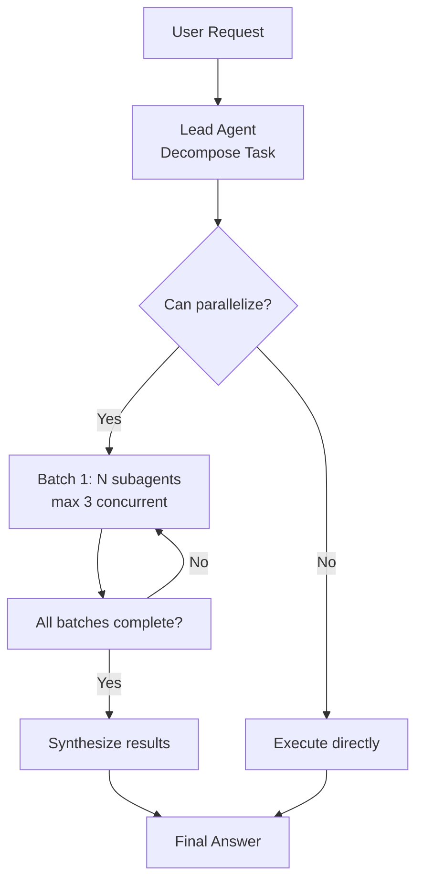

# 多代理并行编排方法论

> 基于 DeerFlow Lead Agent 实现的总结

## 概述

**多代理并行编排**（Multi-Agent Parallel Orchestration）是一种架构模式：

一个**主代理**（Lead Agent）作为协调者，将复杂任务**分解**为多个独立子任务，启动多个**子代理**（Subagent）**并行执行**，最后**汇总**所有结果给出最终答案。



## 权威理论基础

| 机构 | 论文/报告 | 核心贡献 | 链接 |
|------|----------|---------|------|
| OpenAI (2021) | **WebGPT** | 开创了子代理分解模式，主代理协调多个浏览子代理 | [openai.com](https://openai.com/research/webgpt) |
| OpenAI (2023) | **GPT-4 Technical Report** | 验证了LLM作为任务分解器和协调者的能力 | [arxiv.org](https://arxiv.org/abs/2303.08774) |
| Anthropic (2022) | **Constitutional AI** | 确立了主代理-子代理责任分离架构 | [arxiv.org](https://arxiv.org/abs/2212.08073) |
| Microsoft (2023) | **AutoGen** | 系统化多代理协作框架 | [arxiv.org](https://arxiv.org/abs/2308.08155) |
| LangChain (2024) | **LangGraph** | 有状态循环执行图，原生支持多代理并行 | [langchain.com](https://blog.langchain.com/langgraph/) |

## 核心设计原则

### 1. 分而治之 (Divide & Conquer)

> **复杂问题 → 分解为独立子问题 → 并行解决 → 汇总**

- 80% 以上的复杂任务可以分解为 2+ 个可并行的子任务
- 总执行时间从 `O(N)` 降到 `O(1)`（N个子任务并行）

### 2. 硬并发限制

> **严格限制每一轮的并发子代理数量**，防止上下文爆炸。

DeerFlow 默认限制：**max 3 个 `task` 调用/每轮响应**。如果有更多子任务，**分批顺序执行**。

```python
# 来自 prompt.py
**⛔ HARD CONCURRENCY LIMIT: MAXIMUM {n} `task` CALLS PER RESPONSE. THIS IS NOT OPTIONAL.**
- Each response, you may include **at most {n}** `task` tool calls. Any excess calls are **silently discarded** by the system — you will lose that work.
```

**为什么是硬限制？**
- 每一个子代理调用都会向上下文添加结果
- 没有限制会迅速导致上下文溢出（Anthropic 上下文预算理论）
- 分批执行能保持稳定的上下文尺寸

### 3. 中间件责任链

**横切关注点**（Cross-Cutting Concerns）被分解为多个独立中间件，按固定顺序执行。

#### 中间件执行顺序 (DeerFlow 实现)

```python
# 来自 agent.py 注释，行 199-208
# ThreadDataMiddleware must be before SandboxMiddleware to ensure thread_id is available
# UploadsMiddleware should be after ThreadDataMiddleware to access thread_id
# DanglingToolCallMiddleware patches missing ToolMessages before model sees the history
# SummarizationMiddleware should be early to reduce context before other processing
# TodoListMiddleware should be before ClarificationMiddleware to allow todo management
# TitleMiddleware generates title after first exchange
# MemoryMiddleware queues conversation for memory update (after TitleMiddleware)
# ViewImageMiddleware should be before ClarificationMiddleware to inject image details before LLM
# ClarificationMiddleware should be last to intercept clarification requests after model calls
```

顺序不能乱！每一步依赖前一步的结果。

#### DeerFlow 11 个中间件的作用

| 顺序 | 中间件 | 职责 |
|------|--------|------|
| 1 | **ThreadDataMiddleware** | 为对话创建独立线程目录结构 |
| 2 | **UploadsMiddleware** | 跟踪用户上传的文件注入上下文 |
| 3 | **SandboxMiddleware** | 获取沙箱执行环境 |
| 4 | **DanglingToolCallMiddleware** | 修复中断导致的不完整工具调用 |
| 5 | **SummarizationMiddleware** | 对话过长时自动摘要旧内容节省上下文 |
| 6 | **TodoListMiddleware** | 计划模式下启用待办事项跟踪 |
| 7 | **TitleMiddleware** | 自动生成对话标题 |
| 8 | **MemoryMiddleware** | 排队对话供后台提取长期记忆 |
| 9 | **ViewImageMiddleware** | 如果模型支持视觉，处理图片输入 |
| 10 | **SubagentLimitMiddleware** | 强制执行最大并发限制 |
| 11 | **ClarificationMiddleware** | 需要澄清时立即中断执行（必须最后） |

**核心代码摘录 - `_build_middlewares` 函数：**

```python
# agent.py:208-252
def _build_middlewares(config: RunnableConfig, model_name: str | None, agent_name: str | None = None):
    """Build middleware chain based on runtime configuration."""
    middlewares = [ThreadDataMiddleware(), UploadsMiddleware(), SandboxMiddleware(), DanglingToolCallMiddleware()]

    # Add summarization middleware if enabled
    summarization_middleware = _create_summarization_middleware()
    if summarization_middleware is not None:
        middlewares.append(summarization_middleware)

    # Add TodoList middleware if plan mode is enabled
    is_plan_mode = config.get("configurable", {}).get("is_plan_mode", False)
    todo_list_middleware = _create_todo_list_middleware(is_plan_mode)
    if todo_list_middleware is not None:
        middlewares.append(todo_list_middleware)

    # Add TitleMiddleware
    middlewares.append(TitleMiddleware())

    # Add MemoryMiddleware (after TitleMiddleware)
    middlewares.append(MemoryMiddleware(agent_name=agent_name))

    # Add ViewImageMiddleware only if the current model supports vision.
    app_config = get_app_config()
    model_config = app_config.get_model_config(model_name) if model_name else None
    if model_config is not None and model_config.supports_vision:
        middlewares.append(ViewImageMiddleware())

    # Add SubagentLimitMiddleware to truncate excess parallel task calls
    subagent_enabled = config.get("configurable", {}).get("subagent_enabled", False)
    if subagent_enabled:
        max_concurrent_subagents = config.get("configurable", {}).get("max_concurrent_subagents", 3)
        middlewares.append(SubagentLimitMiddleware(max_concurrent=max_concurrent_subagents))

    # ClarificationMiddleware should always be last
    middlewares.append(ClarificationMiddleware())
    return middlewares
```

**分析：**
- **条件化添加**：根据配置动态启用/禁用功能（如摘要、Todo、视觉）
- **开放扩展**：新的横切关注点可以插入到合适的位置，不影响其他代码
- **单一责任**：每个中间件只做一件事

### 4. 动态配置与模型选择

运行时通过 `RunnableConfig` 接收参数，支持灵活调整行为：

```python
# agent.py:255-332
def make_lead_agent(config: RunnableConfig):
    cfg = config.get("configurable", {})

    thinking_enabled = cfg.get("thinking_enabled", True)
    reasoning_effort = cfg.get("reasoning_effort", None)
    requested_model_name: str | None = cfg.get("model_name") or cfg.get("model")
    is_plan_mode = cfg.get("is_plan_mode", False)
    subagent_enabled = cfg.get("subagent_enabled", False)
    max_concurrent_subagents = cfg.get("max_concurrent_subagents", 3)
    is_bootstrap = cfg.get("is_bootstrap", False)
    agent_name = cfg.get("agent_name")
```

**关键配置参数：**

| 参数 | 作用 |
|------|------|
| `thinking_enabled` | 启用 Claude 3.7+ 扩展思考 |
| `model_name` | 选择使用哪个 LLM 模型 |
| `is_plan_mode` | 启用 TodoList 中间件做任务跟踪 |
| `subagent_enabled` | 是否启用子代理功能 |
| `max_concurrent_subagents` | 最大并发数（默认 3）|

**模型解析代码：**

```python
# agent.py:27-40
def _resolve_model_name(requested_model_name: str | None = None) -> str:
    """Resolve a runtime model name safely, falling back to default if invalid."""
    app_config = get_app_config()
    default_model_name = app_config.models[0].name if app_config.models else None
    if default_model_name is None:
        raise ValueError("No chat models are configured. Please configure at least one model in config.yaml.")

    if requested_model_name and app_config.get_model_config(requested_model_name):
        return requested_model_name

    if requested_model_name and requested_model_name != default_model_name:
        logger.warning(f"Model '{requested_model_name}' not found in config; fallback to default model '{default_model_name}'.")
    return default_model_name
```

**设计亮点：**
- 优雅降级：请求的模型不存在时回退到默认模型，不崩溃
- 日志警告：让用户知道发生了回退，便于调试

### 5. 上下文摘要应对溢出

当对话变长接近上下文限制时，自动对较早的对话进行摘要，释放上下文空间：

```python
# agent.py:42-81
def _create_summarization_middleware() -> SummarizationMiddleware | None:
    """Create and configure the summarization middleware from config."""
    config = get_summarization_config()

    if not config.enabled:
        return None

    # Prepare trigger parameter
    trigger = None
    if config.trigger is not None:
        if isinstance(config.trigger, list):
            trigger = [t.to_tuple() for t in config.trigger]
        else:
            trigger = config.trigger.to_tuple()

    # Prepare keep parameter
    keep = config.keep.to_tuple()

    # Prepare model parameter
    if config.model_name:
        model = config.model_name
    else:
        # Use a lightweight model for summarization to save costs
        # Falls back to default model if not explicitly specified
        model = create_chat_model(thinking_enabled=False)

    # ... prepare kwargs
    return SummarizationMiddleware(**kwargs)
```

**符合 Anthropic 上下文管理原则：**
- 使用轻量级模型做摘要节省成本
- 保持最新的 N 个消息不摘要，最新信息更重要
- 可配置触发条件（token 数量 / 消息数量 / 占比）

## 子代理系统提示工程

DeerFlow 在系统提示中**精确规范**了主代理的行为。这是提示工程的关键。

### 何时使用子代理

```markdown
# 来自 prompt.py:68-79
✅ **USE Parallel Subagents (max {n} per turn) when:**
- **Complex research questions**: Requires multiple information sources or perspectives
- **Multi-aspect analysis**: Task has several independent dimensions to explore
- **Large codebases**: Need to analyze different parts simultaneously
- **Comprehensive investigations**: Questions requiring thorough coverage from multiple angles

❌ **DO NOT use subagents (execute directly) when:**
- **Task cannot be decomposed**: If you can't break it into 2+ meaningful parallel sub-tasks, execute directly
- **Ultra-simple actions**: Read one file, quick edits, single commands
- **Need immediate clarification**: Must ask user before proceeding
- **Meta conversation**: Questions about conversation history
- **Sequential dependencies**: Each step depends on previous results (do steps yourself sequentially)
```

### 工作流强制规范

```markdown
# 来自 prompt.py:81-89
**CRITICAL WORKFLOW** (STRICTLY follow this before EVERY action):
1. **COUNT**: In your thinking, list all sub-tasks and count them explicitly: "I have N sub-tasks"
2. **PLAN BATCHES**: If N > {n}, explicitly plan which sub-tasks go in which batch:
   - "Batch 1 (this turn): first {n} sub-tasks"
   - "Batch 2 (next turn): next batch of sub-tasks"
3. **EXECUTE**: Launch ONLY the current batch (max {n} `task` calls). Do NOT launch sub-tasks from future batches.
4. **REPEAT**: After results return, launch the next batch. Continue until all batches complete.
5. **SYNTHESIZE**: After ALL batches are done, synthesize all results.
6. **Cannot decompose** → Execute directly using available tools (bash, read_file, web_search, etc.)
```

**为什么如此严格？**
- LLM 容易忘记限制，一次性启动太多子代理
- 超过限制的调用会被静默丢弃，导致工作丢失
- 提示中反复强调，减少违规概率

### 使用示例（提示中包含）

**单批次示例**（≤ 3 个子任务）：

```python
# User asks: "Why is Tencent's stock price declining?"
# Thinking: 3 sub-tasks → fits in 1 batch

# Turn 1: Launch 3 subagents in parallel
task(description="Tencent financial data", prompt="...", subagent_type="general-purpose")
task(description="Tencent news & regulation", prompt="...", subagent_type="general-purpose")
task(description="Industry & market trends", prompt="...", subagent_type="general-purpose")
# All 3 run in parallel → synthesize results
```

**多批次示例**（> 3 个子任务）：

```python
# User asks: "Compare 5 cloud providers"
# Thinking: 5 sub-tasks → need multiple batches (max 3 per batch)

# Turn 1: Launch first batch of 3
task(description="AWS analysis", prompt="...", subagent_type="general-purpose")
task(description="Azure analysis", prompt="...", subagent_type="general-purpose")
task(description="GCP analysis", prompt="...", subagent_type="general-purpose")

# Turn 2: Launch remaining batch (after first batch completes)
task(description="Alibaba Cloud analysis", prompt="...", subagent_type="general-purpose")
task(description="Oracle Cloud analysis", prompt="...", subagent_type="general-purpose")

# Turn 3: Synthesize ALL results from both batches
```

## 系统提示模板结构

DeerFlow 的系统提示采用**模块化构建**，根据运行时条件注入不同部分：

```python
# 来自 prompt.py:369-409
def apply_prompt_template(subagent_enabled: bool = False, max_concurrent_subagents: int = 3, *, agent_name: str | None = None, available_skills: set[str] | None = None) -> str:
    # Get memory context
    memory_context = _get_memory_context(agent_name)

    # Include subagent section only if enabled (from runtime parameter)
    n = max_concurrent_subagents
    subagent_section = _build_subagent_section(n) if subagent_enabled else ""

    # Add subagent reminder to critical_reminders if enabled
    subagent_reminder = (...) if subagent_enabled else ""

    # Add subagent thinking guidance if enabled
    subagent_thinking = (...) if subagent_enabled else ""

    # Get skills section
    skills_section = get_skills_prompt_section(available_skills)

    # Format the prompt with dynamic skills and memory
    prompt = SYSTEM_PROMPT_TEMPLATE.format(
        agent_name=agent_name or "DeerFlow 2.0",
        soul=get_agent_soul(agent_name),
        skills_section=skills_section,
        memory_context=memory_context,
        subagent_section=subagent_section,
        subagent_reminder=subagent_reminder,
        subagent_thinking=subagent_thinking,
    )

    return prompt + f"\n<current_date>{datetime.now().strftime('%Y-%m-%d, %A')}</current_date>"
```

**模板结构：**

```
<role>
You are {agent_name}, an open-source super agent.
</role>

{soul}                 # 代理个性（SOUL.md）
{memory_context}       # 长期记忆注入

<thinking_style>
- Think concisely and strategically before action
- Break down the task: what's clear? what's ambiguous? what's missing?
- PRIORITY: If unclear → ask clarification FIRST
</thinking_style>

<clarification_system>  # 必须澄清的场景规范
WORKFLOW PRIORITY: CLARIFY → PLAN → ACT
...
</clarification_system>

{skills_section}        # 可用技能列表
{subagent_section}      # 子代理规范（仅当启用）

<working_directory>     # 文件路径约定
...
</working_directory>

<response_style>
...
</response_style>

<critical_reminders>
...
</critical_reminders>

<current_date>...</current_date>
```

**设计要点：**
- **按需注入**：子agent禁用时不占上下文空间
- **长期记忆集成**：`_get_memory_context()` 从持久化存储提取用户相关事实注入
- **技能动态加载**：只注入启用的技能，减少噪音

## 澄清优先原则

DeerFlow 强制要求**澄清总是在行动之前**：

```markdown
# 来自 prompt.py:217-234
**MANDATORY Clarification Scenarios - You MUST call ask_clarification BEFORE starting work when:**

1. **Missing Information** (`missing_info`): Required details not provided
   - Example: User says "create a web scraper" but doesn't specify the target website
   - **REQUIRED ACTION**: Call ask_clarification to get the missing information

2. **Ambiguous Requirements** (`ambiguous_requirement`): Multiple valid interpretations exist
   - Example: "Optimize the code" could mean performance, readability, or memory usage
   - **REQUIRED ACTION**: Call ask_clarification to clarify the exact requirement

3. **Approach Choices** (`approach_choice`): Several valid approaches exist
   - Example: "Add authentication" could use JWT, OAuth, session-based, or API keys
   - **REQUIRED ACTION**: Call ask_clarification to let user choose the approach

4. **Risky Operations** (`risk_confirmation`): Destructive actions need confirmation
   - Example: Deleting files, modifying production configs, database operations
   - **REQUIRED ACTION**: Call ask_clarification to get explicit confirmation

**STRICT ENFORCEMENT:**
- ❌ DO NOT start working and then ask for clarification mid-execution - clarify FIRST
- ❌ DO NOT skip clarification for "efficiency" - accuracy matters more than speed
- ❌ DO NOT make assumptions when information is missing - ALWAYS ask
- ✅ Analyze the request in thinking → Identify unclear aspects → Ask BEFORE any action
```

**技术实现：** `ClarificationMiddleware` 拦截 `ask_clarification` 调用，通过 `Command(goto=END)` 立即中断执行，等待用户回复。

**为什么放在最后？** 这样它能在所有其他中间件之后拦截，确保任何前面添加的上下文都已处理完毕。

## 记忆系统集成

主代理通过 `MemoryMiddleware` 支持**长期用户记忆**：

```python
# agent.py:235 中间件顺序
middlewares.append(MemoryMiddleware(agent_name=agent_name))
```

工作流程：
1. `MemoryMiddleware` 在每次交互后过滤出用户输入和最终AI响应
2. 加入后台更新队列（去重防抖，默认 30 秒）
3. 后台线程调用 LLM 提取事实和上下文更新
4. 原子写入持久化存储 (`memory.json`)
5. 下一次交互时，`_get_memory_context()` 提取相关事实注入系统提示

**符合人类学研究：** 随着时间推移，AI 逐渐了解用户偏好、背景、目标，提供更个性化的回答。

## 最佳实践总结

### 对于实现者

1. **强制并发限制**：永远不要让LLM一次性启动无限制数量的子代理
2. **固定中间件顺序**：仔细思考依赖关系，注释说明为什么这个顺序
3. **分批执行**：超过并发限制的任务必须拆分多轮执行
4. **上下文预算**：使用摘要保持上下文在限制以内
5. **澄清优先**：在任何行动之前先解决歧义
6. **动态注入**：只注入当前需要的提示片段，节省上下文

### 对于使用者

1. **分解大问题**：遇到复杂问题，允许主代理分解给多个子代理并行工作
2. **相信批量处理**：超过 3 个子任务分批执行是正常的，耐心等待
3. **澄清不偷懒**：主代理问你澄清的时候，给出明确回答能避免走错方向
4. **利用长期记忆**：你的偏好和背景信息会被记住，后续对话更个性化

## 参考文献

1. Achiam, J., et al. (2023). **GPT-4 Technical Report**. OpenAI.
   https://arxiv.org/abs/2303.08774

2. Nakano, R., et al. (2021). **WebGPT: Browser-assisted question-answering with human feedback**. OpenAI.
   https://openai.com/research/webgpt

3. Bai, Y., et al. (2022). **Constitutional AI: Harmlessness from AI Feedback**. Anthropic.
   https://arxiv.org/abs/2212.08073

4. Wu, Q., et al. (2023). **AutoGen: Enabling Next-Gen LLM Applications via Multi-Agent Collaboration**. Microsoft Research.
   https://arxiv.org/abs/2308.08155

5. Chase, H. (2022). **LangChain: Building Applications with LLMs through Composability**. LangChain AI.
   https://blog.langchain.com/langchain/

6. Jacob, A., et al. (2024). **LangGraph: Cyclic Computation Graphs for Stateful Multi-Agent Applications**. LangChain AI.
   https://blog.langchain.com/langgraph/

7. OpenAI (2022). **Planning with Large Language Models for Code Generation**. OpenAI.
   https://arxiv.org/abs/2206.07031

8. Eloundou, T., et al. (2023). **GPTs are GPTs: An Early Look at the Labor Market Impact Potential of Large Language Models**. OpenAI.
   https://arxiv.org/abs/2303.10130
