# 第1课：Agent 概论与 ReAct 范式

## 1.1 什么是 AI Agent？

### 从 LLM 到自主 Agent 的进化

大型语言模型（LLM）展现了惊人的语言理解和生成能力，但它们本质上是"无状态"的预测模型。AI Agent 通过赋予 LLM 记忆、工具使用和自主决策能力，使其能够完成复杂的长期任务。

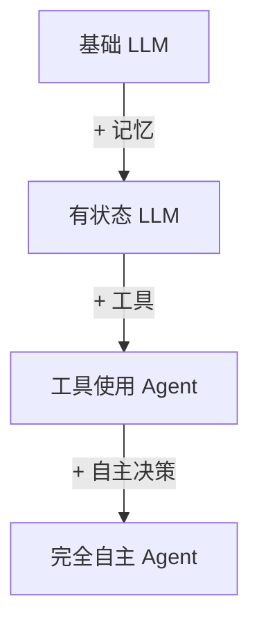

### Agent 的核心组成部分

一个完整的 AI Agent 通常包含以下模块：

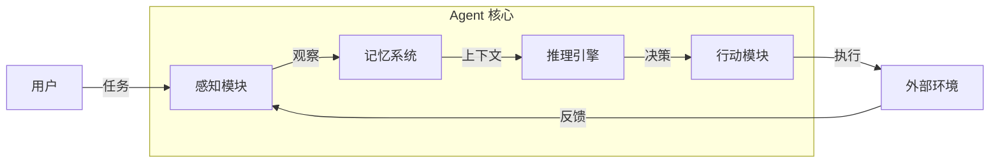

**关键组件说明：**
- **感知模块**：接收用户输入和环境反馈
- **记忆系统**：存储历史交互、知识和经验
- **推理引擎**：做出决策和规划
- **行动模块**：执行具体操作（工具调用、回复等）

---

## 1.2 ReAct 范式详解

### 论文背景

**ReAct: Synergizing Reasoning and Acting in Language Models**
Yao et al., 2022 | [arXiv:2210.03629](https://arxiv.org/abs/2210.03629)

ReAct 的核心思想是将**推理（Reasoning）**和**行动（Acting）**交织在一起，让模型在执行任务时既能思考又能行动。

### ReAct 循环架构

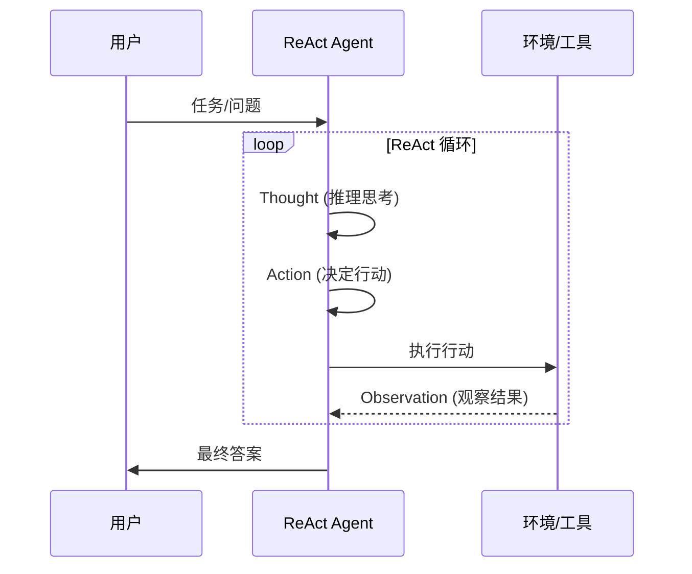

### Thought → Action → Observation 循环

让我们用一个具体例子来说明这个循环：

**问题：** "巴黎和柏林哪个城市人口更多？"

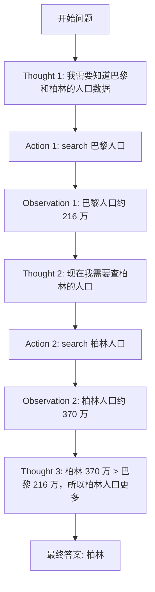

### ReAct Prompt 模板

```
Question: [用户问题]

Thought 1: [推理步骤 1]
Action 1: [行动 1: 工具名称(参数)]
Observation 1: [工具返回结果]

Thought 2: [推理步骤 2]
Action 2: [行动 2]
Observation 2: [结果 2]

...

Thought N: 我现在知道最终答案了
Answer: [最终答案]
```

### 与标准 Prompting 的对比

| 特性 | 标准 Prompting | Chain-of-Thought | ReAct |
|------|---------------|------------------|-------|
| 推理过程 | 隐式 | 显式思维链 | 显式思维 + 行动 |
| 外部信息 | ❌ 无 | ❌ 无 | ✅ 工具获取 |
| 可解释性 | 低 | 中 | 高 |
| 错误修正 | ❌ 无 | ❌ 无 | ✅ 通过观察修正 |
| 适用任务 | 简单问答 | 复杂推理 | 需要交互的任务 |

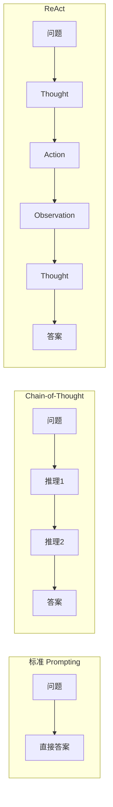

---

## 1.3 OpenAI Assistants API 设计思想

### Assistants API 概述

OpenAI 的 Assistants API 是 ReAct 范式的工业级实现，它提供了：

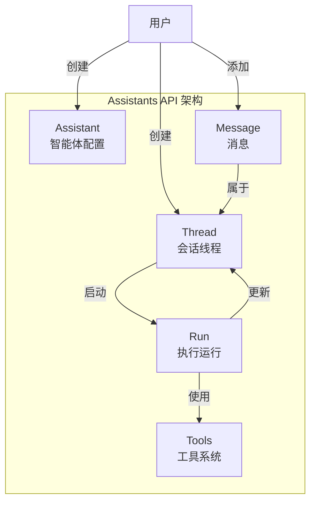

### 核心概念

**1. Assistant（智能体）**
- 系统提示词（System Prompt）
- 使用的模型
- 启用的工具列表
- 上传的文件

**2. Thread（线程）**
- 保存对话历史
- 自动管理上下文窗口
- 跨会话持久化

**3. Run（运行）**
- 触发 Assistant 处理 Thread
- 自动执行 ReAct 循环
- 支持流式和异步模式

### 执行流程

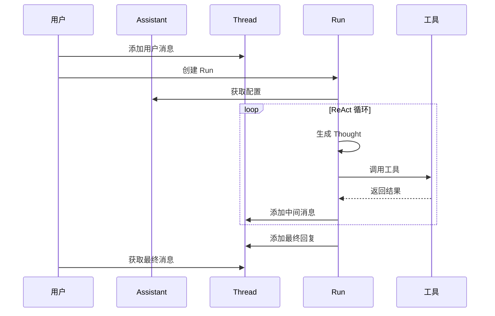

---

## 1.4 ReAct 范式的优势

### 1. 可解释性

完整的推理轨迹让我们能够理解 Agent 的决策过程：

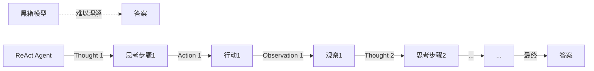

### 2. 错误恢复

当出现错误时，可以通过观察结果进行修正：

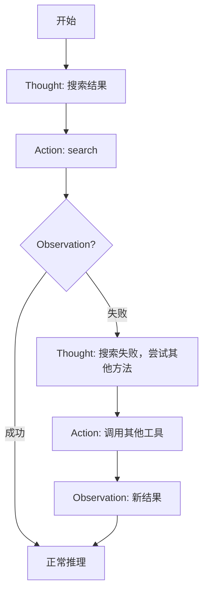

### 3. 知识时效性

通过工具调用获取最新信息：

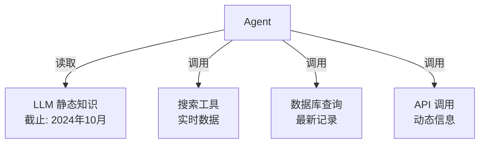

---

## 1.5 实战：简单 ReAct Agent 实现

### 伪代码示例

```python
def react_agent(question, max_steps=10):
    """
    简单的 ReAct Agent 实现
    """
    # 初始化历史
    history = []
    step = 0

    while step < max_steps:
        step += 1

        # 1. 生成 Thought 和 Action
        thought, action = generate_thought_action(
            question,
            history
        )

        print(f"Thought {step}: {thought}")
        print(f"Action {step}: {action}")

        # 2. 检查是否结束
        if action["type"] == "finish":
            return action["answer"]

        # 3. 执行 Action 获取 Observation
        observation = execute_action(action)
        print(f"Observation {step}: {observation}")

        # 4. 记录到历史
        history.append({
            "thought": thought,
            "action": action,
            "observation": observation
        })

    return "达到最大步数限制"
```

### DeerFlow 中的 ReAct 实现

DeerFlow 采用了改进的 ReAct 范式，结合了 LangGraph 的状态管理：

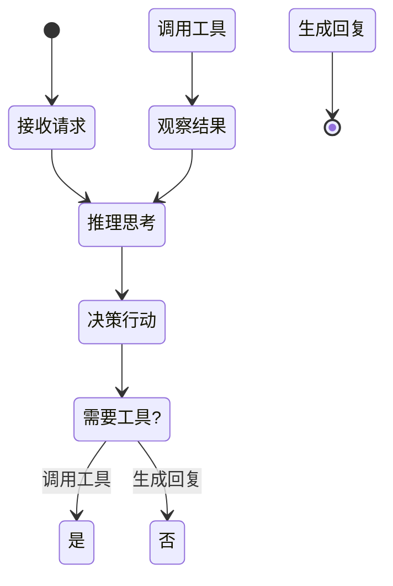

---

## 1.6 DeerFlow 项目代码导读

### 整体架构概览

DeerFlow 是一个基于 LangGraph 的 AI 超级 Agent 系统，其核心架构体现了 ReAct 范式的工业级实现。

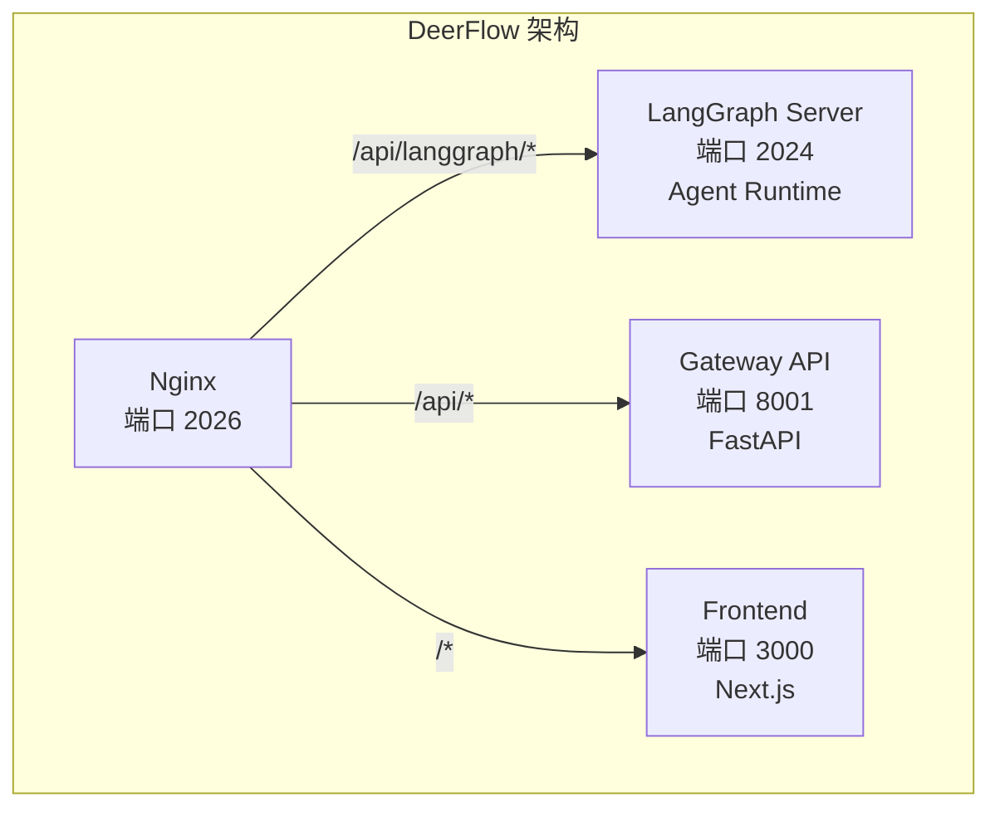

### Lead Agent 核心实现

**入口文件**: `backend/src/agents/lead_agent/agent.py`

```python
def make_lead_agent(config: RunnableConfig):
    """
    DeerFlow 的主 Agent 工厂函数，注册在 langgraph.json 中
    结合了动态模型选择、中间件链、工具系统和子 Agent 委托
    """
    # 1. 动态模型选择 (支持 thinking 和 vision)
    model = create_chat_model(
        model_name=config.get("model_name"),
        thinking_enabled=config.get("thinking_enabled")
    )

    # 2. 加载可用工具 (沙箱 + 内置 + MCP + 社区 + 子 Agent)
    tools = get_available_tools(...)

    # 3. 应用系统提示模板 (技能注入 + 记忆上下文)
    prompt = apply_prompt_template(...)

    # 4. 构建中间件链 (11个中间件按顺序执行)
    agent = build_middleware_chain(agent, middlewares)

    return agent
```

### 中间件链：ReAct 循环的增强

DeerFlow 通过 11 个中间件严格按顺序执行，实现了 ReAct 范式的企业级增强：

| 顺序 | 中间件 | 作用 | 对应 ReAct 环节 |
|------|--------|------|----------------|
| 1 | ThreadDataMiddleware | 创建线程隔离目录 | 环境初始化 |
| 2 | UploadsMiddleware | 注入上传文件 | 感知 |
| 3 | SandboxMiddleware | 获取沙箱环境 | 环境准备 |
| 4 | DanglingToolCallMiddleware | 处理悬空工具调用 | 错误恢复 |
| 5 | SummarizationMiddleware | 上下文压缩 | 记忆管理 |
| 6 | TodoListMiddleware | 任务追踪 (计划模式) | 规划 |
| 7 | TitleMiddleware | 自动生成标题 | 元数据 |
| 8 | MemoryMiddleware | 记忆提取队列 | 记忆 |
| 9 | ViewImageMiddleware | 注入图像数据 | 感知 (视觉) |
| 10 | SubagentLimitMiddleware | 限制并发子 Agent | 行动控制 |
| 11 | ClarificationMiddleware | 拦截澄清请求 | 交互 |

### ThreadState：ReAct 的状态管理

**文件**: `backend/src/agents/thread_state.py`

```python
class ThreadState(AgentState):
    """
    扩展 LangGraph 的 AgentState，实现 ReAct 循环的状态持久化
    """
    # 核心 ReAct 状态
    messages: list[BaseMessage]  # Thought/Action/Observation 历史

    # DeerFlow 扩展
    sandbox: dict              # 沙箱环境信息
    thread_data: dict          # {workspace, uploads, outputs} 路径
    artifacts: list[str]       # 生成的文件路径 (合并去重)
    title: str | None          # 自动生成的对话标题
    todos: list[dict]          # 任务追踪 (计划模式)
    viewed_images: dict        # 视觉模型图像数据
```

### 配置与启动

**LangGraph 配置**: `backend/langgraph.json`

```json
{
  "agent": {
    "type": "agent",
    "path": "src.agents:make_lead_agent"
  }
}
```

**启动命令**:
```bash
# 完整应用 (项目根目录)
make dev  # 启动 LangGraph + Gateway + Frontend + Nginx

# 仅后端 (backend 目录)
make dev      # LangGraph Server (端口 2024)
make gateway  # Gateway API (端口 8001)
```

### 关键代码文件索引

| 模块 | 文件路径 | 说明 |
|------|----------|------|
| **Agent 工厂** | `src/agents/lead_agent/agent.py` | `make_lead_agent()` 入口 |
| **状态定义** | `src/agents/thread_state.py` | ThreadState 类 |
| **中间件** | `src/agents/middlewares/` | 11 个中间件实现 |
| **工具系统** | `src/tools/__init__.py` | `get_available_tools()` |
| **模型工厂** | `src/models/factory.py` | `create_chat_model()` |
| **LangGraph 配置** | `langgraph.json` | 服务注册 |

---

## 1.7 小结

**本节课要点：**

1. ✅ AI Agent 是赋予 LLM 记忆、工具和自主决策能力的系统
2. ✅ ReAct 范式通过 Thought → Action → Observation 循环实现推理与行动的协同
3. ✅ OpenAI Assistants API 是 ReAct 范式的工业级实现
4. ✅ ReAct 提供了更好的可解释性、错误恢复能力和知识时效性

**下节课预告：**
我们将深入探讨推理增强策略，包括 Chain-of-Thought、Tree of Thoughts 和 Self-Refine。

---

## 参考资料

- [ReAct: Synergizing Reasoning and Acting in Language Models](https://arxiv.org/abs/2210.03629)
- [OpenAI Assistants API Documentation](https://platform.openai.com/docs/assistants/overview)
- [LangGraph: Building Agentic Workflows](https://blog.langchain.dev/langgraph/)
