# 第2课：推理增强策略

## 2.1 思维链 (Chain-of-Thought, CoT)

### 论文背景

**Chain-of-Thought Prompting Elicits Reasoning in Large Language Models**
Wei et al., 2022 | NeurIPS 2022

思维链的核心发现是：通过让模型展示其推理过程，可以显著提升复杂推理任务的性能。

### 标准 Prompting vs CoT Prompting

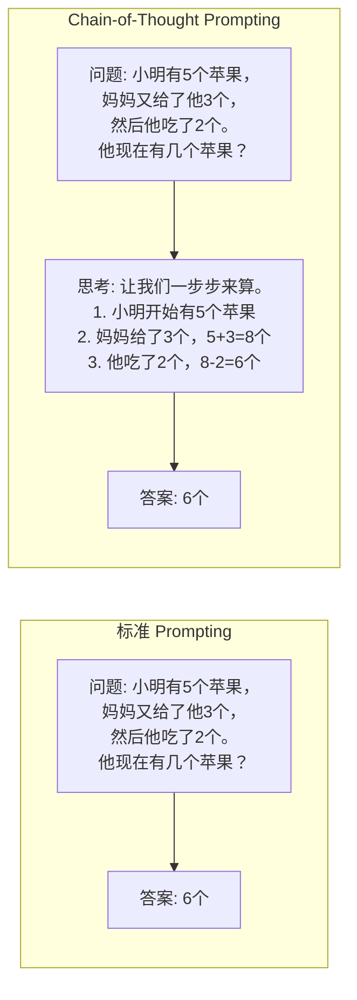

### CoT 工作原理

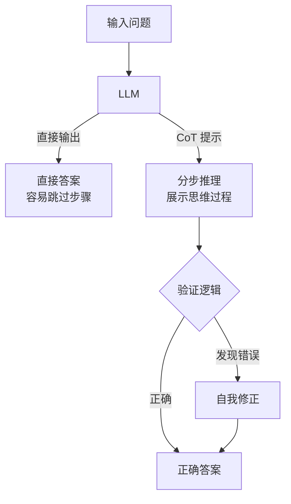

### Few-Shot CoT 示例

```python
# Few-Shot CoT 提示模板
cot_prompt = """
问题: 停车场有3辆车，又来了2辆车，现在有几辆车？
思考: 开始有3辆车，又来了2辆，3+2=5。
答案: 5

问题: 小明有10颗糖，给了小红3颗，又给了小华4颗，还剩几颗？
思考: 开始有10颗，给小红3颗后剩10-3=7颗，再给小华4颗后剩7-4=3颗。
答案: 3

问题: [你的问题]
思考:
"""
```

### 何时使用 CoT

| 任务类型 | CoT 效果 | 原因 |
|---------|---------|------|
| 算术推理 | ⭐⭐⭐⭐⭐ | 需要分步计算 |
| 逻辑推理 | ⭐⭐⭐⭐⭐ | 需要链式推导 |
| 常识问答 | ⭐⭐⭐ | 有时需要推理 |
| 简单问答 | ⭐ | 反而增加复杂度 |
| 代码生成 | ⭐⭐⭐⭐ | 需要逐步构建逻辑 |

---

## 2.2 思维树 (Tree of Thoughts, ToT)

### 论文背景

**Tree of Thoughts: Deliberate Problem Solving with Large Language Models**
Yao et al., 2023 | [arXiv:2305.10601](https://arxiv.org/abs/2305.10601)

思维树将推理过程建模为树状搜索，允许探索多个推理路径并进行回溯。

### ToT 架构概览

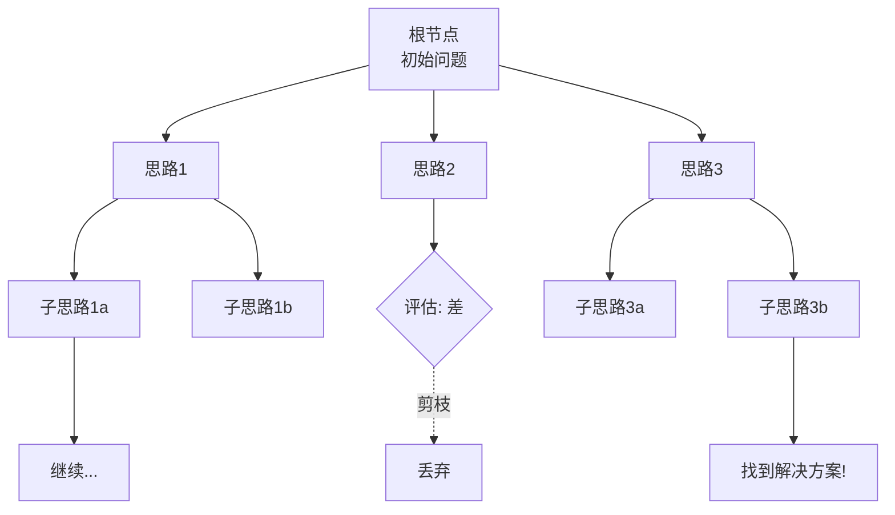

### 核心组件

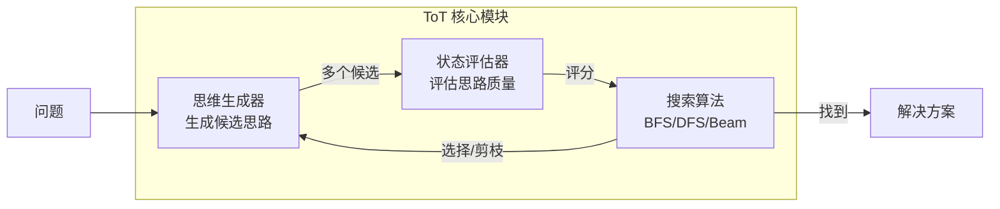

### 思维生成策略

| 策略 | 描述 | 适用场景 |
|------|------|---------|
| **Sample** | 独立采样多个思路 | 创意任务 |
| **Propose** | 按顺序提出思路 | 结构化任务 |
| **Divide** | 将问题分解为子问题 | 复杂任务 |

### 状态评估方法

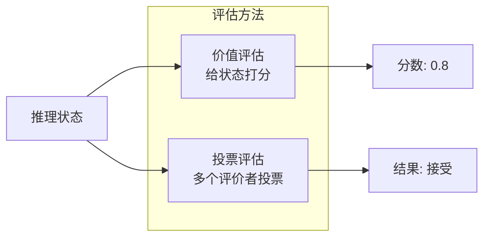

### 搜索算法对比

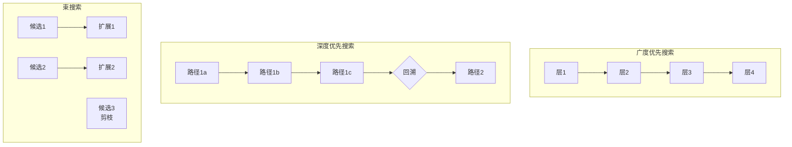

### ToT 完整示例：24点游戏

**任务：** 用数字 4、9、10、13，通过加减乘除得到 24

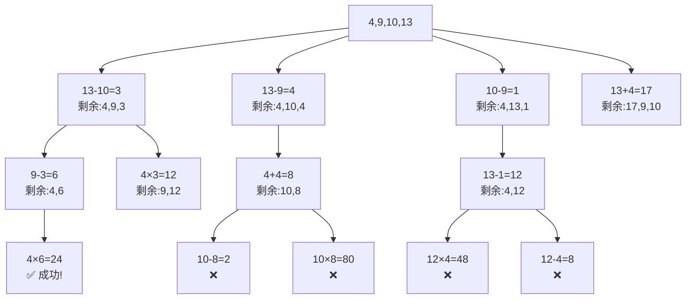

---

## 2.3 Self-Refine 自我反思

### 论文背景

**Self-Refine: Iterative Refinement with Self-Feedback**
Madaan et al., 2023 | [arXiv:2303.17651](https://arxiv.org/abs/2303.17651)

Self-Refine 的核心思想是让模型自己生成反馈，然后根据反馈改进输出。

### Self-Refine 双循环架构

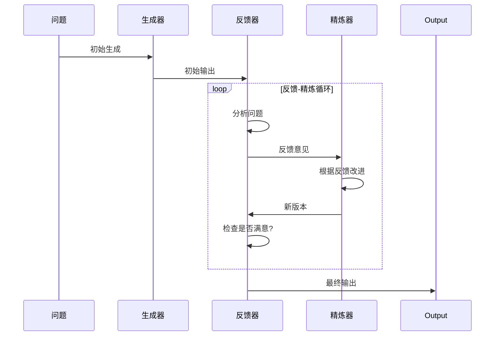

### 三模块详解

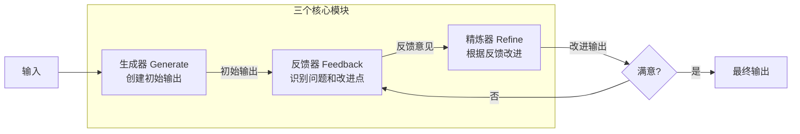

### 反馈生成策略

| 反馈类型 | 描述 | 示例 |
|---------|------|------|
| **正确性** | 事实准确检查 | "这个数据有问题，2023年的统计应该是..." |
| **完整性** | 内容覆盖检查 | "缺少了对X方面的讨论" |
| **清晰性** | 表达清晰度 | "这一段不够清楚，可以重新组织" |
| **一致性** | 逻辑一致性 | "这里与前面的说法矛盾" |
| **风格** | 风格和格式 | "建议使用更正式的语言" |

### 实际例子：代码生成与优化

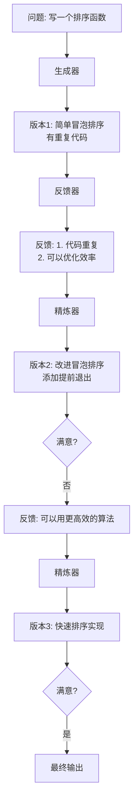

### 伪代码实现

```python
def self_refine(
    problem,
    max_iterations=5,
    accept_threshold=0.9
):
    """
    Self-Refine 算法实现
    """
    # 1. 初始生成
    current_output = generate_initial(problem)
    history = [current_output]

    for i in range(max_iterations):
        # 2. 生成反馈
        feedback = generate_feedback(problem, current_output)

        # 3. 评估质量
        quality_score = evaluate_quality(current_output, feedback)

        # 4. 检查是否满足要求
        if quality_score >= accept_threshold:
            break

        # 5. 精炼输出
        current_output = refine_output(
            problem,
            current_output,
            feedback
        )
        history.append(current_output)

    return current_output, history
```

---

## 2.4 三种策略对比

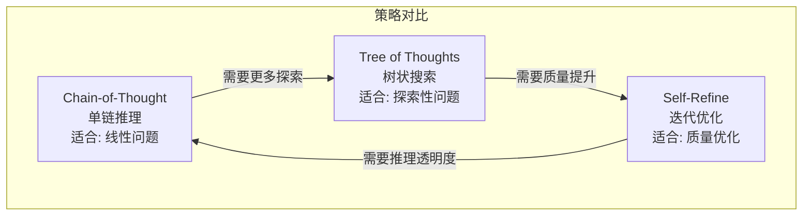

| 维度 | Chain-of-Thought | Tree of Thoughts | Self-Refine |
|------|------------------|------------------|-------------|
| **推理结构** | 线性链 | 树状搜索 | 迭代循环 |
| **计算成本** | 低 | 高 | 中等 |
| **探索能力** | 弱 | 强 | 中等 |
| **质量优化** | 无 | 间接 | 直接 |
| **可解释性** | 高 | 高 | 中高 |
| **最佳场景** | 数学题、逻辑题 | 游戏、创意任务 | 写作、代码 |

---

## 2.5 DeerFlow 中的推理策略

DeerFlow 结合了这三种策略的优点：

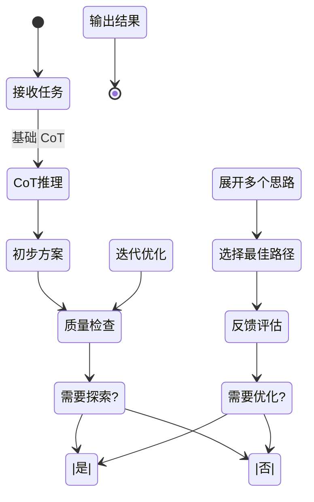

---

## 2.6 DeerFlow 项目代码导读

### 推理策略在 DeerFlow 中的融合

DeerFlow 结合了 Chain-of-Thought、Tree of Thoughts 和 Self-Refine 三种策略的优点，构建了一个强大的推理系统。

### 系统提示中的 CoT 引导

**文件**: `backend/src/agents/lead_agent/prompts.py`

DeerFlow 的系统提示词中内置了 CoT 推理引导：

```python
SYSTEM_PROMPT = """
你是一个有帮助的 AI 助手。

...

# 思考过程
在回答之前，请仔细思考：
1. 理解用户的需求是什么
2. 确定需要哪些信息或工具
3. 规划执行步骤
4. 逐步执行并验证结果

...
"""
```

### 动态模型选择：支持扩展思考

**文件**: `backend/src/models/factory.py`

DeerFlow 支持模型级别的思考能力配置：

```python
def create_chat_model(name: str, thinking_enabled: bool = False):
    """
    支持 thinking_enabled 标志的模型工厂
    """
    config = get_model_config(name)

    # 如果启用思考，应用模型特定的覆盖配置
    if thinking_enabled and config.get("when_thinking_enabled"):
        config = {**config, **config["when_thinking_enabled"]}

    # 通过反射系统动态加载模型类
    model_class = resolve_class(config["use"], BaseChatModel)

    # 解析环境变量 (如 $OPENAI_API_KEY)
    resolved_config = resolve_env_vars(config)

    return model_class(**resolved_config)
```

**配置示例** (`config.yaml`):
```yaml
models:
  - name: gpt-4o
    use: langchain_openai:ChatOpenAI
    model: gpt-4o
    supports_thinking: true
    supports_vision: true
    when_thinking_enabled:
      max_tokens: 16384
      temperature: 0.7
```

### 上下文摘要：Self-Refine 的轻量级实现

**文件**: `backend/src/agents/middlewares/summarization.py`

当上下文接近 token 限制时，DeerFlow 使用摘要中间件进行迭代优化：

```python
class SummarizationMiddleware:
    """
    实现 Self-Refine 风格的上下文优化
    """

    def __init__(self, config: SummarizationConfig):
        self.enabled = config.enabled
        self.trigger = config.trigger  # tokens|messages|fraction
        self.keep_policy = config.keep_policy

    def after_model(self, state: ThreadState) -> ThreadState:
        if not self.enabled:
            return state

        # 检查是否需要摘要
        if self._should_summarize(state):
            # 生成摘要 (Self-Refine 第一步：批评)
            summary = self._generate_summary(state)

            # 应用摘要 (Self-Refine 第二步：精炼)
            state = self._apply_summary(state, summary)

        return state
```

### ToT 风格的多路径探索：子 Agent 系统

**文件**: `backend/src/subagents/executor.py`

DeerFlow 通过子 Agent 系统实现了类似 ToT 的多路径探索：

```python
class SubagentExecutor:
    """
    支持并行执行多个子 Agent，类似 ToT 的多路径探索
    """

    MAX_CONCURRENT_SUBAGENTS = 3
    SUBAGENT_TIMEOUT = 900  # 15分钟

    def __init__(self):
        self._scheduler_pool = ThreadPoolExecutor(max_workers=3)
        self._execution_pool = ThreadPoolExecutor(max_workers=3)

    def execute_subagent(
        self,
        subagent_type: str,
        description: str,
        prompt: str,
        max_turns: int = 10
    ) -> SubagentResult:
        """
        执行子 Agent - 可以并行调用多个来探索不同思路
        """
        subagent = get_subagent(subagent_type)
        return subagent.run(description, prompt, max_turns)
```

**内置子 Agent** (`backend/src/subagents/builtins/`):
- `general-purpose` - 完整工具集的通用 Agent
- `bash` - 命令执行专家

### SubagentLimitMiddleware：控制探索宽度

**文件**: `backend/src/agents/middlewares/subagent_limit.py`

```python
class SubagentLimitMiddleware:
    """
    限制并发子 Agent 数量，防止过度探索
    类似 ToT 中的束搜索 (Beam Search)
    """

    def after_model(self, state: ThreadState) -> ThreadState:
        if not state.get("subagent_enabled"):
            return state

        # 获取模型响应中的工具调用
        messages = state["messages"]
        last_message = messages[-1]

        if hasattr(last_message, "tool_calls"):
            # 筛选出 task 工具调用
            task_calls = [
                call for call in last_message.tool_calls
                if call["name"] == "task"
            ]

            # 截断超过 MAX_CONCURRENT_SUBAGENTS 的调用
            if len(task_calls) > MAX_CONCURRENT_SUBAGENTS:
                truncated = task_calls[:MAX_CONCURRENT_SUBAGENTS]
                last_message.tool_calls = [
                    call for call in last_message.tool_calls
                    if call["name"] != "task"
                ] + truncated

        return state
```

### 配置中的推理策略控制

**文件**: `config.yaml`

```yaml
# 摘要配置 (Self-Refine)
summarization:
  enabled: true
  trigger:
    type: fraction
    value: 0.8  # 当达到上下文窗口的 80% 时触发
  keep_policy:
    recent_messages: 10  # 保留最近 10 条消息
    summarize_older: true

# 子 Agent 配置 (ToT 风格探索)
subagents:
  enabled: true

# 标题生成配置 (CoT 风格)
title:
  enabled: true
  max_words: 10
  max_chars: 60
```

### 关键代码文件索引

| 模块 | 文件路径 | 说明 |
|------|----------|------|
| **模型工厂** | `src/models/factory.py` | `create_chat_model()` 支持 thinking |
| **摘要中间件** | `src/agents/middlewares/summarization.py` | 上下文优化 |
| **子 Agent 执行器** | `src/subagents/executor.py` | 并行任务执行 |
| **子 Agent 限制** | `src/agents/middlewares/subagent_limit.py` | 探索宽度控制 |
| **系统提示** | `src/agents/lead_agent/prompts.py` | CoT 引导 |
| **配置模型** | `src/config/models.py` | 推理策略配置 |

---

## 2.7 小结

**本节课要点：**

1. ✅ **Chain-of-Thought** 通过显式推理步骤提升复杂任务性能
2. ✅ **Tree of Thoughts** 使用树状搜索探索多个推理路径
3. ✅ **Self-Refine** 通过自我反馈进行迭代优化
4. ✅ 三种策略可以组合使用，发挥各自优势

**下节课预告：**
我们将学习自主 Agent 架构，包括 AutoGPT、BabyAGI 和 Stanford Generative Agents。

---

## 参考资料

- [Chain-of-Thought Prompting Elicits Reasoning in Large Language Models](https://arxiv.org/abs/2201.11903)
- [Tree of Thoughts: Deliberate Problem Solving with Large Language Models](https://arxiv.org/abs/2305.10601)
- [Self-Refine: Iterative Refinement with Self-Feedback](https://arxiv.org/abs/2303.17651)
