# 第3课：自主 Agent 架构

## 3.1 AutoGPT 与 BabyAGI：早期自主 Agent 探索

### AutoGPT 架构

AutoGPT 是最早的自主 Agent 之一，它展示了 LLM 作为自主决策者的潜力。

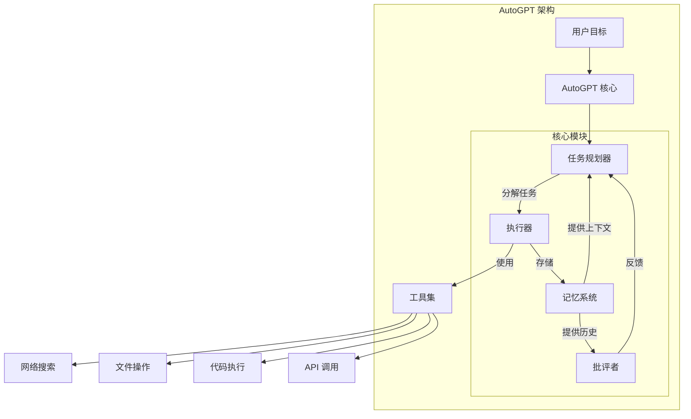

### AutoGPT 任务流程

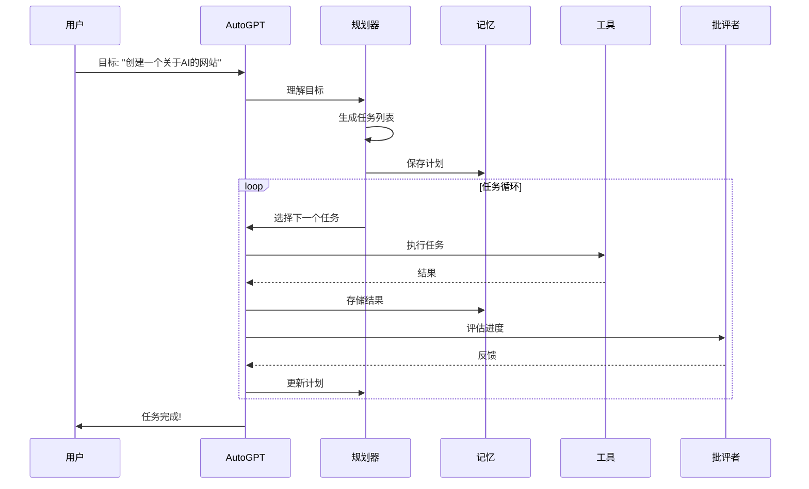

### BabyAGI 架构

BabyAGI 是另一个早期自主 Agent，采用了更简洁的设计。

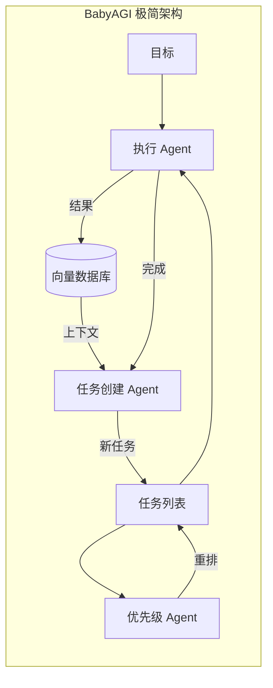

### BabyAGI 核心循环

```python
def babyagi_loop(objective, initial_task):
    """
    BabyAGI 核心循环伪代码
    """
    task_list = deque([initial_task])

    while task_list:
        # 1. 获取下一个任务
        current_task = task_list.popleft()

        # 2. 执行任务
        result = execution_agent(
            objective=objective,
            task=current_task
        )

        # 3. 存储结果
        store_in_vector_db(result)

        # 4. 创建新任务
        new_tasks = task_creation_agent(
            result=result,
            task_list=list(task_list),
            objective=objective
        )

        # 5. 添加新任务
        for task in new_tasks:
            task_list.append(task)

        # 6. 重新排序
        task_list = prioritization_agent(
            task_list=task_list,
            objective=objective
        )
```

---

## 3.2 Stanford Generative Agents

### 论文背景

**Generative Agents: Interactive Simulacra of Human Behavior**
Park et al., 2023 | [arXiv:2304.03442](https://arxiv.org/abs/2304.03442)

Stanford Generative Agents 创建了具有人类行为的交互式 Agent，它们能够记忆、反思、规划和互动。

### 整体架构

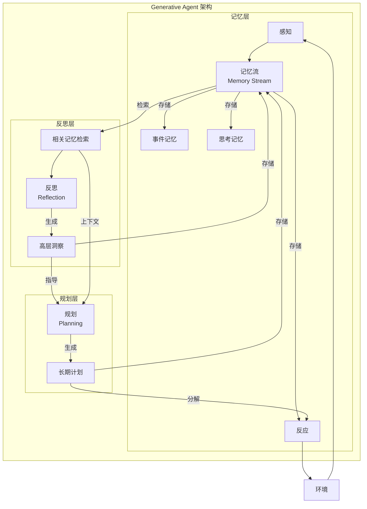

### 记忆流 (Memory Stream)

记忆流是一个时间序列的记忆对象，包含：

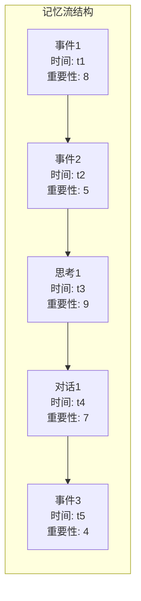

**记忆对象包含：**
- 描述文本
- 时间戳（创建时间、最近访问时间）
- 重要性评分（由模型评估）
- 嵌入向量

### 记忆检索机制

检索时综合考虑三个因素：

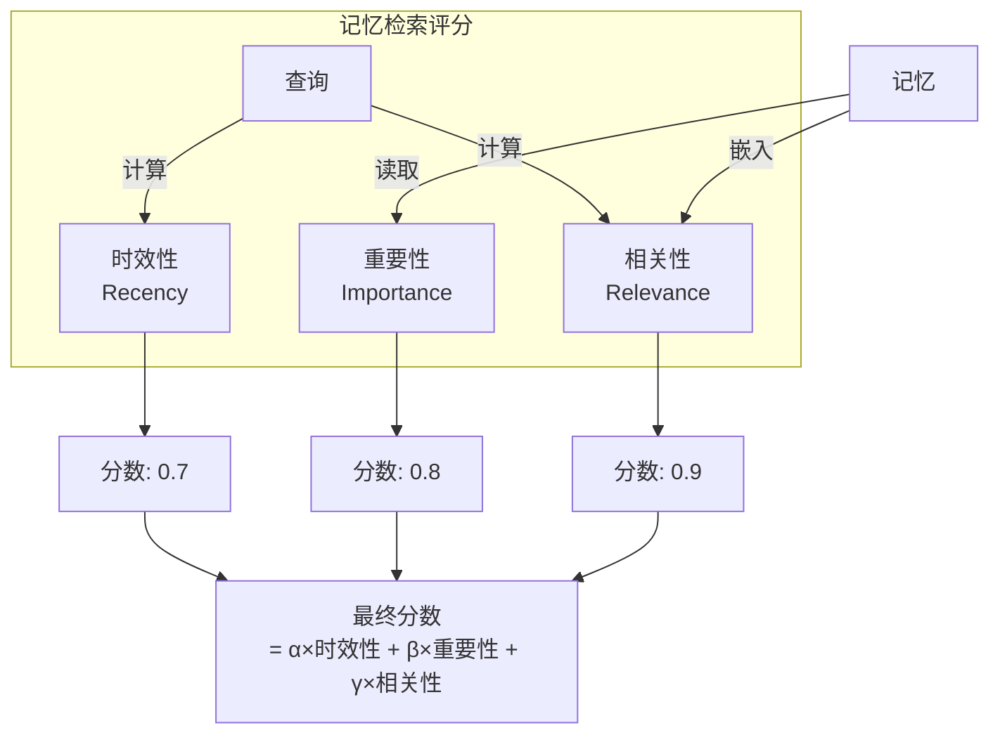

**评分公式：**
```
score = α·recency + β·importance + γ·relevance
其中 α + β + γ = 1
```

### 反思 (Reflection) 机制

反思是将记忆整合成高层洞察的过程：

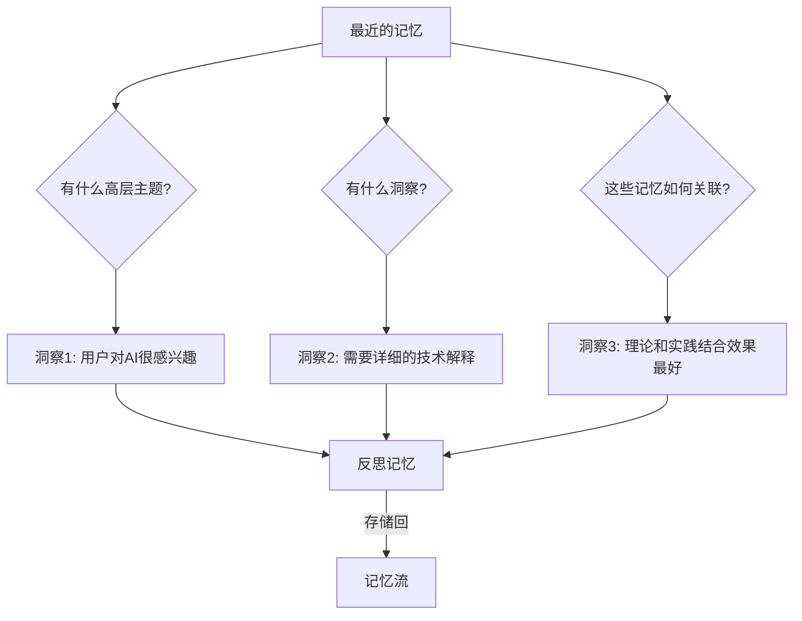

### 规划 (Planning) 与反应

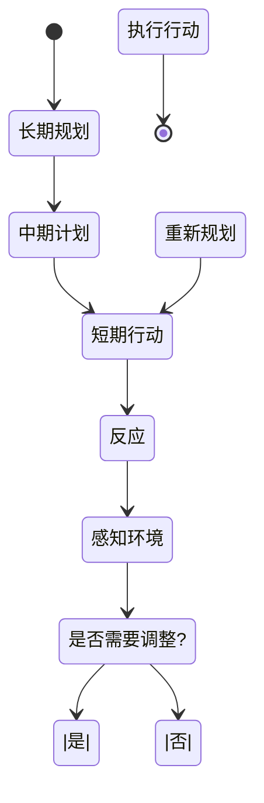

### 完整的 Agent 行为循环

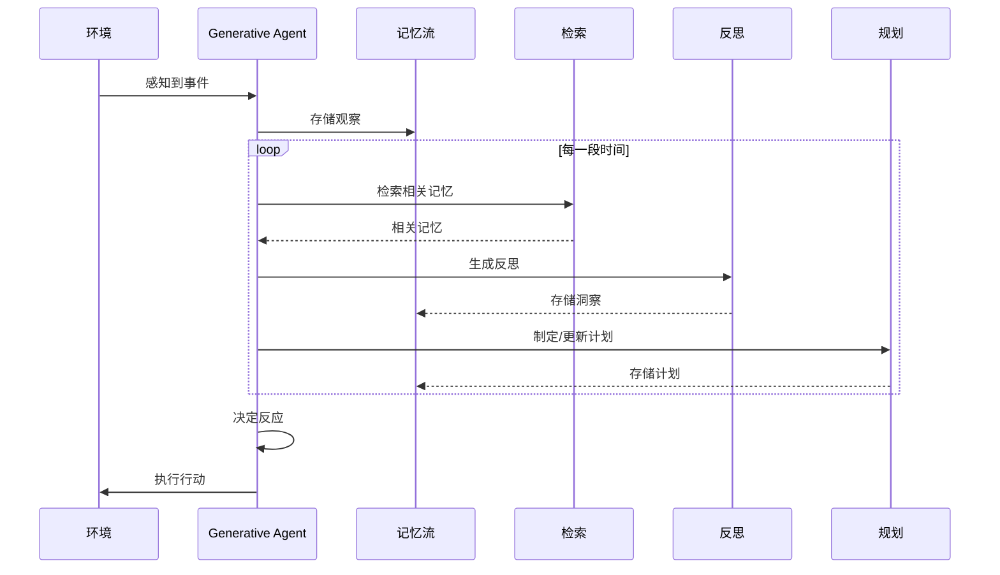

---

## 3.3 三种架构对比

| 特性 | AutoGPT | BabyAGI | Generative Agents |
|------|---------|---------|-------------------|
| **核心目标** | 完成复杂任务 | 任务导向执行 | 模拟人类行为 |
| **记忆系统** | 短期+长期 | 向量数据库 | 记忆流+反思 |
| **规划** | 任务分解 | 优先级排序 | 长期规划+反应 |
| **交互性** | 工具交互 | 工具交互 | 多 Agent 社会交互 |
| **应用场景** | 实用任务 | 任务自动化 | 游戏、模拟 |

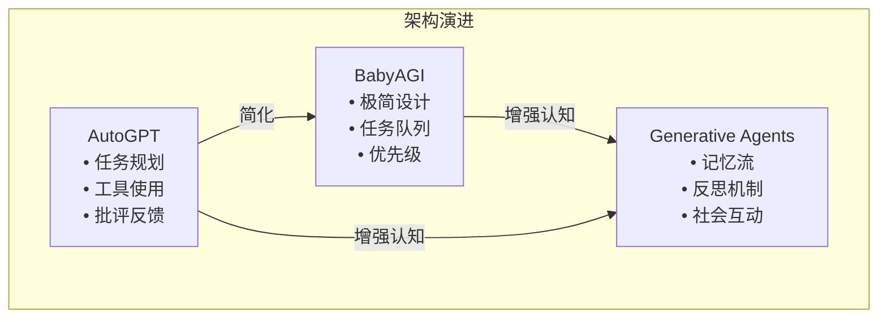

---

## 3.4 DeerFlow 中的实现

DeerFlow 融合了这些架构的优点：

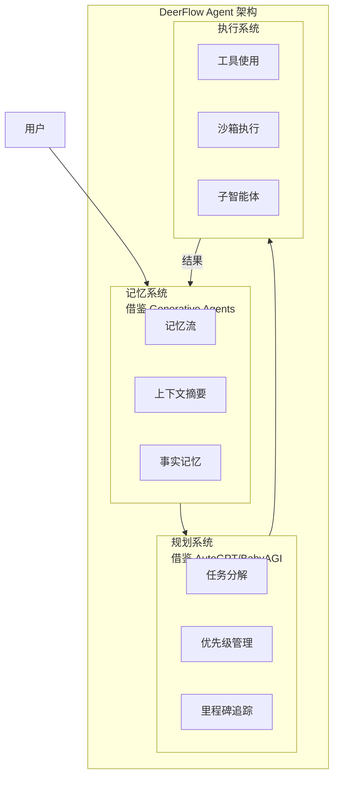

---

## 3.5 DeerFlow 项目代码导读

### DeerFlow 的架构设计：融合三种架构精华

DeerFlow 吸收了 AutoGPT 的任务规划、BabyAGI 的任务队列、Stanford Generative Agents 的记忆系统，构建了一个企业级的自主 Agent 系统。

### 整体架构视图

```mermaid
graph TB
    subgraph DeerFlow_Arch [DeerFlow 架构]
        subgraph Agent [Agent 核心
            Lead[Lead Agent<br/>
            Tools[工具系统]
            SubAgents[子智能体]
        end

        subgraph Memory [记忆系统层]
            Thread[线程记忆]
            Facts[事实记忆]
            Artifacts[工件存储]
        end

        subgraph Planning [规划层]
            MW[中间件链]
            Todo[任务追踪]
            Sandbox[沙箱管理]
        end
    end

    Lead --> Tools
    Lead --> SubAgents
    Lead --> Memory
    Lead --> Planning
```

### 线程记忆系统：借鉴 Generative Agents

**文件**: `backend/src/agents/memory/`

DeerFlow 的记忆系统借鉴了 Stanford Generative Agents 的三层记忆流设计：

```python
# backend/src/agents/memory/updater.py
class MemoryUpdater:
    """
    基于 LLM 的记忆更新器，提取事实和上下文
    类似 Generative Agents 的反思机制
    """

    def __init__(self, config: MemoryConfig):
        self.config = config
        self.model = None  # 懒加载

    def update_memory(
        self,
        memory_data: MemoryData,
        conversation: list[BaseMessage]
    ) -> MemoryData:
        """
        1. 分析对话，提取新事实
        2. 更新用户上下文
        3. 原子性写入
        """
        # 过滤：只保留用户输入和最终 AI 响应
        filtered = self._filter_conversation(conversation)

        # 使用 LLM 提取事实和上下文更新
        updates = self._extract_updates(filtered)

        # 应用更新
        return self._apply_updates(memory_data, updates)
```

**记忆数据结构** (`backend/src/agents/memory/models.py`):
```python
class MemoryData:
    """
    类似 Generative Agents 的记忆结构
    """
    user_context: UserContext  # workContext, personalContext, topOfMind
    history: History  # recentMonths, earlierContext, longTermBackground
    facts: list[Fact]  # id, content, category, confidence, createdAt, source
```

### 记忆队列：防抖更新机制

**文件**: `backend/src/agents/memory/queue.py`

```python
class MemoryUpdateQueue:
    """
    防抖记忆更新队列，避免频繁 LLM 调用
    """

    def __init__(self, updater: MemoryUpdater, config: MemoryConfig):
        self.updater = updater
        self.debounce_seconds = config.debounce_seconds
        self._queue: dict[str, QueuedUpdate] = {}  # thread_id -> QueuedUpdate
        self._thread: Thread | None = None

    def queue_update(
        self,
        thread_id: str,
        memory_path: Path,
        conversation: list[BaseMessage]
    ):
        """
        队列化更新，去重线程
        防抖等待
        """
        self._queue[thread_id] = QueuedUpdate(...)
        self._ensure_worker()
```

### 任务规划系统：融合 AutoGPT + BabyAGI

**文件**: `backend/src/agents/middlewares/todo_list.py`

```python
class TodoListMiddleware:
    """
    任务追踪中间件，结合 AutoGPT 风格的任务规划
    """

    def __init__(self, is_plan_mode: bool):
        self.is_plan_mode = is_plan_mode

    def before_model(self, state: ThreadState) -> ThreadState:
        if not self.is_plan_mode:
            return state

        # 确保 todos 工具只在计划模式下可用
        state["tools"] = state.get("tools", []) + [self.write_todos_tool]
        return state
```

**Todo 工具** (`backend/src/tools/builtins/todo_list.py`):
```python
def write_todos(
    todos: Annotated[str, "JSON list of todo items"],
) -> Annotated[str, "Result"]:
    """
    Write/update the todo list for plan mode.

    Each todo item should have:
    - id: unique identifier
    - description: what to do
    - status: "pending", "in_progress", or "completed"
    """
    pass
```

### 中间件链：类似 AutoGPT 的模块化设计

**文件**: `backend/src/agents/lead_agent/agent.py`

```python
def _build_middlewares(config: LeadAgentConfig) -> list[AgentMiddleware]:
    """
    构建中间件链，顺序执行，类似 AutoGPT 的模块化架构
    """
    return [
        # 1. 线程数据 (ThreadDataMiddleware
        # 2. 上传 (UploadsMiddleware)
        # 3. 沙箱 (SandboxMiddleware)
        # 4. 悬空工具调用 (DanglingToolCallMiddleware)
        # 5. 摘要 (SummarizationMiddleware)
        # 6. 任务列表 (TodoListMiddleware)
        # 7. 标题 (TitleMiddleware)
        # 8. 记忆 (MemoryMiddleware)
        # 9. 图像 (ViewImageMiddleware)
        # 10. 子 Agent 限制 (SubagentLimitMiddleware)
        # 11. 澄清 (ClarificationMiddleware)
    ]
```

### 线程隔离：每个线程独立环境

**文件**: `backend/src/agents/middlewares/thread_data.py`

```python
class ThreadDataMiddleware:
    """
    为每个线程创建独立的工作目录
    类似 AutoGPT 的工作区隔离
    """

    def __init__(self, threads_dir: Path):
        self.threads_dir = threads_dir

    def _get_thread_dir(self, thread_id: str) -> Path:
        """
        backend/.deer-flow/threads/{thread_id}/user-data/
        ├── workspace/  # 工作区
        ├── uploads/    # 上传文件
        └── outputs/    # 输出文件
        """
```

### 工具系统：可扩展的工具注册

**文件**: `backend/src/tools/__init__.py`

```python
def get_available_tools(
    groups: list[str] | None = None,
    include_mcp: bool = True,
    model_name: str | None = None,
    subagent_enabled: bool = False,
) -> list[BaseTool]:
    """
    组合多个工具源，类似 AutoGPT 的插件系统
    """
    tools = []

    # 1. 配置定义的工具
    tools += get_config_tools(groups)

    # 2. MCP 工具 (懒加载)
    if include_mcp:
        tools += get_cached_mcp_tools()

    # 3. 内置工具
    tools += get_builtin_tools(model_name)

    # 4. 子 Agent 工具
    if subagent_enabled:
        tools += [task_tool]

    return tools
```

### 配置系统

**文件**: `config.yaml`

```yaml
# 记忆系统配置 (Generative Agents 风格)
memory:
  enabled: true
  injection_enabled: true
  storage_path: backend/.deer-flow/memory.json
  debounce_seconds: 30
  max_facts: 100
  fact_confidence_threshold: 0.7
  max_injection_tokens: 2000

# 子 Agent 系统
subagents:
  enabled: true

# 标题生成
title:
  enabled: true
```

### 关键代码文件索引

| 模块 | 文件路径 | 说明 |
|------|----------|------|
| **记忆更新器** | `src/agents/memory/updater.py` | LLM 事实提取 |
| **记忆队列** | `src/agents/memory/queue.py` | 防抖更新 |
| **记忆模型** | `src/agents/memory/models.py` | 数据结构 |
| **Todo 中间件** | `src/agents/middlewares/todo_list.py` | 任务追踪 |
| **线程数据** | `src/agents/middlewares/thread_data.py` | 工作区隔离 |
| **工具加载器** | `src/tools/__init__.py` | `get_available_tools()` |
| **子Agent执行器** | `src/subagents/executor.py` | 并行任务 |

---

## 3.6 小结

**本节课要点：**

1. ✅ **AutoGPT**：开创了任务规划+执行+批评的自主 Agent 模式
2. ✅ **BabyAGI**：极简的任务队列+优先级架构
3. ✅ **Generative Agents**：记忆流+反思+规划的认知架构
4. ✅ 这些架构为现代 Agent 系统奠定了基础

**下节课预告：**
我们将深入学习 Agent 记忆系统的设计与实现。

---

## 参考资料

- [Generative Agents: Interactive Simulacra of Human Behavior](https://arxiv.org/abs/2304.03442)
- [AutoGPT GitHub Repository](https://github.com/Significant-Gravitas/AutoGPT)
- [BabyAGI GitHub Repository](https://github.com/yoheinakajima/babyagi)
