# 第4课：Agent 记忆系统

## 4.1 记忆的层级结构

### 人类记忆 vs Agent 记忆

受人类记忆系统启发，Agent 记忆通常采用多层级结构：

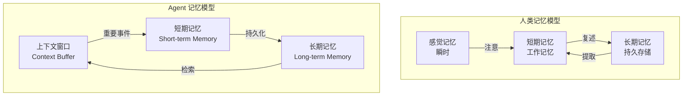

### Agent 记忆三级架构详解

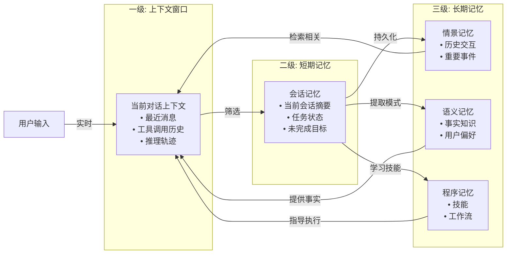

---

## 4.2 向量检索记忆

### 向量嵌入基础

```mermaid
flowchart TB
    Text[文本内容] --> EmbModel[嵌入模型<br>Embedding Model]
    EmbModel --> Vector[向量<br>[0.12, -0.45, 0.78, ...]]
    Vector --> Index[(向量索引)]

    Query[查询文本] --> EmbModel2[嵌入模型]
    EmbModel2 --> QueryVec[查询向量]

    QueryVec --> Search[相似度搜索]
    Index --> Search
    Search --> Results[最相似结果]
```

### 相似度计算

常用的相似度度量方法：

| 方法 | 公式 | 适用场景 |
|------|------|---------|
| **余弦相似度** | $sim(a,b) = \frac{a·b}{\|a\|\|b\|}$ | 文本语义相似 |
| **点积** | $sim(a,b) = a·b$ | 已归一化向量 |
| **欧氏距离** | $dist(a,b) = \sqrt{\sum(a_i-b_i)^2}$ | 空间距离 |

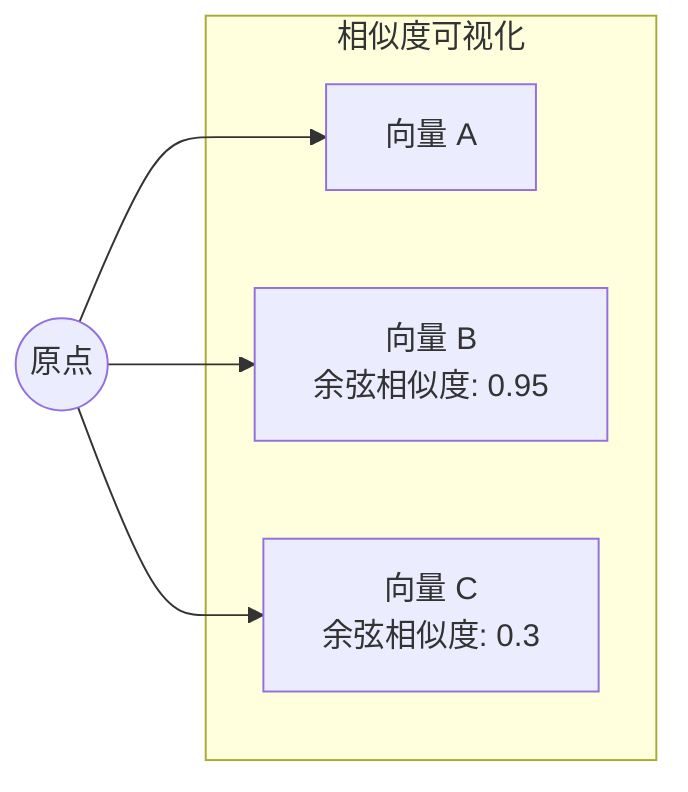

### 向量数据库选型

| 数据库 | 特点 | 适用场景 |
|--------|------|---------|
| **Chroma** | 轻量级、Python 原生 | 原型开发、中小规模 |
| **Pinecone** | 托管服务、可扩展 | 生产环境、大规模 |
| **Weaviate** | 混合搜索、模块化 | 需要元数据过滤 |
| **FAISS** | Facebook 开源、高性能 | 大批量搜索 |
| **PGVector** | PostgreSQL 扩展 | 已有 PG 数据库 |

---

## 4.3 记忆组织与检索策略

### 分块策略 (Chunking)

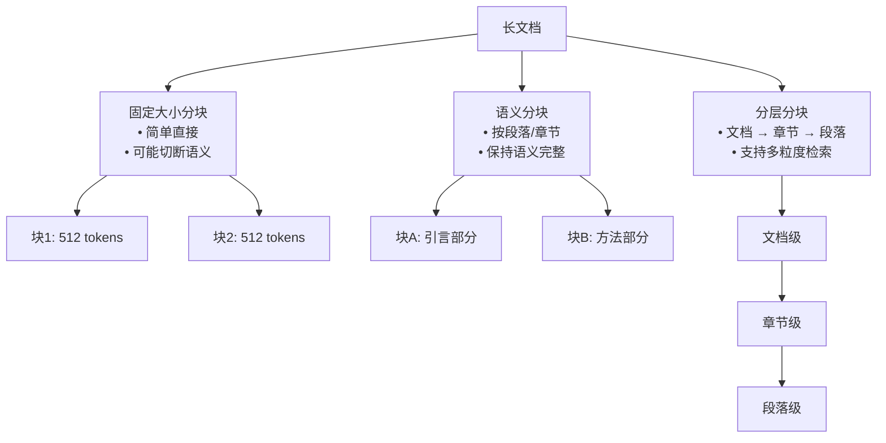

### 索引优化

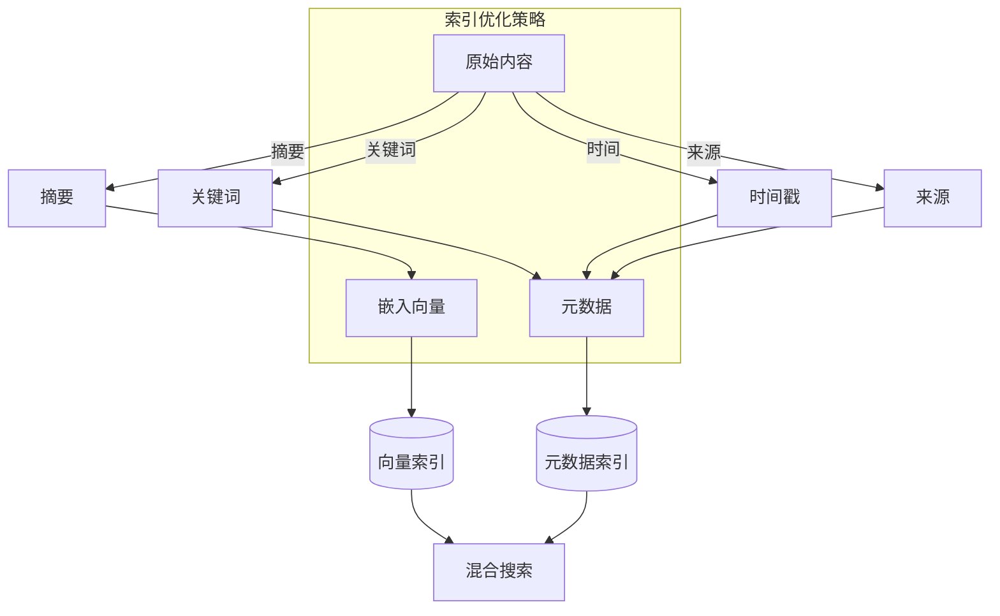

### 高级检索技术

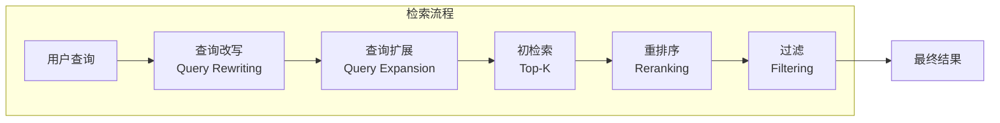

**各步骤说明：**

1. **查询改写**：优化查询表达方式
2. **查询扩展**：添加同义词、相关术语
3. **初检索**：快速返回 Top-K 候选
4. **重排序**：用更精确的模型重新排序
5. **过滤**：根据元数据过滤结果

---

## 4.4 记忆评分机制

### 三重评分模型 (Generative Agents)

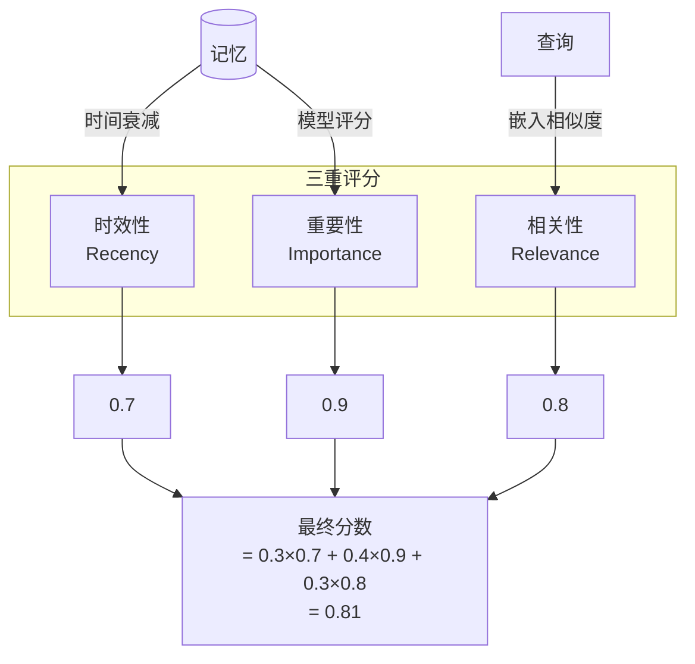

### 时效性计算 (Recency)

使用指数衰减函数：

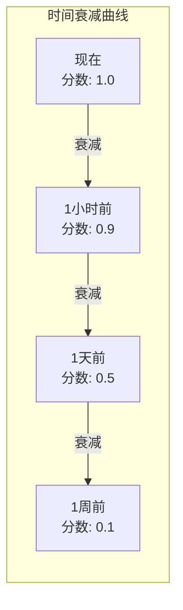

**公式：**
$$
\text{recency}(t) = e^{-\lambda \cdot \Delta t}
$$
其中 $\Delta t$ 是时间差，$\lambda$ 是衰减系数。

### 重要性评分 (Importance)

让 LLM 评估记忆的重要性：

```python
def calculate_importance(memory_content):
    """
    让 LLM 评估记忆的重要性，评分 1-10
    """
    prompt = f"""
    在 1 到 10 的尺度上，评估以下记忆的重要性：
    1 是完全不重要（如日常问候），
    10 是极其重要（如用户核心偏好）。

    记忆内容：{memory_content}

    只返回一个数字。
    """
    score = llm(prompt)
    return float(score) / 10  # 归一化到 0-1
```

---

## 4.5 上下文窗口优化

### 上下文压缩 (Context Compression)

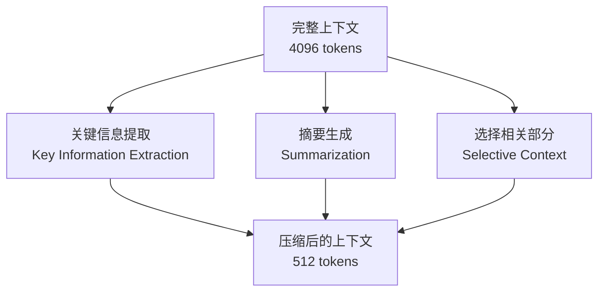

### 滚动窗口与摘要

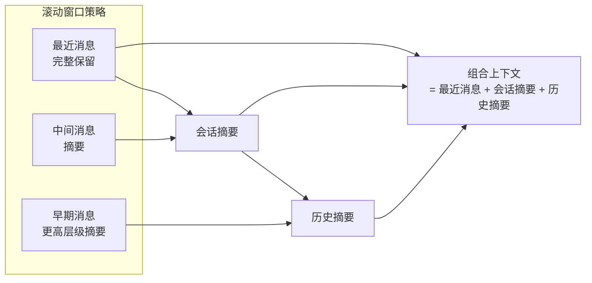

### 提示词工程优化

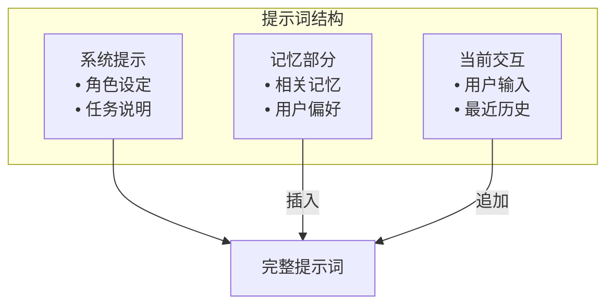

---

## 4.6 DeerFlow 记忆系统解析

### DeerFlow 记忆架构

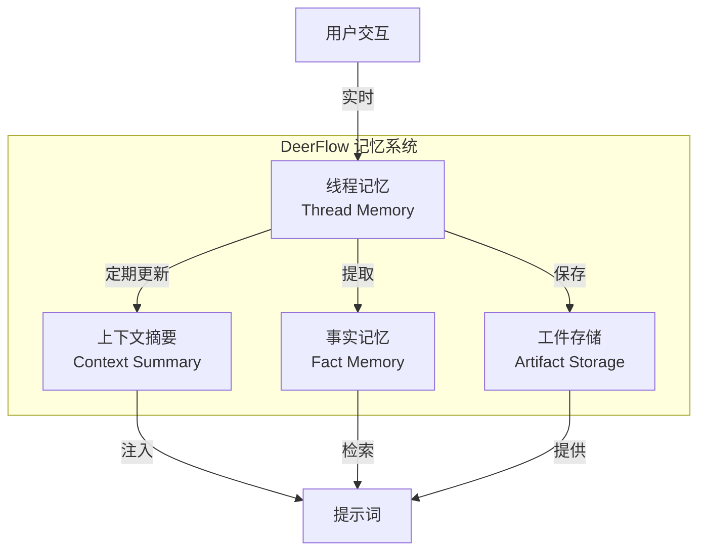

### 记忆中间件流程

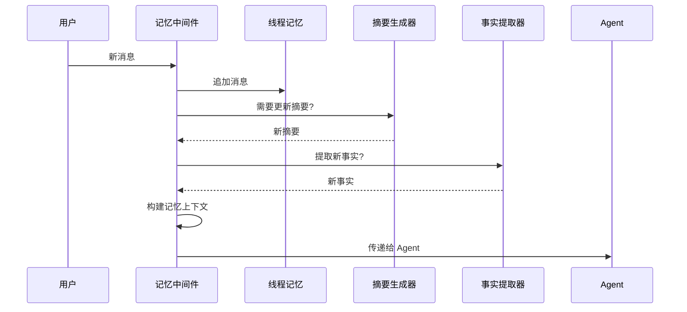

---

## 4.7 DeerFlow 项目代码导读

### DeerFlow 记忆系统架构

DeerFlow 实现了完整的三级记忆架构：上下文窗口（短期）、会话摘要（中期）、持久化记忆（长期）。

### 记忆系统核心组件

**文件**: `backend/src/agents/memory/`

```mermaid
graph TB
    subgraph MemorySys [DeerFlow 记忆系统]
        MW[MemoryMiddleware
        Queue[MemoryUpdateQueue
        Updater[MemoryUpdater
        Prompt[记忆提示模板]
    end

    MW -->|队列更新| Queue
    Queue -->|防抖处理| Updater
    Updater -->|使用| Prompt
```

### MemoryMiddleware：记忆注入与提取

**文件**: `backend/src/agents/middlewares/memory.py`

```python
class MemoryMiddleware(AgentMiddleware):
    """
    记忆中间件：在每次交互中注入记忆，并队列化更新
    """

    def __init__(
        self,
        memory_config: MemoryConfig,
        queue: MemoryUpdateQueue | None = None,
    ):
        self.config = memory_config
        self.queue = queue or MemoryUpdateQueue(
            MemoryUpdater(memory_config),
            memory_config,
        )

    def before_model(self, state: ThreadState) -> ThreadState:
        """
        在 LLM 调用前：注入记忆到系统提示
        """
        if not self.config.injection_enabled:
            return state

        # 加载记忆数据
        memory_data = self._load_memory()

        # 构建 <memory> 标签内容
        memory_context = build_memory_context(memory_data)

        # 注入到系统提示
        state = self._inject_memory(state, memory_context)
        return state

    def after_model(self, state: ThreadState) -> ThreadState:
        """
        在 LLM 调用后：队列化记忆更新
        """
        if not self.config.enabled:
            return state

        # 过滤消息（只保留用户输入和最终 AI 响应）
        messages = self._filter_messages(state["messages"])

        if messages:
            # 队列化更新（防抖，避免频繁 LLM 调用）
            self.queue.queue_update(
                thread_id=state.get("thread_id", "unknown"),
                memory_path=Path(self.config.storage_path),
                conversation=messages,
            )

        return state
```

### MemoryData：三级记忆结构

**文件**: `backend/src/agents/memory/models.py`

```python
@define
class UserContext:
    """
    用户上下文：概括性的用户信息
    """
    work_context: str | None = None  # 工作相关
    personal_context: str | None = None  # 个人相关
    top_of_mind: str | None = None  # 当前关注

@define
class History:
    """
    历史记忆：时间分层的历史信息
    """
    recent_months: str | None = None
    earlier_context: str | None = None
    long_term_background: str | None = None

@define
class Fact:
    """
    事实记忆：带置信度评分的离散事实
    """
    id: str
    content: str
    category: Literal["preference", "knowledge", "context", "behavior", "goal"]
    confidence: float  # 0-1
    created_at: str
    source: str | None = None

@define
class MemoryData:
    """
    完整的记忆数据结构
    """
    version: int = 1
    user_context: UserContext = field(factory=UserContext)
    history: History = field(factory=History)
    facts: list[Fact] = field(factory=list)
    _cached_mtime: float | None = field(default=None, repr=False, eq=False)
```

### MemoryUpdater：LLM 驱动的记忆提取

**文件**: `backend/src/agents/memory/updater.py`

```python
class MemoryUpdater:
    """
    使用 LLM 从对话中提取记忆更新
    类似 Generative Agents 的反思机制
    """

    def update_memory(
        self,
        memory_data: MemoryData,
        conversation: list[BaseMessage],
    ) -> MemoryData:
        """
        1. 生成用户上下文更新
        2. 提取新事实
        3. 原子性写入（临时文件 + 重命名）
        """
        updated = MemoryData(**attr.asdict(memory_data))

        # 更新用户上下文
        updated.user_context = self._update_user_context(
            updated.user_context,
            conversation,
        )

        # 提取新事实
        new_facts = self._extract_facts(conversation)
        for fact in new_facts:
            updated = self._add_or_update_fact(updated, fact)

        # 修剪旧事实
        if len(updated.facts) > self.config.max_facts:
            updated.facts = sorted(
                updated.facts,
                key=lambda f: (f.confidence, f.created_at),
                reverse=True,
            )[: self.config.max_facts]

        return updated

    def _extract_facts(self, conversation: list[BaseMessage]) -> list[Fact]:
        """
        使用 LLM 提取事实，带置信度评分
        """
        prompt = self._build_fact_extraction_prompt(conversation)
        response = self._get_model().invoke(prompt)
        return self._parse_facts_response(response)
```

### 记忆提示模板

**文件**: `backend/src/agents/memory/prompts.py`

```python
# 记忆注入模板（注入到系统提示）
MEMORY_INJECTION_TEMPLATE = """
<memory>
以下是关于用户的重要信息（按相关性排序）：

{facts_section}

{user_context_section}
</memory>
"""

# 事实提取提示
FACT_EXTRACTION_PROMPT = """
请分析以下对话，提取关于用户的离散事实。

每个事实应该：
- 具体、可验证
- 包含置信度评分（0-1）
- 分类：preference/knowledge/context/behavior/goal

对话：
{conversation}

请返回 JSON 格式的事实列表。
"""

# 用户上下文更新提示
USER_CONTEXT_UPDATE_PROMPT = """
请根据对话更新用户的上下文摘要。

当前上下文：
{current_context}

新对话：
{conversation}

请更新：
- work_context：工作相关
- personal_context：个人相关
- top_of_mind：当前关注
"""
```

### 记忆检索与注入

**文件**: `backend/src/agents/memory/updater.py`

```python
def build_memory_context(memory_data: MemoryData, max_tokens: int = 2000) -> str:
    """
    构建记忆上下文，限制 token 数量
    1. 选择 Top 15 事实（按置信度排序）
    2. 添加用户上下文
    """
    # 按置信度排序事实
    sorted_facts = sorted(
        memory_data.facts,
        key=lambda f: f.confidence,
        reverse=True,
    )[:15]  # Top 15

    # 构建事实部分
    facts_section = "\n".join([
        f"- [{fact.category}] {fact.content} (confidence: {fact.confidence:.2f})"
        for fact in sorted_facts
        if fact.confidence >= memory_data.config.fact_confidence_threshold
    ])

    # 构建用户上下文部分
    user_context_section = "\n".join(filter(None, [
        f"工作: {memory_data.user_context.work_context}" if memory_data.user_context.work_context else None,
        f"个人: {memory_data.user_context.personal_context}" if memory_data.user_context.personal_context else None,
        f"当前关注: {memory_data.user_context.top_of_mind}" if memory_data.user_context.top_of_mind else None,
    ]))

    return MEMORY_INJECTION_TEMPLATE.format(
        facts_section=facts_section,
        user_context_section=user_context_section,
    )
```

### 记忆配置

**文件**: `config.yaml`

```yaml
memory:
  enabled: true
  injection_enabled: true
  storage_path: backend/.deer-flow/memory.json
  debounce_seconds: 30  # 防抖等待时间
  model_name: null  # null = 使用默认模型
  max_facts: 100  # 最多存储 100 个事实
  fact_confidence_threshold: 0.7  # 只注入置信度 >= 0.7 的事实
  max_injection_tokens: 2000  # 注入的最大 token 数
```

### 线程级工件存储

**文件**: `backend/src/agents/thread_state.py`

```python
def merge_artifacts(old: list[str] | None, new: list[str]) -> list[str]:
    """
    合并工件列表，去重
    """
    combined = (old or []) + new
    # 去重但保持顺序
    seen = set()
    result = []
    for item in combined:
        if item not in seen:
            seen.add(item)
            result.append(item)
    return result

class ThreadState(AgentState):
    # ...
    artifacts: Annotated[list[str], merge_artifacts]  # 生成的文件路径
```

### SummarizationMiddleware：上下文窗口管理

**文件**: `backend/src/agents/middlewares/summarization.py`

```python
class SummarizationMiddleware:
    """
    上下文摘要中间件：管理有限的上下文窗口
    """

    def __init__(self, config: SummarizationConfig):
        self.config = config
        self.trigger_type = config.trigger.type
        self.trigger_value = config.trigger.value

    def _should_summarize(self, state: ThreadState) -> bool:
        """
        判断是否需要摘要：
        - tokens: token 数量
        - messages: 消息数量
        - fraction: 上下文窗口占比
        """
        if self.trigger_type == "tokens":
            return count_tokens(state) >= self.trigger_value
        elif self.trigger_type == "messages":
            return len(state["messages"]) >= self.trigger_value
        elif self.trigger_type == "fraction":
            return get_context_fraction(state) >= self.trigger_value
        return False

    def _apply_summary(self, state: ThreadState, summary: str) -> ThreadState:
        """
        应用摘要：保留最近消息，摘要化旧消息
        """
        recent = state["messages"][-self.config.keep_policy.recent_messages :]
        state["messages"] = [SystemMessage(content=summary)] + recent
        return state
```

### 关键代码文件索引

| 模块 | 文件路径 | 说明 |
|------|----------|------|
| **记忆中间件** | `src/agents/middlewares/memory.py` | 记忆注入与队列 |
| **记忆更新器** | `src/agents/memory/updater.py` | LLM 事实提取 |
| **记忆队列** | `src/agents/memory/queue.py` | 防抖更新 |
| **记忆模型** | `src/agents/memory/models.py` | 数据结构 |
| **记忆提示** | `src/agents/memory/prompts.py` | 提示模板 |
| **摘要中间件** | `src/agents/middlewares/summarization.py` | 上下文管理 |
| **线程状态** | `src/agents/thread_state.py` | 工件合并 |

---

## 4.8 小结

**本节课要点：**

1. ✅ 记忆系统采用三级架构：上下文窗口、短期记忆、长期记忆
2. ✅ 向量检索使用嵌入和相似度搜索找到相关记忆
3. ✅ 三重评分机制：时效性、重要性、相关性
4. ✅ 上下文压缩和优化技术帮助管理有限的上下文窗口

**下节课预告：**
我们将学习工具使用与函数调用的最佳实践。

---

## 参考资料

- [Generative Agents: Interactive Simulacra of Human Behavior](https://arxiv.org/abs/2304.03442)
- [Anthropic: Retrieval Augmented Generation](https://www.anthropic.com/index/retrieval-augmented-generation-and-embeddings)
- [Chroma Documentation](https://docs.trychroma.com/)
