# 第5课：工具使用与函数调用

## 5.1 工具使用范式

### 工具使用的基本概念

工具使用（Tool Use）是 Agent 与外部世界交互的关键能力。


### 工具使用的发展历程

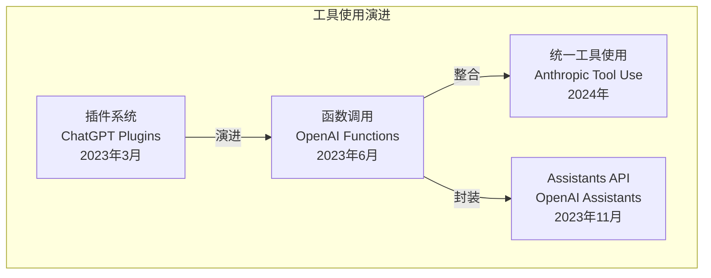

---

## 5.2 Anthropic Tool Use

### 工具定义格式

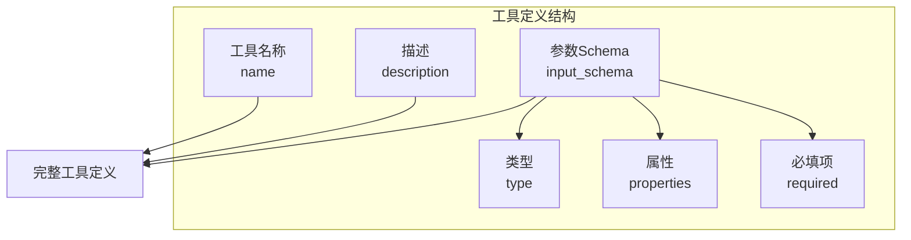

### JSON Schema 示例

```json
{
  "tools": [
    {
      "name": "search",
      "description": "搜索网络获取最新信息",
      "input_schema": {
        "type": "object",
        "properties": {
          "query": {
            "type": "string",
            "description": "搜索查询词"
          },
          "num_results": {
            "type": "integer",
            "description": "返回结果数量",
            "default": 5
          }
        },
        "required": ["query"]
      }
    }
  ]
}
```

### 完整交互流程

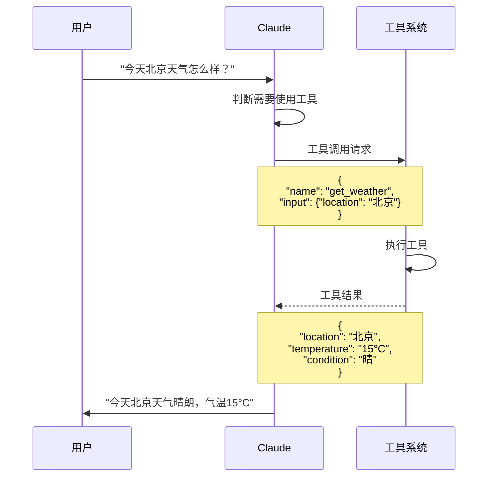

### API 消息格式

```mermaid
graph TB
    subgraph Messages [消息序列]
        M1[用户消息<br>role: user]
        M2[助手响应<br>role: assistant<br>tool_calls: [...]]
        M3[工具结果<br>role: user<br>tool_results: [...]]
        M4[最终回复<br>role: assistant]
    end

    M1 --> M2
    M2 --> M3
    M3 --> M4
```

---

## 5.3 OpenAI 函数调用

### Function Calling 格式

```json
{
  "functions": [
    {
      "name": "get_weather",
      "description": "获取指定城市的天气",
      "parameters": {
        "type": "object",
        "properties": {
          "location": {
            "type": "string",
            "description": "城市名称"
          },
          "unit": {
            "type": "string",
            "enum": ["celsius", "fahrenheit"],
            "default": "celsius"
          }
        },
        "required": ["location"]
      }
    }
  ]
}
```

### 响应格式

```json
{
  "choices": [
    {
      "message": {
        "role": "assistant",
        "content": null,
        "function_call": {
          "name": "get_weather",
          "arguments": "{\"location\": \"北京\"}"
        }
      }
    }
  ]
}
```

---

## 5.4 并行工具调用

### 并行调用架构

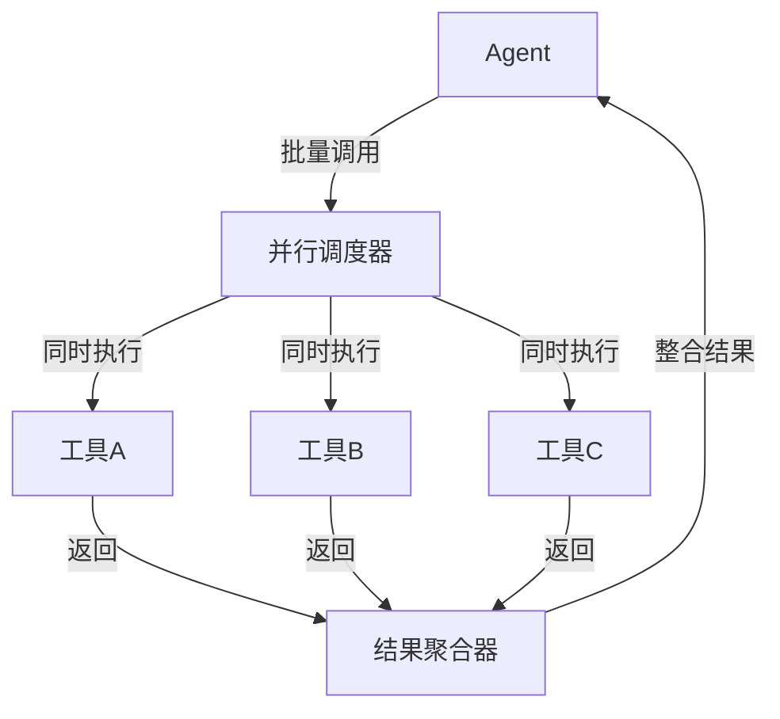

### 何时使用并行调用

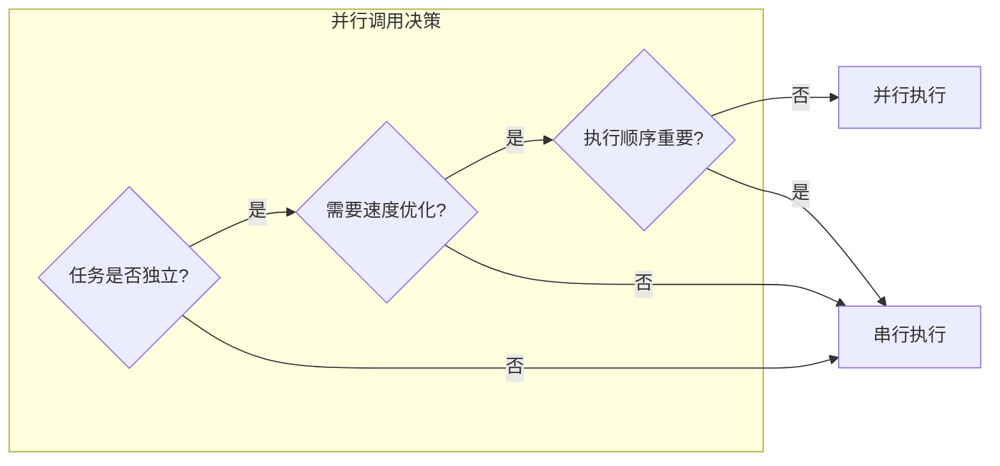

---

## 5.5 工具选择与规划

### 工具选择策略

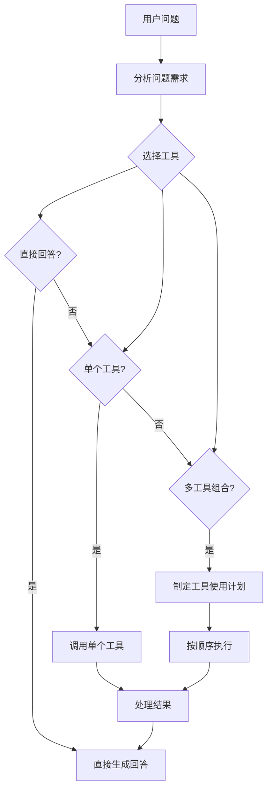

### 工具链规划

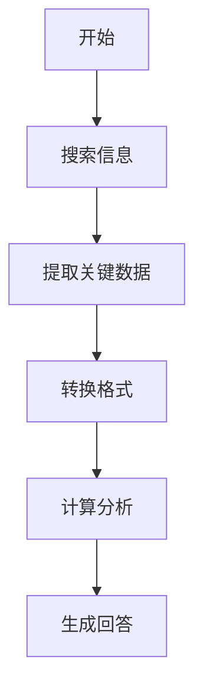

---

## 5.6 错误处理与重试

### 错误类型与处理策略

| 错误类型 | 原因 | 处理策略 |
|---------|------|---------|
| **参数错误** | 缺少必填字段、格式不对 | 提示修正参数 |
| **工具不可用** | 服务超时、权限问题 | 尝试替代工具 |
| **结果为空** | 无匹配数据 | 调整查询重试 |
| **速率限制** | 调用过于频繁 | 等待后重试 |
| **解析错误** | 返回格式异常 | 优雅降级 |

### 重试机制

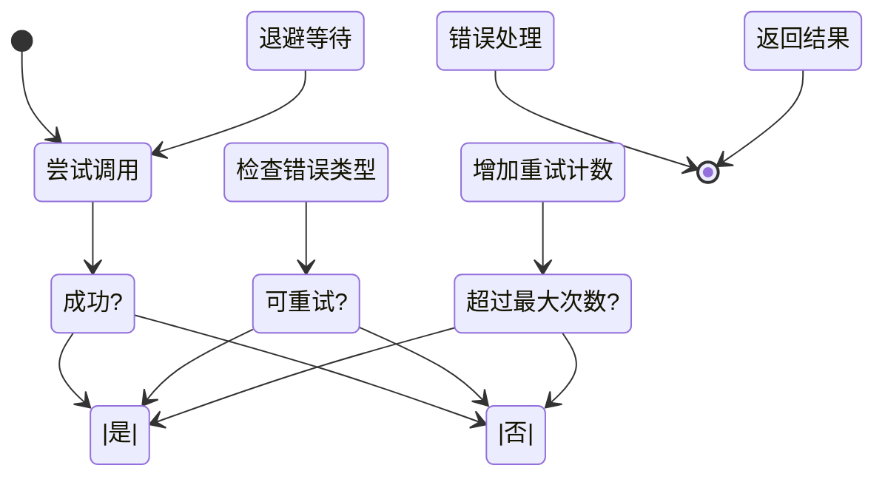

### 退避策略 (Backoff)

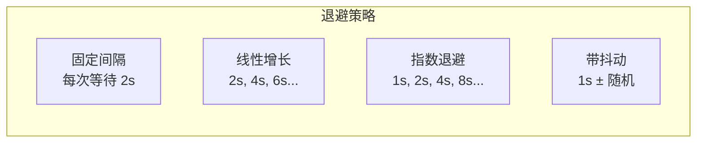

---

## 5.7 工具最佳实践

### 工具设计原则

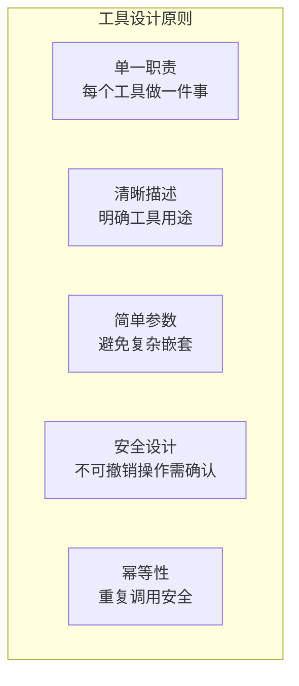

### 描述编写技巧

**不好的描述：**
```json
{
  "name": "tool1",
  "description": "处理数据",
  "input_schema": { ... }
}
```

**好的描述：**
```json
{
  "name": "search_academic_papers",
  "description": "在 arXiv 上搜索学术论文，返回标题、摘要和链接",
  "input_schema": {
    "type": "object",
    "properties": {
      "query": {
        "type": "string",
        "description": "搜索关键词，可以是研究主题、作者名或论文标题"
      },
      "category": {
        "type": "string",
        "enum": ["cs.AI", "cs.LG", "physics"],
        "description": "论文分类，默认为 cs.AI"
      },
      "max_results": {
        "type": "integer",
        "description": "返回结果数量，最多 10 篇",
        "default": 5
      }
    },
    "required": ["query"]
  }
}
```

---

## 5.8 DeerFlow 工具系统

### DeerFlow 内置工具

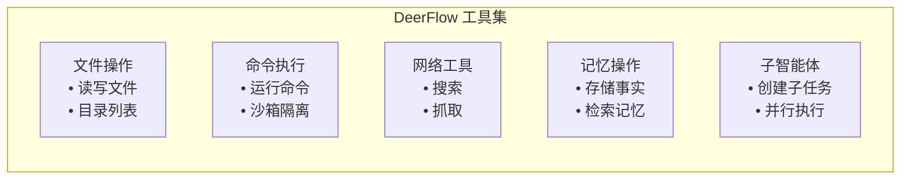

### 工具执行流程

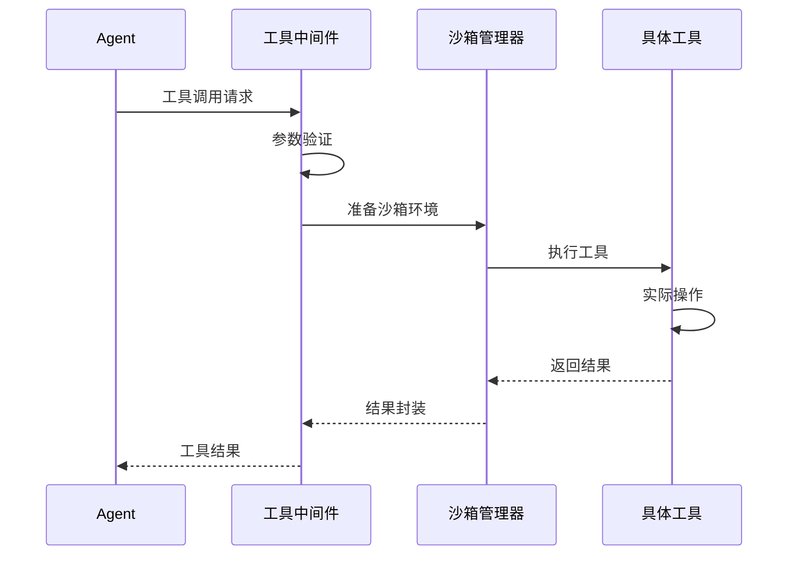

---

## 5.9 DeerFlow 项目代码导读

### DeerFlow 工具系统架构

DeerFlow 拥有多层次的工具生态系统，包括内置工具、配置定义工具、MCP 工具、社区工具和子 Agent 工具。

### 工具加载器

**文件**: `backend/src/tools/__init__.py`

```python
def get_available_tools(
    groups: list[str] | None = None,
    include_mcp: bool = True,
    model_name: str | None = None,
    subagent_enabled: bool = False,
) -> list[BaseTool]:
    """
    组合所有可用工具
    """
    tools = []

    # 1. 配置定义的工具 (config.yaml)
    tools += get_config_tools(groups)

    # 2. MCP 工具 (extensions_config.json)
    if include_mcp:
        tools += get_cached_mcp_tools()

    # 3. 内置工具
    tools += get_builtin_tools(model_name)

    # 4. 子 Agent 工具 (可选)
    if subagent_enabled:
        tools += [task_tool]

    return tools
```

### 沙箱工具系统

**文件**: `backend/src/sandbox/tools.py`

```python
@tool
def bash(
    command: Annotated[str, "The shell command to execute"],
    timeout: Annotated[int | None, "Timeout in seconds"] = 120,
) -> Annotated[str, "Command output"]:
    """
    Execute a shell command in the sandbox environment.
    Uses virtual path translation: /mnt/user-data/ -> thread-specific directories
    """
    sandbox = get_sandbox()
    translated = replace_virtual_paths_in_command(command)
    return sandbox.execute_command(translated, timeout)

@tool
def ls(
    path: Annotated[str, "Directory path"] = "/mnt/user-data/workspace",
) -> Annotated[str, "Directory listing"]:
    """List directory contents in tree format (max 2 levels)."""
    sandbox = get_sandbox()
    translated = replace_virtual_path(path)
    return sandbox.list_dir(translated)

@tool
def read_file(
    path: Annotated[str, "File path"],
    offset: Annotated[int | None, "Start line number"] = None,
    limit: Annotated[int | None, "Number of lines to read"] = None,
) -> Annotated[str, "File content"]:
    """Read a file from the sandbox."""
    sandbox = get_sandbox()
    translated = replace_virtual_path(path)
    return sandbox.read_file(translated, offset, limit)

@tool
def write_file(
    path: Annotated[str, "File path"],
    content: Annotated[str, "Content to write"],
    append: Annotated[bool, "Append to file"] = False,
) -> Annotated[str, "Result"]:
    """Write or append to a file. Creates directories if needed."""
    sandbox = get_sandbox()
    translated = replace_virtual_path(path)
    sandbox.write_file(translated, content, append)
    return f"Written to {path}"

@tool
def str_replace(
    path: Annotated[str, "File path"],
    old_str: Annotated[str, "Text to replace"],
    new_str: Annotated[str, "Replacement text"],
    replace_all: Annotated[bool, "Replace all occurrences"] = False,
) -> Annotated[str, "Result"]:
    """Replace text in a file. Use replace_all=true for global replace."""
    sandbox = get_sandbox()
    translated = replace_virtual_path(path)
    # 读取、替换、写入
    content = sandbox.read_file(translated)
    if replace_all:
        new_content = content.replace(old_str, new_str)
    else:
        new_content = content.replace(old_str, new_str, 1)
    sandbox.write_file(translated, new_content)
    return "Replaced successfully"
```

### 虚拟路径系统

**文件**: `backend/src/sandbox/local.py`

```python
def replace_virtual_path(virtual_path: str, thread_data: dict) -> Path:
    """
    虚拟路径到物理路径的映射
    /mnt/user-data/workspace -> backend/.deer-flow/threads/{id}/user-data/workspace
    /mnt/user-data/uploads   -> backend/.deer-flow/threads/{id}/user-data/uploads
    /mnt/user-data/outputs   -> backend/.deer-flow/threads/{id}/user-data/outputs
    /mnt/skills             -> deer-flow/skills/
    """
    if virtual_path.startswith("/mnt/user-data/"):
        suffix = virtual_path[len("/mnt/user-data/") :]
        return Path(thread_data["base_dir"]) / suffix
    elif virtual_path.startswith("/mnt/skills"):
        suffix = virtual_path[len("/mnt/skills") :]
        return Path(get_skills_dir()) / suffix
    return Path(virtual_path)

def replace_virtual_paths_in_command(command: str, thread_data: dict) -> str:
    """
    替换命令中的所有虚拟路径
    """
    # 正则替换 /mnt/... 路径
    result = command
    for match in VIRTUAL_PATH_PATTERN.finditer(command):
        virtual = match.group(0)
        physical = replace_virtual_path(virtual, thread_data)
        result = result.replace(virtual, str(physical))
    return result
```

### 内置工具

**文件**: `backend/src/tools/builtins/`

```python
# present_files.py
@tool
def present_files(
    files: Annotated[list[str], "List of file paths to present"],
) -> Annotated[str, "Result"]:
    """
    Make files visible to the user in the UI.
    Only files in /mnt/user-data/outputs can be presented.
    """
    pass

# ask_clarification.py
@tool
def ask_clarification(
    question: Annotated[str, "Clarification question to ask the user"],
) -> Annotated[str, "Result"]:
    """
    Ask the user for clarification when the request is ambiguous.
    Intercepted by ClarificationMiddleware to interrupt execution.
    """
    pass

# view_image.py
@tool
def view_image(
    path: Annotated[str, "Path to the image file"],
) -> Annotated[str, "Result"]:
    """
    Read an image and inject it into the conversation.
    Only added if model has supports_vision=true.
    """
    pass
```

### MCP 工具系统

**文件**: `backend/src/mcp/manager.py`

```python
def get_cached_mcp_tools() -> list[BaseTool]:
    """
    懒加载 MCP 工具，带缓存和 mtime 失效
    """
    global _mcp_tools_cache
    global _mcp_tools_mtime

    config_path = get_extensions_config_path()
    current_mtime = config_path.stat().st_mtime if config_path.exists() else 0

    # 检查是否需要重新加载
    if _mcp_tools_cache is None or current_mtime != _mcp_tools_mtime:
        _mcp_tools_cache = _load_mcp_tools()
        _mcp_tools_mtime = current_mtime

    return _mcp_tools_cache

def _load_mcp_tools() -> list[BaseTool]:
    """
    使用 langchain-mcp-adapters 加载 MCP 工具
    支持 stdio, SSE, HTTP 传输
    """
    config = load_extensions_config()
    tools = []

    for server_name, server_config in config.get("mcpServers", {}).items():
        if not server_config.get("enabled", True):
            continue

        # 根据类型创建客户端
        if server_config["type"] == "stdio":
            client = create_stdio_client(server_config)
        elif server_config["type"] == "sse":
            client = create_sse_client(server_config)
        elif server_config["type"] == "http":
            client = create_http_client(server_config)

        # 获取工具
        server_tools = client.get_tools()
        tools.extend(server_tools)

    return tools
```

### MCP 配置

**文件**: `extensions_config.json`

```json
{
  "mcpServers": {
    "github": {
      "enabled": true,
      "type": "stdio",
      "command": "npx",
      "args": ["-y", "@modelcontextprotocol/server-github"],
      "env": {
        "GITHUB_TOKEN": "$GITHUB_TOKEN"
      }
    },
    "filesystem": {
      "enabled": true,
      "type": "stdio",
      "command": "npx",
      "args": ["-y", "@modelcontextprotocol/server-filesystem", "/path/to/workspace"]
    },
    "secure-http": {
      "enabled": true,
      "type": "http",
      "url": "https://api.example.com/mcp",
      "oauth": {
        "enabled": true,
        "token_url": "https://auth.example.com/oauth/token",
        "grant_type": "client_credentials",
        "client_id": "$MCP_OAUTH_CLIENT_ID",
        "client_secret": "$MCP_OAUTH_CLIENT_SECRET"
      }
    }
  },
  "skills": {
    "pdf-processing": {"enabled": true}
  }
}
```

### 社区工具

**文件**: `backend/src/community/`

```python
# tavily/__init__.py
@tool
def tavily_search(
    query: Annotated[str, "Search query"],
    num_results: Annotated[int, "Number of results"] = 5,
) -> Annotated[str, "Search results"]:
    """Web search using Tavily API."""
    pass

@tool
def tavily_extract(
    url: Annotated[str, "URL to extract"],
) -> Annotated[str, "Extracted content"]:
    """Extract web content (4KB limit)."""
    pass

# jina_ai/__init__.py
@tool
def jina_fetch(
    url: Annotated[str, "URL to fetch"],
) -> Annotated[str, "Readable content"]:
    """Fetch web content with readability extraction via Jina AI."""
    pass

# firecrawl/__init__.py
@tool
def firecrawl_scrape(
    url: Annotated[str, "URL to scrape"],
) -> Annotated[str, "Scraped content"]:
    """Scrape web content via Firecrawl API."""
    pass

# image_search/__init__.py
@tool
def duckduckgo_image_search(
    query: Annotated[str, "Search query"],
) -> Annotated[list[dict], "Image results"]:
    """Image search via DuckDuckGo."""
    pass
```

### 子 Agent 工具

**文件**: `backend/src/subagents/tools.py`

```python
@tool
def task(
    description: Annotated[str, "Task description"],
    prompt: Annotated[str, "Detailed prompt for the subagent"],
    subagent_type: Annotated[
        Literal["general-purpose", "bash"],
        "Type of subagent to use",
    ] = "general-purpose",
    max_turns: Annotated[
        int,
        "Maximum number of turns for the subagent",
    ] = 10,
) -> Annotated[str, "Subagent execution result"]:
    """
    Delegate a task to a subagent.

    Args:
        description: Brief description of what the task should accomplish
        prompt: Detailed instructions for the subagent
        subagent_type: "general-purpose" (full tools) or "bash" (command specialist)
        max_turns: Maximum conversation turns before timeout

    Returns:
        The subagent's final output
    """
    executor = SubagentExecutor.get_instance()
    return executor.execute(
        subagent_type=subagent_type,
        description=description,
        prompt=prompt,
        max_turns=max_turns,
    )
```

### 工具配置

**文件**: `config.yaml`

```yaml
tools:
  - name: tavily_search
    use: src.community.tavily:tavily_search
    group: web

  - name: tavily_extract
    use: src.community.tavily:tavily_extract
    group: web

tool_groups:
  - name: default
    tools: ["sandbox", "web", "builtin"]
  - name: sandbox
    tools: ["bash", "ls", "read_file", "write_file", "str_replace"]
  - name: web
    tools: ["tavily_search", "tavily_extract"]
```

### 反射系统：动态加载

**文件**: `backend/src/reflection/__init__.py`

```python
def resolve_variable(path: str):
    """
    从模块路径导入变量
    例如: "src.community.tavily:tavily_search"
    """
    module_path, var_name = path.split(":", 1)
    module = importlib.import_module(module_path)
    return getattr(module, var_name)

def resolve_class(path: str, base_class: type):
    """
    导入类并验证基类
    """
    cls = resolve_variable(path)
    if not issubclass(cls, base_class):
        raise TypeError(f"{path} is not a subclass of {base_class}")
    return cls
```

### 关键代码文件索引

| 模块 | 文件路径 | 说明 |
|------|----------|------|
| **工具加载器** | `src/tools/__init__.py` | `get_available_tools()` |
| **沙箱工具** | `src/sandbox/tools.py` | bash, ls, read/write/str_replace |
| **内置工具** | `src/tools/builtins/` | present_files, ask_clarification, view_image |
| **MCP 管理** | `src/mcp/manager.py` | `get_cached_mcp_tools()` |
| **子 Agent 工具** | `src/subagents/tools.py` | `task()` |
| **社区工具** | `src/community/` | tavily, jina_ai, firecrawl, image_search |
| **反射系统** | `src/reflection/__init__.py` | `resolve_variable()` |
| **虚拟路径** | `src/sandbox/local.py` | `replace_virtual_path()` |

---

## 5.10 小结

**本节课要点：**

1. ✅ 工具使用让 Agent 能够与外部世界交互
2. ✅ Anthropic Tool Use 和 OpenAI Function Calling 提供标准接口
3. ✅ 并行工具调用可以提升效率
4. ✅ 需要完善的错误处理和重试机制
5. ✅ 工具设计要遵循单一职责、清晰描述等原则

**下节课预告：**
我们将学习规划与任务分解的策略。

---

## 参考资料

- [Anthropic Tool Use Documentation](https://docs.anthropic.com/en/docs/build-with-claude/tool-use)
- [OpenAI Function Calling Guide](https://platform.openai.com/docs/guides/function-calling)
- [How to Think About Tool Use](https://www.anthropic.com/index/tool-use)
