# 第6课：规划与任务分解

## 6.1 任务分解策略

### 什么是任务分解？

任务分解是将复杂任务拆分成可管理的子任务的过程。

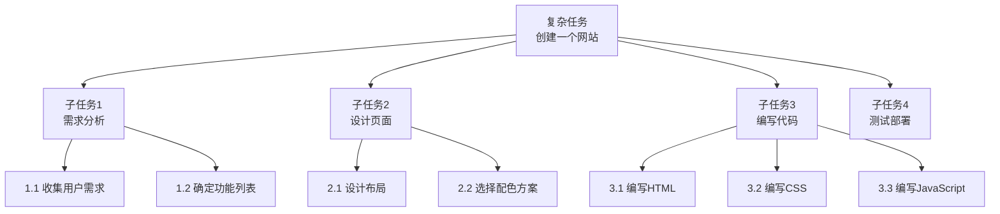

### 自上而下 vs 自下而上

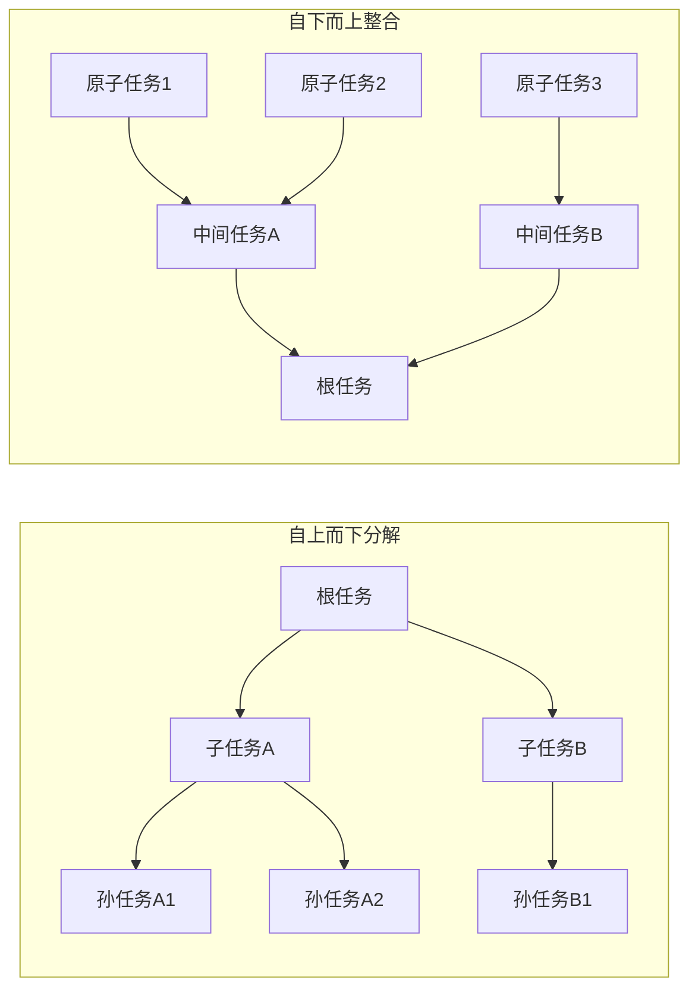

| 策略 | 优点 | 缺点 | 适用场景 |
|------|------|------|---------|
| **自上而下** | 整体观强、层次清晰 | 可能低估细节 | 目标明确的任务 |
| **自下而上** | 细节完整、可复用 | 缺乏整体视野 | 探索性任务 |
| **混合** | 平衡两者 | 复杂度增加 | 大多数实际任务 |

### 递归分解模式

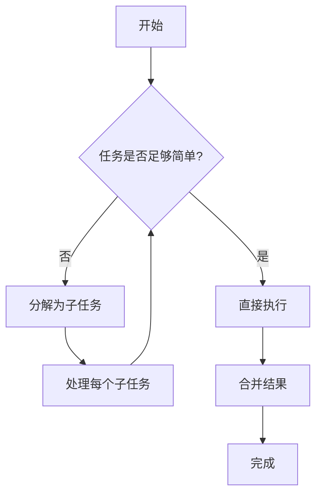

---

## 6.2 规划范式

### 预规划 vs 反应式规划

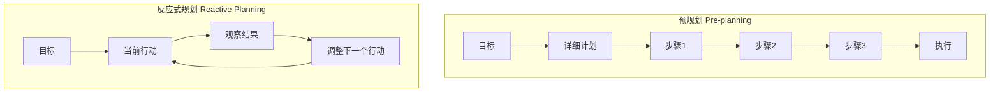

| 特性 | 预规划 | 反应式规划 |
|------|--------|-----------|
| **效率** | 高效，避免重复决策 | 可能重复思考 |
| **适应性** | 差，难以应对意外 | 强，灵活调整 |
| **认知负荷** | 前期高，后期低 | 持续高 |
| **适用场景** | 稳定环境、可预测 | 动态环境、不确定 |

### 混合规划策略

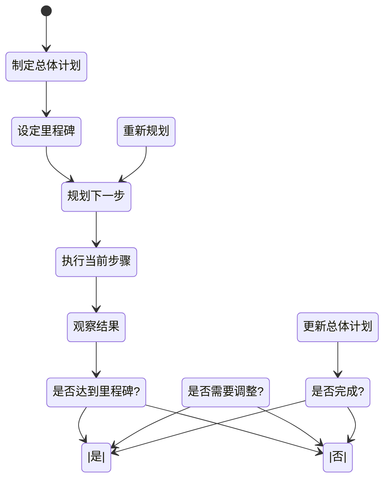

---

## 6.3 里程碑设定与进度追踪

### 里程碑设计

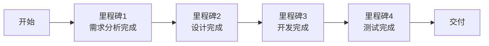

### 好的里程碑特征

| 特征 | 说明 | 示例 |
|------|------|------|
| **具体** | 明确、可验证 | "首页设计稿完成" vs "设计进行中" |
| **可衡量** | 有明确的完成标准 | "所有单元测试通过" |
| **时间绑定** | 有预期时间 | "本周五前完成" |
| **重要** | 标志着关键进展 | "核心功能上线" |

### 进度追踪看板

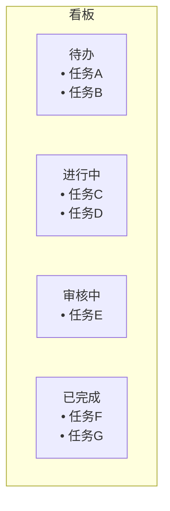

---

## 6.4 计划调整与回退机制

### 触发调整的信号

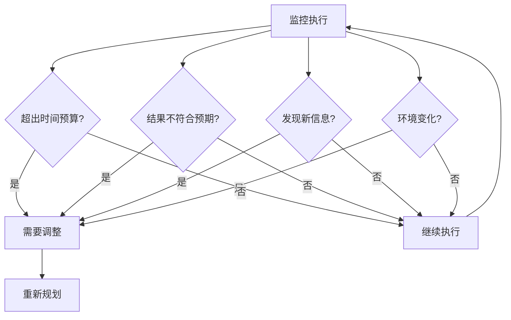

### 回退策略

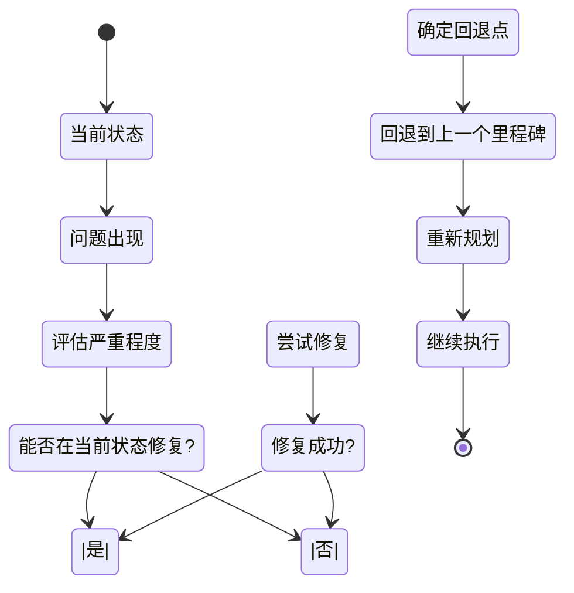

---

## 6.5 执行检查与自我验证

### 结果质量评估维度

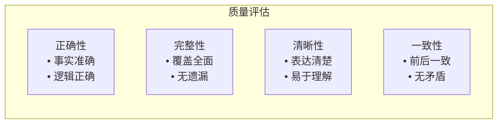

### 自我验证清单

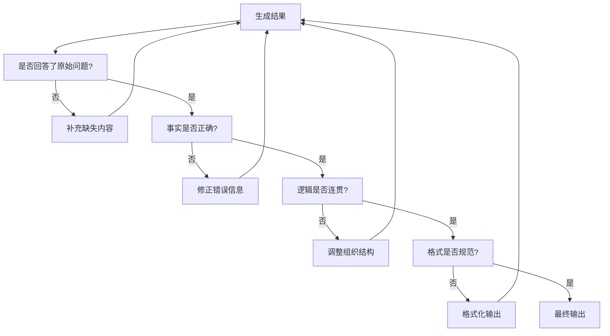

---

## 6.6 DeerFlow 中的规划实现

### DeerFlow 任务追踪

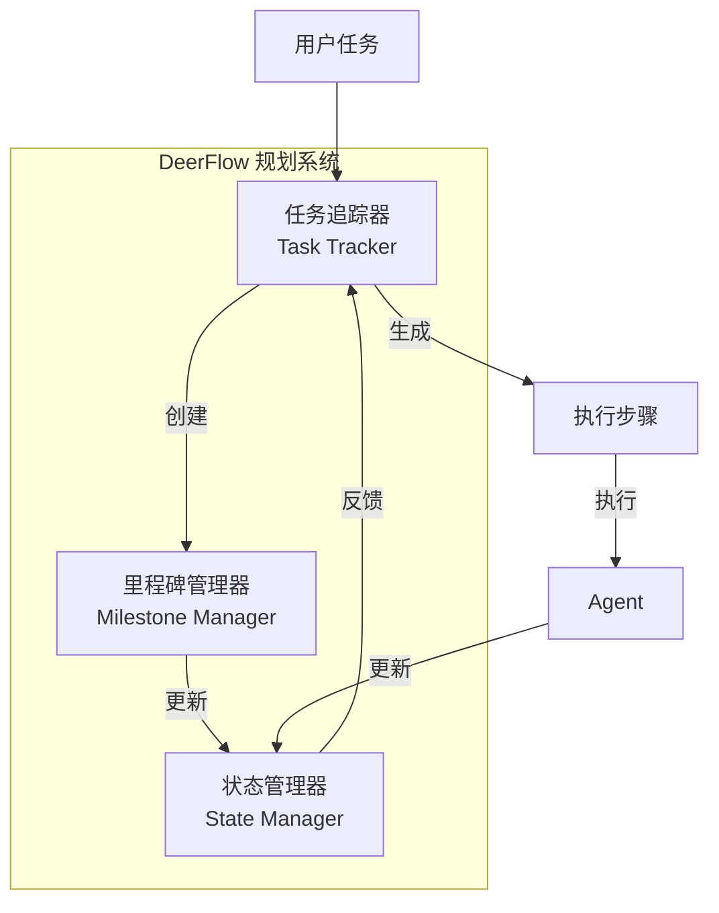

### 规划中间件流程

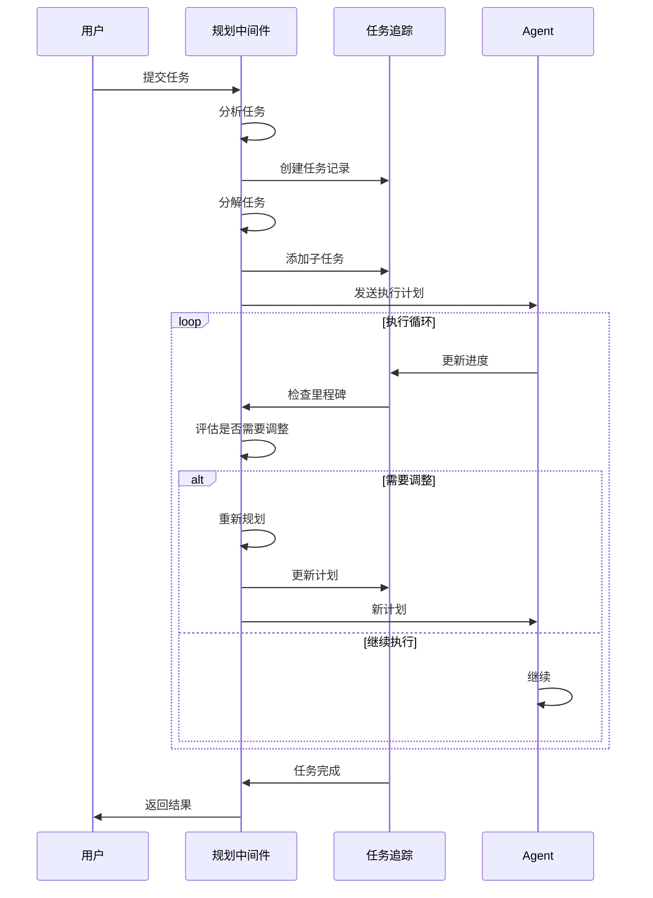

---

## 6.7 DeerFlow 项目代码导读

### DeerFlow 规划系统架构

DeerFlow 通过 TodoListMiddleware、中间件链和子 Agent 系统实现了灵活的任务规划与分解。

### TodoListMiddleware：计划模式

**文件**: `backend/src/agents/middlewares/todo_list.py`

```python
class TodoListMiddleware(AgentMiddleware):
    """
    任务追踪中间件，启用计划模式时提供 write_todos 工具
    """

    def __init__(self, is_plan_mode: bool):
        self.is_plan_mode = is_plan_mode

    def before_model(self, state: ThreadState) -> ThreadState:
        """
        在 LLM 调用前：注入 write_todos 工具
        """
        if not self.is_plan_mode:
            return state

        # 添加 write_todos 工具到可用工具列表
        state["tools"] = state.get("tools", []) + [self._get_write_todos_tool()]
        return state

    def _get_write_todos_tool(self) -> BaseTool:
        """
        创建 write_todos 工具
        """
        @tool
        def write_todos(
            todos: Annotated[str, "JSON list of todo items"],
        ) -> Annotated[str, "Result"]:
            """
            Write/update the todo list for plan mode.

            Each todo item should have:
            - id: unique identifier
            - description: what to do
            - status: "pending", "in_progress", or "completed"
            """
            pass

        return write_todos
```

### ThreadState 中的任务追踪

**文件**: `backend/src/agents/thread_state.py`

```python
@define
class ThreadState(AgentState):
    """
    线程状态，包含任务追踪字段
    """
    # 核心状态
    messages: Annotated[list[BaseMessage], add_messages]

    # 扩展字段
    sandbox: dict | None = None
    artifacts: Annotated[list[str] | None, merge_artifacts] = None
    thread_data: dict | None = None
    title: str | None = None
    todos: list[dict] | None = None  # 任务列表
    uploaded_files: list[dict] | None = None
    viewed_images: dict | None = None
```

### 子 Agent 系统：任务分解与并行执行

**文件**: `backend/src/subagents/executor.py`

```python
class SubagentExecutor:
    """
    子 Agent 执行器：支持任务分解和并行执行
    """

    MAX_CONCURRENT_SUBAGENTS = 3
    SUBAGENT_TIMEOUT = 900  # 15 minutes

    def __init__(self):
        # 双线程池：调度池 + 执行池
        self._scheduler_pool = ThreadPoolExecutor(max_workers=3)
        self._execution_pool = ThreadPoolExecutor(max_workers=3)
        self._running_tasks: dict[str, SubagentTask] = {}

    def execute(
        self,
        subagent_type: str,
        description: str,
        prompt: str,
        max_turns: int = 10,
    ) -> SubagentResult:
        """
        同步执行子 Agent
        """
        subagent = get_subagent(subagent_type)
        return subagent.run(description, prompt, max_turns)

    def execute_async(
        self,
        task_id: str,
        subagent_type: str,
        description: str,
        prompt: str,
        max_turns: int = 10,
    ):
        """
        异步执行子 Agent（后台线程）
        """
        task = SubagentTask(
            task_id=task_id,
            status="starting",
            subagent_type=subagent_type,
            description=description,
        )
        self._running_tasks[task_id] = task

        # 提交到线程池
        future = self._execution_pool.submit(
            self._execute_task,
            task_id,
            subagent_type,
            description,
            prompt,
            max_turns,
        )
        future.add_done_callback(
            lambda f: self._on_task_complete(task_id, f)
        )
```

### SubagentLimitMiddleware：控制并行度

**文件**: `backend/src/agents/middlewares/subagent_limit.py`

```python
class SubagentLimitMiddleware(AgentMiddleware):
    """
    限制并发子 Agent 数量，最多 MAX_CONCURRENT_SUBAGENTS 个
    """

    def after_model(self, state: ThreadState) -> ThreadState:
        """
        在模型调用后：截断多余的 task 工具调用
        """
        if not state.get("config", {}).get("configurable", {}).get("subagent_enabled"):
            return state

        messages = state["messages"]
        if not messages:
            return state

        last_message = messages[-1]
        if not hasattr(last_message, "tool_calls"):
            return state

        # 筛选 task 工具调用
        task_calls = []
        other_calls = []
        for call in last_message.tool_calls:
            if call["name"] == "task":
                task_calls.append(call)
            else:
                other_calls.append(call)

        # 截断超过限制的调用
        if len(task_calls) > MAX_CONCURRENT_SUBAGENTS:
            truncated = task_calls[:MAX_CONCURRENT_SUBAGENTS]
            last_message.tool_calls = other_calls + truncated

        return state
```

### 内置子 Agent

**文件**: `backend/src/subagents/builtins/`

```python
# general-purpose.py
def create_general_purpose_agent() -> Subagent:
    """
    通用子 Agent：拥有完整工具集（除了 task）
    """
    tools = get_available_tools(
        include_mcp=True,
        subagent_enabled=False,  # 子 Agent 不能再创建子 Agent
    )
    return Subagent(
        name="general-purpose",
        tools=tools,
        system_prompt="你是一个能干的助手，可以使用各种工具完成任务。",
    )

# bash.py
def create_bash_agent() -> Subagent:
    """
    Bash 专家子 Agent：专注于命令执行
    """
    tools = [bash_tool, ls_tool, read_file_tool, write_file_tool, str_replace_tool]
    return Subagent(
        name="bash",
        tools=tools,
        system_prompt="你是一个命令行专家，专注于执行 shell 命令和文件操作。",
    )
```

### 子 Agent 注册表

**文件**: `backend/src/subagents/registry.py`

```python
_subagents: dict[str, SubagentFactory] = {}

def register_subagent(name: str, factory: SubagentFactory):
    """注册子 Agent 工厂"""
    _subagents[name] = factory

def get_subagent(name: str) -> Subagent:
    """获取子 Agent 实例"""
    if name not in _subagents:
        raise ValueError(f"Unknown subagent type: {name}")
    return _subagents[name]()

def list_subagents() -> list[str]:
    """列出所有可用子 Agent"""
    return list(_subagents.keys())

# 注册内置子 Agent
register_subagent("general-purpose", create_general_purpose_agent)
register_subagent("bash", create_bash_agent)
```

### 中间件链：任务规划的完整流程

**文件**: `backend/src/agents/lead_agent/agent.py`

```python
def make_lead_agent(config: RunnableConfig) -> StateGraph:
    """
    创建 Lead Agent，中间件链按顺序执行
    """
    configurable = config.get("configurable", {})

    # 1. ThreadDataMiddleware: 创建线程目录
    # 2. UploadsMiddleware: 注入上传文件
    # 3. SandboxMiddleware: 获取沙箱
    # 4. DanglingToolCallMiddleware: 处理悬空调用
    # 5. SummarizationMiddleware: 上下文摘要
    # 6. TodoListMiddleware: 任务追踪
    # 7. TitleMiddleware: 自动标题
    # 8. MemoryMiddleware: 记忆系统
    # 9. ViewImageMiddleware: 图像处理
    # 10. SubagentLimitMiddleware: 子 Agent 限制
    # 11. ClarificationMiddleware: 澄清拦截

    # 构建图
    graph = StateGraph(ThreadState)
    graph.add_node("agent", agent_node)
    graph.add_node("tools", tool_node)

    # 边
    graph.set_entry_point("agent")
    graph.add_conditional_edges(
        "agent",
        should_continue,
        {
            "continue": "tools",
            "end": END,
        },
    )
    graph.add_edge("tools", "agent")

    return graph.compile(checkpointer=checkpointer)
```

### 规划配置

**文件**: `config.yaml`

```yaml
# 子 Agent 系统
subagents:
  enabled: true

# 摘要配置 (用于管理长上下文)
summarization:
  enabled: true
  trigger:
    type: fraction
    value: 0.8
  keep_policy:
    recent_messages: 10
    summarize_older: true

# 标题生成
title:
  enabled: true
  max_words: 10
  max_chars: 60
```

### 运行时配置

**LangGraph 运行时配置**:
```python
config = {
    "configurable": {
        "thread_id": "thread-123",
        "model_name": "gpt-4o",
        "thinking_enabled": False,
        "is_plan_mode": True,  # 启用计划模式
        "subagent_enabled": True,
    }
}
```

### 关键代码文件索引

| 模块 | 文件路径 | 说明 |
|------|----------|------|
| **Todo 中间件** | `src/agents/middlewares/todo_list.py` | 任务追踪 |
| **子 Agent 执行器** | `src/subagents/executor.py` | 并行任务执行 |
| **子 Agent 限制** | `src/agents/middlewares/subagent_limit.py` | 并发控制 |
| **子 Agent 注册表** | `src/subagents/registry.py` | `register_subagent()`, `get_subagent()` |
| **内置子 Agent** | `src/subagents/builtins/` | general-purpose, bash |
| **线程状态** | `src/agents/thread_state.py` | `todos` 字段 |
| **Agent 工厂** | `src/agents/lead_agent/agent.py` | `make_lead_agent()` |

---

## 6.8 小结

**本节课要点：**

1. ✅ 任务分解可以采用自上而下、自下而上或混合策略
2. ✅ 预规划适合稳定环境，反应式规划适合动态环境
3. ✅ 里程碑帮助追踪进度，应具体、可衡量
4. ✅ 需要计划调整和回退机制应对意外
5. ✅ 执行检查和自我验证保证结果质量

**下节课预告：**
我们将学习多 Agent 协作基础。

---

## 参考资料

- [LLM Planning Survey](https://arxiv.org/abs/2402.05428)
- [Task Decomposition for Agents](https://blog.langchain.dev/task-decomposition/)
- [Planning in Generative Agents](https://arxiv.org/abs/2304.03442)
