# 第7课：多 Agent 协作基础

## 7.1 为什么需要多 Agent 系统？

### 单 Agent 的局限性

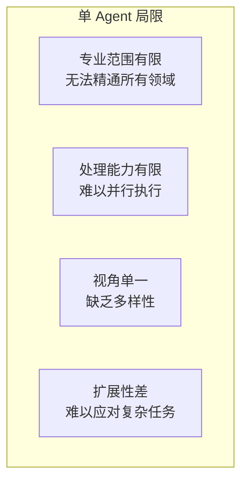

### 多 Agent 系统的优势

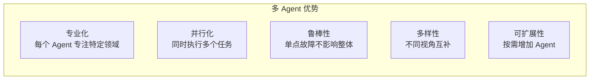

### 适用场景对比

| 场景 | 单 Agent | 多 Agent |
|------|---------|---------|
| 简单问答 | ✅ 适合 | ❌ 过度设计 |
| 单领域任务 | ✅ 适合 | ⚠️ 可但非必须 |
| 多步骤流程 | ⚠️ 可但复杂 | ✅ 自然分解 |
| 多专业协作 | ❌ 困难 | ✅ 完美适配 |
| 高并发任务 | ❌ 性能差 | ✅ 并行优势 |

---

## 7.2 多 Agent 通信机制

### 通信模式分类

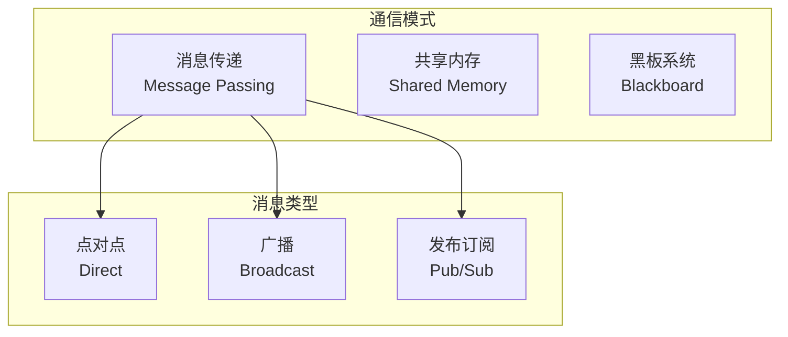

### 消息传递模式详解

#### 点对点通信 (Direct)

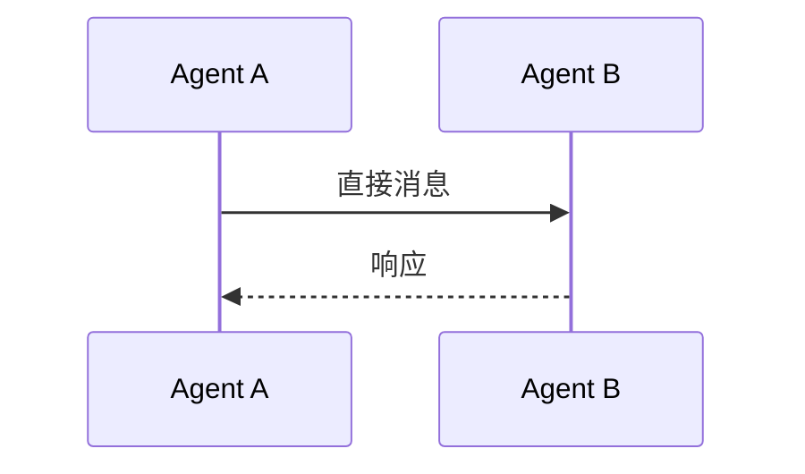

**特点：**
- 一对一通信
- 低延迟
- 需要知道接收者地址
- 适合协调工作

#### 广播通信 (Broadcast)

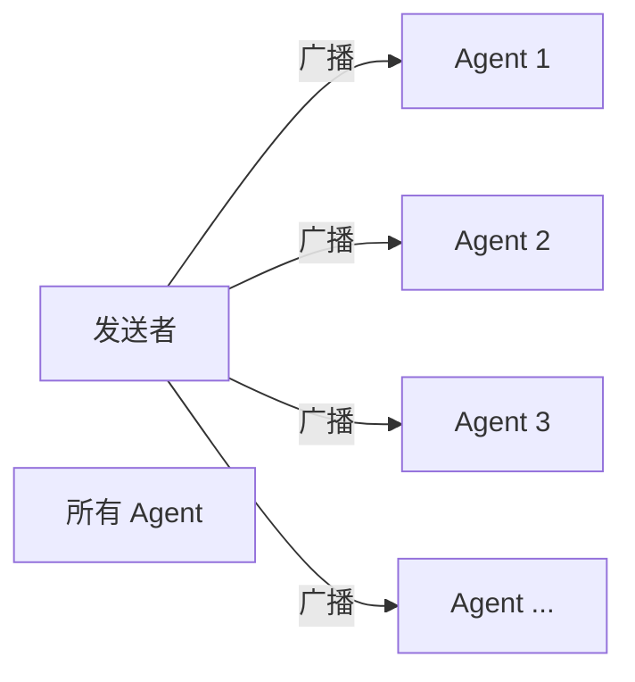

**特点：**
- 一对多通信
- 所有 Agent 都收到
- 网络负载高
- 适合全局通知

#### 发布订阅 (Pub/Sub)

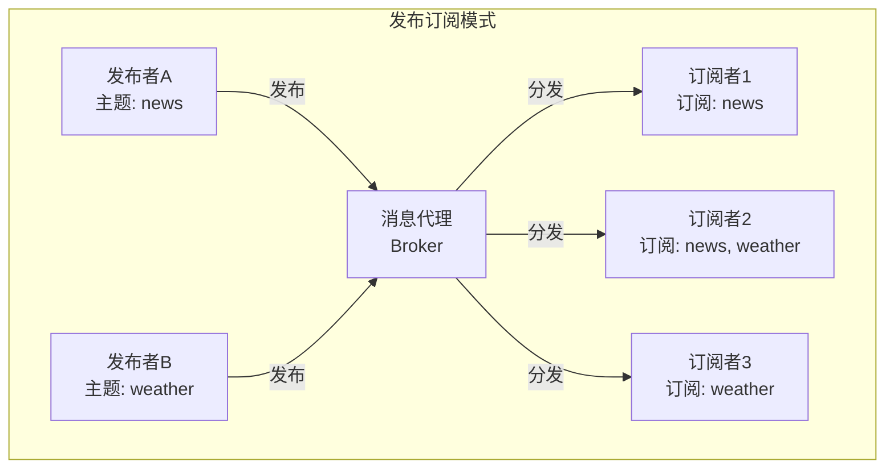

**特点：**
- 解耦发送者和接收者
- 按主题订阅
- 灵活扩展
- 需要消息代理

### 共享内存模式

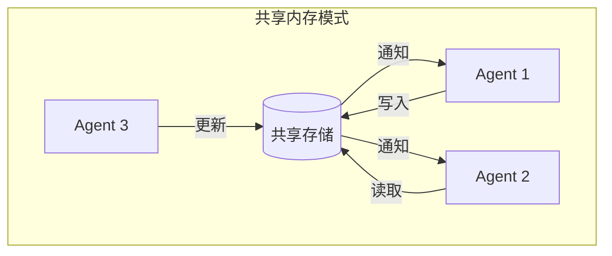

**特点：**
- 集中式存储
- Agent 通过读写共享数据协作
- 需要同步机制
- 简单直观

### 黑板系统

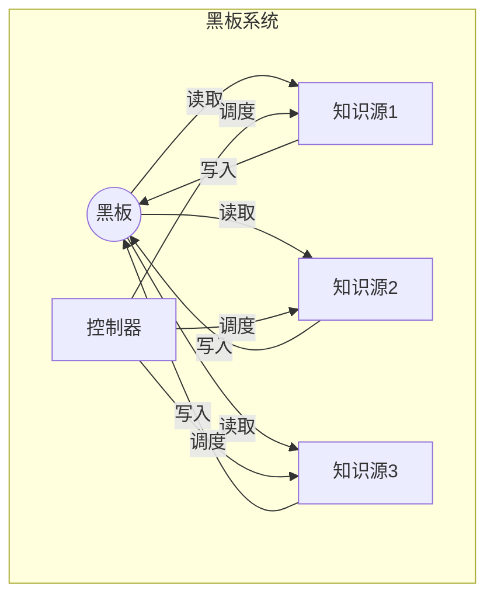

**特点：**
- 所有 Agent 读写同一个"黑板"
- 控制器协调访问
- 适合渐进式问题求解
- 经典 AI 问题求解模式

---

## 7.3 状态管理：共享 vs 私有

### 状态架构对比

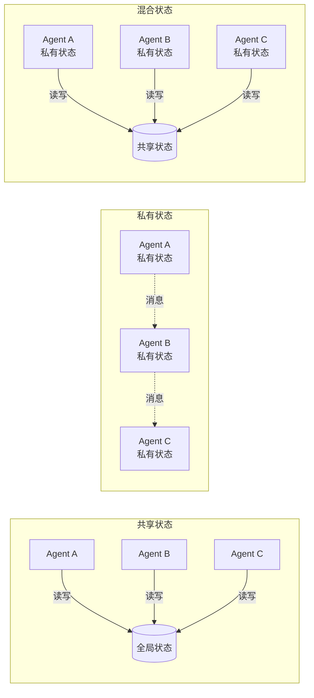

| 架构 | 优点 | 缺点 | 适用场景 |
|------|------|------|---------|
| **共享状态** | 简单直观、数据一致 | 并发冲突、可扩展性差 | 小规模、强一致 |
| **私有状态** | 完全解耦、高度可扩展 | 同步复杂、数据冗余 | 大规模、松耦合 |
| **混合状态** | 平衡灵活性和一致性 | 设计复杂 | 大多数实际场景 |

### 混合状态设计

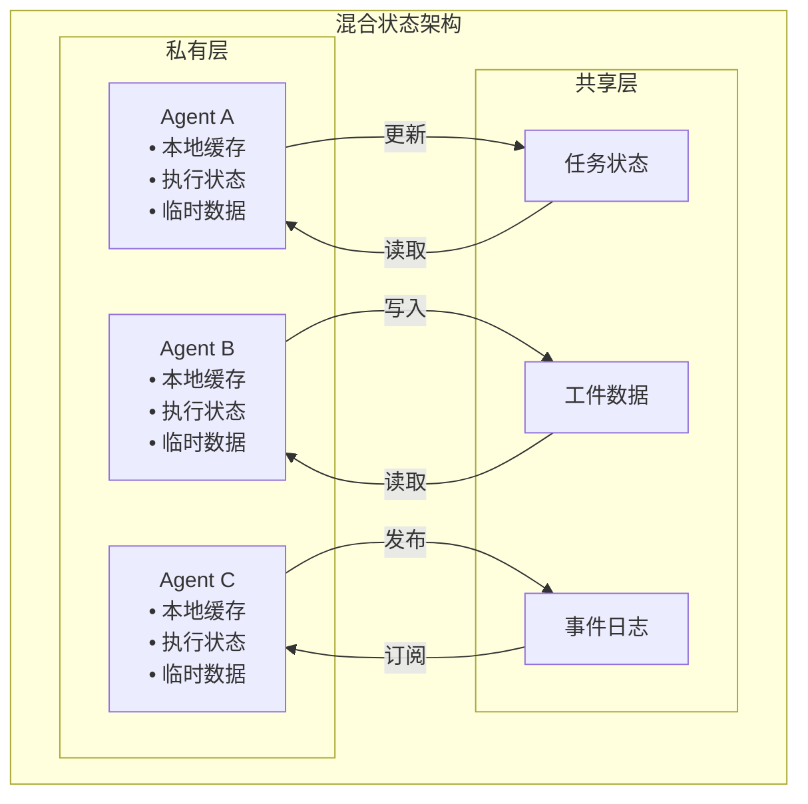

---

## 7.4 通信协议设计

### 消息结构设计

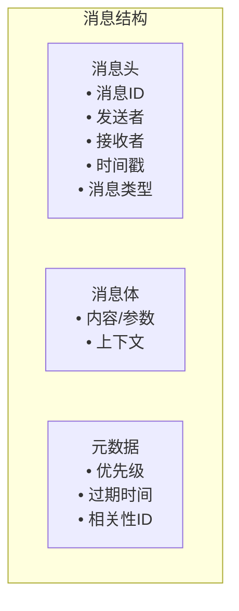

### 消息类型

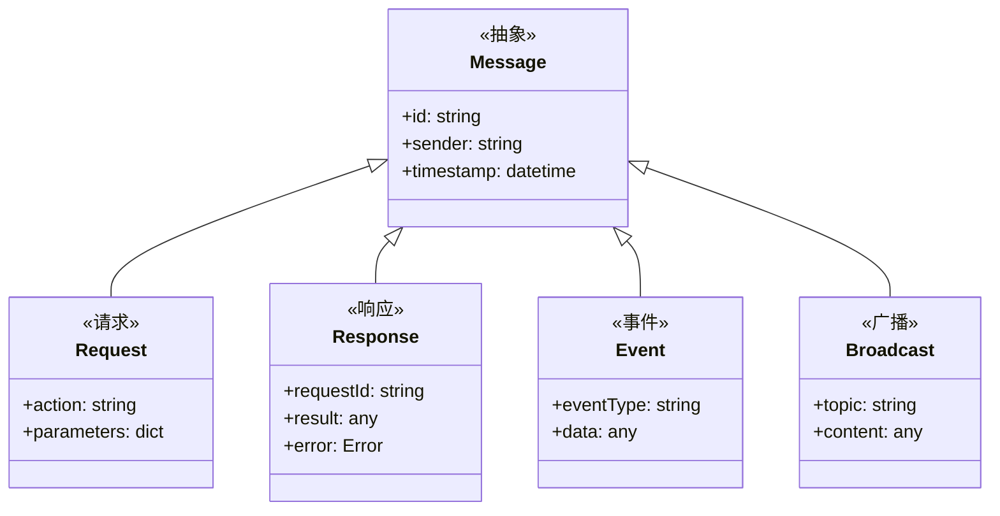

### 协议示例

```json
{
  "header": {
    "id": "msg_001",
    "sender": "planner_agent",
    "receiver": "code_agent",
    "timestamp": "2024-01-15T10:30:00Z",
    "type": "request"
  },
  "body": {
    "action": "write_code",
    "parameters": {
      "language": "python",
      "task": "实现一个快速排序函数",
      "requirements": ["类型注解", "单元测试"]
    }
  },
  "meta": {
    "priority": "high",
    "expires_at": "2024-01-15T11:00:00Z",
    "correlation_id": "task_123"
  }
}
```

---

## 7.5 角色分配策略

### 角色分类

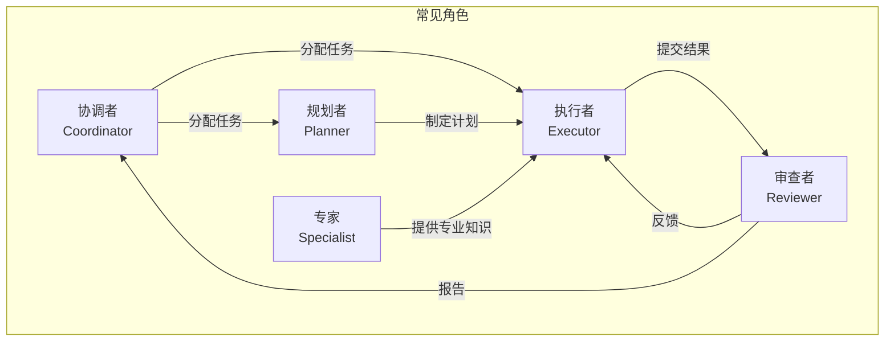

### 静态 vs 动态角色分配

| 特性 | 静态分配 | 动态分配 |
|------|---------|---------|
| **角色绑定** | 固定不变 | 根据需要变化 |
| **复杂度** | 低 | 高 |
| **适应性** | 差 | 强 |
| **适用场景** | 稳定工作流 | 动态环境 |

### 动态角色分配示例

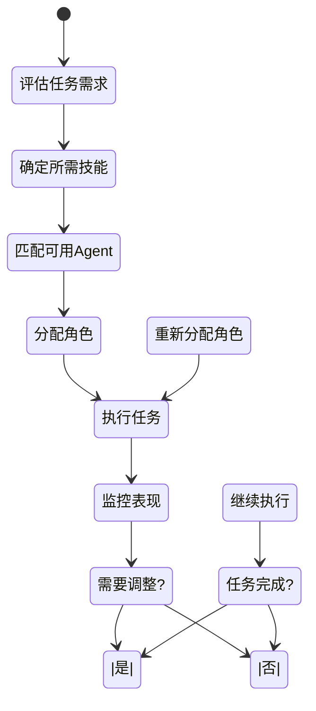

---

## 7.6 能力互补策略

### 能力图谱设计

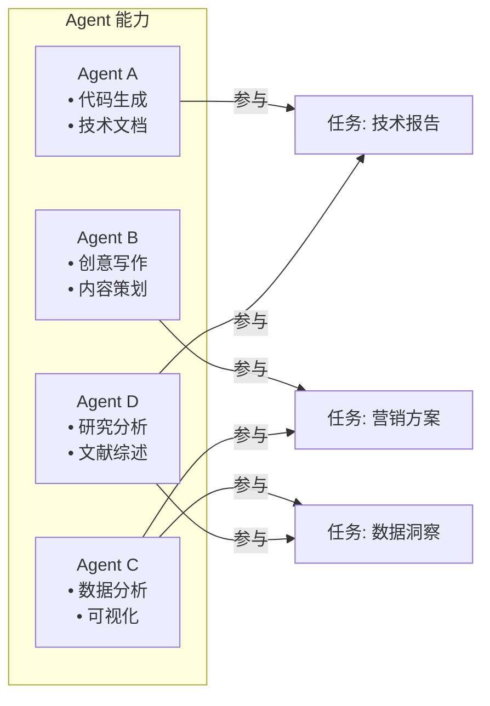

### 能力互补矩阵

| Agent | 代码 | 写作 | 分析 | 设计 | 研究 |
|-------|------|------|------|------|------|
| **Alice** | ⭐⭐⭐⭐⭐ | ⭐⭐ | ⭐⭐⭐ | ⭐ | ⭐⭐ |
| **Bob** | ⭐⭐ | ⭐⭐⭐⭐⭐ | ⭐⭐ | ⭐⭐⭐ | ⭐⭐⭐ |
| **Charlie** | ⭐ | ⭐⭐⭐ | ⭐⭐⭐⭐⭐ | ⭐⭐ | ⭐⭐⭐⭐ |
| **Diana** | ⭐⭐⭐ | ⭐⭐⭐ | ⭐⭐ | ⭐⭐ | ⭐⭐⭐⭐⭐ |

---

## 7.7 DeerFlow 项目代码导读

### DeerFlow 多 Agent 协作架构

DeerFlow 采用主从架构 + 共享状态的混合模式，实现了灵活的多 Agent 协作。

### 整体架构：主从 + 共享状态

```mermaid
graph TB
    subgraph DeerFlow_MultiAgent [DeerFlow 多 Agent 架构]
        Lead[Lead Agent
        State[共享状态
        SubPool[子 Agent 池
    end

    Lead -->|读写| State
    Lead -->|委托| SubPool
    SubPool -->|更新| State
```

### 共享状态：ThreadState

**文件**: `backend/src/agents/thread_state.py`

```python
from typing import TypedDict, Annotated, Sequence
from langchain_core.messages import BaseMessage
import operator
from langgraph.graph import add_messages

def merge_artifacts(old: list[str] | None, new: list[str]) -> list[str]:
    """合并工件列表，去重但保持顺序"""
    combined = (old or []) + new
    seen = set()
    result = []
    for item in combined:
        if item not in seen:
            seen.add(item)
            result.append(item)
    return result

def merge_viewed_images(
    old: dict | None,
    new: dict | None,
) -> dict | None:
    """
    合并 viewed_images:
    - new 为 None: 清除
    - 否则: 合并
    """
    if new is None:
        return None
    if old is None:
        return new
    return {**old, **new}

class ThreadState(TypedDict):
    """
    所有 Agent 共享的状态
    主 Agent 和子 Agent 通过这个状态进行通信
    """
    # 消息历史 (LangGraph 标准)
    messages: Annotated[Sequence[BaseMessage], add_messages]

    # DeerFlow 扩展状态
    sandbox: dict | None
    artifacts: Annotated[list[str] | None, merge_artifacts]
    thread_data: dict | None
    title: str | None
    todos: list[dict] | None
    uploaded_files: list[dict] | None
    viewed_images: Annotated[dict | None, merge_viewed_images]
```

### 子 Agent 执行器：任务分配

**文件**: `backend/src/subagents/executor.py`

```python
from concurrent.futures import ThreadPoolExecutor
from dataclasses import dataclass
from typing import Any
import threading
import time

@dataclass
class SubagentTask:
    """子 Agent 任务状态"""
    task_id: str
    status: str  # starting, running, completed, failed, timed_out
    subagent_type: str
    description: str
    result: Any | None = None
    error: str | None = None
    created_at: float = field(default_factory=time.time)
    started_at: float | None = None
    completed_at: float | None = None

class SubagentExecutor:
    """
    子 Agent 执行器：主从架构的任务分配器
    """

    MAX_CONCURRENT_SUBAGENTS = 3
    SUBAGENT_TIMEOUT = 900  # 15 minutes

    _instance: "SubagentExecutor" = None
    _lock: threading.Lock = threading.Lock()

    def __init__(self):
        # 双线程池：调度 + 执行
        self._scheduler_pool = ThreadPoolExecutor(max_workers=3)
        self._execution_pool = ThreadPoolExecutor(max_workers=3)
        self._running_tasks: dict[str, SubagentTask] = {}
        self._lock = threading.Lock()

    @classmethod
    def get_instance(cls) -> "SubagentExecutor":
        """单例模式"""
        with cls._lock:
            if cls._instance is None:
                cls._instance = cls()
            return cls._instance

    def execute(
        self,
        subagent_type: str,
        description: str,
        prompt: str,
        max_turns: int = 10,
    ) -> SubagentResult:
        """
        同步执行：主 Agent 等待子 Agent 完成
        """
        subagent = get_subagent(subagent_type)
        return subagent.run(description, prompt, max_turns)

    def execute_async(
        self,
        task_id: str,
        subagent_type: str,
        description: str,
        prompt: str,
        max_turns: int = 10,
    ):
        """
        异步执行：后台线程运行
        """
        with self._lock:
            task = SubagentTask(
                task_id=task_id,
                status="starting",
                subagent_type=subagent_type,
                description=description,
            )
            self._running_tasks[task_id] = task

        # 提交到执行池
        future = self._execution_pool.submit(
            self._execute_task,
            task_id,
            subagent_type,
            description,
            prompt,
            max_turns,
        )
        future.add_done_callback(lambda f: self._on_task_complete(task_id, f))

    def _execute_task(
        self,
        task_id: str,
        subagent_type: str,
        description: str,
        prompt: str,
        max_turns: int,
    ) -> SubagentResult:
        """
        实际执行子 Agent 任务
        """
        with self._lock:
            task = self._running_tasks.get(task_id)
            if task:
                task.status = "running"
                task.started_at = time.time()

        try:
            subagent = get_subagent(subagent_type)
            result = subagent.run(description, prompt, max_turns)

            with self._lock:
                task = self._running_tasks.get(task_id)
                if task:
                    task.status = "completed"
                    task.result = result
                    task.completed_at = time.time()

            return result
        except Exception as e:
            with self._lock:
                task = self._running_tasks.get(task_id)
                if task:
                    task.status = "failed"
                    task.error = str(e)
                    task.completed_at = time.time()
            raise
```

### 子 Agent 注册表

**文件**: `backend/src/subagents/registry.py`

```python
from typing import Callable
from .builtins import create_general_purpose_agent, create_bash_agent

SubagentFactory = Callable[[], Subagent]

_subagents: dict[str, SubagentFactory] = {}

def register_subagent(name: str, factory: SubagentFactory):
    """
    注册子 Agent 工厂函数
    """
    _subagents[name] = factory

def get_subagent(name: str) -> Subagent:
    """
    获取子 Agent 实例
    """
    if name not in _subagents:
        raise ValueError(f"Unknown subagent type: {name}")
    return _subagents[name]()

def list_subagents() -> list[str]:
    """
    列出所有可用子 Agent
    """
    return list(_subagents.keys())

# 注册内置子 Agent
register_subagent("general-purpose", create_general_purpose_agent)
register_subagent("bash", create_bash_agent)
```

### 内置子 Agent

**文件**: `backend/src/subagents/builtins/`

```python
# general-purpose.py
def create_general_purpose_agent() -> Subagent:
    """
    通用子 Agent：拥有完整工具集，但不能再创建子 Agent
    """
    from src.tools import get_available_tools

    tools = get_available_tools(
        include_mcp=True,
        subagent_enabled=False,  # 防止递归
    )

    return Subagent(
        name="general-purpose",
        tools=tools,
        system_prompt="""
你是一个能干的助手，可以使用各种工具完成任务。

请仔细思考任务，选择合适的工具，逐步执行。
""",
    )

# bash.py
def create_bash_agent() -> Subagent:
    """
    Bash 专家子 Agent：专注于命令执行和文件操作
    """
    from src.sandbox.tools import bash, ls, read_file, write_file, str_replace

    return Subagent(
        name="bash",
        tools=[bash, ls, read_file, write_file, str_replace],
        system_prompt="""
你是一个命令行专家，专注于执行 shell 命令和文件操作。

请使用高效的命令链完成任务，注意错误处理。
""",
    )
```

### 任务工具：主从通信接口

**文件**: `backend/src/subagents/tools.py`

```python
from langchain_core.tools import tool
from typing import Annotated, Literal
from .executor import SubagentExecutor

@tool
def task(
    description: Annotated[str, "Brief task description"],
    prompt: Annotated[str, "Detailed prompt for the subagent"],
    subagent_type: Annotated[
        Literal["general-purpose", "bash"],
        "Type of subagent to use",
    ] = "general-purpose",
    max_turns: Annotated[
        int,
        "Maximum conversation turns before timeout",
    ] = 10,
) -> Annotated[str, "Subagent execution result"]:
    """
    委托任务给子 Agent。

    主 Agent 通过这个工具与子 Agent 通信：
    - description: 简短描述
    - prompt: 详细指令
    - subagent_type: "general-purpose" 或 "bash"
    - max_turns: 最大对话轮数

    返回子 Agent 的最终输出。
    """
    executor = SubagentExecutor.get_instance()
    result = executor.execute(
        subagent_type=subagent_type,
        description=description,
        prompt=prompt,
        max_turns=max_turns,
    )
    return result.output
```

### SubagentLimitMiddleware：并发控制

**文件**: `backend/src/agents/middlewares/subagent_limit.py`

```python
class SubagentLimitMiddleware(AgentMiddleware):
    """
    限制并发子 Agent 数量为 MAX_CONCURRENT_SUBAGENTS
    """

    def after_model(self, state: ThreadState) -> ThreadState:
        configurable = state.get("config", {}).get("configurable", {})
        if not configurable.get("subagent_enabled"):
            return state

        messages = state["messages"]
        if not messages:
            return state

        last_message = messages[-1]
        if not hasattr(last_message, "tool_calls"):
            return state

        # 分离 task 调用和其他调用
        task_calls = []
        other_calls = []
        for call in last_message.tool_calls:
            if call["name"] == "task":
                task_calls.append(call)
            else:
                other_calls.append(call)

        # 截断超过限制的 task 调用
        if len(task_calls) > MAX_CONCURRENT_SUBAGENTS:
            truncated = task_calls[:MAX_CONCURRENT_SUBAGENTS]
            last_message.tool_calls = other_calls + truncated

        return state
```

### 配置系统

**文件**: `config.yaml`

```yaml
subagents:
  enabled: true
```

### 运行时配置

```python
config = {
    "configurable": {
        "thread_id": "...",
        "subagent_enabled": True,  # 启用子 Agent
        "is_plan_mode": False,
    }
}
```

### 关键代码文件索引

| 模块 | 文件路径 | 说明 |
|------|----------|------|
| **子 Agent 执行器** | `src/subagents/executor.py` | `SubagentExecutor` 类 |
| **子 Agent 注册表** | `src/subagents/registry.py` | `register_subagent()`, `get_subagent()` |
| **内置子 Agent** | `src/subagents/builtins/` | general-purpose, bash |
| **任务工具** | `src/subagents/tools.py` | `task()` 工具 |
| **子 Agent 限制** | `src/agents/middlewares/subagent_limit.py` | 并发控制 |
| **线程状态** | `src/agents/thread_state.py` | 共享状态定义 |

---

## 7.8 小结

**本节课要点：**

1. ✅ 多 Agent 系统提供专业化、并行化、鲁棒性等优势
2. ✅ 通信模式包括消息传递、共享内存、黑板系统
3. ✅ 状态管理可采用共享、私有或混合架构
4. ✅ 角色分配可以是静态的或动态的
5. ✅ 能力互补使团队可以完成单个 Agent 无法完成的任务

**下节课预告：**
我们将学习多 Agent 架构模式，包括 MetaGPT 和 LangGraph。

---

## 参考资料

- [Multi-Agent Systems: A Modern Approach](https://mitpress.mit.edu/books/multi-agent-systems)
- [A Survey on Multi-Agent Collaboration with LLMs](https://arxiv.org/abs/2401.05574)
- [LangGraph Multi-Agent Patterns](https://blog.langchain.dev/multi-agent-collaboration/)
