# 第8课：多 Agent 架构模式

## 8.1 MetaGPT：模拟软件公司

### 论文背景

**MetaGPT: Meta Programming for A Multi-Agent Collaborative Framework**
Hong et al., 2023 | [arXiv:2308.00352](https://arxiv.org/abs/2308.00352)

MetaGPT 将软件公司的工作流程建模为多 Agent 协作系统。

### MetaGPT 整体架构

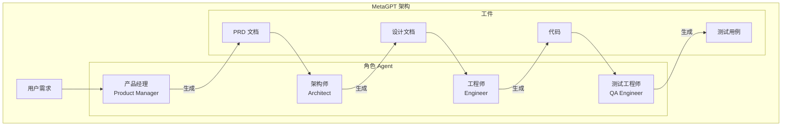

### SOP 标准化流程

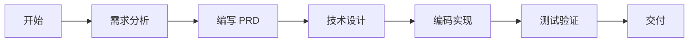

### 详细工作流

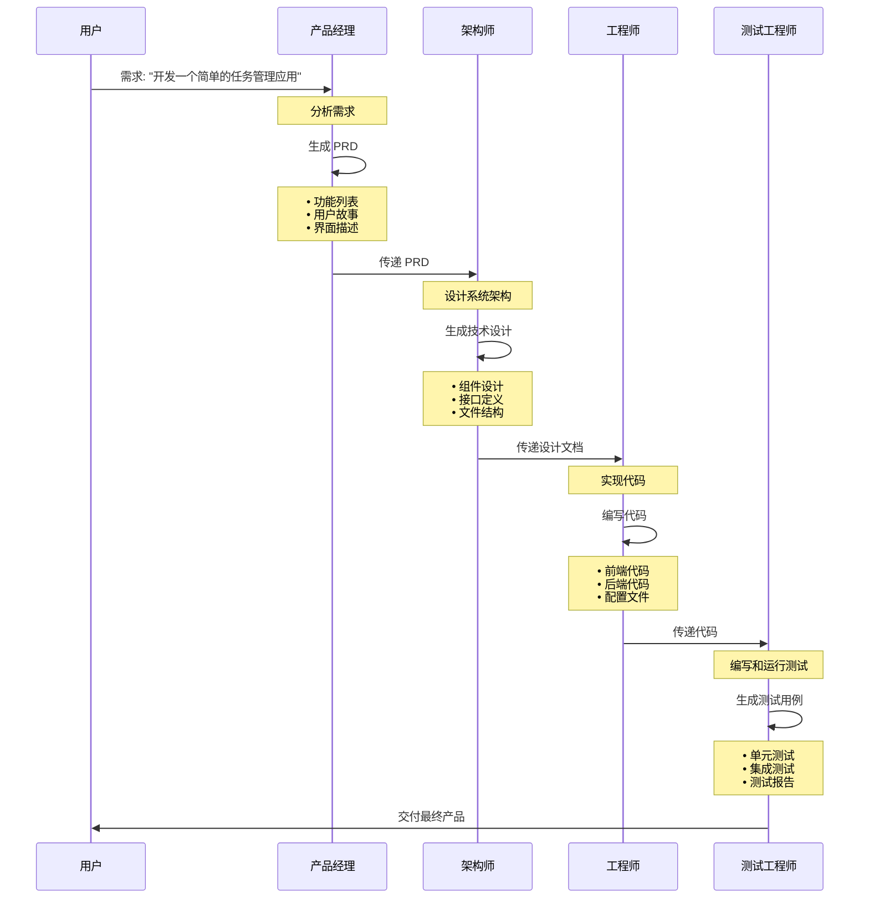

### 各角色职责

| 角色 | 主要职责 | 输出工件 |
|------|---------|---------|
| **产品经理** | 需求分析、用户研究 | PRD 文档、需求规格 |
| **架构师** | 系统设计、技术选型 | 架构设计、接口定义 |
| **工程师** | 代码实现、文档编写 | 源代码、构建脚本 |
| **测试工程师** | 测试计划、质量保证 | 测试用例、测试报告 |

---

## 8.2 LangGraph：状态机驱动的工作流

### LangGraph 核心概念

LangGraph 将 Agent 工作流建模为状态图，使用节点和边来表示计算步骤。

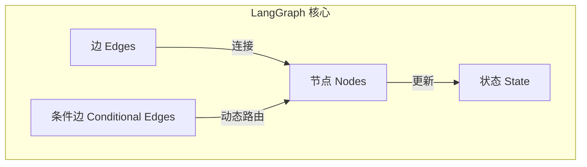

### 基本图结构

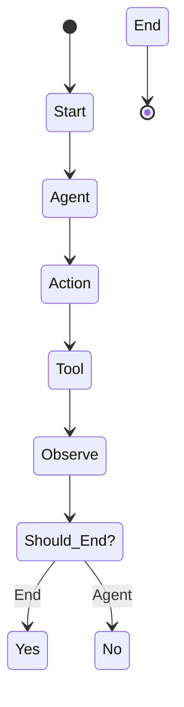

### 节点类型

| 节点类型 | 描述 | 用途 |
|---------|------|------|
| **Agent Node** | 执行推理决策 | 主思考节点 |
| **Tool Node** | 调用外部工具 | 工具执行 |
| **Condition Node** | 条件判断 | 分支逻辑 |
| **Merge Node** | 合并多个分支 | 聚合结果 |

### 条件边示例

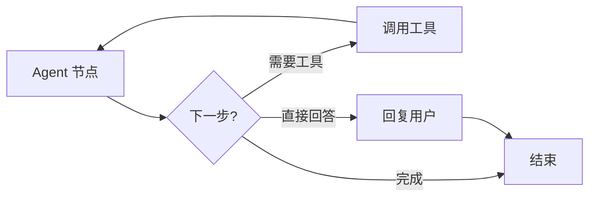

### 状态管理

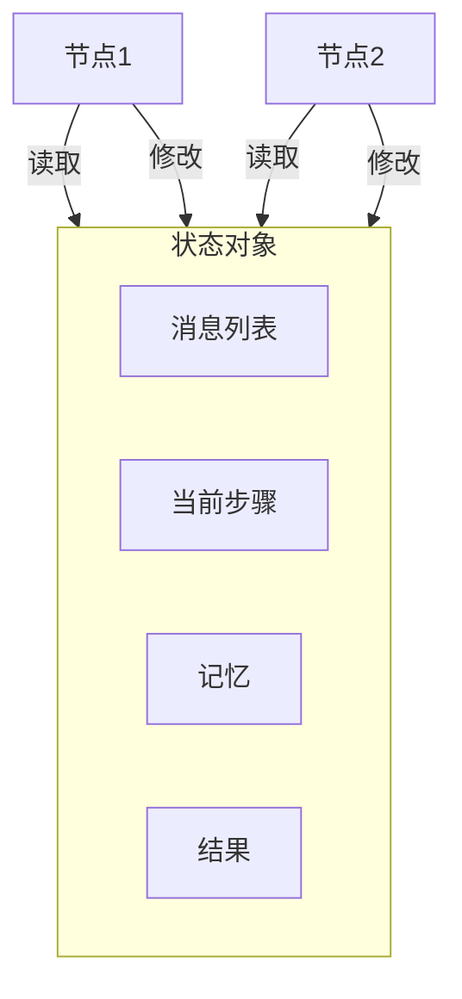

### 状态定义示例

```python
from typing import TypedDict, Annotated, Sequence
from langchain_core.messages import BaseMessage
import operator

class AgentState(TypedDict):
    messages: Annotated[Sequence[BaseMessage], operator.add]
    next_step: str
    intermediate_results: dict
    task_completed: bool
```

---

## 8.3 多 Agent 架构模式

### 1. 顺序流水线 (Sequential Pipeline)

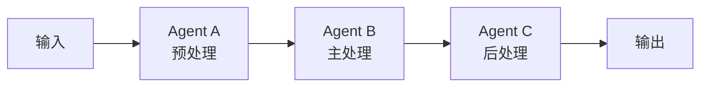

**特点：**
- 线性顺序执行
- 每个 Agent 负责一个阶段
- 简单直观
- 适合明确定义的工作流

---

### 2. 主从架构 (Master-Slave)

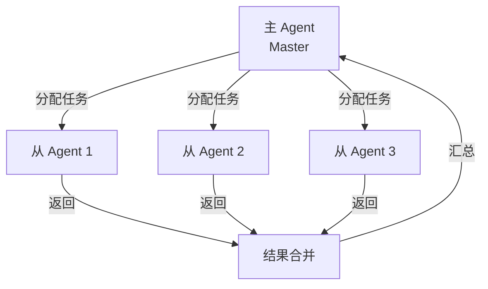

**特点：**
- 中央协调
- 并行执行
- 负载均衡
- 适合可并行的任务

---

### 3. 对等协作 (Peer-to-Peer)

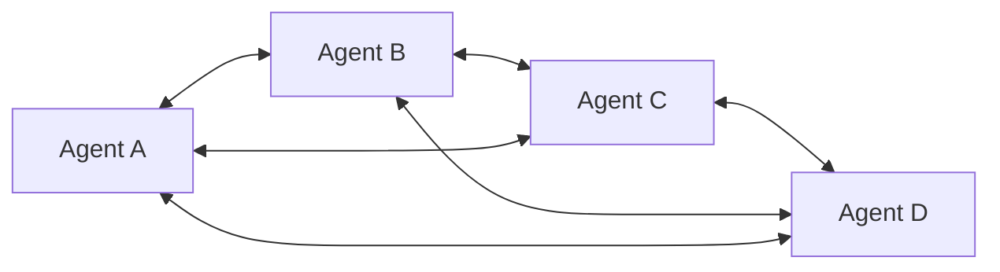

**特点：**
- 无中心节点
- 完全平等
- 灵活协调
- 复杂动态环境

---

### 4. 分层架构 (Hierarchical)

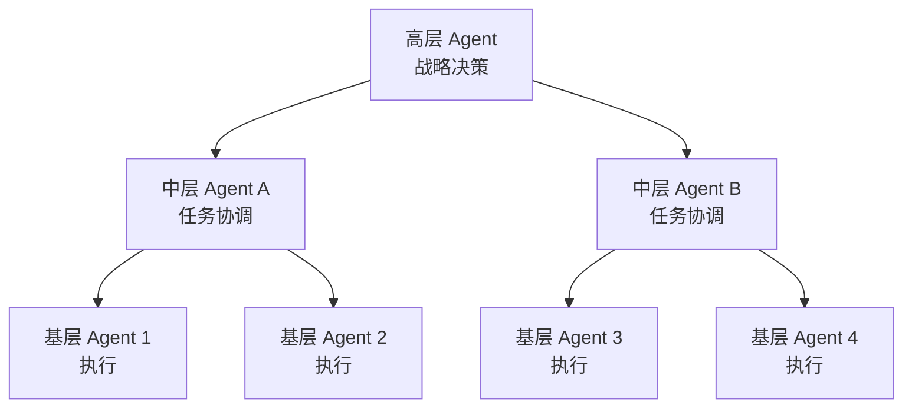

**特点：**
- 多层级结构
- 抽象层次分离
- 权责明确
- 大型复杂系统

---

### 5. 黑板模式 (Blackboard)

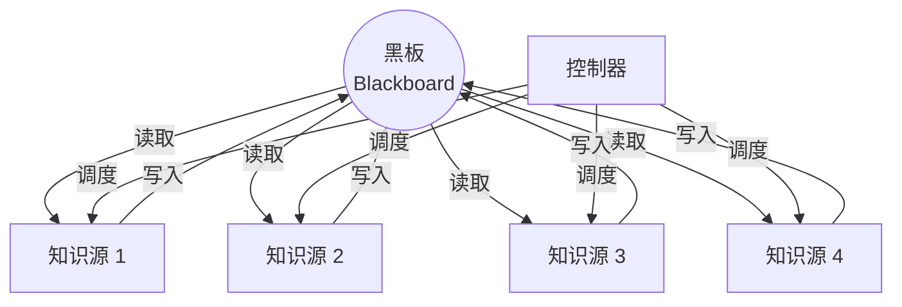

**特点：**
- 共享数据空间
- 渐进式求解
- 灵活组合
- 适合探索性问题

---

## 8.4 DeerFlow 多 Agent 设计

### DeerFlow 子智能体系统

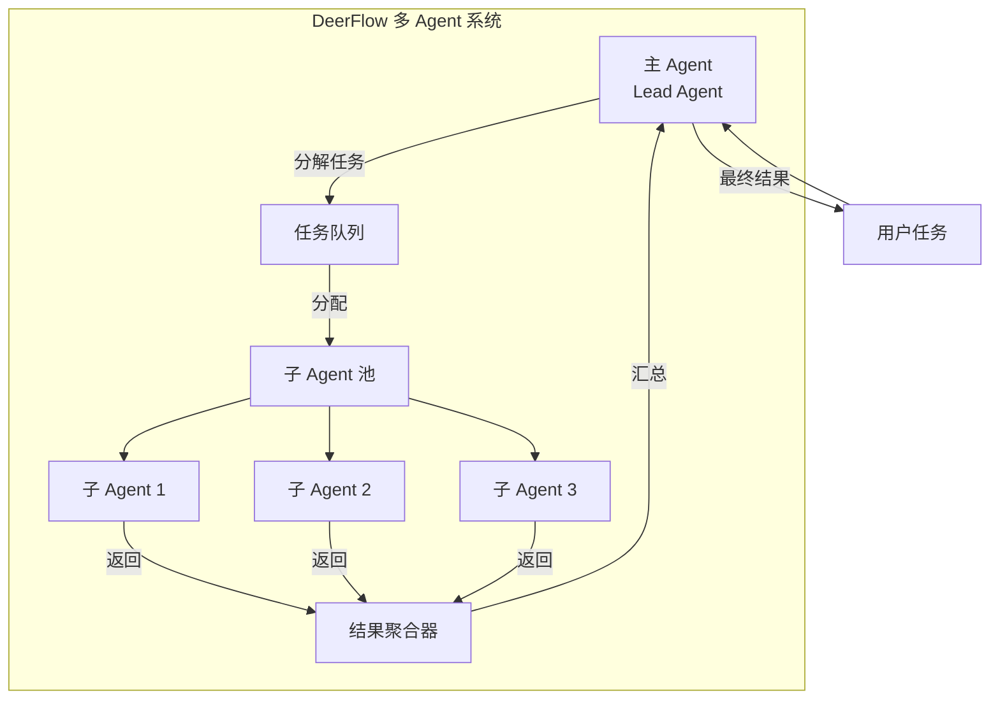

### 中间件链架构

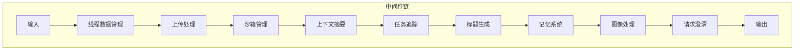

---

## 8.5 架构模式对比总结

| 架构模式 | 协调复杂度 | 并行能力 | 适用场景 | 示例 |
|---------|-----------|---------|---------|------|
| **顺序流水线** | 低 | 低 | 明确定义的工作流 | 传统 ETL |
| **主从架构** | 中 | 高 | 可并行的任务分解 | MapReduce |
| **对等协作** | 高 | 中高 | 动态复杂环境 | P2P 网络 |
| **分层架构** | 中高 | 中 | 大型复杂系统 | 企业架构 |
| **黑板模式** | 中 | 中 | 探索性问题 | 信号处理 |
| **MetaGPT** | 中 | 低 | 软件开发生命周期 | 软件开发 |
| **LangGraph** | 中 | 中 | 灵活工作流 | 通用 Agent |

---

## 8.6 DeerFlow 项目代码导读

### DeerFlow 的 LangGraph 状态机架构

DeerFlow 基于 LangGraph 构建，使用状态机和图结构来实现灵活的 Agent 工作流，这是本课中多种架构模式的融合。

### LangGraph 状态图核心

**文件**: `backend/src/agents/lead_agent/agent.py`

```python
from langgraph.graph import StateGraph, END
from langgraph.prebuilt import ToolNode

def make_lead_agent(config: RunnableConfig) -> StateGraph:
    """
    创建 Lead Agent 的 LangGraph 状态图
    结合了 ReAct 循环和中间件链
    """
    configurable = config.get("configurable", {})

    # 1. 创建模型
    model = create_chat_model(
        configurable.get("model_name"),
        configurable.get("thinking_enabled", False),
    )

    # 2. 加载工具
    tools = get_available_tools(...)
    model_with_tools = model.bind_tools(tools)

    # 3. 构建状态图
    graph = StateGraph(ThreadState)

    # 4. 定义节点
    def agent_node(state: ThreadState) -> ThreadState:
        """Agent 决策节点"""
        messages = state["messages"]
        response = model_with_tools.invoke(messages)
        return {"messages": [response]}

    tool_node = ToolNode(tools)

    # 5. 添加节点
    graph.add_node("agent", agent_node)
    graph.add_node("tools", tool_node)

    # 6. 定义条件边
    def should_continue(state: ThreadState) -> Literal["continue", "end"]:
        """判断是否需要继续（调用工具或结束）"""
        messages = state["messages"]
        last_message = messages[-1]
        if hasattr(last_message, "tool_calls") and last_message.tool_calls:
            return "continue"
        return "end"

    # 7. 设置边
    graph.set_entry_point("agent")
    graph.add_conditional_edges(
        "agent",
        should_continue,
        {
            "continue": "tools",
            "end": END,
        },
    )
    graph.add_edge("tools", "agent")

    # 8. 编译图（带检查点）
    checkpointer = MemorySaver()
    return graph.compile(checkpointer=checkpointer)
```

### ThreadState：状态定义

**文件**: `backend/src/agents/thread_state.py`

```python
from typing import TypedDict, Annotated, Sequence
from langchain_core.messages import BaseMessage
from langgraph.graph import add_messages

class ThreadState(TypedDict):
    """
    LangGraph 的状态定义
    每个字段都可以有自定义的 reducer 函数
    """
    # 核心消息历史 (使用 LangGraph 的 add_messages reducer)
    messages: Annotated[Sequence[BaseMessage], add_messages]

    # DeerFlow 扩展字段 (使用自定义 reducers)
    sandbox: dict | None
    artifacts: Annotated[list[str] | None, merge_artifacts]
    thread_data: dict | None
    title: str | None
    todos: list[dict] | None
    uploaded_files: list[dict] | None
    viewed_images: Annotated[dict | None, merge_viewed_images]

# 自定义 reducer 示例
def merge_artifacts(old: list[str] | None, new: list[str]) -> list[str]:
    """
    合并工件列表，去重但保持顺序
    """
    combined = (old or []) + new
    seen = set()
    result = []
    for item in combined:
        if item not in seen:
            seen.add(item)
            result.append(item)
    return result
```

### 中间件链：分层架构

**文件**: `backend/src/agents/lead_agent/agent.py`

```python
def _build_middlewares(
    config: LeadAgentConfig,
    threads_dir: Path,
) -> list[AgentMiddleware]:
    """
    构建中间件链 - 顺序执行的分层架构
    """
    middlewares = []

    # 1. 线程数据：创建隔离目录
    middlewares.append(
        ThreadDataMiddleware(threads_dir=threads_dir)
    )

    # 2. 上传处理：注入上传文件
    middlewares.append(UploadsMiddleware())

    # 3. 沙箱管理：获取执行环境
    middlewares.append(
        SandboxMiddleware(sandbox_provider=config.sandbox.provider)
    )

    # 4. 悬空工具调用处理
    middlewares.append(DanglingToolCallMiddleware())

    # 5. 上下文摘要（可选）
    if config.summarization and config.summarization.enabled:
        middlewares.append(
            SummarizationMiddleware(config=config.summarization)
        )

    # 6. 任务追踪（计划模式）
    middlewares.append(
        TodoListMiddleware(is_plan_mode=config.is_plan_mode)
    )

    # 7. 自动标题生成
    if config.title and config.title.enabled:
        middlewares.append(TitleMiddleware(config=config.title))

    # 8. 记忆系统
    if config.memory and config.memory.enabled:
        middlewares.append(
            MemoryMiddleware(memory_config=config.memory)
        )

    # 9. 图像处理（视觉模型）
    middlewares.append(ViewImageMiddleware())

    # 10. 子 Agent 限制
    if config.subagents and config.subagents.enabled:
        middlewares.append(SubagentLimitMiddleware())

    # 11. 澄清拦截（必须在最后）
    middlewares.append(ClarificationMiddleware())

    return middlewares
```

### AgentMiddleware：中间件基类

**文件**: `backend/src/agents/middlewares/base.py`

```python
from abc import ABC, abstractmethod
from typing import Any

class AgentMiddleware(ABC):
    """
    中间件基类 - 支持 before_model 和 after_model 钩子
    """

    @abstractmethod
    def before_model(self, state: ThreadState) -> ThreadState:
        """
        在模型调用前执行
        """
        return state

    @abstractmethod
    def after_model(self, state: ThreadState) -> ThreadState:
        """
        在模型调用后执行
        """
        return state
```

### LangGraph 配置

**文件**: `backend/langgraph.json`

```json
{
  "agent": {
    "type": "agent",
    "path": "src.agents:make_lead_agent"
  },
  "graphs": {
    "agent": {
      "checkpoint": {
        "type": "memory"
      }
    }
  }
}
```

### Gateway API：服务层

**文件**: `backend/src/gateway/app.py`

```python
from fastapi import FastAPI
from fastapi.middleware.cors import CORSMiddleware

from .routers import (
    models,
    mcp,
    skills,
    memory,
    uploads,
    artifacts,
)

app = FastAPI(title="DeerFlow Gateway API")

# CORS 配置
app.add_middleware(
    CORSMiddleware,
    allow_origins=["*"],
    allow_methods=["*"],
    allow_headers=["*"],
)

# 健康检查
@app.get("/health")
def health_check():
    return {"status": "healthy"}

# 注册路由
app.include_router(models.router, prefix="/api/models", tags=["models"])
app.include_router(mcp.router, prefix="/api/mcp", tags=["mcp"])
app.include_router(skills.router, prefix="/api/skills", tags=["skills"])
app.include_router(memory.router, prefix="/api/memory", tags=["memory"])
app.include_router(uploads.router, prefix="/api/threads/{thread_id}/uploads", tags=["uploads"])
app.include_router(artifacts.router, prefix="/api/threads/{thread_id}/artifacts", tags=["artifacts"])
```

### 路由模块化

**文件**: `backend/src/gateway/routers/`

```python
# models.py
@router.get("/")
def list_models():
    """列出所有可用模型"""
    config = load_config()
    return {"models": config.models}

@router.get("/{name}")
def get_model(name: str):
    """获取特定模型详情"""
    pass

# mcp.py
@router.get("/config")
def get_mcp_config():
    """获取 MCP 配置"""
    pass

@router.put("/config")
def update_mcp_config(servers: dict):
    """更新 MCP 配置"""
    pass

# skills.py
@router.get("/")
def list_skills():
    """列出所有技能"""
    pass

@router.post("/install")
def install_skill(file: UploadFile):
    """安装技能包"""
    pass
```

### 整体架构：Nginx 统一入口

```mermaid
graph TB
    Nginx[Nginx<br/>端口 2026
    Gateway[Gateway API<br/>
    LangGraph[LangGraph Server<br/>
    Frontend[Frontend<br/>

    Nginx -->|/api/langgraph/*| LangGraph
    Nginx -->|/api/*| Gateway
    Nginx -->|/*| Frontend
```

### Nginx 配置示例

```nginx
server {
    listen 2026;

    # LangGraph Server
    location /api/langgraph/ {
        proxy_pass http://localhost:2024/;
        proxy_set_header Host $host;
        proxy_set_header X-Real-IP $remote_addr;
        proxy_buffering off;
        proxy_set_header Connection '';
        proxy_http_version 1.1;
        chunked_transfer_encoding off;
    }

    # Gateway API
    location /api/ {
        proxy_pass http://localhost:8001/api/;
        proxy_set_header Host $host;
        proxy_set_header X-Real-IP $remote_addr;
    }

    # Frontend
    location / {
        proxy_pass http://localhost:3000/;
        proxy_set_header Host $host;
    }
}
```

### 配置驱动的架构

**文件**: `config.yaml`

```yaml
# 模型配置
models:
  - name: gpt-4o
    use: langchain_openai:ChatOpenAI
    model: gpt-4o
    api_key: $OPENAI_API_KEY
    supports_thinking: false
    supports_vision: true

# 工具配置
tools:
  - name: tavily_search
    use: src.community.tavily:tavily_search
    group: web

# 沙箱配置
sandbox:
  use: src.sandbox.local:LocalSandboxProvider

# 技能配置
skills:
  path: ../skills
  container_path: /mnt/skills

# 子 Agent 配置
subagents:
  enabled: true

# 记忆配置
memory:
  enabled: true
  injection_enabled: true
```

### 关键代码文件索引

| 模块 | 文件路径 | 说明 |
|------|----------|------|
| **Agent 工厂** | `src/agents/lead_agent/agent.py` | `make_lead_agent()` LangGraph 图 |
| **线程状态** | `src/agents/thread_state.py` | `ThreadState` 定义 + reducers |
| **中间件基类** | `src/agents/middlewares/base.py` | `AgentMiddleware` ABC |
| **中间件链** | `src/agents/lead_agent/agent.py` | `_build_middlewares()` |
| **Gateway 应用** | `src/gateway/app.py` | FastAPI 应用 |
| **路由** | `src/gateway/routers/` | 6 个路由模块 |
| **LangGraph 配置** | `langgraph.json` | 服务注册 |
| **主配置** | `config.yaml` | 配置驱动架构 |

---

## 8.7 小结

**本节课要点：**

1. ✅ **MetaGPT** 模拟软件公司工作流，通过标准化 SOP 实现多 Agent 协作
2. ✅ **LangGraph** 使用状态机和图结构建模 Agent 工作流
3. ✅ 多 Agent 架构模式包括：顺序流水线、主从、对等、分层、黑板等
4. ✅ DeerFlow 结合了这些模式的优点，实现了灵活的多 Agent 系统

**下节课预告：**
我们将学习多 Agent 协调与共识机制。

---

## 参考资料

- [MetaGPT: Meta Programming for A Multi-Agent Collaborative Framework](https://arxiv.org/abs/2308.00352)
- [LangGraph Documentation](https://langchain-ai.github.io/langgraph/)
- [Multi-Agent Architecture Patterns](https://blog.langchain.dev/multi-agent-architectures/)
