# 第9课：协调与共识

## 9.1 协调机制

### 协调模式分类

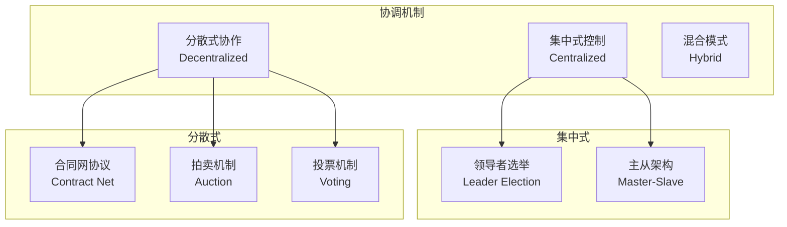

---

## 9.2 集中式 vs 分散式

### 集中式控制

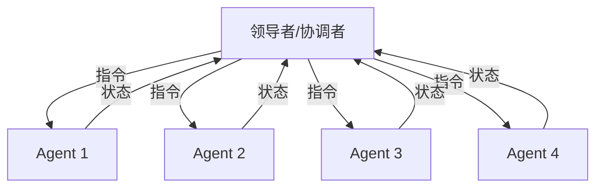

| 优点 | 缺点 |
|------|------|
| 决策简单高效 | 单点故障风险 |
| 全局视图 | 领导者成为瓶颈 |
| 易于实现 | 可扩展性有限 |
| 避免冲突 | 缺乏自主性 |

### 分散式协作

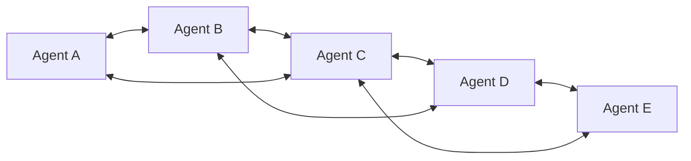

| 优点 | 缺点 |
|------|------|
| 无单点故障 | 协调复杂 |
| 高度可扩展 | 可能出现冲突 |
| 容错性强 | 达成共识慢 |
| 充分利用自主性 | 缺乏全局最优 |

### 混合模式

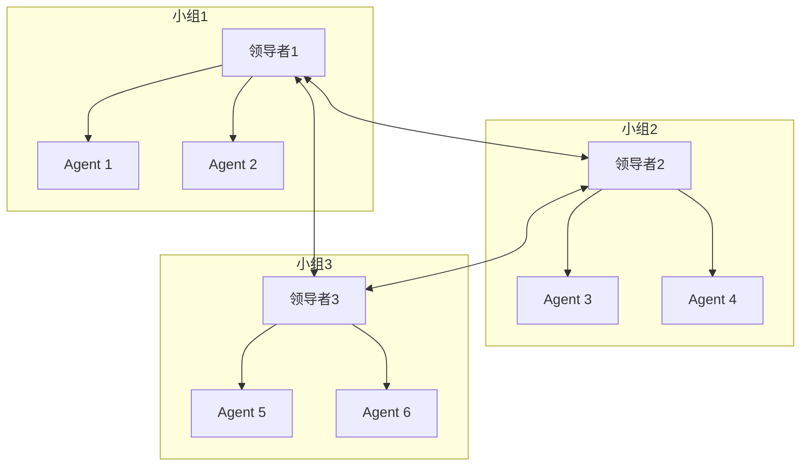

**特点：**
- 分层协调
- 组内集中式，组间分散式
- 兼顾效率和灵活性
- 适合大规模系统

---

## 9.3 角色分配：主从架构 vs 对等网络

### 主从架构 (Master-Slave)

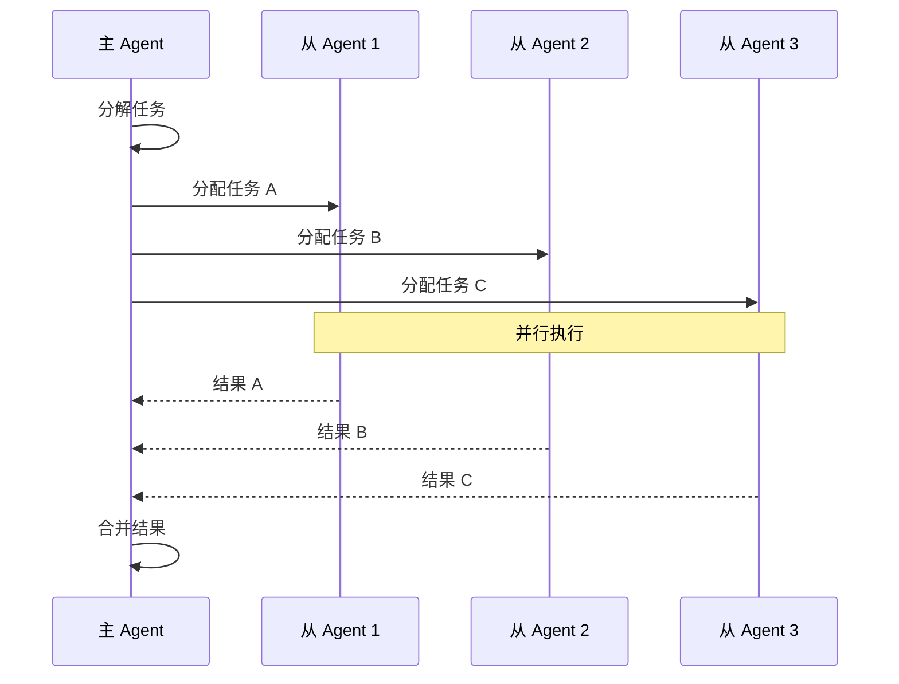

### 对等网络 (Peer-to-Peer)

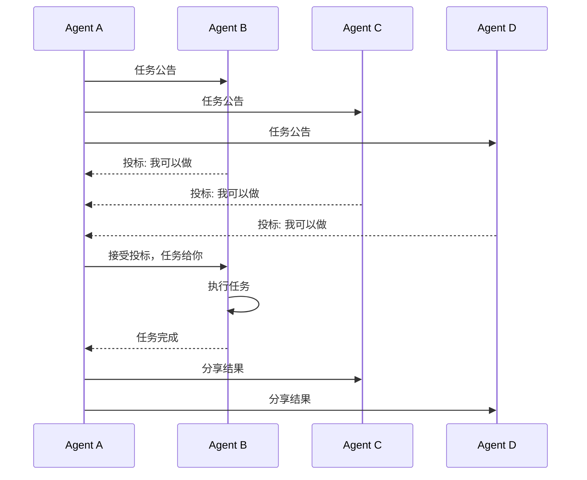

### 对比总结

| 维度 | 主从架构 | 对等网络 |
|------|---------|---------|
| **决策方式** | 集中决策 | 分布式协商 |
| **通信模式** | 星型 | 网状 |
| **复杂度** | 较低 | 较高 |
| **适应性** | 较差 | 较强 |
| **适用场景** | 结构化任务 | 动态任务 |

---

## 9.4 任务分配算法

### 合同网协议 (Contract Net Protocol)

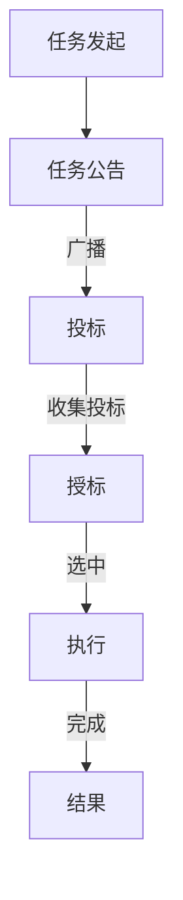

**步骤：**
1. **任务公告**：管理者向所有参与者广播任务
2. **投标**：有能力的参与者提交投标
3. **授标**：管理者选择最佳投标并授标
4. **执行**：中标者执行任务并汇报结果

### 拍卖机制 (Auction Mechanisms)

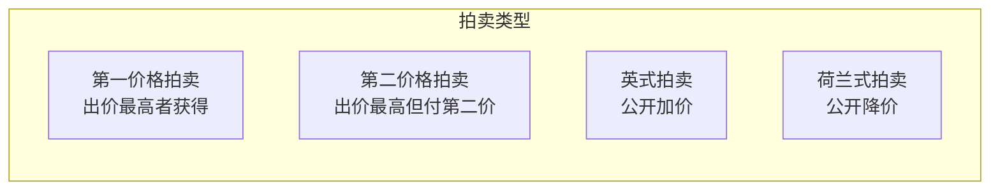

#### 英式拍卖流程

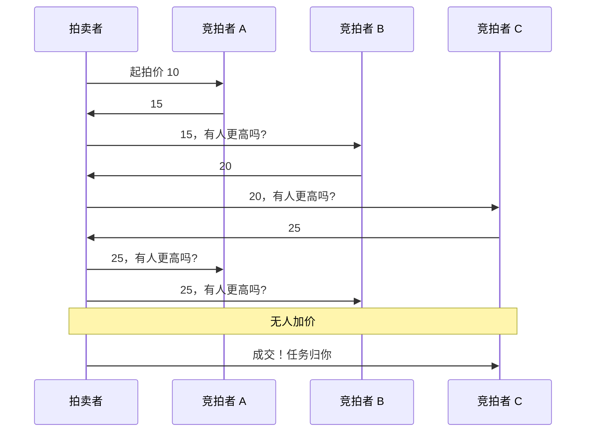

### 基于能力的任务分配

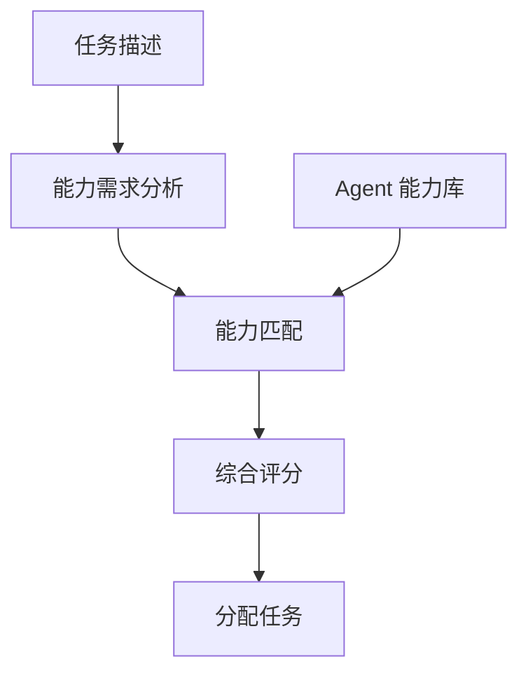

**评分公式：**

$$
\text{Score}(a, t) = \sum_{i} w_i \cdot \text{match}(c_i^a, c_i^t) + \beta \cdot \text{availability}(a) + \gamma \cdot \text{load}(a)
$$

其中：
- $w_i$ 是各能力的权重
- $\text{match}(c_i^a, c_i^t)$ 是 Agent $a$ 对能力 $i$ 的匹配度
- $\beta, \gamma$ 是可用性和负载的权重

---

## 9.5 冲突解决机制

### 冲突类型

| 冲突类型 | 描述 | 示例 |
|---------|------|------|
| **资源冲突** | 竞争同一资源 | 两个 Agent 同时想编辑同一文件 |
| **目标冲突** | 目标不一致 | 一个想快速完成，一个想保证质量 |
| **意见冲突** | 解决方案分歧 | 对技术选型有不同看法 |
| **优先级冲突** | 任务排序不同 | 对任务重要性有不同判断 |

### 投票机制

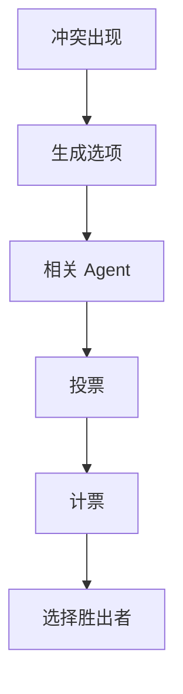

#### 投票方法对比

| 投票方法 | 原理 | 优点 | 缺点 |
|---------|------|------|------|
| **简单多数** | 得票最多者胜出 | 简单 | 可能忽略少数意见 |
| **绝对多数** | 需要超过 50% | 更有共识 | 可能多轮投票 |
| **排序投票** | 排序偏好 | 细致 | 复杂 |
| **认可投票** | 认可多个选项 | 灵活 | 策略性投票 |

### 辩论与说服

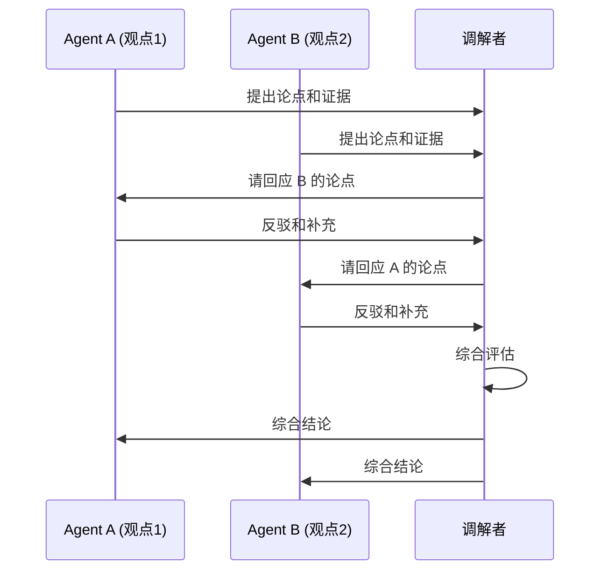

### 仲裁者设计

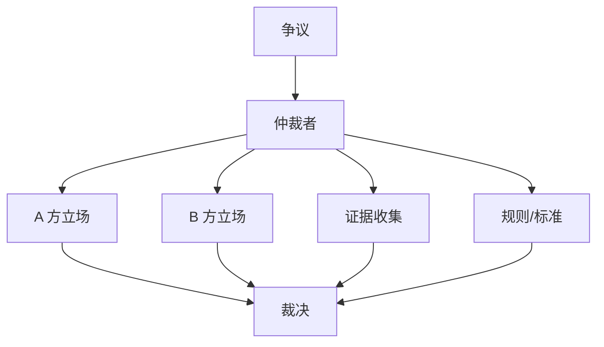

---

## 9.6 团队反思：集体记忆与经验积累

### 集体记忆架构

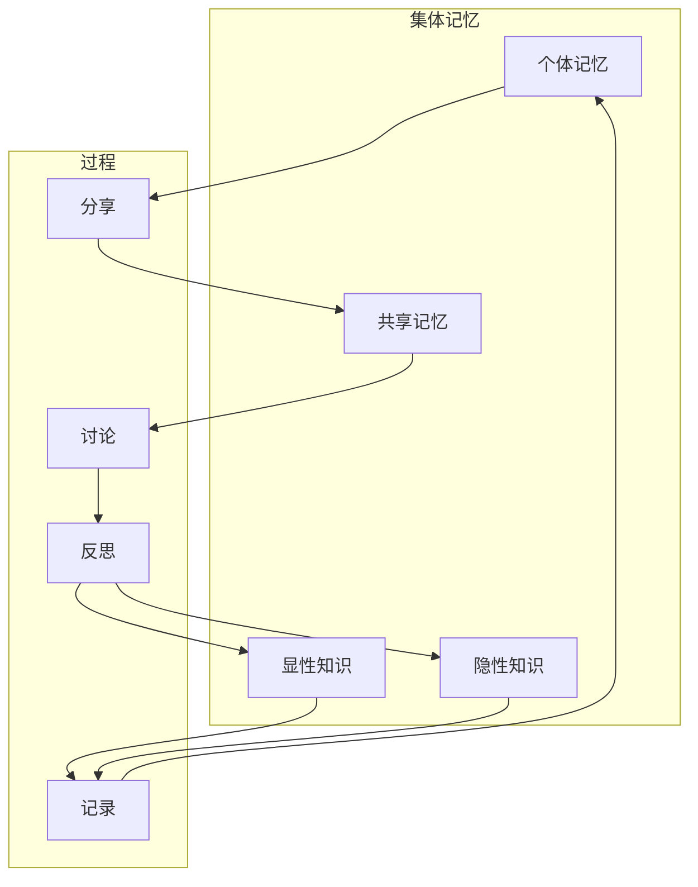

### 经验学习循环

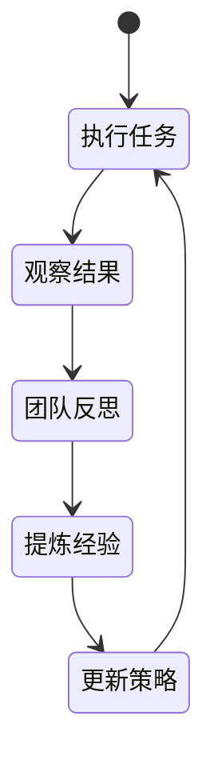

### 团队反思会议

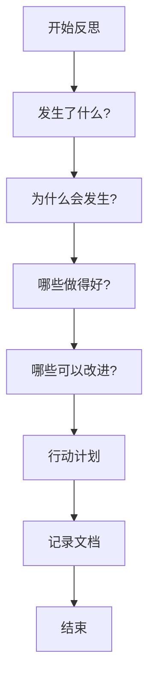

---

## 9.7 DeerFlow 项目代码导读

### DeerFlow 的协调与共识机制

DeerFlow 采用集中式控制的主从架构，结合了多种协调策略来确保系统的稳定运行。

### 集中式协调架构：Lead Agent + 子 Agent

**文件**: `backend/src/subagents/executor.py`

```python
class SubagentExecutor:
    """
    子 Agent 执行器：集中式任务分配
    主 Agent (Lead Agent) 作为协调者
    """

    MAX_CONCURRENT_SUBAGENTS = 3
    SUBAGENT_TIMEOUT = 900  # 15 minutes

    def __init__(self):
        # 双线程池设计
        self._scheduler_pool = ThreadPoolExecutor(max_workers=3)
        self._execution_pool = ThreadPoolExecutor(max_workers=3)
        self._running_tasks: dict[str, SubagentTask] = {}
        self._lock = threading.Lock()

    def execute(
        self,
        subagent_type: str,
        description: str,
        prompt: str,
        max_turns: int = 10,
    ) -> SubagentResult:
        """
        同步执行子 Agent：主 Agent 等待结果
        """
        subagent = get_subagent(subagent_type)
        return subagent.run(description, prompt, max_turns)

    def get_task_status(self, task_id: str) -> SubagentTask | None:
        """
        获取任务状态：主 Agent 轮询查询
        """
        with self._lock:
            return self._running_tasks.get(task_id)
```

### 任务状态追踪

**文件**: `backend/src/subagents/executor.py`

```python
from dataclasses import dataclass, field
from typing import Any
import time

@dataclass
class SubagentTask:
    """
    子 Agent 任务状态：集中式状态管理
    """
    task_id: str
    status: str  # starting, running, completed, failed, timed_out
    subagent_type: str
    description: str
    result: Any | None = None
    error: str | None = None
    created_at: float = field(default_factory=time.time)
    started_at: float | None = None
    completed_at: float | None = None

class SubagentResult:
    """
    子 Agent 执行结果
    """
    output: str
    success: bool
    error: str | None = None
```

### SubagentLimitMiddleware：并发控制

**文件**: `backend/src/agents/middlewares/subagent_limit.py`

```python
class SubagentLimitMiddleware(AgentMiddleware):
    """
    限制并发子 Agent 数量为 MAX_CONCURRENT_SUBAGENTS
    防止资源耗尽
    """

    def after_model(self, state: ThreadState) -> ThreadState:
        configurable = state.get("config", {}).get("configurable", {})
        if not configurable.get("subagent_enabled"):
            return state

        messages = state["messages"]
        if not messages:
            return state

        last_message = messages[-1]
        if not hasattr(last_message, "tool_calls"):
            return state

        # 分离 task 调用和其他调用
        task_calls = []
        other_calls = []
        for call in last_message.tool_calls:
            if call["name"] == "task":
                task_calls.append(call)
            else:
                other_calls.append(call)

        # 截断超过限制的 task 调用（主从架构的负载控制）
        if len(task_calls) > MAX_CONCURRENT_SUBAGENTS:
            truncated = task_calls[:MAX_CONCURRENT_SUBAGENTS]
            last_message.tool_calls = other_calls + truncated

        return state
```

### 线程数据隔离：避免资源冲突

**文件**: `backend/src/agents/middlewares/thread_data.py`

```python
class ThreadDataMiddleware(AgentMiddleware):
    """
    为每个线程创建独立的工作目录，避免资源冲突
    """

    def __init__(self, threads_dir: Path):
        self.threads_dir = threads_dir

    def before_model(self, state: ThreadState) -> ThreadState:
        """
        在模型调用前：创建或获取线程目录
        """
        thread_id = state.get("thread_id", "unknown")
        thread_dir = self.threads_dir / thread_id
        user_data_dir = thread_dir / "user-data"

        # 创建隔离目录
        workspace_dir = user_data_dir / "workspace"
        uploads_dir = user_data_dir / "uploads"
        outputs_dir = user_data_dir / "outputs"

        workspace_dir.mkdir(parents=True, exist_ok=True)
        uploads_dir.mkdir(parents=True, exist_ok=True)
        outputs_dir.mkdir(parents=True, exist_ok=True)

        # 存储到状态中（所有 Agent 共享）
        state["thread_data"] = {
            "base_dir": str(user_data_dir),
            "workspace": str(workspace_dir),
            "uploads": str(uploads_dir),
            "outputs": str(outputs_dir),
        }

        return state
```

### SandboxMiddleware：资源分配协调

**文件**: `backend/src/sandbox/middleware.py`

```python
class SandboxMiddleware(AgentMiddleware):
    """
    沙箱中间件：协调沙箱环境的获取和释放
    """

    def __init__(self, sandbox_provider: SandboxProvider):
        self.provider = sandbox_provider

    def before_model(self, state: ThreadState) -> ThreadState:
        """
        在模型调用前：获取沙箱环境
        """
        if state.get("sandbox"):
            return state

        # 从 provider 获取沙箱
        sandbox_id = self.provider.acquire()
        sandbox = self.provider.get(sandbox_id)

        state["sandbox"] = {
            "sandbox_id": sandbox_id,
            "provider": type(self.provider).__name__,
        }

        return state

    def after_model(self, state: ThreadState) -> ThreadState:
        """
        在模型调用后：可以选择是否释放沙箱
        当前设计保持沙箱活跃以便重用
        """
        return state
```

### 沙箱 Provider 接口

**文件**: `backend/src/sandbox/sandbox.py`

```python
from abc import ABC, abstractmethod
from pathlib import Path
from typing import Any

class Sandbox(ABC):
    """
    沙箱抽象接口
    """

    @abstractmethod
    def execute_command(
        self, command: str, timeout: int | None = None
    ) -> str:
        """执行命令"""
        pass

    @abstractmethod
    def read_file(self, path: str | Path) -> str:
        """读取文件"""
        pass

    @abstractmethod
    def write_file(self, path: str | Path, content: str, append: bool = False):
        """写入文件"""
        pass

    @abstractmethod
    def list_dir(self, path: str | Path) -> str:
        """列出目录"""
        pass

class SandboxProvider(ABC):
    """
    沙箱提供者：管理沙箱生命周期
    """

    @abstractmethod
    def acquire(self) -> str:
        """
        获取沙箱 ID
        支持多种分配策略：轮询、最少使用等
        """
        pass

    @abstractmethod
    def get(self, sandbox_id: str) -> Sandbox:
        """
        获取沙箱实例
        """
        pass

    @abstractmethod
    def release(self, sandbox_id: str):
        """
        释放沙箱
        """
        pass
```

### LocalSandboxProvider：单例沙箱

**文件**: `backend/src/sandbox/local.py`

```python
class LocalSandboxProvider(SandboxProvider):
    """
    本地沙箱提供者：单例模式，简单直接
    开发环境使用，生产环境建议使用 AioSandboxProvider
    """

    _instance: "LocalSandboxProvider" = None
    _lock: threading.Lock = threading.Lock()
    _sandbox: "LocalSandbox" = None

    def __new__(cls):
        with cls._lock:
            if cls._instance is None:
                cls._instance = super().__new__(cls)
            return cls._instance

    def acquire(self) -> str:
        """获取沙箱 ID：总是返回 'local'"""
        return "local"

    def get(self, sandbox_id: str) -> Sandbox:
        """获取沙箱实例：单例"""
        if sandbox_id != "local":
            raise ValueError(f"Unknown sandbox id: {sandbox_id}")

        with self._lock:
            if self._sandbox is None:
                self._sandbox = LocalSandbox()
            return self._sandbox

    def release(self, sandbox_id: str):
        """释放沙箱：本地沙箱不做任何事"""
        pass
```

### 共享状态：ThreadState 作为共识层

**文件**: `backend/src/agents/thread_state.py`

```python
def merge_artifacts(old: list[str] | None, new: list[str]) -> list[str]:
    """
    合并工件列表，去重但保持顺序
    所有 Agent 对 artifacts 的修改都会通过这个 reducer 协调
    """
    combined = (old or []) + new
    seen = set()
    result = []
    for item in combined:
        if item not in seen:
            seen.add(item)
            result.append(item)
    return result

def merge_viewed_images(
    old: dict | None,
    new: dict | None,
) -> dict | None:
    """
    合并 viewed_images
    - new 为 None: 清除所有
    - 否则: 合并
    """
    if new is None:
        return None
    if old is None:
        return new
    return {**old, **new}

class ThreadState(TypedDict):
    """
    线程状态：作为所有 Agent 的共享共识层
    """
    # 消息历史：使用 LangGraph 的 add_messages
    messages: Annotated[Sequence[BaseMessage], add_messages]

    # 扩展状态：使用自定义 reducers
    sandbox: dict | None
    artifacts: Annotated[list[str] | None, merge_artifacts]
    thread_data: dict | None
    title: str | None
    todos: list[dict] | None
    uploaded_files: list[dict] | None
    viewed_images: Annotated[dict | None, merge_viewed_images]
```

### 子 Agent 注册表：角色分配

**文件**: `backend/src/subagents/registry.py`

```python
from typing import Callable
from .builtins import create_general_purpose_agent, create_bash_agent

SubagentFactory = Callable[[], Subagent]

_subagents: dict[str, SubagentFactory] = {}

def register_subagent(name: str, factory: SubagentFactory):
    """
    注册子 Agent：类似于角色分配
    """
    _subagents[name] = factory

def get_subagent(name: str) -> Subagent:
    """
    获取子 Agent：按角色名称查找
    """
    if name not in _subagents:
        raise ValueError(f"Unknown subagent type: {name}")
    return _subagents[name]()

def list_subagents() -> list[str]:
    """
    列出所有可用的子 Agent 角色
    """
    return list(_subagents.keys())

# 注册内置角色
register_subagent("general-purpose", create_general_purpose_agent)
register_subagent("bash", create_bash_agent)
```

### 配置驱动的协调策略

**文件**: `config.yaml`

```yaml
# 子 Agent 系统配置
subagents:
  enabled: true

# 沙箱配置
sandbox:
  use: src.sandbox.local:LocalSandboxProvider

# 摘要配置（上下文管理）
summarization:
  enabled: true
  trigger:
    type: fraction
    value: 0.8
  keep_policy:
    recent_messages: 10
    summarize_older: true
```

### 关键代码文件索引

| 模块 | 文件路径 | 说明 |
|------|----------|------|
| **子 Agent 执行器** | `src/subagents/executor.py` | `SubagentExecutor` 集中式协调 |
| **子 Agent 限制** | `src/agents/middlewares/subagent_limit.py` | 并发控制 |
| **线程数据** | `src/agents/middlewares/thread_data.py` | 资源隔离 |
| **沙箱中间件** | `src/sandbox/middleware.py` | 沙箱生命周期管理 |
| **沙箱接口** | `src/sandbox/sandbox.py` | `Sandbox` + `SandboxProvider` |
| **本地沙箱** | `src/sandbox/local.py` | `LocalSandboxProvider` 单例 |
| **子 Agent 注册表** | `src/subagents/registry.py` | 角色分配 |
| **线程状态** | `src/agents/thread_state.py` | 共享状态 + reducers |

---

## 9.8 小结

**本节课要点：**

1. ✅ 协调机制分为集中式、分散式和混合模式
2. ✅ 任务分配可以使用合同网协议、拍卖机制或基于能力的分配
3. ✅ 冲突解决可以通过投票、辩论或仲裁
4. ✅ 团队反思帮助积累集体经验和持续改进

**下节课预告：**
我们将学习 Agent 安全与对齐。

---

## 参考资料

- [Contract Net Protocol: High-Level Communication and Control in a Distributed Problem Solver](https://ieeexplore.ieee.org/document/6312940)
- [Multi-Agent Systems: Algorithmic, Game-Theoretic, and Logical Foundations](https://mitpress.mit.edu/books/multi-agent-systems)
- [A Survey of Multi-Agent Coordination](https://arxiv.org/abs/2401.05574)
