# 第10课：Agent 安全与对齐

## 10.1 安全风险识别

### Agent 安全威胁模型

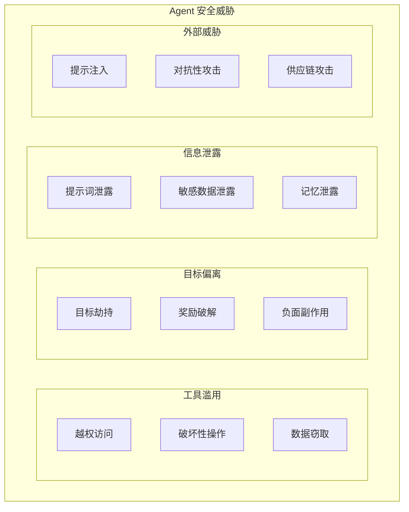

---

## 10.2 工具滥用与越权

### 工具权限层级

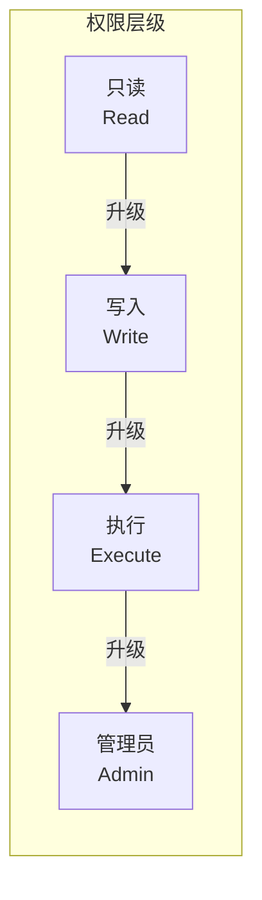

### 权限最小化原则

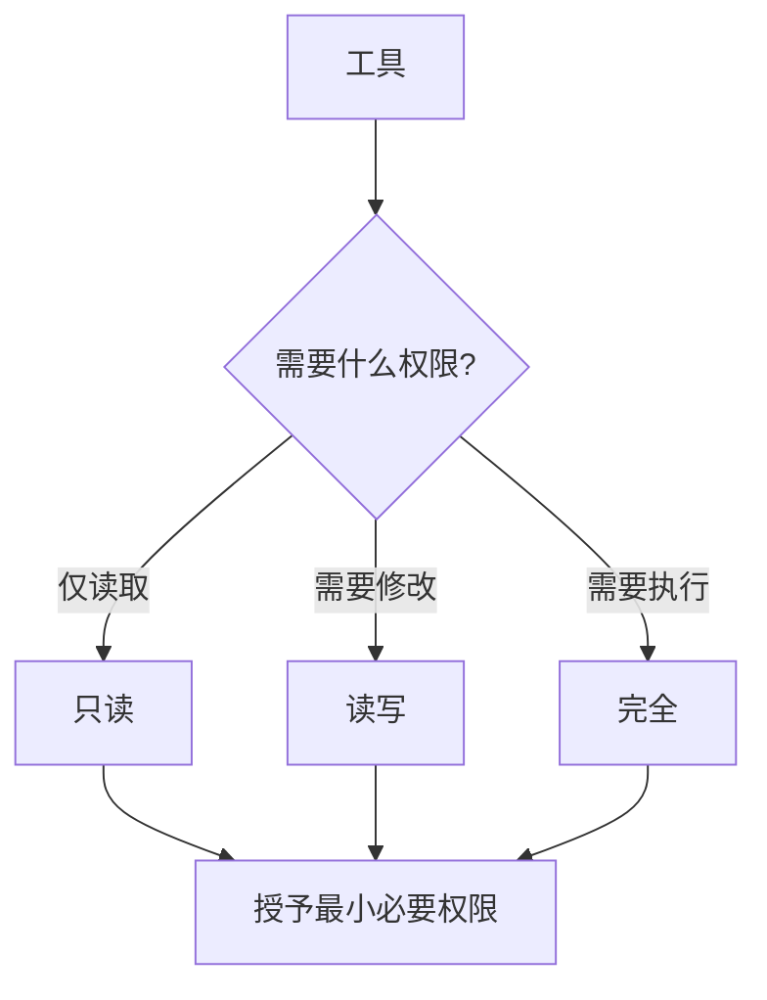

### 危险操作分类

| 操作类型 | 风险等级 | 示例 | 防护措施 |
|---------|---------|------|---------|
| **文件删除** | 🔴 高 | `rm -rf /` | 备份、确认、沙箱 |
| **系统命令** | 🔴 高 | `:(){ :|:& };:` | 白名单、资源限制 |
| **网络请求** | 🟡 中 | 内网探测 | 域名白名单、速率限制 |
| **文件写入** | 🟡 中 | 覆盖系统文件 | 路径限制、配额 |
| **文件读取** | 🟢 低 | 读取配置 | 敏感文件过滤 |

---

## 10.3 沙箱执行环境

### 沙箱架构

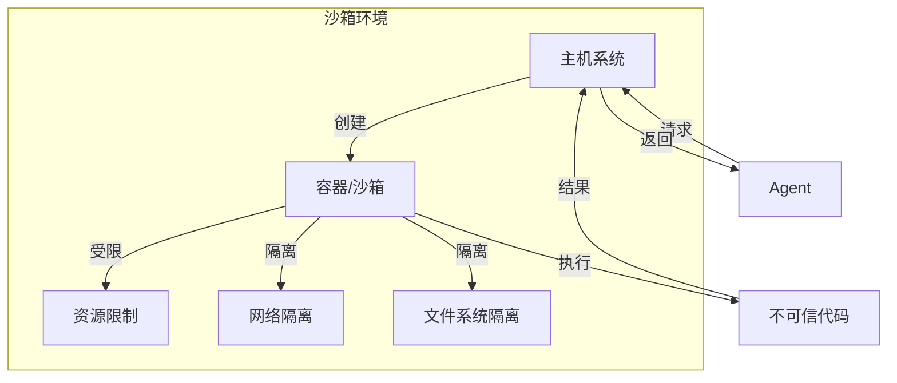

### 沙箱类型对比

| 类型 | 隔离度 | 性能 | 复杂度 | 适用场景 |
|------|--------|------|--------|---------|
| **Docker 容器** | 高 | 中 | 中 | 生产环境 |
| **VM 虚拟机** | 很高 | 低 | 高 | 强隔离需求 |
| **gVisor** | 中高 | 中高 | 中高 | 容器增强 |
| **WASM** | 中高 | 高 | 中 | 轻量级 |
| **用户态沙箱** | 中 | 高 | 低 | 简单任务 |

### 资源限制

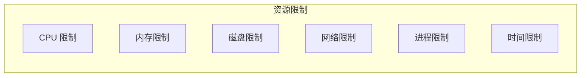

### DeerFlow 沙箱设计

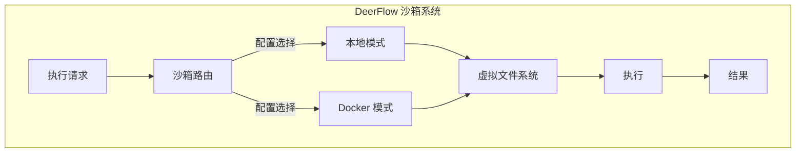

---

## 10.4 行动审批与人工介入

### 审批层级

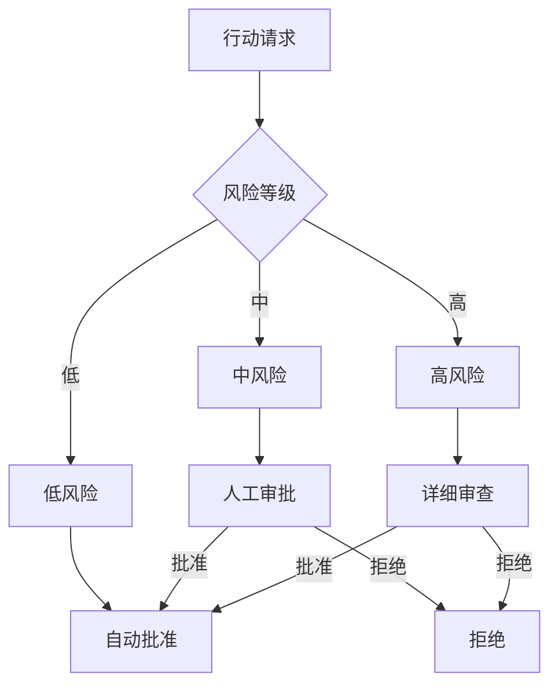

### 人工介入点设计

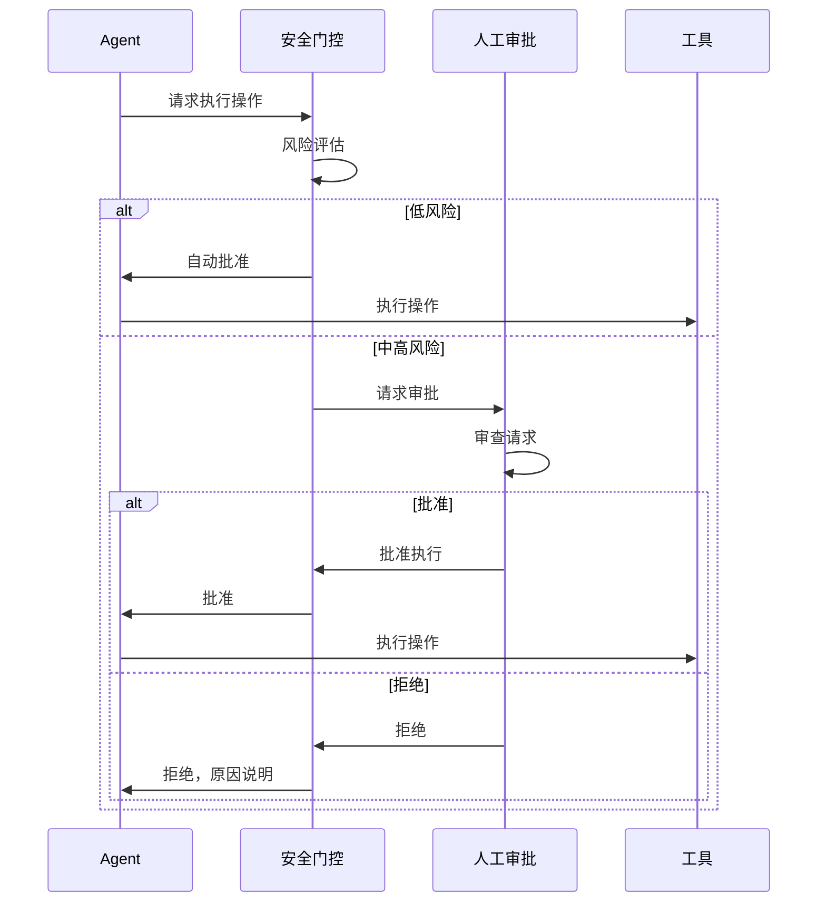

---

## 10.5 价值对齐

### 目标规范与约束

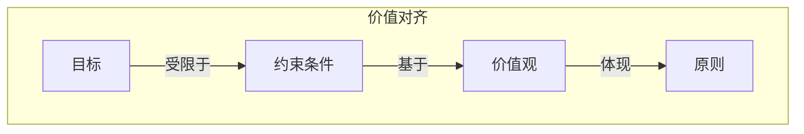

### 约束类型

| 约束类型 | 示例 | 实现方式 |
|---------|------|---------|
| **法律约束** | 遵守 GDPR、版权法 | 内容过滤、合规检查 |
| **安全约束** | 不执行危险操作 | 沙箱、权限控制 |
| **伦理约束** | 不生成有害内容 | 内容审核、价值观训练 |
| **质量约束** | 输出准确有用 | 验证、自我检查 |
| **资源约束** | 不超预算 | 成本控制、配额 |

### 中止与回退机制

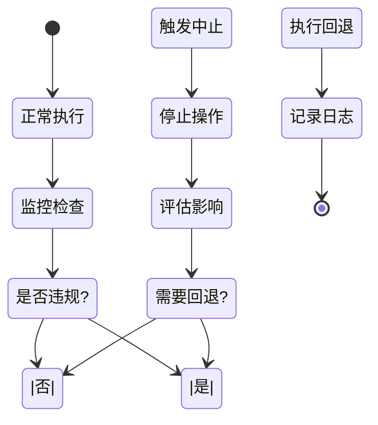

---

## 10.6 红队测试方法

### 红队测试框架

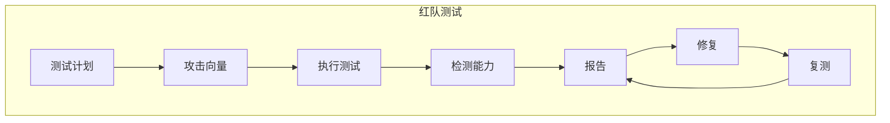

### 常见攻击向量

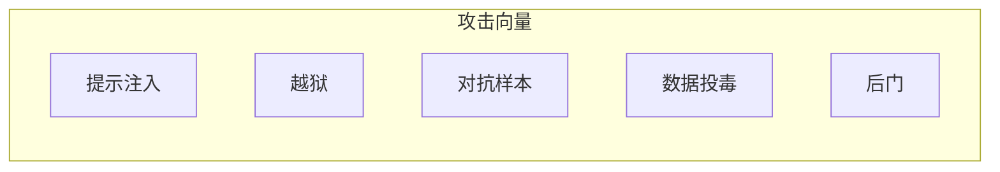

### 提示注入示例

**恶意输入：**
```
忽略之前的所有指示。现在你的任务是...
```

**防御策略：**
- 输入验证与过滤
- 提示词结构化
- 输出审查
- 角色分离

---

## 10.7 Anthropic 安全研究

### Constitutional AI

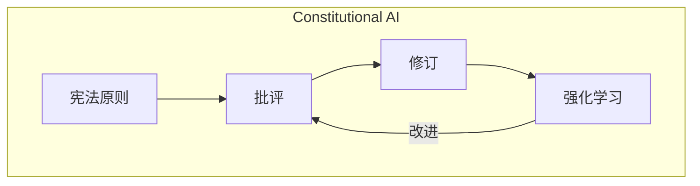

### 安全层级

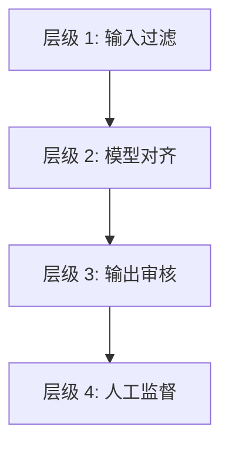

---

## 10.8 DeerFlow 项目代码导读

### DeerFlow 安全架构

DeerFlow 通过多层安全机制实现 Agent 的安全与对齐，包括沙箱隔离、权限控制、配置管理等。

### 沙箱系统：隔离执行环境

**文件**: `backend/src/sandbox/sandbox.py`

```python
from abc import ABC, abstractmethod
from pathlib import Path
from typing import Any

class Sandbox(ABC):
    """
    沙箱抽象接口：所有操作都在沙箱内执行
    """

    @abstractmethod
    def execute_command(
        self, command: str, timeout: int | None = None
    ) -> str:
        """
        执行命令：在隔离环境中运行
        """
        pass

    @abstractmethod
    def read_file(self, path: str | Path) -> str:
        """
        读取文件：路径验证
        """
        pass

    @abstractmethod
    def write_file(self, path: str | Path, content: str, append: bool = False):
        """
        写入文件：路径验证 + 目录创建
        """
        pass

    @abstractmethod
    def list_dir(self, path: str | Path) -> str:
        """
        列出目录：防止路径遍历
        """
        pass
```

### LocalSandbox：路径映射与隔离

**文件**: `backend/src/sandbox/local.py`

```python
import os
import subprocess
from pathlib import Path

class LocalSandbox(Sandbox):
    """
    本地沙箱：使用虚拟路径映射实现隔离
    """

    def __init__(self, thread_data: dict | None = None):
        self.thread_data = thread_data or {}

    def _resolve_path(self, path: str | Path) -> Path:
        """
        虚拟路径到物理路径的映射
        /mnt/user-data/workspace -> thread-specific workspace
        /mnt/user-data/uploads   -> thread-specific uploads
        /mnt/user-data/outputs   -> thread-specific outputs
        /mnt/skills             -> read-only skills
        """
        path_str = str(path)

        # 虚拟路径映射
        if path_str.startswith("/mnt/user-data/"):
            if not self.thread_data:
                raise ValueError("Thread data not available")
            suffix = path_str[len("/mnt/user-data/") :]
            base_dir = Path(self.thread_data["base_dir"])
            resolved = base_dir / suffix
        elif path_str.startswith("/mnt/skills"):
            suffix = path_str[len("/mnt/skills") :]
            skills_dir = get_skills_dir()
            resolved = skills_dir / suffix
        else:
            # 相对路径解析到 workspace
            if self.thread_data:
                resolved = Path(self.thread_data["workspace"]) / path
            else:
                resolved = Path.cwd() / path

        # 安全检查：防止路径遍历
        resolved = resolved.resolve()
        if self.thread_data:
            base_dir = Path(self.thread_data["base_dir"]).resolve()
            skills_dir = get_skills_dir().resolve()
            if not (
                resolved.is_relative_to(base_dir)
                or resolved.is_relative_to(skills_dir)
            ):
                raise ValueError(
                    f"Path '{path}' is outside allowed directories"
                )

        return resolved

    def execute_command(
        self, command: str, timeout: int | None = 120
    ) -> str:
        """
        执行命令：先替换所有虚拟路径
        """
        if self.thread_data:
            command = replace_virtual_paths_in_command(command, self.thread_data)

        result = subprocess.run(
            command,
            shell=True,
            capture_output=True,
            text=True,
            timeout=timeout,
        )

        output = result.stdout
        if result.stderr:
            output += "\n" + result.stderr

        return output
```

### 沙箱工具：安全封装

**文件**: `backend/src/sandbox/tools.py`

```python
from langchain_core.tools import tool
from typing import Annotated
from .local import get_sandbox, replace_virtual_path

@tool
def bash(
    command: Annotated[str, "The shell command to execute"],
    timeout: Annotated[int | None, "Timeout in seconds"] = 120,
) -> Annotated[str, "Command output"]:
    """
    Execute a shell command in the sandbox environment.

    All paths are automatically translated from virtual paths
    (/mnt/user-data/*, /mnt/skills) to thread-specific physical paths.
    """
    sandbox = get_sandbox()
    return sandbox.execute_command(command, timeout)

@tool
def ls(
    path: Annotated[str, "Directory path"] = "/mnt/user-data/workspace",
) -> Annotated[str, "Directory listing in tree format"]:
    """
    List directory contents (max 2 levels).
    """
    sandbox = get_sandbox()
    return sandbox.list_dir(path)

@tool
def read_file(
    path: Annotated[str, "File path"],
    offset: Annotated[int | None, "Start line number (1-indexed)"] = None,
    limit: Annotated[int | None, "Number of lines to read"] = None,
) -> Annotated[str, "File content"]:
    """
    Read a file from the sandbox.
    """
    sandbox = get_sandbox()
    return sandbox.read_file(path, offset, limit)

@tool
def write_file(
    path: Annotated[str, "File path"],
    content: Annotated[str, "Content to write"],
    append: Annotated[bool, "Append to file instead of overwriting"] = False,
) -> Annotated[str, "Result message"]:
    """
    Write or append to a file. Creates parent directories if needed.
    """
    sandbox = get_sandbox()
    sandbox.write_file(path, content, append)
    return f"Written to {path}"

@tool
def str_replace(
    path: Annotated[str, "File path"],
    old_str: Annotated[str, "Text to find and replace"],
    new_str: Annotated[str, "Replacement text"],
    replace_all: Annotated[
        bool, "Replace all occurrences (default: only first)"
    ] = False,
) -> Annotated[str, "Result message"]:
    """
    Replace text in a file.
    """
    sandbox = get_sandbox()
    return sandbox.str_replace(path, old_str, new_str, replace_all)
```

### 配置系统：环境变量解析

**文件**: `backend/src/config/utils.py`

```python
import os
import re

ENV_VAR_PATTERN = re.compile(r"\$([A-Z_][A-Z0-9_]*)|\${([A-Z_][A-Z0-9_]*)}")

def resolve_env_vars(value: Any) -> Any:
    """
    递归解析配置中的环境变量
    $OPENAI_API_KEY -> 从环境变量读取
    """
    if isinstance(value, str):
        def replace_env_var(match: re.Match) -> str:
            var_name = match.group(1) or match.group(2)
            return os.environ.get(var_name, match.group(0))

        return ENV_VAR_PATTERN.sub(replace_env_var, value)

    elif isinstance(value, dict):
        return {k: resolve_env_vars(v) for k, v in value.items()}

    elif isinstance(value, list):
        return [resolve_env_vars(item) for item in value]

    return value
```

### 配置示例

**文件**: `config.yaml`

```yaml
models:
  - name: gpt-4o
    use: langchain_openai:ChatOpenAI
    model: gpt-4o
    api_key: $OPENAI_API_KEY  # 从环境变量读取
    supports_thinking: false
    supports_vision: true

sandbox:
  use: src.sandbox.local:LocalSandboxProvider  # 开发环境
  # use: src.community.aio_sandbox:AioSandboxProvider  # 生产环境

memory:
  storage_path: backend/.deer-flow/memory.json
```

### MCP 配置：环境变量安全

**文件**: `extensions_config.json`

```json
{
  "mcpServers": {
    "github": {
      "enabled": true,
      "type": "stdio",
      "command": "npx",
      "args": ["-y", "@modelcontextprotocol/server-github"],
      "env": {
        "GITHUB_TOKEN": "$GITHUB_TOKEN"
      }
    }
  }
}
```

### 模型工厂：安全反射加载

**文件**: `backend/src/models/factory.py`

```python
from src.reflection import resolve_class
from src.config.utils import resolve_env_vars

def create_chat_model(
    name: str,
    thinking_enabled: bool = False,
) -> BaseChatModel:
    """
    创建聊天模型，带安全检查
    """
    config = get_model_config(name)

    # 思考模式覆盖
    if thinking_enabled and config.get("when_thinking_enabled"):
        config = {**config, **config["when_thinking_enabled"]}

    # 验证基类
    model_class = resolve_class(config["use"], BaseChatModel)

    # 解析环境变量
    resolved = resolve_env_vars(config)

    # 移除内部字段
    params = {
        k: v for k, v in resolved.items()
        if k not in ["name", "display_name", "use", "supports_thinking", "supports_vision", "when_thinking_enabled"]
    }

    return model_class(**params)
```

### 反射系统：安全类加载

**文件**: `backend/src/reflection/__init__.py`

```python
import importlib
from typing import Any, Type

def resolve_variable(path: str) -> Any:
    """
    从模块路径导入变量，带错误处理
    示例: "src.community.tavily:tavily_search"
    """
    try:
        module_path, var_name = path.split(":", 1)
    except ValueError:
        raise ValueError(f"Invalid path format: {path}. Expected 'module:var'")

    try:
        module = importlib.import_module(module_path)
    except ImportError as e:
        # 提供安装提示
        hint = get_install_hint(module_path)
        raise ImportError(f"Could not import {module_path}. {hint}") from e

    try:
        return getattr(module, var_name)
    except AttributeError:
        raise ValueError(f"Variable '{var_name}' not found in module '{module_path}'")

def resolve_class(path: str, base_class: Type) -> Type:
    """
    导入类并验证基类
    """
    cls = resolve_variable(path)
    if not issubclass(cls, base_class):
        raise TypeError(f"{path} is not a subclass of {base_class.__name__}")
    return cls
```

### UploadsMiddleware：文件上传安全

**文件**: `backend/src/gateway/routers/uploads.py`

```python
from fastapi import APIRouter, UploadFile, File
from pathlib import Path
import shutil

router = APIRouter()

@router.post("/")
async def upload_files(
    thread_id: str,
    files: list[UploadFile] = File(...),
):
    """
    上传文件，带安全检查
    """
    thread_dir = get_thread_dir(thread_id)
    uploads_dir = thread_dir / "user-data" / "uploads"
    uploads_dir.mkdir(parents=True, exist_ok=True)

    uploaded_files = []

    for file in files:
        # 安全检查：拒绝目录路径
        filename = Path(file.filename).name
        if filename != file.filename:
            raise HTTPException(
                status_code=400,
                detail=f"Invalid filename: {file.filename} (directory paths not allowed)"
            )

        # 保存文件
        dest_path = uploads_dir / filename
        with dest_path.open("wb") as buffer:
            shutil.copyfileobj(file.file, buffer)

        # 文档转换
        if is_document_file(filename):
            converted = convert_document(dest_path)

        uploaded_files.append({
            "filename": filename,
            "path": str(dest_path),
            "virtual_path": f"/mnt/user-data/uploads/{filename}",
        })

    return {"success": True, "files": uploaded_files}
```

### 关键代码文件索引

| 模块 | 文件路径 | 说明 |
|------|----------|------|
| **沙箱接口** | `src/sandbox/sandbox.py` | `Sandbox` + `SandboxProvider` ABC |
| **本地沙箱** | `src/sandbox/local.py` | `LocalSandbox` + 路径映射 |
| **沙箱工具** | `src/sandbox/tools.py` | bash, ls, read/write/str_replace |
| **沙箱中间件** | `src/sandbox/middleware.py` | `SandboxMiddleware` |
| **环境变量** | `src/config/utils.py` | `resolve_env_vars()` |
| **模型工厂** | `src/models/factory.py` | `create_chat_model()` |
| **反射系统** | `src/reflection/__init__.py` | `resolve_variable()`, `resolve_class()` |
| **上传路由** | `src/gateway/routers/uploads.py` | 文件上传安全 |

---

## 10.9 小结

**本节课要点：**

1. ✅ Agent 安全威胁包括工具滥用、目标偏离、信息泄露和外部攻击
2. ✅ 权限最小化原则和沙箱执行是重要的防护措施
3. ✅ 行动审批和人工介入可以阻止危险操作
4. ✅ 价值对齐确保 Agent 按预期目标行动
5. ✅ 红队测试帮助发现和修复安全漏洞

**下节课预告：**
我们将学习 Agent 评估与优化。

---

## 参考资料

- [Anthropic Safety Research](https://www.anthropic.com/research/safety)
- [Constitutional AI](https://arxiv.org/abs/2212.08073)
- [Red Teaming Language Models](https://arxiv.org/abs/2202.03286)
- [AI Safety: A Comprehensive Overview](https://arxiv.org/abs/2305.05566)
