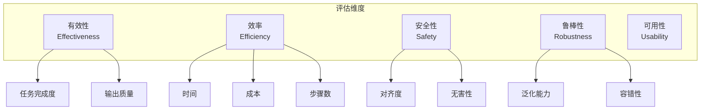
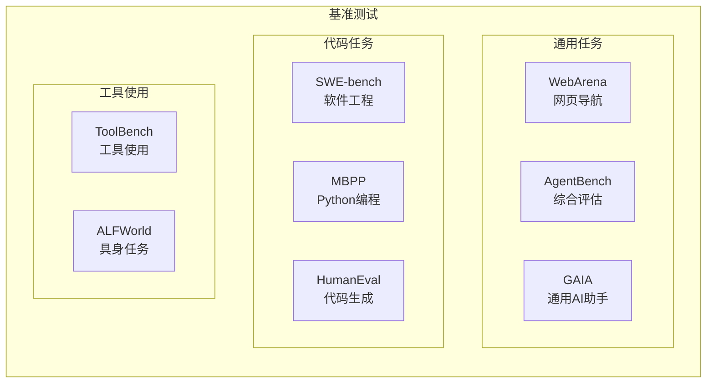
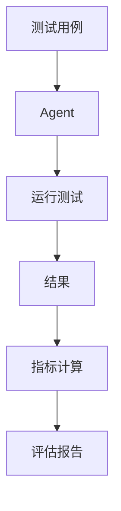
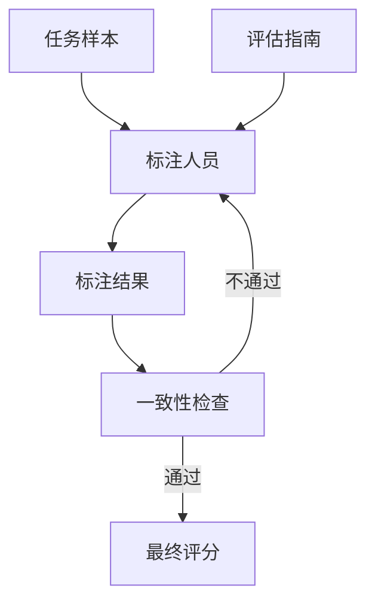
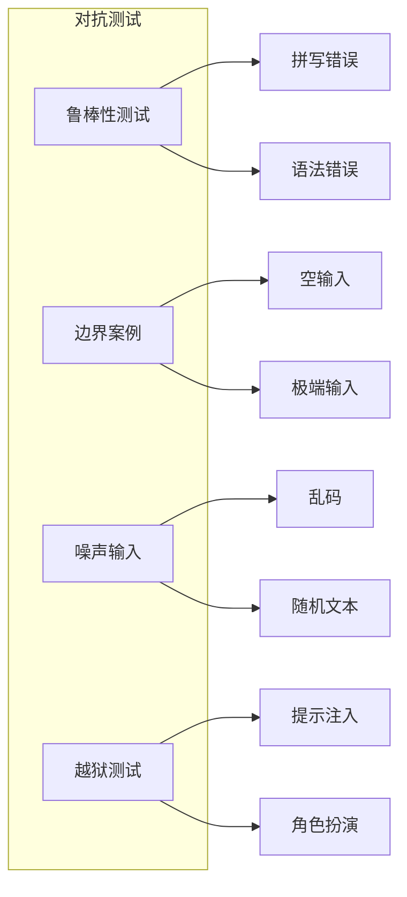
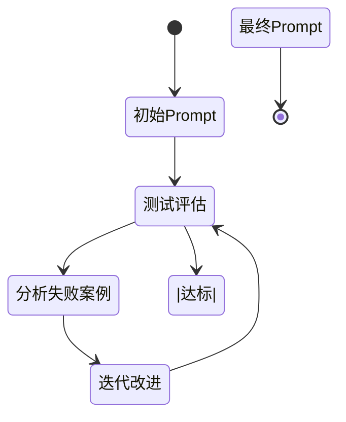
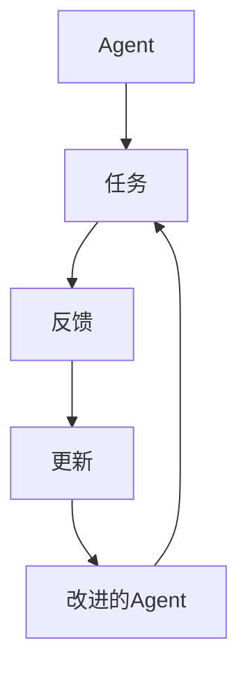
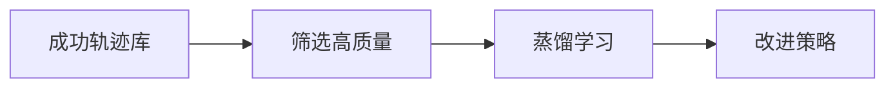
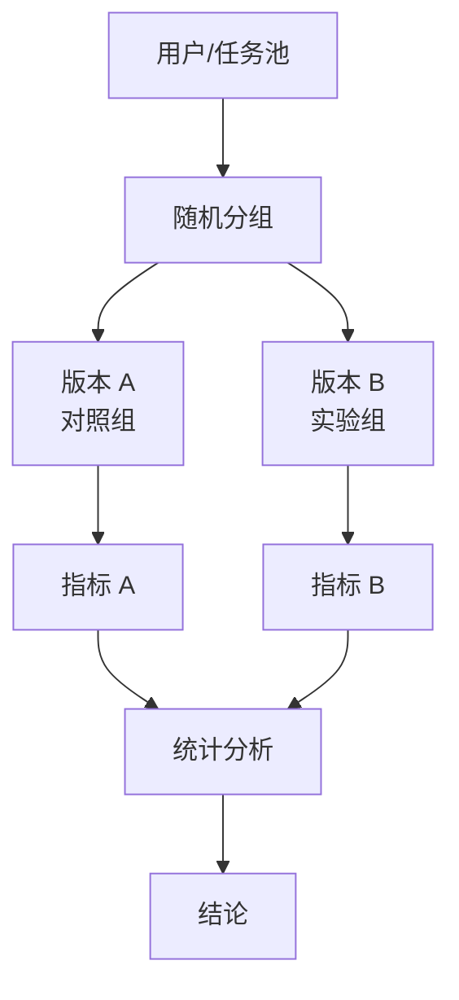

# 第11课：Agent 评估与优化

## 11.1 评估基准与指标

### 评估维度



### 核心指标

| 指标类别 | 具体指标 | 计算方式 |
|---------|---------|---------|
| **任务指标** | 成功率 | 成功任务数 / 总任务数 |
| | 完成率 | 完成的子任务数 / 总子任务数 |
| | 准确率 | 正确输出数 / 总输出数 |
| **效率指标** | 平均步骤数 | 总步骤数 / 任务数 |
| | 平均时间 | 总时间 / 任务数 |
| | 成本 | Token 消耗 × 单价 |
| **质量指标** | 有用性 | 用户评分 (1-5) |
| | 连贯性 | 人工评估 |
| | 创造性 | 人工评估 |

---

## 11.2 评估基准

### 常用 Agent 基准测试



### 基准对比

| 基准 | 任务类型 | 难度 | 规模 | 特点 |
|------|---------|------|------|------|
| **GAIA** | 通用助手 | 中高 | 466 题 | 真实世界任务 |
| **WebArena** | 网页导航 | 中高 | 812 题 | 真实网站环境 |
| **SWE-bench** | 软件工程 | 高 | 300+ PR | 真实 GitHub 问题 |
| **ToolBench** | 工具使用 | 中 | 16k+ | 多样化工具 |
| **AgentBench** | 综合评估 | 中高 | 多维度 | 全面评估 |

---

## 11.3 评估方法

### 自动化评估



#### 自动评估类型

| 方法 | 描述 | 优点 | 缺点 |
|------|------|------|------|
| **基于规则** | 硬编码检查逻辑 | 快速、可重复 | 覆盖有限 |
| **执行验证** | 运行代码验证 | 客观准确 | 仅适用于代码 |
| **LLM 评判** | 用 LLM 评估输出 | 灵活、通用 | 可能有偏差 |
| **对比评估** | 与参考输出对比 | 相对客观 | 需要参考答案 |

### LLM 评判示例

```python
def llm_as_judge(output, reference, rubric):
    """
    使用 LLM 作为评判者
    """
    prompt = f"""
    请评估以下 Agent 输出，按照评分标准进行评分。

    参考标准答案：{reference}

    Agent 实际输出：{output}

    评分标准：
    {rubric}

    请给出：
    1. 总分 (0-10)
    2. 分项得分
    3. 详细评语
    """
    return llm(prompt)
```

### 人工评估



#### 人工评估流程

1. **抽样**：从测试集中抽取有代表性的样本
2. **培训**：培训标注人员，理解评估标准
3. **试标**：小规模试标注，校准标准
4. **正式标注**：多位标注人员独立标注
5. **一致性检查**：计算标注者间一致性（如 Fleiss' kappa）
6. **仲裁**：解决分歧，确定最终评分

---

## 11.4 对抗测试

### 对抗测试类型



### 边界案例示例

| 案例类型 | 示例 |
|---------|------|
| **空输入** | ""（空字符串） |
| **极长输入** | 100k token 的文档 |
| **极端数字** | "计算 999999999999999 的阶乘" |
| **歧义输入** | "它是什么？"（无上下文） |
| **矛盾输入** | "告诉我 X，但不要告诉我 X" |

---

## 11.5 优化策略

### Prompt 工程与迭代



### 提示词迭代循环

```python
def prompt_iteration(
    initial_prompt,
    test_cases,
    max_iterations=10
):
    """
    提示词迭代优化
    """
    current_prompt = initial_prompt

    for i in range(max_iterations):
        # 1. 测试当前提示词
        results = evaluate(current_prompt, test_cases)
        score = calculate_score(results)

        print(f"Iteration {i}: Score = {score}")

        # 2. 检查是否达标
        if score >= target_score:
            break

        # 3. 分析失败案例
        failures = analyze_failures(results)

        # 4. 生成改进版提示词
        current_prompt = improve_prompt(
            current_prompt,
            failures
        )

    return current_prompt
```

### 反馈学习



### 成功轨迹蒸馏



#### 蒸馏步骤

1. **收集轨迹**：记录 Agent 的成功执行轨迹
2. **质量筛选**：选择高质量、多样化的轨迹
3. **生成训练数据**：将轨迹转化为训练样本
4. **微调模型**：用成功案例微调
5. **验证改进**：测试验证效果

---

## 11.6 A/B 测试

### 实验设计



### 统计显著性检验

```python
def ab_test(metrics_a, metrics_b, alpha=0.05):
    """
    A/B 测试统计检验
    """
    from scipy import stats

    # t 检验
    t_stat, p_value = stats.ttest_ind(
        metrics_a,
        metrics_b
    )

    significant = p_value < alpha

    return {
        "p_value": p_value,
        "significant": significant,
        "effect_size": (
            (np.mean(metrics_b) - np.mean(metrics_a))
            / np.std(metrics_a)
        )
    }
```

---

## 11.7 DeerFlow 项目代码导读

### DeerFlow 评估与优化架构

DeerFlow 内置了多种评估和优化机制，包括记忆系统的反馈循环、上下文摘要优化、中间件链的可配置性等。

### 记忆系统的反馈学习

**文件**: `backend/src/agents/memory/updater.py`

```python
class MemoryUpdater:
    """
    记忆更新器：从对话中学习，持续优化
    """

    def __init__(self, config: MemoryConfig):
        self.config = config
        self.model = None  # 懒加载

    def update_memory(
        self,
        memory_data: MemoryData,
        conversation: list[BaseMessage],
    ) -> MemoryData:
        """
        反馈学习循环：
        1. 分析对话历史
        2. 提取新事实
        3. 更新用户上下文
        4. 修剪旧事实
        """
        updated = MemoryData(**attr.asdict(memory_data))

        # 过滤：只保留用户输入和最终 AI 响应
        filtered = self._filter_conversation(conversation)

        if not filtered:
            return updated

        # LLM 驱动的更新
        user_context_update = self._update_user_context(
            updated.user_context,
            filtered,
        )
        updated.user_context = user_context_update

        # 提取新事实
        new_facts = self._extract_facts(filtered)
        for fact in new_facts:
            updated = self._add_or_update_fact(updated, fact)

        # 修剪：只保留置信度最高的 N 个事实
        if len(updated.facts) > self.config.max_facts:
            updated.facts = sorted(
                updated.facts,
                key=lambda f: (f.confidence, f.created_at),
                reverse=True,
            )[: self.config.max_facts]

        return updated
```

### 记忆队列：防抖与批量更新

**文件**: `backend/src/agents/memory/queue.py`

```python
class MemoryUpdateQueue:
    """
    防抖记忆更新队列：优化 LLM 调用频率
    """

    def __init__(self, updater: MemoryUpdater, config: MemoryConfig):
        self.updater = updater
        self.debounce_seconds = config.debounce_seconds
        self._queue: dict[str, QueuedUpdate] = {}
        self._thread: Thread | None = None
        self._stop_event = threading.Event()

    def queue_update(
        self,
        thread_id: str,
        memory_path: Path,
        conversation: list[BaseMessage],
    ):
        """
        队列化更新，线程级去重
        """
        self._queue[thread_id] = QueuedUpdate(
            thread_id=thread_id,
            memory_path=memory_path,
            conversation=conversation,
            queued_at=time.time(),
        )
        self._ensure_worker()

    def _worker_loop(self):
        """
        后台工作线程：批量处理更新
        """
        while not self._stop_event.is_set():
            try:
                # 收集到期的更新
                now = time.time()
                ready = [
                    update for update in self._queue.values()
                    if now - update.queued_at >= self.debounce_seconds
                ]

                for update in ready:
                    del self._queue[update.thread_id]
                    self._process_update(update)

                if not ready:
                    time.sleep(1)
            except Exception:
                time.sleep(1)
```

### SummarizationMiddleware：上下文优化

**文件**: `backend/src/agents/middlewares/summarization.py`

```python
class SummarizationMiddleware(AgentMiddleware):
    """
    摘要中间件：自动优化上下文窗口使用
    """

    def __init__(self, config: SummarizationConfig):
        self.config = config
        self.trigger_type = config.trigger.type
        self.trigger_value = config.trigger.value
        self.keep_policy = config.keep_policy

    def _should_summarize(self, state: ThreadState) -> bool:
        """
        判断是否需要摘要：
        - tokens: token 数量达到阈值
        - messages: 消息数量达到阈值
        - fraction: 上下文窗口占比
        """
        if self.trigger_type == "tokens":
            return self._count_tokens(state) >= self.trigger_value
        elif self.trigger_type == "messages":
            return len(state["messages"]) >= self.trigger_value
        elif self.trigger_type == "fraction":
            return self._get_context_fraction(state) >= self.trigger_value
        return False

    def _apply_summary(self, state: ThreadState, summary: str) -> ThreadState:
        """
        应用摘要：保留最近消息，摘要化旧消息
        """
        recent = state["messages"][-self.keep_policy.recent_messages :]
        state["messages"] = [SystemMessage(content=summary)] + recent
        return state
```

### 配置驱动的优化

**文件**: `config.yaml`

```yaml
# 摘要配置：上下文窗口优化
summarization:
  enabled: true
  trigger:
    type: fraction  # tokens|messages|fraction
    value: 0.8     # 80% 时触发
  keep_policy:
    recent_messages: 10      # 保留最近 10 条
    summarize_older: true    # 摘要化旧消息

# 记忆配置：反馈学习
memory:
  enabled: true
  injection_enabled: true
  storage_path: backend/.deer-flow/memory.json
  debounce_seconds: 30       # 防抖 30 秒
  model_name: null           # null = 默认模型
  max_facts: 100            # 最多 100 个事实
  fact_confidence_threshold: 0.7  # 只注入置信度 >= 0.7 的事实
  max_injection_tokens: 2000     # 注入最多 2000 tokens

# 标题生成
title:
  enabled: true
  max_words: 10
  max_chars: 60

# 子 Agent
subagents:
  enabled: true
```

### 模型工厂：动态选择与优化

**文件**: `backend/src/models/factory.py`

```python
_model_cache: dict[str, BaseChatModel] = {}

def create_chat_model(
    name: str,
    thinking_enabled: bool = False,
) -> BaseChatModel:
    """
    创建聊天模型，带缓存优化
    """
    cache_key = f"{name}:{thinking_enabled}"

    if cache_key in _model_cache:
        return _model_cache[cache_key]

    config = get_model_config(name)

    if thinking_enabled and config.get("when_thinking_enabled"):
        config = {**config, **config["when_thinking_enabled"]}

    model_class = resolve_class(config["use"], BaseChatModel)
    resolved = resolve_env_vars(config)

    params = {
        k: v for k, v in resolved.items()
        if k not in ["name", "display_name", "use", "supports_thinking", "supports_vision", "when_thinking_enabled"]
    }

    model = model_class(**params)
    _model_cache[cache_key] = model
    return model
```

### MCP 工具：懒加载与缓存失效

**文件**: `backend/src/mcp/manager.py`

```python
_mcp_tools_cache: list[BaseTool] | None = None
_mcp_tools_mtime: float = 0

def get_cached_mcp_tools() -> list[BaseTool]:
    """
    获取缓存的 MCP 工具，带 mtime 失效
    """
    global _mcp_tools_cache
    global _mcp_tools_mtime

    config_path = get_extensions_config_path()
    current_mtime = config_path.stat().st_mtime if config_path.exists() else 0

    # 检查是否需要重新加载
    if _mcp_tools_cache is None or current_mtime != _mcp_tools_mtime:
        _mcp_tools_cache = _load_mcp_tools()
        _mcp_tools_mtime = current_mtime

    return _mcp_tools_cache
```

### Gateway API：模型列表与管理

**文件**: `backend/src/gateway/routers/models.py`

```python
from fastapi import APIRouter
from src.config import load_config

router = APIRouter()

@router.get("/")
def list_models():
    """
    列出所有可用模型
    """
    config = load_config()
    return {
        "models": [
            {
                "name": m.name,
                "display_name": m.display_name,
                "supports_thinking": m.supports_thinking,
                "supports_vision": m.supports_vision,
            }
            for m in config.models
        ]
    }

@router.get("/{name}")
def get_model(name: str):
    """
    获取特定模型详情
    """
    config = load_config()
    for m in config.models:
        if m.name == name:
            return {
                "name": m.name,
                "display_name": m.display_name,
                "supports_thinking": m.supports_thinking,
                "supports_vision": m.supports_vision,
            }
    raise HTTPException(status_code=404, detail="Model not found")
```

### 测试套件

**文件**: `backend/tests/`

```
backend/tests/
├── conftest.py                          # pytest 配置
├── test_client.py                       # 嵌入式客户端测试
├── test_client_live.py                  # 集成测试
├── test_config.py                       # 配置系统测试
├── test_docker_sandbox_mode_detection.py  # Docker 模式检测
├── test_memory.py                       # 记忆系统测试
├── test_provisioner_kubeconfig.py      # 配置处理测试
└── test_sandbox.py                      # 沙箱测试
```

### 运行测试

```bash
# 运行所有测试
cd backend
make test

# 运行特定测试文件
PYTHONPATH=. uv run pytest tests/test_memory.py -v

# Gateway 一致性测试
# 验证嵌入式客户端与 Gateway API 的兼容性
PYTHONPATH=. uv run pytest tests/test_client.py::TestGatewayConformance -v
```

### 关键代码文件索引

| 模块 | 文件路径 | 说明 |
|------|----------|------|
| **记忆更新器** | `src/agents/memory/updater.py` | 反馈学习 |
| **记忆队列** | `src/agents/memory/queue.py` | 防抖批量更新 |
| **摘要中间件** | `src/agents/middlewares/summarization.py` | 上下文优化 |
| **模型工厂** | `src/models/factory.py` | 动态选择 + 缓存 |
| **MCP 管理** | `src/mcp/manager.py` | 懒加载 + mtime 失效 |
| **模型路由** | `src/gateway/routers/models.py` | 模型列表 API |
| **测试套件** | `tests/` | 单元测试 + 集成测试 |

---

## 11.8 小结

**本节课要点：**

1. ✅ 评估维度包括有效性、效率、安全性、鲁棒性和可用性
2. ✅ 常用基准包括 GAIA、WebArena、SWE-bench、ToolBench 等
3. ✅ 评估方法包括自动化评估、人工评估和对抗测试
4. ✅ 优化策略包括提示词迭代、反馈学习和成功轨迹蒸馏
5. ✅ A/B 测试帮助验证改进效果

**下节课预告：**
我们将学习高级记忆技术。

---

## 参考资料

- [GAIA: A Benchmark for General AI Assistants](https://arxiv.org/abs/2311.12983)
- [WebArena: A Realistic Web Environment for Building Autonomous Agents](https://arxiv.org/abs/2307.13854)
- [SWE-bench: Can Language Models Resolve Real-World GitHub Issues?](https://arxiv.org/abs/2310.06770)
- [AgentBench: Evaluating LLMs as Agents](https://arxiv.org/abs/2308.03688)
