# 第12课：高级记忆技术

## 12.1 长期记忆架构

### 记忆层级设计

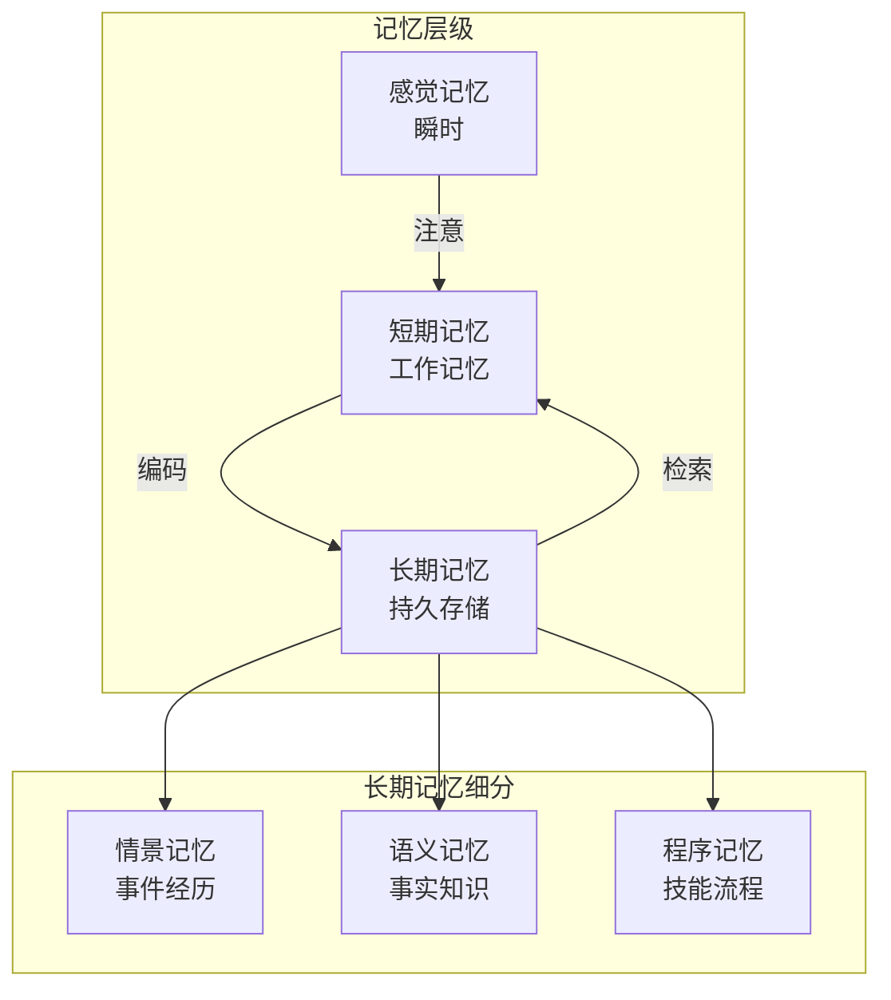

### 长期记忆架构

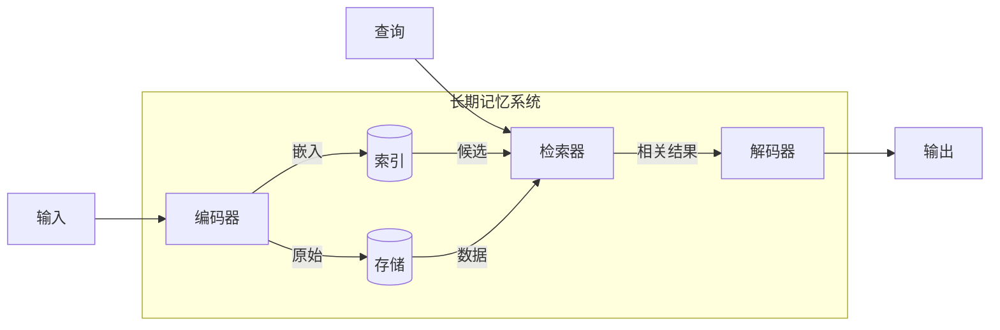

---

## 12.2 知识图谱集成

### 知识图谱基础

```mermaid
graph LR
    subgraph KG [知识图谱]
        E1[实体1<br>北京]
        E2[实体2<br>中国]
        E3[实体3<br>天安门]
        R1[关系<br>首都]
        R2[关系<br>位于]
    end

    E1 -->|是| R1
    R1 -->|的| E2
    E3 -->|| R2
    R2 -->|在| E1
```

### 混合记忆架构

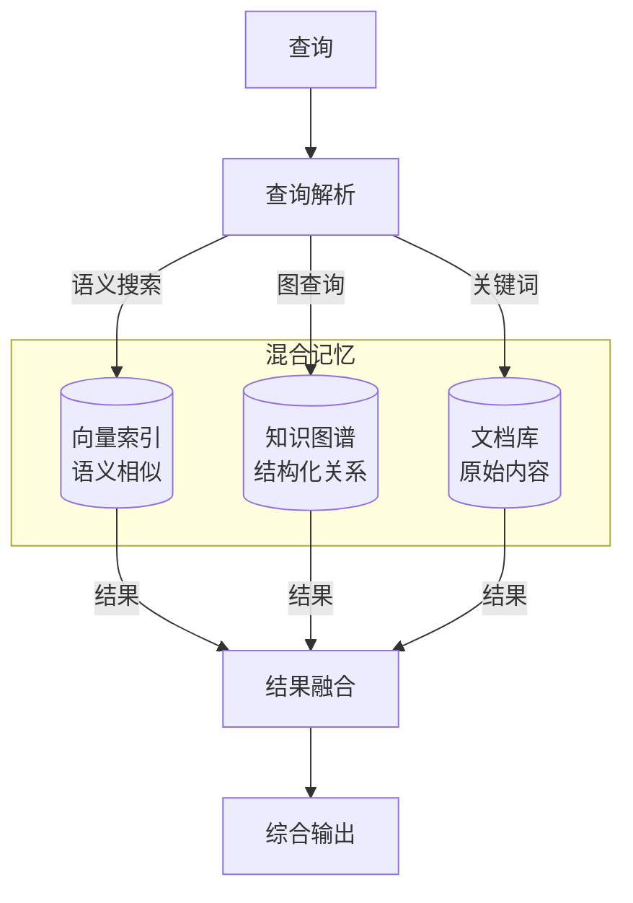

### RAG + 知识图谱

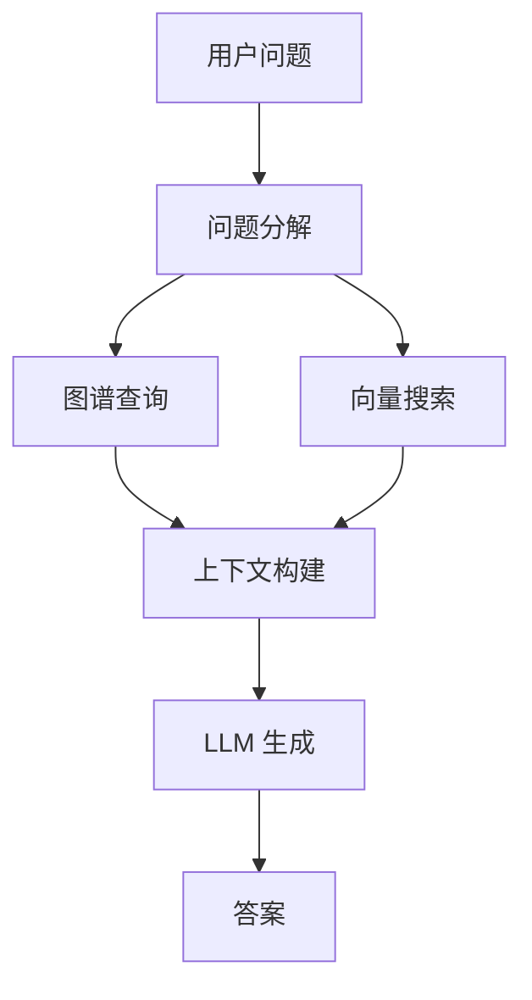

---

## 12.3 时序记忆建模

### 时间序列记忆

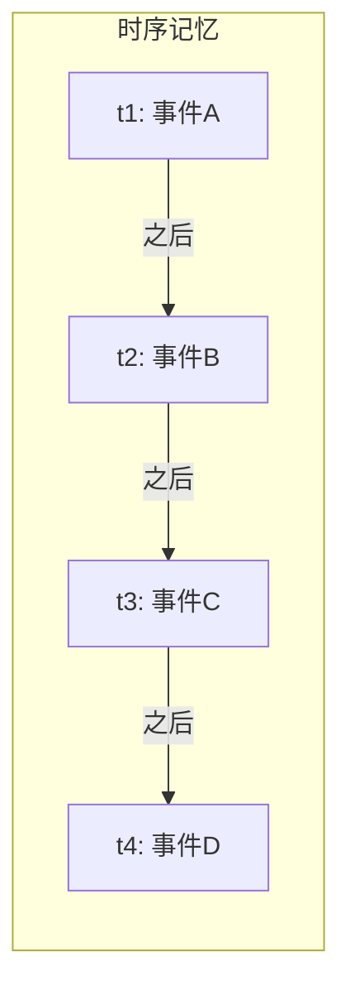

### 时间衰减函数

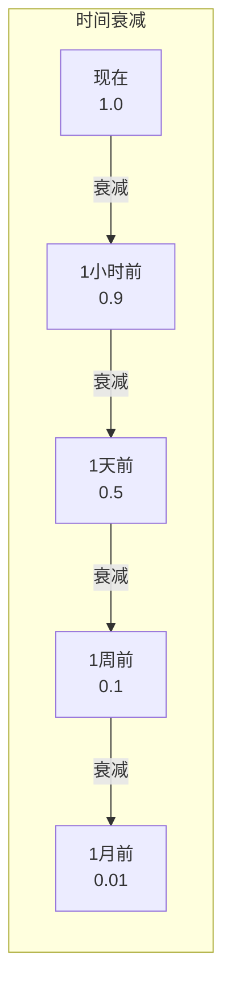

**指数衰减公式：**
$$
w(t) = e^{-\lambda \cdot \Delta t}
$$

其中 $\Delta t$ 是时间差，$\lambda$ 是衰减系数。

### 时序检索增强

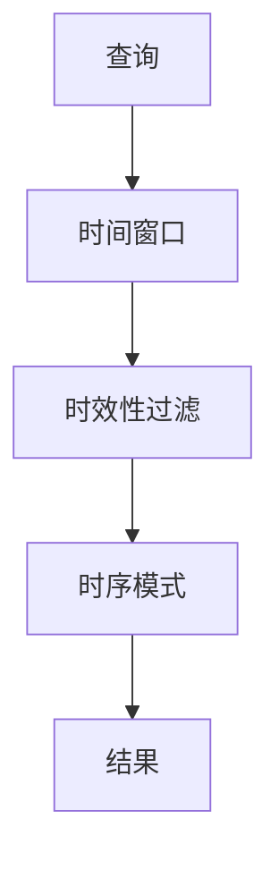

---

## 12.4 分层检索策略

### 多层级索引

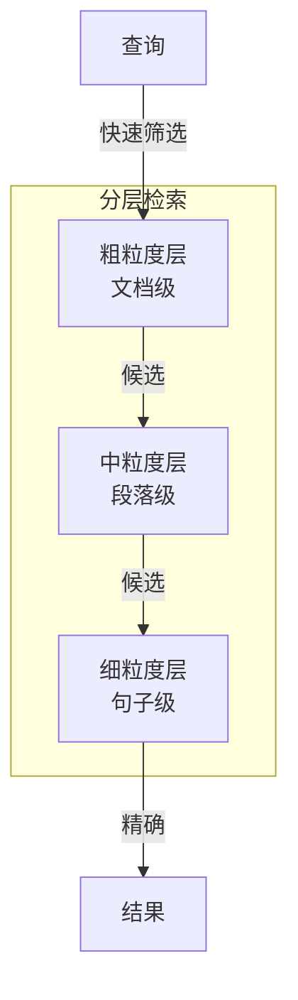

### 检索流程

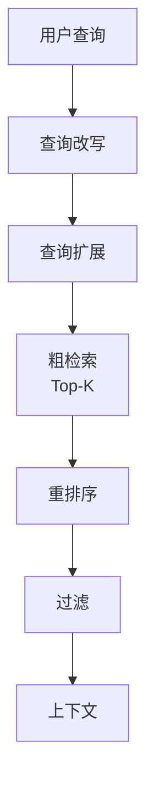

---

## 12.5 重排序与过滤

### 重排序模型

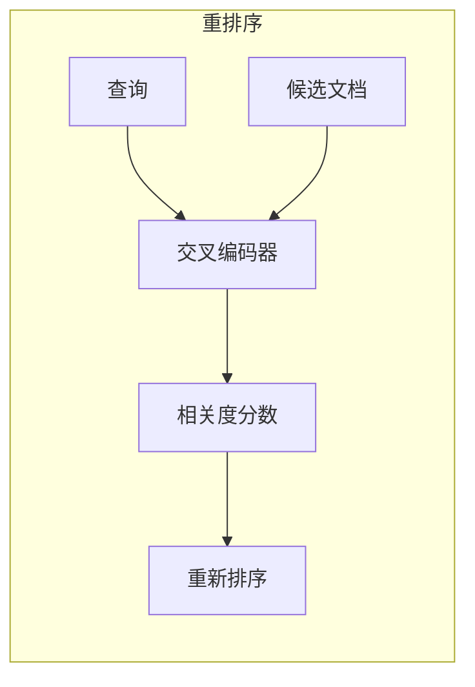

### 常用重排序方法

| 方法 | 描述 | 优点 | 缺点 |
|------|------|------|------|
| **交叉编码器** | 同时处理查询和文档 | 准确度高 | 速度慢 |
| **双向编码器** | 分别编码后计算相似度 | 速度快 | 准确度稍低 |
| **RRF 融合** | 倒数秩融合 | 简单有效 | 需要多个排序 |
| **LLM 重排序** | 用 LLM 评估相关性 | 灵活 | 成本高 |

### 过滤策略

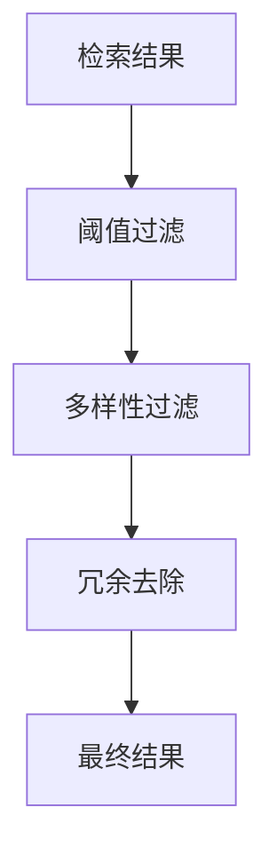

---

## 12.6 记忆编辑与遗忘

### 记忆更新机制

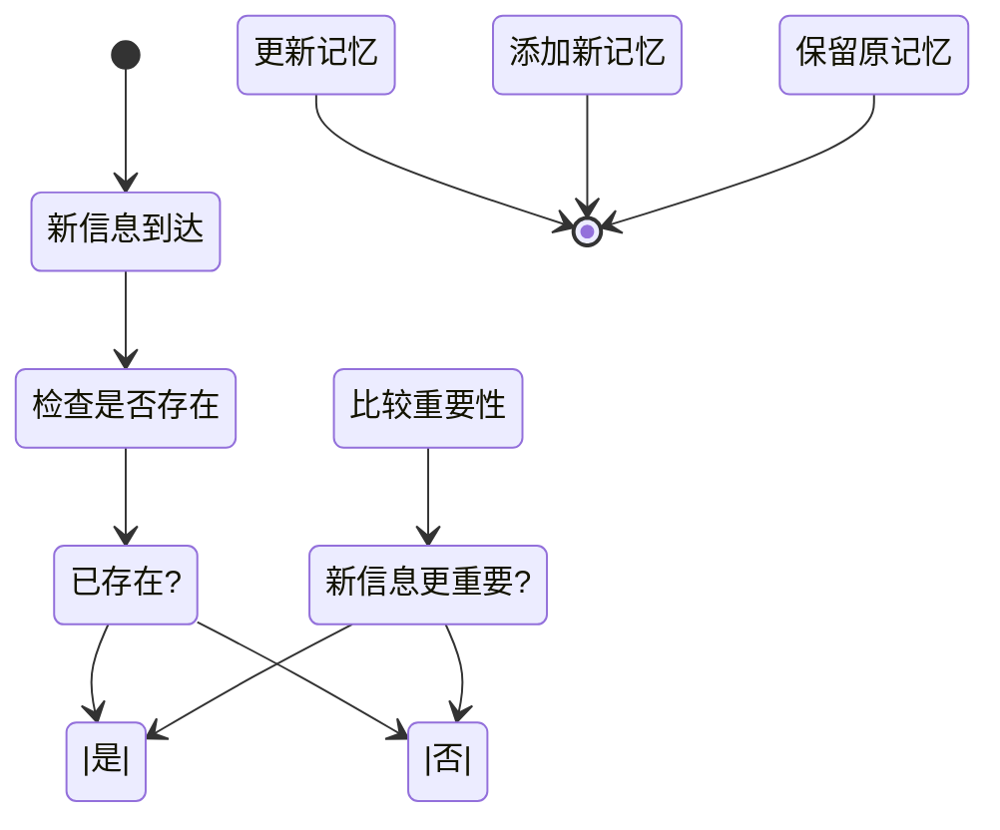

### 错误记忆修正

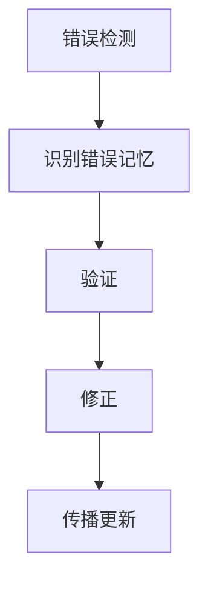

### 选择性遗忘

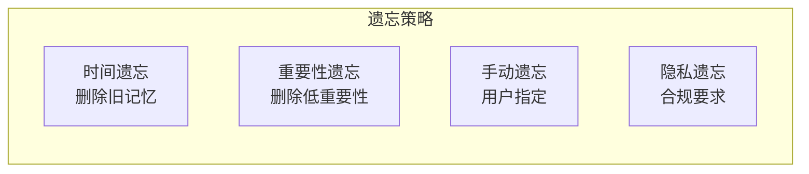

---

## 12.7 上下文窗口优化

### 上下文压缩

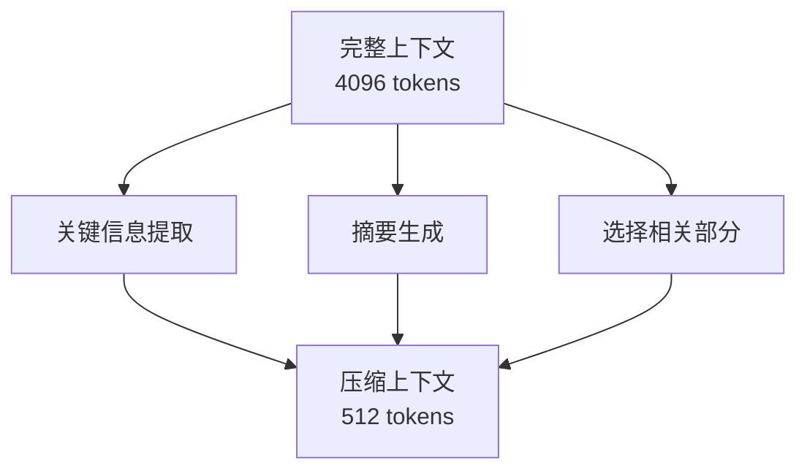

### 滚动窗口策略

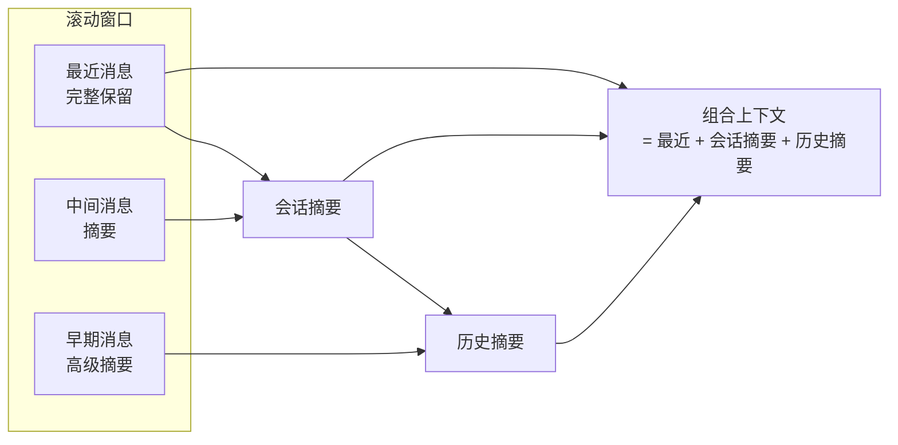

---

## 12.8 DeerFlow 项目代码导读

### DeerFlow 高级记忆技术

DeerFlow 实现了多种高级记忆技术，包括事实记忆、上下文摘要、记忆编辑与遗忘机制等。

### 长期记忆架构：MemoryData

**文件**: `backend/src/agents/memory/models.py`

```python
from dataclasses import dataclass, field
from typing import Literal

@dataclass
class UserContext:
    """
    用户上下文：概括性的长期记忆
    """
    work_context: str | None = None
    personal_context: str | None = None
    top_of_mind: str | None = None

@dataclass
class History:
    """
    历史记忆：时间分层的摘要
    """
    recent_months: str | None = None
    earlier_context: str | None = None
    long_term_background: str | None = None

@dataclass
class Fact:
    """
    事实记忆：带置信度的离散事实
    """
    id: str
    content: str
    category: Literal["preference", "knowledge", "context", "behavior", "goal"]
    confidence: float  # 0-1
    created_at: str
    source: str | None = None

@dataclass
class MemoryData:
    """
    完整的记忆数据结构
    """
    version: int = 1
    user_context: UserContext = field(factory=UserContext)
    history: History = field(factory=History)
    facts: list[Fact] = field(factory=list)
    _cached_mtime: float | None = field(default=None, repr=False, eq=False)
```

### 记忆提取：LLM 驱动的事实提取

**文件**: `backend/src/agents/memory/updater.py`

```python
class MemoryUpdater:
    """
    使用 LLM 从对话中提取记忆
    """

    def _extract_facts(self, conversation: list[BaseMessage]) -> list[Fact]:
        """
        提取新事实，带置信度评分
        """
        prompt = self._build_fact_extraction_prompt(conversation)
        response = self._get_model().invoke(prompt)
        return self._parse_facts_response(response)

    def _add_or_update_fact(
        self,
        memory_data: MemoryData,
        new_fact: Fact,
    ) -> MemoryData:
        """
        添加或更新事实：
        - 如果内容相似，更新置信度
        - 否则添加新事实
        """
        # 查找相似事实
        existing_idx = None
        for i, fact in enumerate(memory_data.facts):
            if self._is_similar_fact(fact, new_fact):
                existing_idx = i
                break

        if existing_idx is not None:
            # 更新现有事实
            existing = memory_data.facts[existing_idx]
            if new_fact.confidence > existing.confidence:
                memory_data.facts[existing_idx] = new_fact
        else:
            # 添加新事实
            memory_data.facts.append(new_fact)

        return memory_data
```

### 记忆注入：构建记忆上下文

**文件**: `backend/src/agents/memory/updater.py`

```python
def build_memory_context(
    memory_data: MemoryData,
    max_tokens: int = 2000,
    fact_confidence_threshold: float = 0.7,
) -> str:
    """
    构建记忆上下文，限制 token 数量
    """
    # 1. 按置信度排序事实，取 Top 15
    sorted_facts = sorted(
        [
            f for f in memory_data.facts
            if f.confidence >= fact_confidence_threshold
        ],
        key=lambda f: f.confidence,
        reverse=True,
    )[:15]

    # 2. 构建事实部分
    facts_section = ""
    if sorted_facts:
        facts_section = "## 重要事实\n"
        for fact in sorted_facts:
            facts_section += f"- [{fact.category}] {fact.content} (置信度: {fact.confidence:.2f})\n"

    # 3. 构建用户上下文部分
    user_context_section = ""
    context_parts = []
    if memory_data.user_context.work_context:
        context_parts.append(f"**工作**: {memory_data.user_context.work_context}")
    if memory_data.user_context.personal_context:
        context_parts.append(f"**个人**: {memory_data.user_context.personal_context}")
    if memory_data.user_context.top_of_mind:
        context_parts.append(f"**当前关注**: {memory_data.user_context.top_of_mind}")

    if context_parts:
        user_context_section = "## 用户上下文\n" + "\n".join(context_parts)

    # 4. 组合成最终的记忆上下文
    return MEMORY_INJECTION_TEMPLATE.format(
        facts_section=facts_section,
        user_context_section=user_context_section,
    )
```

### MemoryMiddleware：记忆的注入与队列化更新

**文件**: `backend/src/agents/middlewares/memory.py`

```python
class MemoryMiddleware(AgentMiddleware):
    """
    记忆中间件：
    - before_model: 注入记忆到系统提示
    - after_model: 队列化记忆更新
    """

    def __init__(
        self,
        memory_config: MemoryConfig,
        queue: MemoryUpdateQueue | None = None,
    ):
        self.config = memory_config
        self.queue = queue or MemoryUpdateQueue(
            MemoryUpdater(memory_config),
            memory_config,
        )

    def before_model(self, state: ThreadState) -> ThreadState:
        """
        在 LLM 调用前：注入记忆
        """
        if not self.config.injection_enabled:
            return state

        # 加载记忆
        memory_data = self._load_memory()

        # 构建记忆上下文
        memory_context = build_memory_context(
            memory_data,
            max_tokens=self.config.max_injection_tokens,
            fact_confidence_threshold=self.config.fact_confidence_threshold,
        )

        # 注入到系统提示
        state = self._inject_memory_into_prompt(state, memory_context)
        return state

    def after_model(self, state: ThreadState) -> ThreadState:
        """
        在 LLM 调用后：队列化更新
        """
        if not self.config.enabled:
            return state

        # 过滤消息：只保留用户输入和最终 AI 响应
        messages = self._filter_relevant_messages(state["messages"])

        if messages:
            self.queue.queue_update(
                thread_id=state.get("thread_id", "unknown"),
                memory_path=Path(self.config.storage_path),
                conversation=messages,
            )

        return state
```

### 记忆提示模板

**文件**: `backend/src/agents/memory/prompts.py`

```python
# 记忆注入模板
MEMORY_INJECTION_TEMPLATE = """
<memory>
以下是关于用户的重要信息（按相关性排序）：

{facts_section}

{user_context_section}
</memory>
"""

# 事实提取提示
FACT_EXTRACTION_PROMPT = """
请分析以下对话，提取关于用户的离散事实。

每个事实应该：
- 具体、可验证
- 包含置信度评分（0-1）
- 分类：preference/knowledge/context/behavior/goal

对话：
{conversation}

请返回 JSON 格式的事实列表。
"""

# 用户上下文更新提示
USER_CONTEXT_UPDATE_PROMPT = """
请根据对话更新用户的上下文摘要。

当前上下文：
{current_context}

新对话：
{conversation}

请更新：
- work_context：工作相关
- personal_context：个人相关
- top_of_mind：当前关注
"""
```

### 持久化：原子性文件 I/O

**文件**: `backend/src/agents/memory/updater.py`

```python
import tempfile
import os

def save_memory_data(memory_data: MemoryData, path: Path):
    """
    原子性保存：临时文件 + 重命名
    避免崩溃导致数据损坏
    """
    data = attr.asdict(memory_data)
    data["_mtime"] = time.time()

    # 写入临时文件
    temp_path = path.with_suffix(path.suffix + ".tmp")
    with temp_path.open("w") as f:
        json.dump(data, f, indent=2)

    # 原子重命名
    os.replace(temp_path, path)

def load_memory_data(path: Path) -> MemoryData:
    """
    加载记忆数据，带 mtime 缓存
    """
    if not path.exists():
        return MemoryData()

    with path.open() as f:
        data = json.load(f)

    data.pop("_mtime", None)
    return MemoryData(**data)
```

### 记忆配置

**文件**: `config.yaml`

```yaml
memory:
  enabled: true
  injection_enabled: true
  storage_path: backend/.deer-flow/memory.json
  debounce_seconds: 30       # 防抖等待时间
  model_name: null           # null = 默认模型
  max_facts: 100            # 最多存储 100 个事实
  fact_confidence_threshold: 0.7  # 注入阈值
  max_injection_tokens: 2000     # 注入 token 限制
```

### 工件存储：ThreadState 中的 artifacts

**文件**: `backend/src/agents/thread_state.py`

```python
def merge_artifacts(old: list[str] | None, new: list[str]) -> list[str]:
    """
    合并工件列表，去重但保持顺序
    """
    combined = (old or []) + new
    seen = set()
    result = []
    for item in combined:
        if item not in seen:
            seen.add(item)
            result.append(item)
    return result

class ThreadState(TypedDict):
    messages: Annotated[Sequence[BaseMessage], add_messages]
    artifacts: Annotated[list[str] | None, merge_artifacts]  # 工件存储
    # ...
```

### Gateway API：记忆管理

**文件**: `backend/src/gateway/routers/memory.py`

```python
from fastapi import APIRouter
from src.agents.memory import (
    load_memory_data,
    get_memory_status,
    reload_memory,
)

router = APIRouter()

@router.get("/")
def get_memory():
    """获取记忆数据"""
    return load_memory_data()

@router.post("/reload")
def reload_memory_endpoint():
    """强制重新加载记忆"""
    reload_memory()
    return {"success": True}

@router.get("/config")
def get_memory_config():
    """获取记忆配置"""
    config = load_config()
    return config.memory

@router.get("/status")
def get_memory_status_endpoint():
    """获取记忆状态（配置 + 数据）"""
    return get_memory_status()
```

### 关键代码文件索引

| 模块 | 文件路径 | 说明 |
|------|----------|------|
| **记忆模型** | `src/agents/memory/models.py` | `MemoryData`, `Fact`, `UserContext` |
| **记忆更新器** | `src/agents/memory/updater.py` | LLM 事实提取 |
| **记忆队列** | `src/agents/memory/queue.py` | 防抖批量更新 |
| **记忆提示** | `src/agents/memory/prompts.py` | 提示模板 |
| **记忆中间件** | `src/agents/middlewares/memory.py` | 注入 + 队列化 |
| **记忆路由** | `src/gateway/routers/memory.py` | 记忆管理 API |
| **线程状态** | `src/agents/thread_state.py` | `merge_artifacts` |

---

## 12.9 小结

**本节课要点：**

1. ✅ 长期记忆可分为情景记忆、语义记忆和程序记忆
2. ✅ 知识图谱可以增强记忆的结构化关系查询
3. ✅ 时序记忆考虑时间衰减和时序模式
4. ✅ 分层检索和重排序提升检索质量
5. ✅ 记忆编辑和遗忘机制保持记忆的准确性和时效性

**下节课预告：**
我们将学习前沿架构创新，包括 Claude Agents、Gemini Agentic 系统等。

---

## 参考资料

- [Generative Agents: Interactive Simulacra of Human Behavior](https://arxiv.org/abs/2304.03442)
- [Retrieval-Augmented Generation for Knowledge-Intensive NLP Tasks](https://arxiv.org/abs/2005.11401)
- [Lost in the Middle: How Language Models Use Long Contexts](https://arxiv.org/abs/2307.03172)
- [GraphRAG: Unlocking LLM Discovery on Private Data](https://www.microsoft.com/en-us/research/blog/graphrag-unlocking-llm-discovery-on-private-data/)
