# 第13课：前沿架构创新

## 13.1 Claude Agents：Anthropic 的 Agent 设计理念

### Claude 扩展上下文

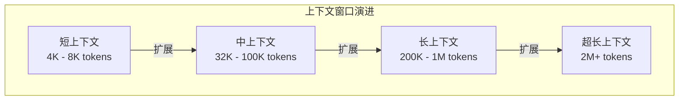

### Claude 工具使用设计

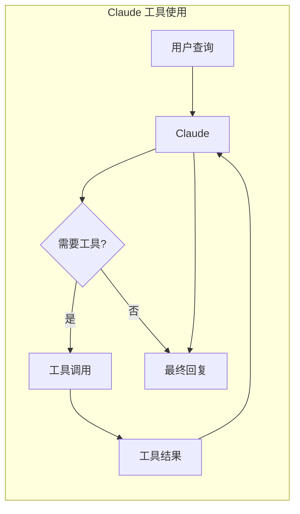

### Claude Agent 特性

| 特性 | 说明 |
|------|------|
| **长上下文** | 支持 200K+ tokens 上下文 |
| **结构化输出** | 更好的工具调用格式 |
| **思考能力** | 内置推理能力 |
| **多模态** | 支持图像理解 |
| **安全对齐** |  Constitutional AI |

### 提示词优化策略

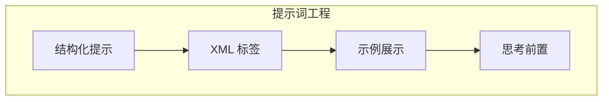

**结构化提示示例：**

```xml
<task>
你是一个研究助手，帮助用户查找和分析信息。
</task>

<rules>
1. 首先思考需要什么信息
2. 必要时使用搜索工具
3. 综合多个来源的信息
4. 引用信息来源
</rules>

<input>
{USER_QUERY}
</input>

<thinking>
让我分析这个问题...
</thinking>
```

---

## 13.2 Gemini Agentic 系统

### 多模态 Agent 架构

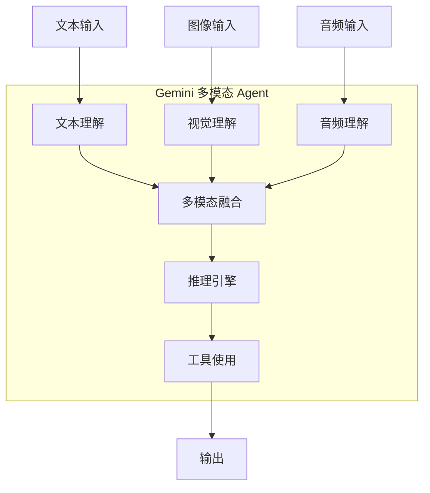

### 多模态工具使用

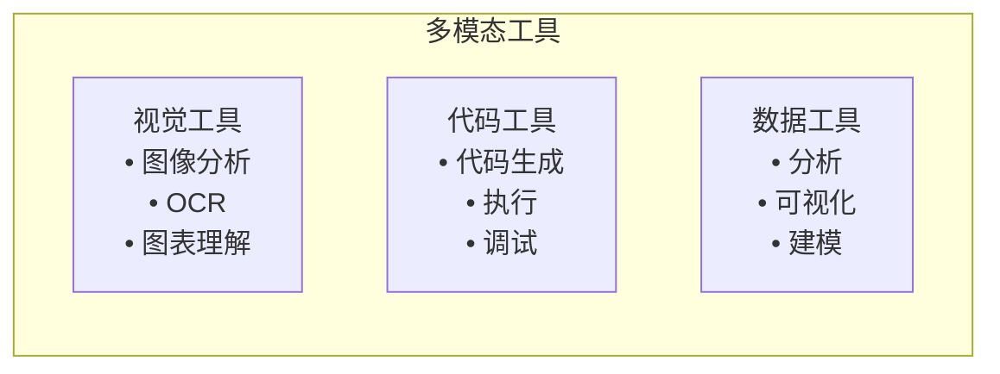

### Gemini Agent 工作流

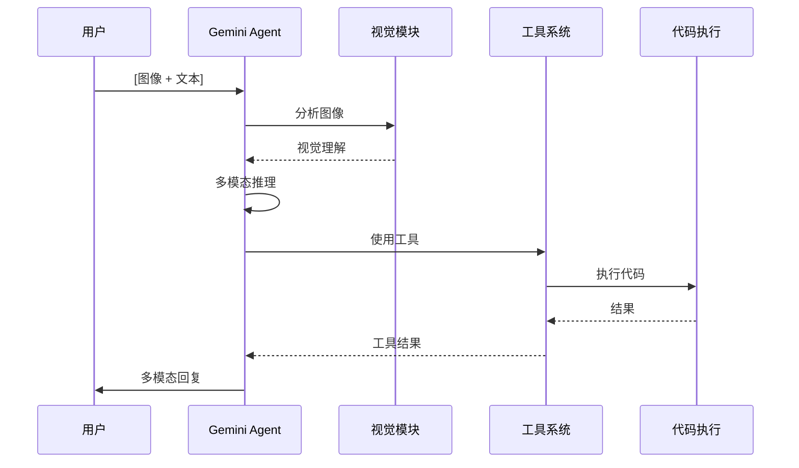

---

## 13.3 DeepSeek 推理框架

### DeepSeek 长文档处理

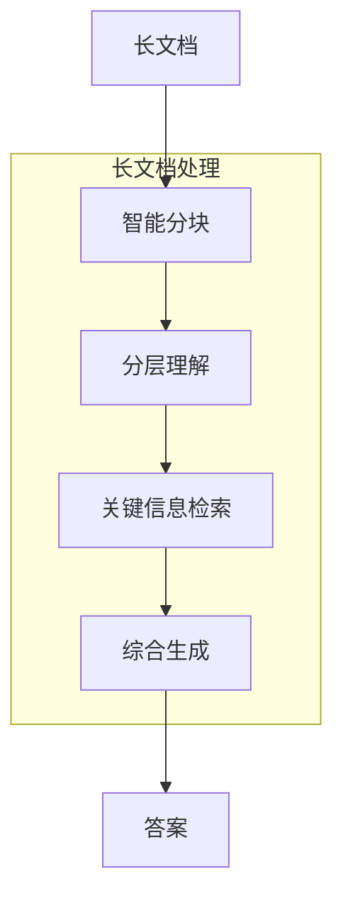

### DeepSeek 代码 Agent

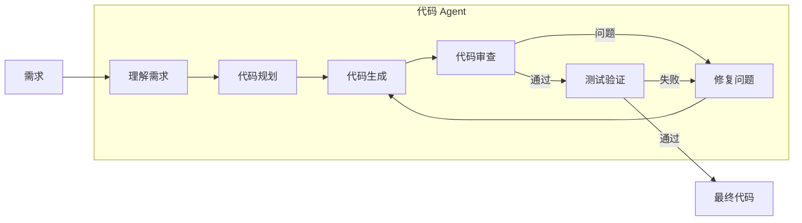

---

## 13.4 字节跳动 Agent 探索

### 豆包 Agent 架构

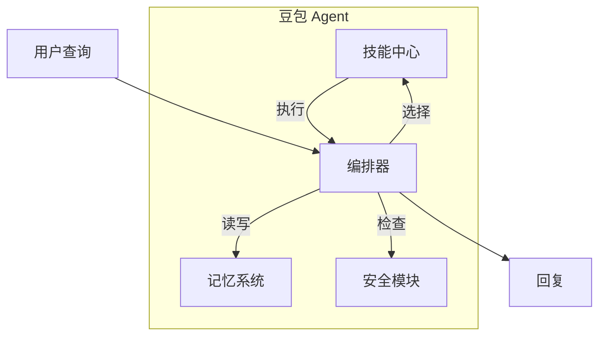

### 技能库设计

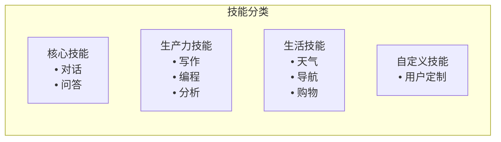

---

## 13.5 架构对比

| 特性 | Claude Agents | Gemini Agentic | DeepSeek | 字节跳动 |
|------|---------------|----------------|----------|----------|
| **上下文长度** | 200K+ | 1M+ | 128K+ | 32K+ |
| **多模态** | 图像 | 图像、音频、视频 | 文本为主 | 多模态 |
| **代码能力** | 强 | 强 | 很强 | 中强 |
| **长文档** | 优秀 | 优秀 | 极佳 | 良好 |
| **工具使用** | 原生支持 | 原生支持 | 支持 | 技能库 |

---

## 13.6 前沿趋势

### 长上下文 + RAG 混合

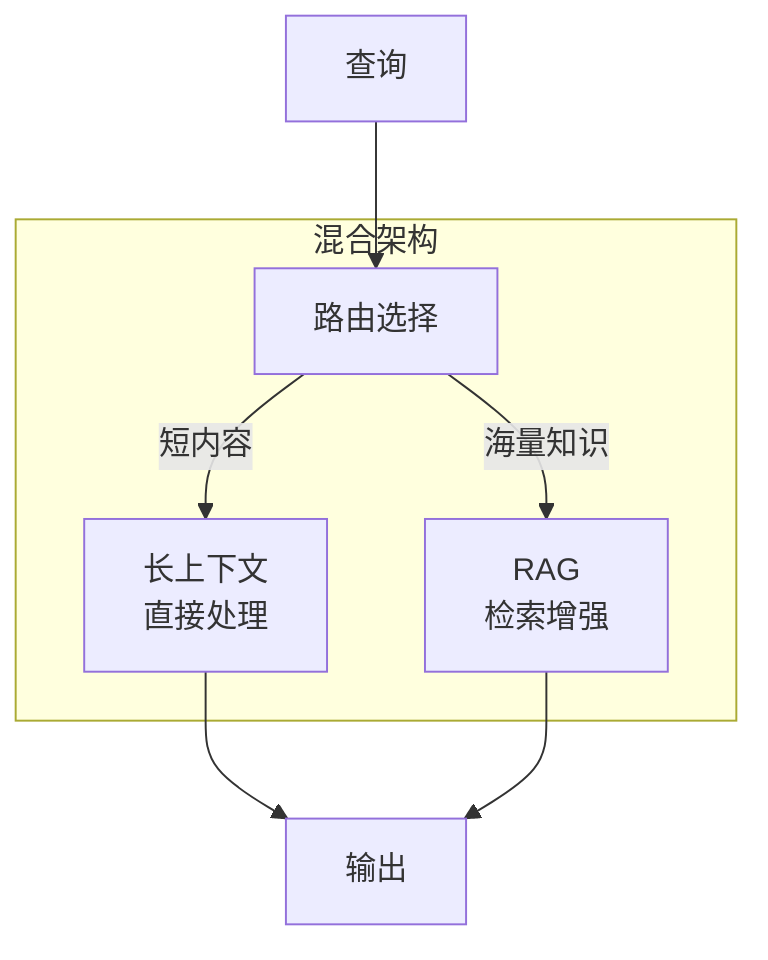

### 自我改进 Agent

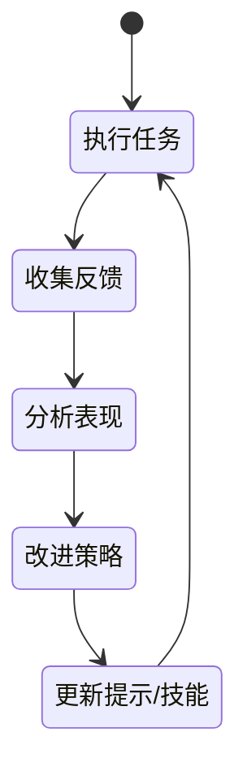

### 多 Agent 生态系统

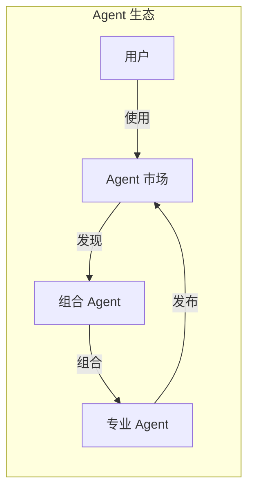

---

## 13.7 DeerFlow 项目代码导读

### DeerFlow 的前沿架构设计

DeerFlow 融合了多种前沿架构思想，包括 Claude 的长上下文、LangGraph 的状态机、可扩展的工具系统等。

### 动态模型选择：支持多种模型

**文件**: `backend/src/models/factory.py`

```python
from typing import Any
from langchain_core.language_models import BaseChatModel
from src.reflection import resolve_class
from src.config import load_config, ModelConfig

_model_cache: dict[str, BaseChatModel] = {}

def create_chat_model(
    name: str,
    thinking_enabled: bool = False,
) -> BaseChatModel:
    """
    动态创建聊天模型
    - 支持多种提供商 (OpenAI, Anthropic, DeepSeek, ...)
    - 支持 thinking 模式
    - 支持 vision 能力
    """
    cache_key = f"{name}:{thinking_enabled}"

    if cache_key in _model_cache:
        return _model_cache[cache_key]

    # 从配置加载模型配置
    config = get_model_config(name)

    # 思考模式覆盖
    if thinking_enabled and config.get("when_thinking_enabled"):
        config = {**config, **config["when_thinking_enabled"]}

    # 通过反射系统加载模型类
    model_class = resolve_class(config["use"], BaseChatModel)

    # 解析环境变量
    resolved = resolve_env_vars(config)

    # 移除内部字段
    params = {
        k: v for k, v in resolved.items()
        if k not in ["name", "display_name", "use", "supports_thinking", "supports_vision", "when_thinking_enabled"]
    }

    # 创建模型实例
    model = model_class(**params)
    _model_cache[cache_key] = model
    return model

def get_model_config(name: str) -> ModelConfig:
    """获取模型配置"""
    config = load_config()
    for m in config.models:
        if m.name == name:
            return m
    raise ValueError(f"Model not found: {name}")
```

### 模型配置：config.yaml

**文件**: `config.yaml`

```yaml
models:
  - name: gpt-4o
    display_name: GPT-4o
    use: langchain_openai:ChatOpenAI
    model: gpt-4o
    api_key: $OPENAI_API_KEY
    supports_thinking: false
    supports_vision: true

  - name: claude-3-5-sonnet
    display_name: Claude 3.5 Sonnet
    use: langchain_anthropic:ChatAnthropic
    model: claude-3-5-sonnet-20241022
    api_key: $ANTHROPIC_API_KEY
    supports_thinking: true
    supports_vision: true
    when_thinking_enabled:
      max_tokens: 8192
      temperature: 0.7

  - name: deepseek-chat
    display_name: DeepSeek Chat
    use: langchain_deepseek:ChatDeepSeek
    model: deepseek-chat
    api_key: $DEEPSEEK_API_KEY
    supports_thinking: false
    supports_vision: false
```

### LangGraph 状态机：灵活的工作流

**文件**: `backend/src/agents/lead_agent/agent.py`

```python
from langgraph.graph import StateGraph, END
from langgraph.prebuilt import ToolNode
from langgraph.checkpoint.memory import MemorySaver

def make_lead_agent(config: RunnableConfig) -> StateGraph:
    """
    创建 Lead Agent 的 LangGraph 状态图
    """
    configurable = config.get("configurable", {})

    # 1. 创建模型
    model = create_chat_model(
        configurable.get("model_name"),
        configurable.get("thinking_enabled", False),
    )

    # 2. 加载工具
    tools = get_available_tools(
        include_mcp=True,
        model_name=configurable.get("model_name"),
        subagent_enabled=configurable.get("subagent_enabled", False),
    )
    model_with_tools = model.bind_tools(tools)

    # 3. 构建状态图
    graph = StateGraph(ThreadState)

    # 4. 定义节点
    def agent_node(state: ThreadState) -> ThreadState:
        messages = state["messages"]
        response = model_with_tools.invoke(messages)
        return {"messages": [response]}

    tool_node = ToolNode(tools)

    # 5. 添加节点
    graph.add_node("agent", agent_node)
    graph.add_node("tools", tool_node)

    # 6. 条件边
    def should_continue(state: ThreadState) -> Literal["continue", "end"]:
        messages = state["messages"]
        last_message = messages[-1]
        if hasattr(last_message, "tool_calls") and last_message.tool_calls:
            return "continue"
        return "end"

    # 7. 设置边
    graph.set_entry_point("agent")
    graph.add_conditional_edges(
        "agent",
        should_continue,
        {
            "continue": "tools",
            "end": END,
        },
    )
    graph.add_edge("tools", "agent")

    # 8. 编译（带检查点）
    checkpointer = MemorySaver()
    return graph.compile(checkpointer=checkpointer)
```

### 中间件链：可扩展的架构

**文件**: `backend/src/agents/lead_agent/agent.py`

```python
def _build_middlewares(
    config: LeadAgentConfig,
    threads_dir: Path,
) -> list[AgentMiddleware]:
    """
    构建中间件链：顺序执行
    """
    middlewares = []

    # 1. 线程数据
    middlewares.append(ThreadDataMiddleware(threads_dir=threads_dir))

    # 2. 上传处理
    middlewares.append(UploadsMiddleware())

    # 3. 沙箱管理
    middlewares.append(SandboxMiddleware(
        sandbox_provider=config.sandbox.provider
    ))

    # 4. 悬空工具调用处理
    middlewares.append(DanglingToolCallMiddleware())

    # 5. 上下文摘要（可选）
    if config.summarization and config.summarization.enabled:
        middlewares.append(SummarizationMiddleware(
            config=config.summarization
        ))

    # 6. 任务追踪（计划模式）
    middlewares.append(TodoListMiddleware(
        is_plan_mode=config.is_plan_mode
    ))

    # 7. 自动标题
    if config.title and config.title.enabled:
        middlewares.append(TitleMiddleware(config=config.title))

    # 8. 记忆系统
    if config.memory and config.memory.enabled:
        middlewares.append(MemoryMiddleware(
            memory_config=config.memory
        ))

    # 9. 图像处理
    middlewares.append(ViewImageMiddleware())

    # 10. 子 Agent 限制
    if config.subagents and config.subagents.enabled:
        middlewares.append(SubagentLimitMiddleware())

    # 11. 澄清拦截（必须在最后）
    middlewares.append(ClarificationMiddleware())

    return middlewares
```

### MCP 工具系统：扩展生态

**文件**: `backend/src/mcp/manager.py`

```python
from langchain_mcp_adapters import MultiServerMCPClient

_mcp_tools_cache: list[BaseTool] | None = None
_mcp_tools_mtime: float = 0

def get_cached_mcp_tools() -> list[BaseTool]:
    """
    获取 MCP 工具，带 mtime 缓存失效
    """
    global _mcp_tools_cache
    global _mcp_tools_mtime

    config_path = get_extensions_config_path()
    current_mtime = config_path.stat().st_mtime if config_path.exists() else 0

    if _mcp_tools_cache is None or current_mtime != _mcp_tools_mtime:
        _mcp_tools_cache = _load_mcp_tools()
        _mcp_tools_mtime = current_mtime

    return _mcp_tools_cache

def _load_mcp_tools() -> list[BaseTool]:
    """
    加载 MCP 工具，支持 stdio, SSE, HTTP 传输
    """
    config = load_extensions_config()
    tools = []

    for server_name, server_config in config.get("mcpServers", {}).items():
        if not server_config.get("enabled", True):
            continue

        # 根据类型创建客户端
        if server_config["type"] == "stdio":
            client = create_stdio_client(server_config)
        elif server_config["type"] == "sse":
            client = create_sse_client(server_config)
        elif server_config["type"] == "http":
            client = create_http_client(server_config)
        else:
            continue

        # 获取工具
        server_tools = client.get_tools()
        tools.extend(server_tools)

    return tools
```

### 技能系统

**文件**: `backend/src/skills/loader.py`

```python
from dataclasses import dataclass
from pathlib import Path
import yaml

@dataclass
class Skill:
    name: str
    description: str
    license: str | None
    allowed_tools: list[str]
    content: str
    directory: Path
    enabled: bool = True

def load_skills(
    skills_dir: Path,
    extensions_config: dict | None = None,
) -> list[Skill]:
    """
    递归加载技能：
    - skills/public/ - 公共技能
    - skills/custom/ - 自定义技能
    """
    skills = []
    skills_state = (extensions_config or {}).get("skills", {})

    # 扫描目录
    for skill_dir in _find_skill_directories(skills_dir):
        skill_md = skill_dir / "SKILL.md"
        if not skill_md.exists():
            continue

        # 解析 SKILL.md（YAML frontmatter + 内容）
        skill = _parse_skill_md(skill_md, skill_dir)

        # 从 extensions_config 读取启用状态
        skill.enabled = skills_state.get(skill.name, {}).get("enabled", True)

        skills.append(skill)

    return skills

def _parse_skill_md(path: Path, directory: Path) -> Skill:
    """解析 SKILL.md"""
    content = path.read_text()

    # 分离 frontmatter 和内容
    if content.startswith("---"):
        _, frontmatter_str, body = content.split("---", 2)
        frontmatter = yaml.safe_load(frontmatter_str)
    else:
        frontmatter = {}
        body = content

    return Skill(
        name=frontmatter.get("name", directory.name),
        description=frontmatter.get("description", ""),
        license=frontmatter.get("license"),
        allowed_tools=frontmatter.get("allowed-tools", []),
        content=body.strip(),
        directory=directory,
    )
```

### 关键代码文件索引

| 模块 | 文件路径 | 说明 |
|------|----------|------|
| **模型工厂** | `src/models/factory.py` | `create_chat_model()` 动态加载 |
| **Agent 工厂** | `src/agents/lead_agent/agent.py` | `make_lead_agent()` LangGraph 图 |
| **中间件链** | `src/agents/lead_agent/agent.py` | `_build_middlewares()` |
| **MCP 管理** | `src/mcp/manager.py` | `get_cached_mcp_tools()` |
| **技能加载** | `src/skills/loader.py` | `load_skills()` |
| **反射系统** | `src/reflection/__init__.py` | `resolve_class()`, `resolve_variable()` |
| **配置加载** | `src/config/__init__.py` | `load_config()` |

---

## 13.8 小结

**本节课要点：**

1. ✅ **Claude Agents** 专注于长上下文、结构化输出和安全对齐
2. ✅ **Gemini Agentic** 强调多模态理解和工具使用
3. ✅ **DeepSeek** 在长文档处理和代码生成方面表现突出
4. ✅ **字节跳动** 采用技能库和编排器的设计
5. ✅ 前沿趋势包括长上下文+RAG混合、自我改进、多Agent生态

**下节课预告：**
我们将学习领域特定 Agent 设计，包括研究 Agent、工程 Agent 和创意 Agent。

---

## 参考资料

- [Anthropic: Building with Claude](https://www.anthropic.com/index/building-with-ai-agents)
- [Google DeepMind: Gemini](https://deepmind.google/discover/blog/)
- [DeepSeek AI GitHub](https://github.com/deepseek-ai)
- [ByteDance Research](https://arxiv.org/search/?query=bytedance)
- [The Shift from Models to Agents](https://www.sequoiacap.com/article/agents-shift)
