# 第14课：领域特定 Agent 设计

## 14.1 研究 Agent：文献检索、分析与综述

### 研究 Agent 架构

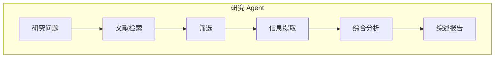

### 文献检索模块

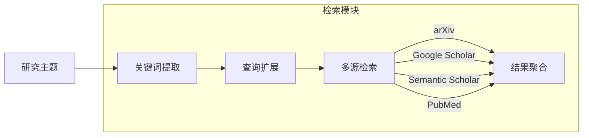

### 多源信息整合

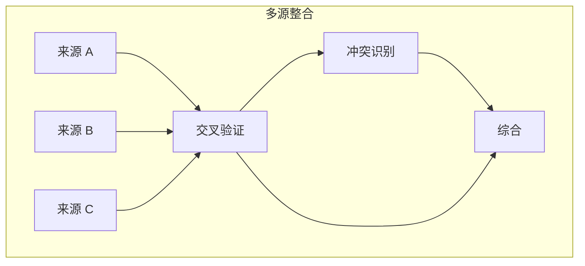

### 批判性分析流程

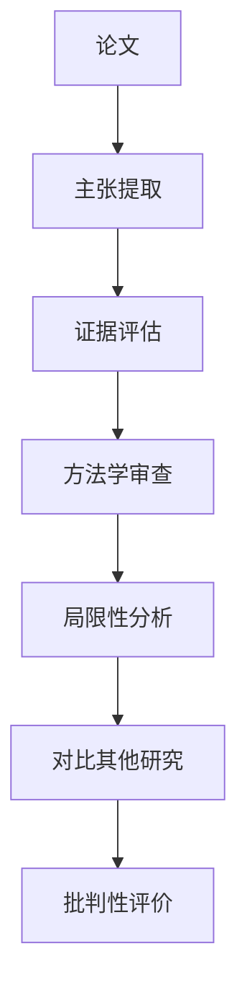

### 研究 Agent 工作流

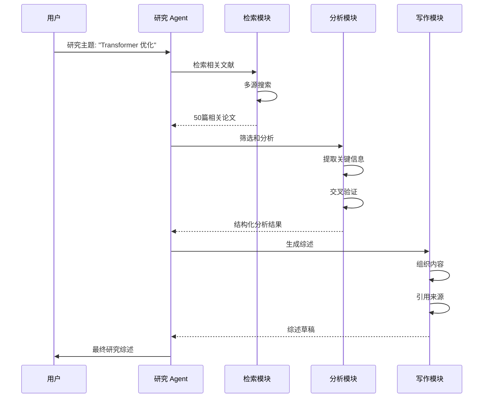

---

## 14.2 工程 Agent：代码设计、实现与测试

### 软件工程 Agent 架构

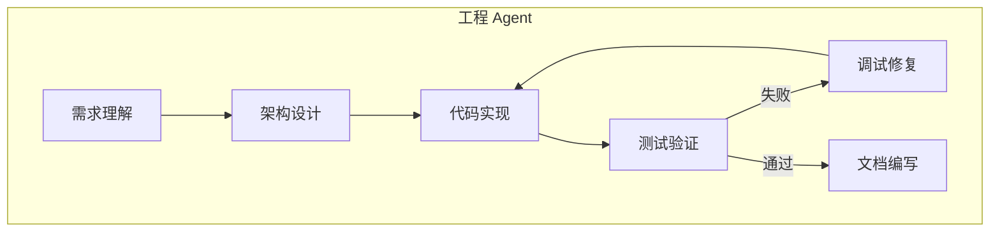

### 代码库理解

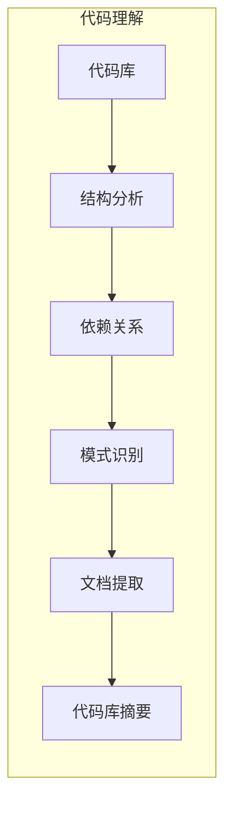

### 代码生成流程

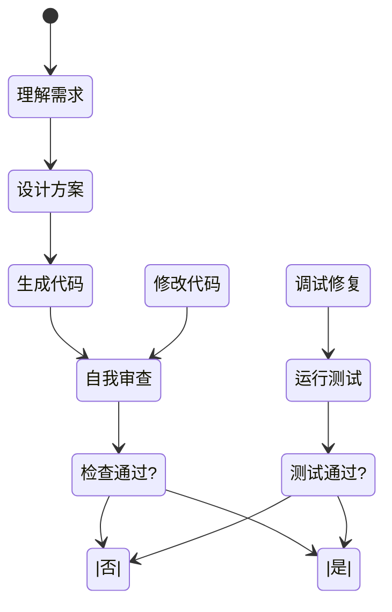

### 调试与修复

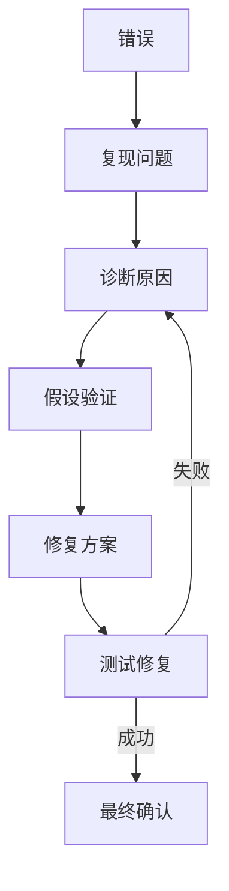

### MetaGPT 启发的工程团队

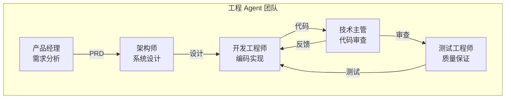

---

## 14.3 创意 Agent：内容创作与设计

### 创意 Agent 架构

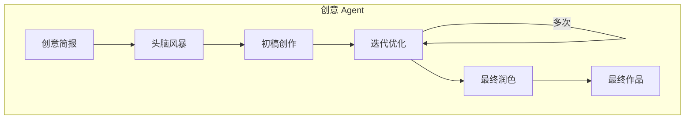

### 头脑风暴模块

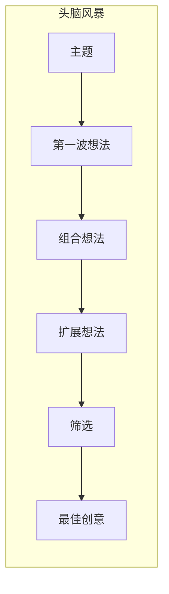

### 多步创作流程

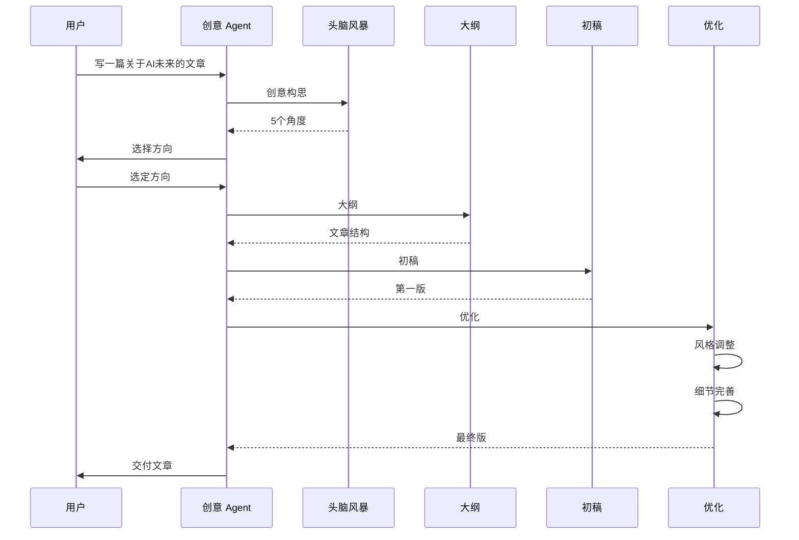

### 风格一致性维护

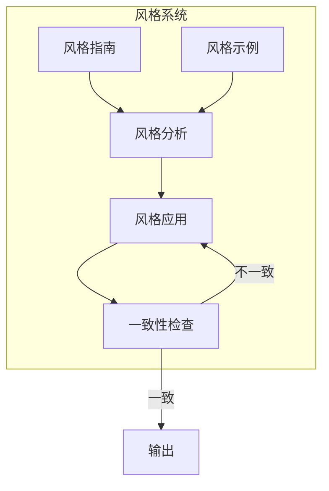

---

## 14.4 领域特定设计要点

### 研究 Agent 设计要点

| 方面 | 考虑因素 | 实现建议 |
|------|---------|---------|
| **检索** | 多源覆盖、最新性 | arXiv、Semantic Scholar、Google Scholar |
| **可信度** | 来源评估、交叉验证 | 引用分析、同行评议 |
| **综述** | 结构清晰、客观中立 | 时间线、主题分类、对比表格 |
| **引用** | 准确引用、格式规范 | BibTeX、APA、MLA 格式 |

### 工程 Agent 设计要点

| 方面 | 考虑因素 | 实现建议 |
|------|---------|---------|
| **代码质量** | 可读性、可维护性 | 代码规范、最佳实践 |
| **测试** | 覆盖全面、自动化 | 单元测试、集成测试 |
| **调试** | 问题定位、修复验证 | 错误分析、回归测试 |
| **文档** | 清晰准确、及时更新 | README、API 文档、注释 |

### 创意 Agent 设计要点

| 方面 | 考虑因素 | 实现建议 |
|------|---------|---------|
| **原创性** | 避免陈词滥调 | 多角度思考、独特视角 |
| **风格** | 统一、有辨识度 | 风格指南、示例学习 |
| **迭代** | 多轮优化 | 自我审查、逐步完善 |
| **用户反馈** | 灵活调整 | 支持修改、版本管理 |

---

## 14.5 DeerFlow 项目代码导读

### DeerFlow 的领域特定设计

DeerFlow 的架构设计使其能够支持多种领域特定的 Agent 应用，从研究助手到工程 Agent，再到创意内容生成。

### 技能系统：领域特定工作流

**文件**: `backend/src/skills/loader.py`

```python
from dataclasses import dataclass
from pathlib import Path
import yaml

@dataclass
class Skill:
    """
    技能：领域特定的工作流
    """
    name: str
    description: str
    license: str | None
    allowed_tools: list[str]
    content: str  # 注入到系统提示的内容
    directory: Path
    enabled: bool = True
    container_path: str | None = None  # /mnt/skills/...

def load_skills(
    skills_dir: Path,
    container_skills_path: str | None = None,
    extensions_config: dict | None = None,
) -> list[Skill]:
    """
    从以下位置加载技能：
    - {skills_dir}/public/ - 公共技能（提交到 git）
    - {skills_dir}/custom/ - 自定义技能（gitignore）
    """
    skills = []
    skills_state = (extensions_config or {}).get("skills", {})

    public_dir = skills_dir / "public"
    custom_dir = skills_dir / "custom"

    for base_dir in [public_dir, custom_dir]:
        if not base_dir.exists():
            continue

        # 递归查找 SKILL.md
        for skill_md in base_dir.rglob("SKILL.md"):
            skill_dir = skill_md.parent
            skill = _parse_skill_md(skill_md, skill_dir)

            # 设置容器路径
            if container_skills_path:
                rel_path = skill_dir.relative_to(skills_dir)
                skill.container_path = f"{container_skills_path}/{rel_path}"

            # 从 extensions_config 读取启用状态
            skill.enabled = skills_state.get(skill.name, {}).get("enabled", True)

            skills.append(skill)

    return skills

def _parse_skill_md(path: Path, directory: Path) -> Skill:
    """
    解析 SKILL.md：YAML frontmatter + Markdown 内容
    """
    content = path.read_text()

    if content.startswith("---"):
        _, frontmatter_str, body = content.split("---", 2)
        frontmatter = yaml.safe_load(frontmatter_str)
    else:
        frontmatter = {}
        body = content

    return Skill(
        name=frontmatter.get("name", directory.name),
        description=frontmatter.get("description", ""),
        license=frontmatter.get("license"),
        allowed_tools=frontmatter.get("allowed-tools", []),
        content=body.strip(),
        directory=directory,
    )
```

### 技能目录结构

```
skills/
├── public/              # 公共技能（提交到 git）
│   ├── pdf-processing/
│   │   └── SKILL.md
│   ├── frontend-design/
│   │   └── SKILL.md
│   ├── data-analysis/
│   │   └── SKILL.md
│   └── research-helper/
│       └── SKILL.md
└── custom/              # 自定义技能（gitignore）
    └── user-installed/
        └── SKILL.md
```

### SKILL.md 格式示例

**文件**: `skills/public/pdf-processing/SKILL.md`

```markdown
---
name: PDF Processing
description: Handle PDF documents efficiently
license: MIT
allowed-tools:
  - read_file
  - write_file
  - bash
---

# PDF Processing Skill

你是一个 PDF 处理专家，能够高效地处理 PDF 文档。

## 工作流程

1. 使用 `read_file` 读取 PDF 文件
2. 使用 `bash` 调用 pdftotext 或其他工具提取文本
3. 分析内容，提取关键信息
4. 使用 `write_file` 保存结果

## 提示

- 对于大文件，考虑分页处理
- 保留原始文件的结构
- 输出格式应该清晰易读
```

### 系统提示中的技能注入

**文件**: `backend/src/agents/lead_agent/prompts.py`

```python
def build_system_prompt(
    skills: list[Skill],
    memory_context: str | None = None,
) -> str:
    """
    构建系统提示，注入技能和记忆
    """
    prompt = BASE_SYSTEM_PROMPT

    # 注入启用的技能
    enabled_skills = [s for s in skills if s.enabled]
    if enabled_skills:
        prompt += "\n\n## Skills\n\n"
        prompt += "You have access to the following skills:\n\n"
        for skill in enabled_skills:
            prompt += f"### {skill.name}\n"
            prompt += f"{skill.description}\n\n"
            if skill.container_path:
                prompt += f"Location: {skill.container_path}\n"
            prompt += f"\n{skill.content}\n\n"

    # 注入记忆
    if memory_context:
        prompt += f"\n\n{memory_context}\n\n"

    return prompt
```

### Gateway API：技能管理

**文件**: `backend/src/gateway/routers/skills.py`

```python
from fastapi import APIRouter, UploadFile, File, HTTPException
from pathlib import Path
import shutil
import zipfile

router = APIRouter()

@router.get("/")
def list_skills():
    """列出所有技能"""
    config = load_config()
    skills = load_skills(
        Path(config.skills.path),
        config.skills.container_path,
        load_extensions_config(),
    )
    return {
        "skills": [
            {
                "name": s.name,
                "description": s.description,
                "enabled": s.enabled,
                "license": s.license,
            }
            for s in skills
        ]
    }

@router.get("/{name}")
def get_skill(name: str):
    """获取特定技能详情"""
    config = load_config()
    skills = load_skills(...)
    for s in skills:
        if s.name == name:
            return {
                "name": s.name,
                "description": s.description,
                "content": s.content,
                "enabled": s.enabled,
            }
    raise HTTPException(status_code=404, detail="Skill not found")

@router.put("/{name}")
def update_skill(name: str, enabled: bool):
    """更新技能启用状态"""
    config = load_extensions_config()
    if "skills" not in config:
        config["skills"] = {}
    config["skills"][name] = {"enabled": enabled}
    save_extensions_config(config)
    return {"success": True, "name": name, "enabled": enabled}

@router.post("/install")
def install_skill(file: UploadFile = File(...)):
    """
    从 .skill 压缩包安装技能
    """
    config = load_config()
    custom_dir = Path(config.skills.path) / "custom"
    custom_dir.mkdir(parents=True, exist_ok=True)

    # 保存并解压
    temp_path = custom_dir / f"temp_{file.filename}"
    with temp_path.open("wb") as buffer:
        shutil.copyfileobj(file.file, buffer)

    skill_name = Path(file.filename).stem
    skill_dir = custom_dir / skill_name

    with zipfile.ZipFile(temp_path, "r") as zf:
        zf.extractall(skill_dir)

    temp_path.unlink()

    return {"success": True, "name": skill_name}
```

### 工具生态：研究、工程、创意

**文件**: `backend/src/community/`

```
backend/src/community/
├── tavily/           # 网络搜索 - 研究助手
│   ├── __init__.py
│   └── tools.py
├── jina_ai/          # 网页抓取 - 研究助手
│   ├── __init__.py
│   └── tools.py
├── firecrawl/        # 网页爬取 - 研究助手
│   ├── __init__.py
│   └── tools.py
├── image_search/     # 图像搜索 - 创意应用
│   ├── __init__.py
│   └── tools.py
└── aio_sandbox/      # Docker 沙箱 - 工程应用
    ├── __init__.py
    └── provider.py
```

### 社区工具示例

**文件**: `backend/src/community/tavily/tools.py`

```python
from langchain_core.tools import tool
from typing import Annotated

@tool
def tavily_search(
    query: Annotated[str, "Search query"],
    num_results: Annotated[int, "Number of results to return"] = 5,
) -> Annotated[str, "Search results"]:
    """
    Web search using Tavily API.
    研究助手的核心工具。
    """
    pass

@tool
def tavily_extract(
    url: Annotated[str, "URL to extract content from"],
) -> Annotated[str, "Extracted content"]:
    """
    Extract web content (4KB limit).
    研究助手的内容提取工具。
    """
    pass
```

### 子 Agent 系统：专业分工

**文件**: `backend/src/subagents/builtins/`

```python
# general-purpose.py - 通用子 Agent
def create_general_purpose_agent() -> Subagent:
    """
    通用子 Agent：拥有完整工具集
    适合研究、写作、分析等多种任务
    """
    tools = get_available_tools(
        include_mcp=True,
        subagent_enabled=False,
    )
    return Subagent(
        name="general-purpose",
        tools=tools,
        system_prompt="你是一个能干的助手，可以使用各种工具完成任务。",
    )

# bash.py - 命令专家
def create_bash_agent() -> Subagent:
    """
    Bash 专家子 Agent：专注于命令执行
    工程 Agent 的核心组件
    """
    from src.sandbox.tools import bash, ls, read_file, write_file, str_replace
    return Subagent(
        name="bash",
        tools=[bash, ls, read_file, write_file, str_replace],
        system_prompt="你是一个命令行专家，专注于执行 shell 命令和文件操作。",
    )
```

### 配置：领域特定定制

**文件**: `config.yaml`

```yaml
# 技能配置
skills:
  path: ../skills
  container_path: /mnt/skills

# 工具分组
tool_groups:
  - name: research
    tools: ["tavily_search", "tavily_extract", "jina_fetch", "read_file"]
  - name: engineering
    tools: ["bash", "ls", "read_file", "write_file", "str_replace"]
  - name: creative
    tools: ["write_file", "present_files"]

# 记忆配置（研究 Agent 需要）
memory:
  enabled: true
  injection_enabled: true
  max_facts: 200
```

### 关键代码文件索引

| 模块 | 文件路径 | 说明 |
|------|----------|------|
| **技能加载器** | `src/skills/loader.py` | `load_skills()`, `Skill` 类 |
| **技能路由** | `src/gateway/routers/skills.py` | 技能管理 API |
| **社区工具** | `src/community/` | tavily, jina_ai, firecrawl, image_search |
| **内置子 Agent** | `src/subagents/builtins/` | general-purpose, bash |
| **子 Agent 注册表** | `src/subagents/registry.py` | `register_subagent()`, `get_subagent()` |
| **系统提示** | `src/agents/lead_agent/prompts.py` | 技能注入 |

---

## 14.6 小结

**本节课要点：**

1. ✅ **研究 Agent** 需要多源检索、交叉验证、批判性分析
2. ✅ **工程 Agent** 需要代码理解、生成、测试、调试的完整流程
3. ✅ **创意 Agent** 需要头脑风暴、多步创作、风格一致性维护
4. ✅ 每个领域都有特定的设计考虑和最佳实践

**下节课预告：**
我们将进行 Agent 系统设计实战，端到端设计一个完整的 Agent 系统。

---

## 参考资料

- [MetaGPT: Meta Programming for A Multi-Agent Collaborative Framework](https://arxiv.org/abs/2308.00352)
- [LLM-based Software Engineering: A Survey](https://arxiv.org/abs/2401.00741)
- [Creative Writing with LLMs](https://arxiv.org/abs/2307.08678)
- [Scientific Discovery with LLM Agents](https://arxiv.org/abs/2311.07044)
