# 第15课：Agent 系统设计实战

## 15.1 端到端 Agent 系统设计

### 设计流程

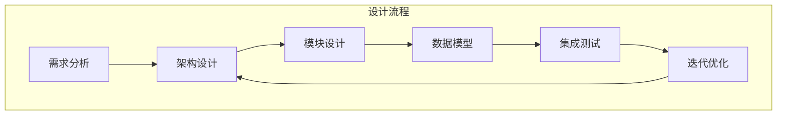

### 需求分析

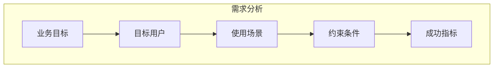

### 需求清单示例

| 类别 | 需求 | 优先级 |
|------|------|--------|
| **功能需求** | 支持对话交互 | P0 |
| | 工具调用能力 | P0 |
| | 记忆系统 | P0 |
| | 多 Agent 协作 | P1 |
| **非功能需求** | 响应时间 < 5s | P0 |
| | 可用性 > 99% | P1 |
| | 成本控制 | P2 |
| **安全需求** | 权限控制 | P0 |
| | 数据加密 | P0 |
| | 审计日志 | P1 |

---

## 15.2 架构选型与模块划分

### 架构决策树

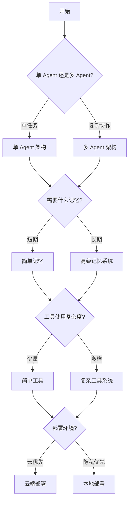

### 模块划分原则

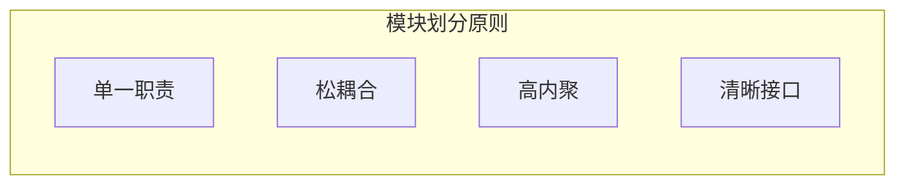

### 参考架构

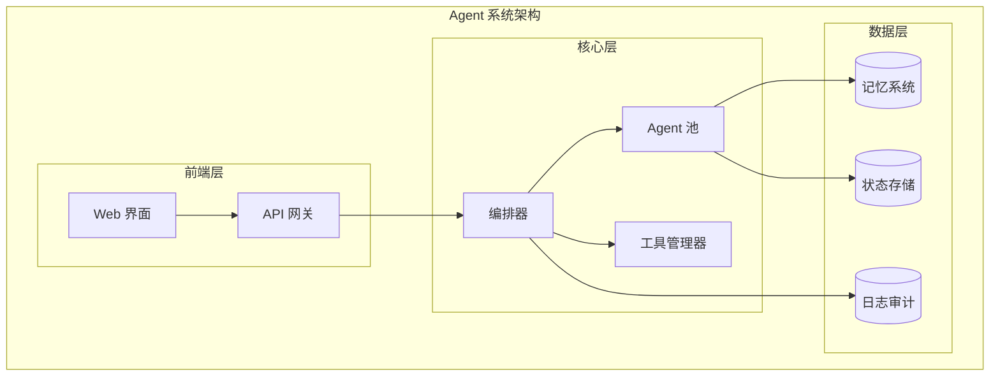

---

## 15.3 DeerFlow 架构深度解析

### DeerFlow 整体架构

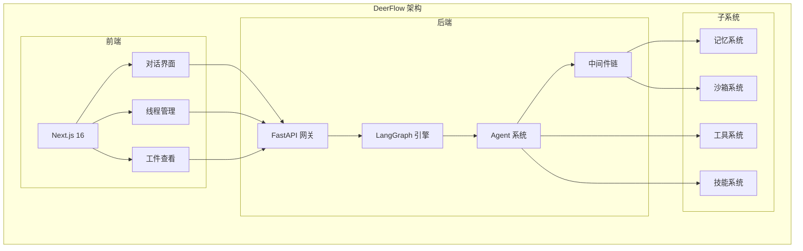

### 中间件链详解

```mermaid
flowchart LR
    Input[输入请求]
    ThreadData[线程数据管理]
    Upload[上传处理]
    SandboxMgr[沙箱管理]
    Context[上下文摘要]
    TaskTrack[任务追踪]
    TitleGen[标题生成]
    MemorySys[记忆系统]
    ImageProc[图像处理]
    Clarify[请求澄清]
    Output[输出响应]

    Input --> ThreadData
    ThreadData --> Upload
    Upload --> SandboxMgr
    SandboxMgr --> Context
    Context --> TaskTrack
    TaskTrack --> TitleGen
    TitleGen --> MemorySys
    MemorySys --> ImageProc
    ImageProc --> Clarify
    Clarify --> Output
```

### 关键设计决策

| 决策点 | 选项 | 选择 | 理由 |
|--------|------|------|------|
| **Agent 框架** | LangChain / LangGraph / 自研 | LangGraph | 状态管理、灵活控制流 |
| **API 框架** | FastAPI / Flask / Django | FastAPI | 高性能、类型安全、自动文档 |
| **前端框架** | React / Vue / Svelte | Next.js + React | SSR、生态丰富 |
| **记忆存储** | SQLite / PostgreSQL / 向量库 | 混合方案 | 灵活、可扩展 |
| **沙箱** | Docker / WASM / 本地 | 双模式 | 安全与便利平衡 |

---

## 15.4 技术栈决策

### 技术选型矩阵

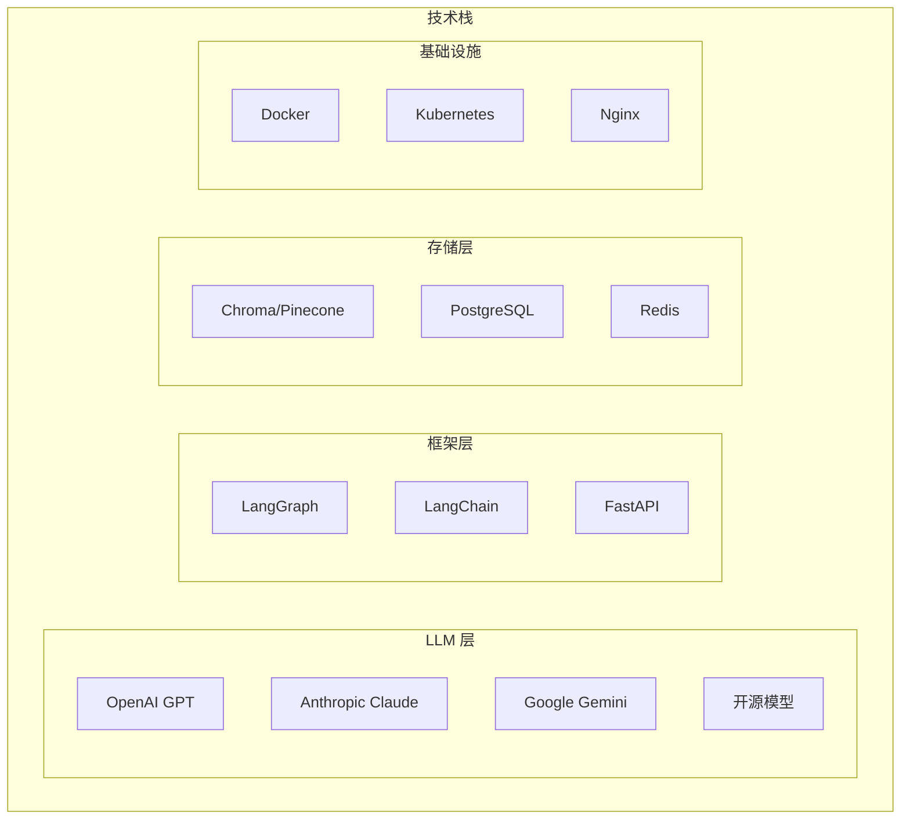

### 技术选择考虑因素

| 因素 | 说明 | 评估问题 |
|------|------|---------|
| **成熟度** | 社区支持、文档 | 有多少实际应用案例? |
| **性能** | 速度、资源消耗 | 响应时间是否满足要求? |
| **可扩展性** | 未来扩展能力 | 能否支撑 10x 规模? |
| **成本** | 许可、运营成本 | 总体拥有成本是多少? |
| **团队熟悉度** | 学习曲线 | 团队是否有相关经验? |

---

## 15.5 实战案例分析

### 案例：研究助手 Agent

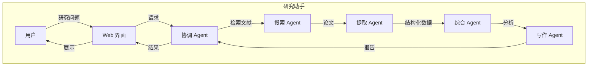

### 实现步骤

1. **定义 Agent 角色**
   - 协调 Agent：任务分发、结果汇总
   - 搜索 Agent：多源文献检索
   - 提取 Agent：信息抽取
   - 综合 Agent：分析综合
   - 写作 Agent：报告生成

2. **设计通信协议**
   - 消息格式
   - 任务描述
   - 结果结构

3. **实现记忆系统**
   - 文献库索引
   - 研究笔记
   - 用户偏好

4. **集成工具**
   - 学术搜索
   - PDF 解析
   - 引用管理

5. **测试优化**
   - 端到端测试
   - 性能调优
   - 用户反馈迭代

---

## 15.6 未来展望

### Agent 的进化方向

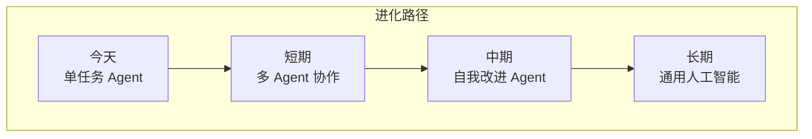

### 研究挑战与机遇

| 挑战 | 机遇 |
|------|------|
| 长期规划能力 | 分层规划、抽象推理 |
| 样本效率 | 从经验中学习、元学习 |
| 安全对齐 | 可解释性、价值学习 |
| 通用性 | 知识迁移、少样本学习 |
| 可扩展性 | 模块化设计、分布式系统 |

### 伦理与社会影响

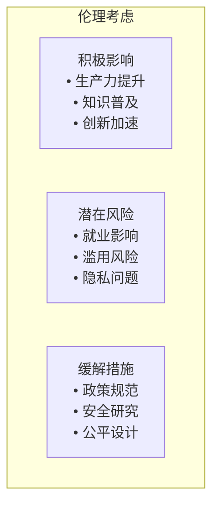

---

## 15.7 课程总结

### 核心概念回顾

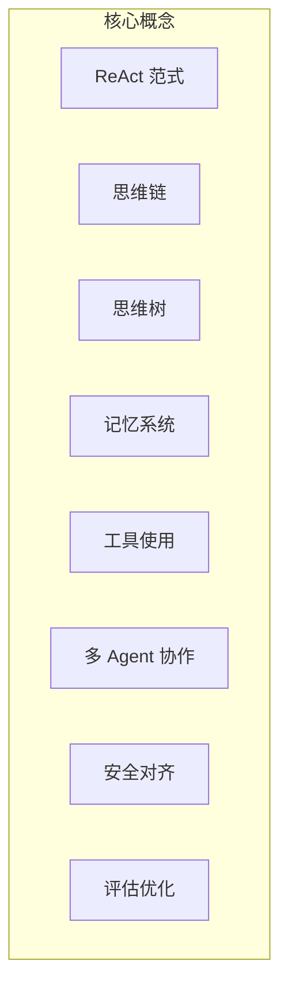

### 关键架构模式

| 模式 | 应用场景 | 代表项目 |
|------|---------|---------|
| **ReAct** | 通用任务 | Claude, GPT-4 |
| **生成 Agent** | 模拟人类行为 | Stanford Generative Agents |
| **MetaGPT** | 软件工程 | MetaGPT |
| **LangGraph** | 工作流 | LangChain, DeerFlow |

### 学习路径建议

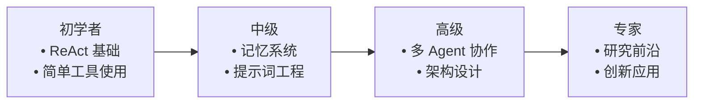

---

## 15.8 DeerFlow 项目代码导读

### DeerFlow 端到端架构深度解析

DeerFlow 是一个完整的、生产级的 AI Agent 系统，从前端到后端，从 Agent 运行时到网关 API，提供了完整的解决方案。

### 整体系统架构

```mermaid
graph TB
    subgraph Frontend [前端层
        Next[Next.js 16
        Chat[对话界面
        Threads[线程管理
        Artifacts[工件查看
    end

    subgraph Proxy [反向代理
        Nginx[Nginx<br/>
    end

    subgraph Backend [后端层
        Gateway[Gateway API<br/>
        LangGraph[LangGraph Server<br/>
    end

    subgraph Services [服务层
        Models[模型工厂
        Tools[工具系统
        Memory[记忆系统
        Sandbox[沙箱系统
        Skills[技能系统
        MCP[MCP 系统
    end

    Next -->|HTTP| Nginx
    Nginx -->|/api/*| Gateway
    Nginx -->|/api/langgraph/*| LangGraph
    Nginx -->|/*| Next

    Gateway --> Models
    Gateway --> Skills
    Gateway --> Memory
    Gateway --> MCP

    LangGraph --> Tools
    LangGraph --> Memory
    LangGraph --> Sandbox
    LangGraph --> Skills
```

### 前端集成架构

**文件**: `frontend/` (不在本导读范围内，简要提及)

```
frontend/
├── app/                    # Next.js App Router
│   ├── page.tsx           # 主页
│   └── thread/[id]/       # 线程页面
├── components/
│   ├── Chat/             # 对话组件
│   ├── Threads/          # 线程管理
│   └── Artifacts/        # 工件查看
└── lib/
    ├── api/              # API 客户端
    └── types/            # TypeScript 类型
```

### Nginx 反向代理配置

**路由规则**:
- `/api/langgraph/*` → LangGraph Server (端口 2024)
- `/api/*` → Gateway API (端口 8001)
- `/*` → Frontend (端口 3000)

### Gateway API：FastAPI 应用

**文件**: `backend/src/gateway/app.py`

```python
from fastapi import FastAPI
from fastapi.middleware.cors import CORSMiddleware

from .routers import (
    models,
    mcp,
    skills,
    memory,
    uploads,
    artifacts,
)

app = FastAPI(title="DeerFlow Gateway API")

# CORS 配置
app.add_middleware(
    CORSMiddleware,
    allow_origins=["*"],
    allow_methods=["*"],
    allow_headers=["*"],
)

# 健康检查
@app.get("/health")
def health_check():
    return {"status": "healthy"}

# 注册路由
app.include_router(models.router, prefix="/api/models", tags=["models"])
app.include_router(mcp.router, prefix="/api/mcp", tags=["mcp"])
app.include_router(skills.router, prefix="/api/skills", tags=["skills"])
app.include_router(memory.router, prefix="/api/memory", tags=["memory"])
app.include_router(uploads.router, prefix="/api/threads/{thread_id}/uploads", tags=["uploads"])
app.include_router(artifacts.router, prefix="/api/threads/{thread_id}/artifacts", tags=["artifacts"])
```

### Gateway 路由模块

**文件**: `backend/src/gateway/routers/`

```
backend/src/gateway/routers/
├── models.py       # GET /api/models, GET /api/models/{name}
├── mcp.py          # GET/PUT /api/mcp/config
├── skills.py       # GET/PUT /api/skills, POST /api/skills/install
├── memory.py       # GET/POST /api/memory, GET /api/memory/config
├── uploads.py      # POST /api/threads/{id}/uploads
└── artifacts.py    # GET /api/threads/{id}/artifacts/{path}
```

### LangGraph Server 配置

**文件**: `backend/langgraph.json`

```json
{
  "agent": {
    "type": "agent",
    "path": "src.agents:make_lead_agent"
  },
  "graphs": {
    "agent": {
      "checkpoint": {
        "type": "memory"
      }
    }
  }
}
```

### Lead Agent 工厂

**文件**: `backend/src/agents/lead_agent/agent.py`

```python
def make_lead_agent(config: RunnableConfig) -> StateGraph:
    """
    Lead Agent 工厂函数，LangGraph Server 的入口点
    """
    configurable = config.get("configurable", {})

    # 1. 加载配置
    full_config = load_config()

    # 2. 创建模型
    model = create_chat_model(
        configurable.get("model_name", full_config.models[0].name),
        configurable.get("thinking_enabled", False),
    )

    # 3. 加载工具
    tools = get_available_tools(
        include_mcp=True,
        model_name=configurable.get("model_name"),
        subagent_enabled=configurable.get("subagent_enabled", full_config.subagents.enabled),
    )
    model_with_tools = model.bind_tools(tools)

    # 4. 构建中间件链
    threads_dir = get_threads_dir()
    middlewares = _build_middlewares(full_config, threads_dir)

    # 5. 构建状态图
    graph = StateGraph(ThreadState)

    # 6. 定义节点
    def agent_node(state: ThreadState) -> ThreadState:
        # 应用中间件 (before_model)
        for mw in middlewares:
            state = mw.before_model(state)

        # 调用模型
        messages = state["messages"]
        response = model_with_tools.invoke(messages)
        state["messages"] = state["messages"] + [response]

        # 应用中间件 (after_model)
        for mw in middlewares:
            state = mw.after_model(state)

        return state

    tool_node = ToolNode(tools)

    # 7. 添加节点和边
    graph.add_node("agent", agent_node)
    graph.add_node("tools", tool_node)
    graph.set_entry_point("agent")

    def should_continue(state: ThreadState) -> Literal["continue", "end"]:
        messages = state["messages"]
        last_message = messages[-1]
        if hasattr(last_message, "tool_calls") and last_message.tool_calls:
            return "continue"
        return "end"

    graph.add_conditional_edges(
        "agent",
        should_continue,
        {"continue": "tools", "end": END},
    )
    graph.add_edge("tools", "agent")

    # 8. 编译
    checkpointer = MemorySaver()
    return graph.compile(checkpointer=checkpointer)
```

### 中间件链

**文件**: `backend/src/agents/lead_agent/agent.py`

```python
def _build_middlewares(
    config: LeadAgentConfig,
    threads_dir: Path,
) -> list[AgentMiddleware]:
    """
    构建中间件链：11 个中间件按顺序执行
    """
    return [
        # 1. 线程数据：创建隔离目录
        ThreadDataMiddleware(threads_dir=threads_dir),
        # 2. 上传处理：注入文件列表
        UploadsMiddleware(),
        # 3. 沙箱管理：获取执行环境
        SandboxMiddleware(sandbox_provider=config.sandbox.provider),
        # 4. 悬空工具调用：处理中断后的状态
        DanglingToolCallMiddleware(),
        # 5. 上下文摘要：可选
        SummarizationMiddleware(config=config.summarization)
        if config.summarization and config.summarization.enabled
        else None,
        # 6. 任务追踪：计划模式
        TodoListMiddleware(is_plan_mode=config.is_plan_mode),
        # 7. 标题生成：可选
        TitleMiddleware(config=config.title)
        if config.title and config.title.enabled
        else None,
        # 8. 记忆系统：可选
        MemoryMiddleware(memory_config=config.memory)
        if config.memory and config.memory.enabled
        else None,
        # 9. 图像处理：视觉模型
        ViewImageMiddleware(),
        # 10. 子 Agent 限制：可选
        SubagentLimitMiddleware()
        if config.subagents and config.subagents.enabled
        else None,
        # 11. 澄清拦截：必须在最后
        ClarificationMiddleware(),
    ]
```

### 配置系统

**文件**: `backend/src/config/__init__.py`

```python
from pathlib import Path
import yaml

def load_config(config_path: Path | None = None) -> LeadAgentConfig:
    """
    加载配置，按优先级查找：
    1. 显式 config_path 参数
    2. DEER_FLOW_CONFIG_PATH 环境变量
    3. ./config.yaml
    4. ../config.yaml (项目根目录)
    """
    paths = _get_config_candidates(config_path)
    for path in paths:
        if path.exists():
            with path.open() as f:
                data = yaml.safe_load(f)
            return LeadAgentConfig(**data)
    raise FileNotFoundError("Config file not found")

def load_extensions_config(config_path: Path | None = None) -> dict:
    """
    加载 extensions_config.json
    """
    paths = _get_extensions_config_candidates(config_path)
    for path in paths:
        if path.exists():
            with path.open() as f:
                return json.load(f)
    return {}
```

### 主配置：config.yaml

```yaml
# 模型配置
models:
  - name: gpt-4o
    display_name: GPT-4o
    use: langchain_openai:ChatOpenAI
    model: gpt-4o
    api_key: $OPENAI_API_KEY
    supports_thinking: false
    supports_vision: true

# 工具配置
tools:
  - name: tavily_search
    use: src.community.tavily:tavily_search
    group: web

# 工具分组
tool_groups:
  - name: default
    tools: ["sandbox", "web", "builtin"]

# 沙箱配置
sandbox:
  use: src.sandbox.local:LocalSandboxProvider

# 技能配置
skills:
  path: ../skills
  container_path: /mnt/skills

# 子 Agent 配置
subagents:
  enabled: true

# 记忆配置
memory:
  enabled: true
  injection_enabled: true
  storage_path: backend/.deer-flow/memory.json
  debounce_seconds: 30
  max_facts: 100
  fact_confidence_threshold: 0.7
  max_injection_tokens: 2000

# 标题生成配置
title:
  enabled: true
  max_words: 10
  max_chars: 60

# 摘要配置
summarization:
  enabled: true
  trigger:
    type: fraction
    value: 0.8
  keep_policy:
    recent_messages: 10
    summarize_older: true
```

### Makefile：开发命令

**文件**: `Makefile` (项目根目录)

```makefile
# 完整应用
.PHONY: check install dev stop

check:           # 检查系统要求
install:         # 安装所有依赖 (frontend + backend)
dev:             # 启动所有服务 (LangGraph + Gateway + Frontend + Nginx)
stop:            # 停止所有服务

# 后端目录 Makefile
.PHONY: install dev gateway lint format test

install:         # 安装后端依赖
dev:             # 运行 LangGraph Server (端口 2024)
gateway:         # 运行 Gateway API (端口 8001)
lint:            # 运行 linter (ruff)
format:          # 格式化代码 (ruff)
test:            # 运行测试
```

### 关键代码文件索引（完整架构）

| 层级 | 文件路径 | 说明 |
|------|----------|------|
| **入口** | `langgraph.json` | LangGraph Server 配置 |
| **Agent** | `src/agents/lead_agent/agent.py` | `make_lead_agent()` |
| **状态** | `src/agents/thread_state.py` | `ThreadState` |
| **中间件** | `src/agents/middlewares/` | 11 个中间件 |
| **记忆** | `src/agents/memory/` | 提取、队列、提示 |
| **模型** | `src/models/factory.py` | `create_chat_model()` |
| **工具** | `src/tools/__init__.py` | `get_available_tools()` |
| **沙箱** | `src/sandbox/` | `Sandbox`, `SandboxProvider` |
| **子 Agent** | `src/subagents/` | 执行器、注册表、内置 |
| **技能** | `src/skills/loader.py` | `load_skills()` |
| **MCP** | `src/mcp/manager.py` | `get_cached_mcp_tools()` |
| **Gateway** | `src/gateway/app.py` | FastAPI 应用 |
| **路由** | `src/gateway/routers/` | 6 个路由模块 |
| **配置** | `src/config/__init__.py` | `load_config()` |
| **反射** | `src/reflection/__init__.py` | `resolve_class()`, `resolve_variable()` |
| **社区** | `src/community/` | tavily, jina_ai, firecrawl, image_search, aio_sandbox |

---

## 15.9 小结

**本节课要点：**

1. ✅ Agent 系统设计从需求分析开始，考虑功能、非功能和安全需求
2. ✅ 架构选型需要权衡单/多 Agent、记忆复杂度、工具复杂度等
3. ✅ DeerFlow 采用 LangGraph + FastAPI + Next.js 的技术栈
4. ✅ 未来 Agent 将向多 Agent 协作、自我改进、通用智能方向发展
5. ✅ 需要关注伦理和社会影响，采取积极的缓解措施

**课程总结：**

恭喜你完成了 AI Agent 高级课程！通过这 15 节课，你已经掌握了：
- Agent 基础范式（ReAct、CoT、ToT）
- 核心能力模块（记忆、工具、规划）
- 多 Agent 系统（协作、协调、共识）
- 进阶技术（安全、评估、高级记忆）
- 前沿架构与实战设计

继续探索，继续创新！

---

## 参考资料

- [DeerFlow GitHub Repository](https://github.com/deer-flow/deer-flow)
- [The Shift from Models to Agents](https://www.sequoiacap.com/article/agents-shift)
- [Agentic Design Patterns](https://www.anthropic.com/index/agentic-design-patterns)
- [AI Agent Landscape 2025](https://arxiv.org/abs/2401.00741)
